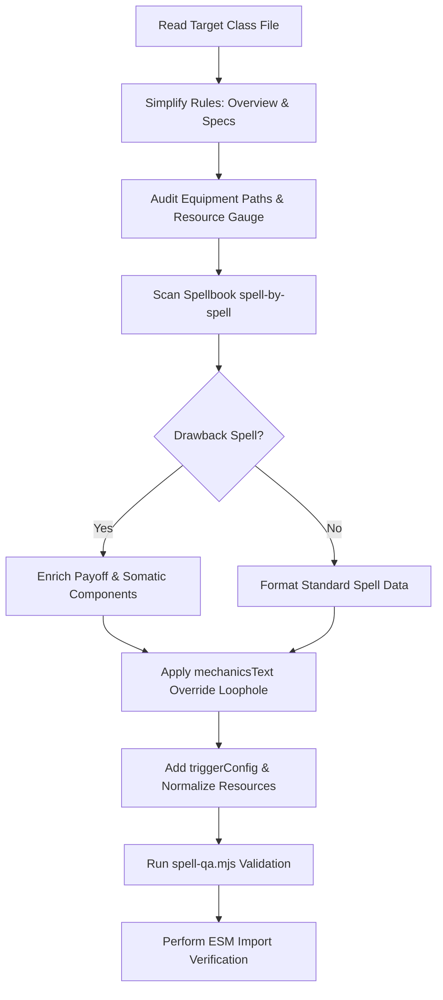

# Class Design & Audit Standards Guide

This guide establishes the strict standards, design philosophy, and data schemas for class files in the VTT system. It serves as a direct companion to [`docs/SPELL_DATA_REFERENCE.md`](file:///d:/VTT/docs/SPELL_DATA_REFERENCE.md). 

Use this guide side-by-side with the spell reference to audit, remediate, and write class data modules (e.g., `berserkerData.js`, `pyrofiendData.js`, `martyrData.js`). Our goal is to ensure that every class represents a striking, evocative fantasy, provides clear playstyle guidance for TTRPG beginners, and maintains a highly polished, consistent data structure for the rendering engine.

---

## 1. Core Design Philosophy

Our classes are built from the ground up to support high-impact, thematic combat while remaining highly navigable and easy to learn. We follow three key pillars:

### A. WoW-Style Anti-Homogenization
We reject class homogenization. Every class must feel completely distinct from all others in the roster. They must have unique resources, custom mechanics, and specific strategic niches.
* **The "Why Bring Me?" Anchor**: Every class MUST feature a single, clear, high-impact combat utility or mechanical state that defines their role.
  * *Berserker Example*: Bypasses all enemy resistances when low on health (under 30% HP), turning near-death into unmitigated destruction.
  * *Pyrofiend Example*: Generates progressive explosive heat that detonates across adjacent tiles, acting as the ultimate close-quarters crowd-clearing hazard.
  * *Martyr Example*: Converts their own suffering into holy barriers and stat-buffs for allies, bridging the gap between healer and tank.

### B. Level-Up Choice Economy & Drawback Balancing
In our game, when a player levels up, **they pick exactly ONE spell from that new level**. This creates a tight economy where passive or completely "safe" spells naturally compete with high-risk active spells.
* **The Drawback Rule**: If a spell includes a drawback (such as self-harm, resource overload, stance speed penalties, or locking out healing), the corresponding benefit **MUST be mathematically massive and visually spectacular** to incentivize selection.
* **Thematic Somatic & Verbal Writing**: Somatic and verbal components should describe high exertion, intense focus, and physical or magical strain. Focus on raw intensity and effort rather than crossing into graphic self-mutilation or excessive anatomical horror.

### C. TTRPG Beginner-Friendliness
While our mechanics can be complex, **a new TTRPG player must understand the class instantly upon reading the Overview**.
* **Flavor-First Guidance**: Keep mathematics and complex tables structured, but prefix them with highly intuitive, evocative summaries.
* **Tactile Metaphors**: Use physical, real-world metaphors (e.g., "managing a boiling kettle," "riding a ticking time bomb," "dancing on the edge of a blade") to help players instantly capture the mechanical rhythm of the class.

### D. Thematic Tone: Toning Down Grimdark / Visceral Horror Across All Classes
To ensure a consistent, premium, and widely appealing fantasy aesthetic, **we are systematically toning down the grimdark flavor across ALL classes (including the Berserker and Martyr)**. We are moving away from visceral, grotesque anatomical or self-harm horror and toward a high-exertion, high-velocity, and tactical fantasy style.

* **The Core Shift**: 
  * Avoid raw bone-snapping, muscle-flaying, internal bleeding, blood-drinking, or grotesque anatomical mutilation.
  * Emphasize physical stamina, adrenaline rushes, rapid reflexes, kinetic momentum, alchemical enhancement, extreme exertion, and high strategic risk.
* **Berserker Auditing Rules**:
  * *Instead of*: "Tear your own flesh to spray toxic blood" or "Shatter your own hand to hit harder."
  * *Use*: "Push your physical stamina past its threshold, ignoring pain through sheer battle-fury" or "Force a crushing blow that strains your muscles for massive impact."
* **Bladedancer Auditing Rules**:
  * *Instead of*: "Lacerating joints" or "Flaying the skin to move faster."
  * *Use*: "Kinetic sweep," "Steely Riposte," "Kinetic Dash," or "Sensory Numbing."
* **Martyr Auditing Rules**:
  * *Instead of*: "Gouging out eyes or horrific self-sacrifice."
  * *Use*: "Taking the burden of combat strain, converting impact into defensive protective barriers."
* **Chaos Weaver Auditing Rules**:
  * *Instead of*: "Shatter your bone marrow to tear the dimensions open," "weep boiling starlight from split flesh," or "your collarbone fractures from local rifts."
  * *Use*: "Exert intense mental control to step through dimensional seams," "splicing the threads of temporal friction into the present," or "thinning your planar anchor to phase through physical threats."

#### Grimdark to Kinetic Translation Reference Carousel
````carousel
##### Page 1: General Core Grimdark-to-Kinetic Translations
| Grimdark / Visceral Term (AVOID) | Modern Kinetic / High-Exertion Term (USE) |
| :--- | :--- |
| Mutilation, Flaying, Lacerating | Kinetic Sweep, Striking, Piercing |
| Bone-Snapping, Joint-Shattering | Kinetic Strain, Muscle Strain, Adrenaline Overdrive |
| Agony, Grotesque Torture | Intense Focus, Physical Endurance, Pain Resistance |
| Blood-Drinking, Flesh-Eating | Alchemical Overdrive, Battle-Fury, Planar Siphon |
| Organ Rupturing, Internal Bleeding | Metabolic Burnout, System Overload, Planar Strain |
<!-- slide -->
##### Page 2: Class-Specific Translation Guidelines
| Class | Visceral Visuals (AVOID) | Tactical Kinetic Mechanics (USE) |
| :--- | :--- | :--- |
| **Berserker** | Tear flesh, splash toxic blood, shatter self-bones | Overdrive stamina, channel raw battle-fury, muscle strain |
| **Bladedancer** | Flay skin to move faster, lacerate own/enemy joints | Kinetic Sweep, Steely Riposte, Sensory Numbing, Kinetic Dash |
| **Martyr** | Gouging out eyes, graphic anatomical self-mutilation | Absorbing combat strain, converting impact into protective barriers |
| **Chaos Weaver** | Bone marrow collapse, weeping starlight from split flesh | Planar thinning, molecular phase instability, temporal strain |
````

---

## 2. The Four Rules Sections

Every class file must be structured into **four distinct rules sections** that populate the interactive UI. This structure avoids cognitive fatigue by separating lore, gear, resource management, and specializations into logical tabs.

### Section 1: Overview
The Overview is the player's gateway. It must capture the core fantasy, roleplay hooks, and immediate playstyle notes.

```json
"overview": {
  "title": "The Class Name",
  "subtitle": "The Class Subtitle / Epithet",
  
  "quickOverview": {
    "title": "Quick Overview",
    "content": "A 2-3 paragraph summary. Use bold headers. Answer: What is the core mechanic? What is the class resource? Who is this class best for?"
  },
  
  "description": "Lore-focused introduction describing the physical reality and flavor of the class in the world.",
  
  "roleplayIdentity": {
    "title": "Roleplay Identity Subtitle",
    "content": "Outline the physical toll or social reality of the class. Provide 3 concrete character archetypes to help players get started."
  },
  
  "combatRole": {
    "title": "Combat Role / Why Bring Me",
    "content": "Must include the 'Why Bring Me?' utility sentence. Define their unique team contribution and call out their fatal mechanical flaw."
  },
  
  "playstyle": {
    "title": "Playstyle & Management",
    "content": "Break down the class's resource thresholds (e.g., green, yellow, danger zones) in simple, strategic terms."
  },
  
  "immersiveCombatExample": {
    "title": "Combat Example: The [Thematic Action]",
    "content": "A detailed, step-by-step turn sequence (Turn 1, Turn 2, Turn 3) demonstrating a typical combat loop. Must show resources building/spending, specific ability triggers, and somatic descriptions."
  }
}
```

### Section 2: Starting Equipment
Provides distinct equipment paths that support different starting playstyles, making character creation exciting and tactical.

```json
"equipment": {
  "title": "Starting Equipment",
  "choices": [
    {
      "name": "Equipment Path A (e.g., Shattered Greataxe)",
      "icon": "icon_name/id",
      "items": [
        "Primary Weapon (Damage formula, flavor note)",
        "Armor Type (Armor rating, maximum agility constraints)",
        "Utility/Ranged Gear"
      ],
      "description": "A sentence explaining the tactical purpose of this path (e.g., maximum impact, rapid resource building)."
    },
    {
      "name": "Equipment Path B (e.g., Dual Warhammers)",
      "icon": "icon_name/id",
      "items": [
        "Dual-wield Weapons (Damage formulas, flavor note)",
        "Heavy Bracers/Wraps",
        "Alternative utility gear"
      ],
      "description": "Explains how this path shifts the class's combat style."
    }
  ],
  "standardGear": [
    "Pack list (backpack, rations, unique class tools like cauterizing iron)",
    "Currency (e.g., 1d10 x 5 rusted copper pieces)"
  ],
  "notes": "Strict class-specific equipment constraints (e.g., 'You cannot wield bows; your rage requires close-quarters mutilation')."
}
```

### Section 3: Resource System
Delineates the class's unique mechanical engine. It must contain the gauge configuration, the exact generation rules, and threshold effects.

```json
"resourceSystem": {
  "title": "Resource Name & Core Stance",
  "subtitle": "Thematic Subtitle",
  "description": "High-level summary of how the resource scale works, how it influences survival, and the core penalty for ignoring it.",
  
  "cards": [
    {
      "title": "Resource Name (Range)",
      "stats": "Visual tracker description (e.g., Thermal Scale, Heat Gauge, Cruor Pool)",
      "details": "Explanation of the resource limit, how it behaves at rest, and the primary burnout hazard."
    }
  ],
  
  "generationTable": {
    "headers": ["Action", "Resource Change", "Flesh Toll / Recoil / Cost"],
    "rows": [
      ["Melee swing / spell cast", "+X generation", "Self-harm or stamina cost"],
      ["Taking damage", "+Y translation", "Pain converted to fuel"],
      ["Resting / Passivity", "-Z decay per round", "Withdrawal effects or decay rate"],
      ["Burnout / Overheat (101+)", "Reset / Penalty", "Severe physiological backlash"]
    ]
  },
  
  "usage": {
    "momentum": "How resource costs scale across levels (e.g., 5 to 100 costs).",
    "flourish": "⚠️ The signature mechanical restriction or core drawback (e.g., Healing Immunity while enraged)."
  },
  
  "overheatRules": {
    "title": "Metabolic Burnout / System Collapse",
    "content": "Specific, harsh rules for exceeding the resource ceiling. Must detail the exact round limit, unresistable damage penalty, stun states, or mechanical recovery."
  },
  
  "rageStatesTable": {
    "title": "Resource Thresholds",
    "headers": ["State / Phase", "Range", "Unlocked Mechanics", "Agony / Penalty"],
    "rows": [
      ["Smoldering / Idle", "0-20", "Basic actions. Vulnerability/mortality felt.", "None"],
      ["Frenzied / Active", "21-40", "First layer of stat buffs (+1 to hit, etc.).", "Stance drawbacks begin."],
      ["Primal / Peak", "41-80", "High-tier damage bonuses and armor bypasses.", "Armor reduction or self-harm multipliers."],
      ["Obliteration / Overdrive", "81-100", "Apocalyptic damage scaling.", "Extreme armor penalties, self-damage per turn."]
    ]
  }
}
```

### Section 4: Specializations
Classes split into three distinct specializations. Rather than front-loading talent trees (which are handled downstream by the game engine's talent system), keep specializations clean and uncomplicated. A specialization should be represented by **a clear, flavorful playstyle overview, strengths/weaknesses, and a single primary specPassive (which can be a passive or a unique signature ability) that anchors the subclass's core identity**.

> [!NOTE]
> Avoid overcomplicating specializations! Complex progression and detailed options are handled by the talent trees. The specialization itself should give the player exactly one passive or primary ability to immediately define their new playstyle.

```json
"specializations": {
  "title": "Specializations",
  "subtitle": "Paths of [Theme]",
  "description": "Short introductory summary of the choosing process.",
  "specs": [
    {
      "id": "spec_id_1",
      "name": "Spec Name (e.g., Savage)",
      "icon": "icon_name/id",
      "color": "Hex color representing the subclass (e.g., #8B0000)",
      "theme": "Thematic Keyword (e.g., Relentless Carnage)",
      "description": "One-sentence overview of the spec's identity.",
      "playstyle": "Simple description of how combat changes under this path.",
      "strengths": [
        "Strength bullet point 1",
        "Strength bullet point 2"
      ],
      "weaknesses": [
        "Weakness bullet point 1",
        "Weakness bullet point 2"
      ],
      "specPassive": {
        "name": "Evocative Passive or Ability Title",
        "description": "The base passive or primary ability that anchors the spec's playstyle. Must be mathematically powerful but simple to read."
      }
    }
  ]
}
```

---

## 3. Auditing Class Spellbooks

When editing the `spells` array inside a class file, you must ensure both compliance with the **7 Unbreakable Rules** of [`docs/SPELL_DATA_REFERENCE.md`](file:///d:/VTT/docs/SPELL_DATA_REFERENCE.md) and the flavor standard of this guide.

### Key Audit Checklist for Spells:

1. **Visceral magic components**:
   * Verify that somatic and verbal texts are filled with high-impact, physical descriptions. 
   * A somatic component should describe rapid movement, posture shifts, high-velocity weapon sweeps, and intense kinetic focus.
   * A verbal component should describe sharp breaths of concentration, low grunts of extreme effort, or the whistle of wind from high speed.
2. **The `mechanicsText` Loophole**:
   * **Crucial Rule**: Auto-generated buff/debuff modifiers can cause visual layout bugs on rendering cards (like blank badges or redundant stat lines).
   * **Resolution**: Always specify a custom `mechanicsText` inside the effect object inside `buffConfig.effects[]` or `debuffConfig.effects[]`. If present, the rendering engine completely bypasses its automated logic and displays this exact text cleanly.
3. **Trigger Config Consistency**:
   * Every high-risk spell must have a populated `triggerConfig` object. Call out the trigger type (`on_cast`, `on_hit`, `passive`, `start_of_turn`) and detail the drawback action.
4. **Normalize Resource Costs**:
   * Use negative cost fields for spells that generate resources on hit:
     ```javascript
     resourceCost: {
       actionPoints: 1,
       mana: 0,
       resourceTypes: ["mana", "rage_generation"],
       resourceValues: { mana: 0, rage_generation: 6 },
       classResource: { type: "rage", cost: -6 }, // Generation
       components: ["somatic"],
       somaticText: "Heave your massive weapon back, tearing muscle fibers as you force the swing."
     }
     ```

---

## 4. Drawback Spell Design - Gold-Standard Patterns

Use the following three structural patterns when drafting or auditing high-risk, drawback spells to ensure players are eager to choose them during their level-up choices.

### Pattern 1: Physiological Recoil (Melee/Physical)
* **The Danger**: Tearing your own body apart.
* **The Return**: Massive immediate damage that scales near death, bypassing defenses.
* **Example Spell Config**:
```javascript
{
  id: "berserk_hemorrhagic_strike",
  name: "Hemorrhagic Strike",
  description: "Heave your weapon with terrifying, uncontrolled force. Your muscles snap and tear from the bone, dealing damage to yourself but building your Blood-Heat.",
  level: 1,
  spellType: "ACTION",
  icon: "Slashing/Cross Slash",
  typeConfig: {
    school: "slashing",
    icon: "Slashing/Cross Slash",
    tags: ["melee", "damage", "rage generation", "self-damage"]
  },
  targetingConfig: {
    targetingType: "single",
    rangeType: "melee",
    rangeDistance: 5,
    targetRestrictions: ["enemy"]
  },
  resourceCost: {
    actionPoints: 1,
    mana: 0,
    resourceTypes: ["mana", "rage_generation"],
    resourceValues: { mana: 0, rage_generation: 6 },
    classResource: { type: "rage", cost: -6 },
    components: ["verbal", "somatic"],
    verbalText: "A guttural, rattling gasp of raw exertion.",
    somaticText: "Heave your weapon back with agonizing force, muscles visibly tearing as you swing."
  },
  resolution: "DICE",
  effectTypes: ["damage", "debuff"],
  damageConfig: {
    formula: "1d12 + strength",
    damageTypes: ["slashing"],
    resolution: "DICE",
    description: "A brutal, agonizing swing. Deals massive slashing damage."
  },
  debuffConfig: {
    debuffType: "statusEffect",
    effects: [
      {
        id: "self_laceration",
        name: "Self-Laceration",
        description: "Your tendons tear from the swing.",
        mechanicsText: "Take 1d4 physical damage to self",
        statModifier: { stat: "health", magnitude: "-1d4", magnitudeType: "dice", formula: "-1d4" }
      }
    ],
    durationType: "instant",
    durationValue: 0,
    durationUnit: "rounds"
  },
  triggerConfig: {
    triggers: [
      {
        id: "self_laceration_trigger",
        name: "Self-Laceration",
        triggerType: "on_cast",
        action: "Take 1d4 physical damage to self upon swinging."
      }
    ]
  },
  cooldownConfig: { cooldownType: "turn_based", cooldownValue: 0 }
}
```

### Pattern 2: Stance Penalty (Passive Toggle)
* **The Danger**: Massive penalty to movement speed, vulnerability to bleed/poison, or loss of defenses.
* **The Return**: Automatic armor boost and high resource generation when struck.
* **Example Spell Config**:
```javascript
{
  id: "berserk_calloused_hide",
  name: "Calloused Hide",
  description: "Toggle a defensive posture. Your flesh thickens with crude scar tissue, hardening you against strikes and feeding your Blood-Heat when hit.",
  level: 1,
  spellType: "PASSIVE",
  icon: "Utility/Deflecting Shield",
  typeConfig: {
    school: "bludgeoning",
    icon: "Utility/Deflecting Shield",
    tags: ["defense", "buff", "stance", "toggleable"],
    toggleable: true,
    exclusiveGroup: "berserker_stance"
  },
  targetingConfig: { targetingType: "self", rangeType: "self" },
  resourceCost: {
    actionPoints: 0,
    mana: 0,
    resourceTypes: ["mana"],
    resourceValues: { mana: 0 },
    components: ["somatic"],
    somaticText: "Flex your muscles until the skin splits, forcing thick, grey scar tissue to encase your torso like overlapping plates."
  },
  resolution: "NONE",
  effectTypes: ["buff"],
  buffConfig: {
    buffType: "statEnhancement",
    effects: [
      {
        id: "calloused_skin",
        name: "Calloused Skin",
        description: "Gain +2 Armor. Every time an enemy hits you with a melee attack, gain +1d4 Blood-Heat.",
        statModifier: { stat: "armor", magnitude: 2, magnitudeType: "flat" }
      },
      {
        id: "rigid_flesh_drawback",
        name: "Rigid Flesh",
        description: "Your rigid flesh makes you slow and highly vulnerable to bleeding.",
        mechanicsText: "-5 ft Movement Speed, +2 damage taken from Bleed and Poison",
        statModifier: { stat: "movement_speed", magnitude: -5, magnitudeType: "flat" }
      }
    ],
    durationType: "permanent",
    durationValue: 0,
    durationUnit: "rounds"
  },
  triggerConfig: {
    triggers: [
      {
        id: "stance_on_hit",
        name: "Pain-Driven Heat",
        triggerType: "passive",
        action: "When hit by an enemy melee attack, gain +1d4 Blood-Heat."
      }
    ]
  },
  cooldownConfig: { cooldownType: "turn_based", cooldownValue: 0 }
}
```

### Pattern 3: Catastrophic Stance (High-Harm Stance)
* **The Danger**: Constant health decay per turn, locking out all healing from allies.
* **The Return**: Unlocks unresistable damage and flat fire/slashing scaling on every strike.
* **Example Spell Config**:
```javascript
{
  id: "berserk_boiling_veins",
  name: "Boiling Veins",
  description: "Unlock your boiling veins, allowing the crimson fire to circulate. You inflict additional fire and slashing damage with every swing and enter Frenzied state, but you burn your own health and your pain immunity prevents allies from healing you.",
  level: 1,
  spellType: "PASSIVE",
  icon: "Fire/Fire Shield",
  typeConfig: {
    school: "fire",
    icon: "Fire/Fire Shield",
    tags: ["damage stance", "buff", "stance", "toggleable"],
    toggleable: true,
    exclusiveGroup: "berserker_stance"
  },
  targetingConfig: { targetingType: "self", rangeType: "self" },
  resourceCost: {
    actionPoints: 0,
    mana: 0,
    resourceTypes: ["mana"],
    resourceValues: { mana: 0 },
    components: ["somatic"],
    somaticText: "Pound your chest over your heart until your veins bulge black and steam rises from your breath."
  },
  resolution: "NONE",
  effectTypes: ["buff"],
  buffConfig: {
    buffType: "statEnhancement",
    effects: [
      {
        id: "boiling_blood_strike",
        name: "Boiling Blood Stasis",
        description: "Your strikes carry a searing spray. Every melee attack deals +1d4 fire/slashing damage.",
        mechanicsText: "All melee attacks deal +1d4 bonus fire/slashing damage"
      },
      {
        id: "vessel_rupture",
        name: "Vessel Rupture Drawback",
        description: "Your heart hammers dangerously fast. You lose 1 HP at the start of your turn. While toggled, your Blood-Heat is treated as being at least 21 (Frenzied State).",
        mechanicsText: "Lose 1 HP at start of turn. Pain Immunity active: Immune to pain, but cannot be healed by allies' spells or potions."
      }
    ],
    durationType: "permanent",
    durationValue: 0,
    durationUnit: "rounds"
  },
  triggerConfig: {
    triggers: [
      {
        id: "veins_self_harm",
        name: "Thermal Rupture",
        triggerType: "start_of_turn",
        action: "Lose 1 HP at the start of your turn."
      },
      {
        id: "veins_frenzied_passive",
        name: "Pain Immunity Active",
        triggerType: "passive",
        action: "Forces Blood-Heat state minimum to 21 (Frenzied), preventing all friendly incoming healing."
      }
    ]
  },
  cooldownConfig: { cooldownType: "turn_based", cooldownValue: 0 }
}
```

---

## 5. Execution Workflow

When auditing any class file, execute the following steps in sequence:



1. **Research & Extract**: Read the existing class data file fully to understand its thematic identity.
2. **Overview Clean-up**: Strip out cluttered mathematics from the overview descriptions. Replace them with evocative lore and the single **Immersive Combat Example**.
3. **Specialization Standardization**: Rewrite strengths, weaknesses, and key abilities to be crisp, readable, and highly flavor-focused. Standardize the `specPassive` object.
4. **Spell-by-Spell Polish**: Apply the structural rules from `SPELL_DATA_REFERENCE.md`.
5. **Card Layout Optimization**: Verify that every status effect inside `buffConfig` and `debuffConfig` uses `mechanicsText` to prevent card engine display issues.
6. **Trigger and Resource Normalization**: Check that all triggers (`triggerConfig`) and generated/spent resources (`resourceCost`) use valid properties and consistent IDs.
7. **Verify & Test**: Run the project's QA script (`node scripts/spell-qa.mjs`) to verify syntax and ensure that the class module exports clean, loadable ESM code.
