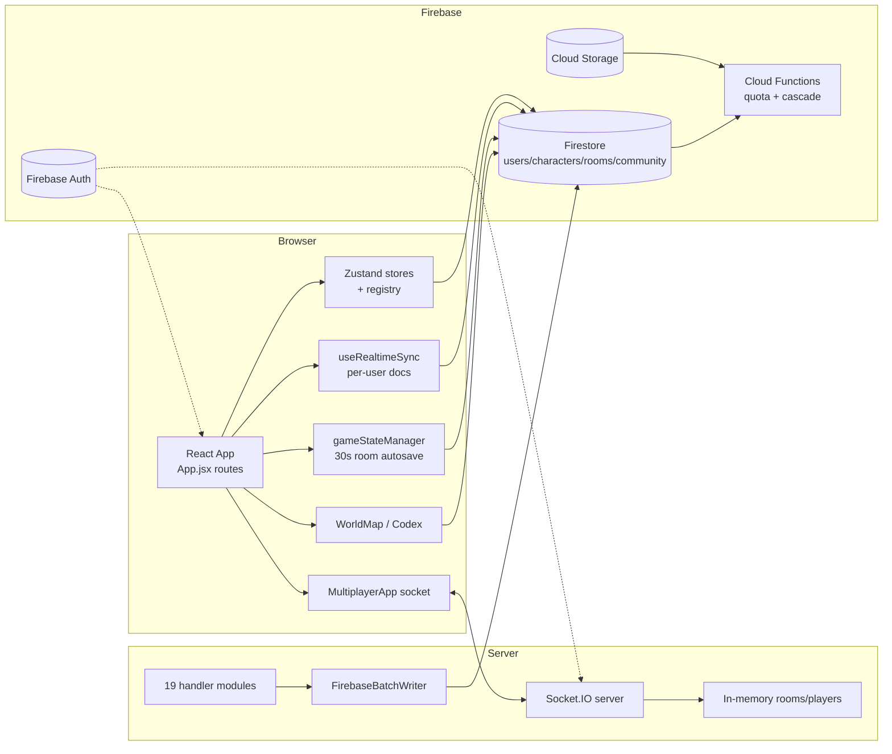
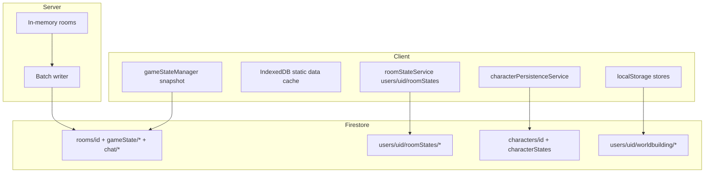
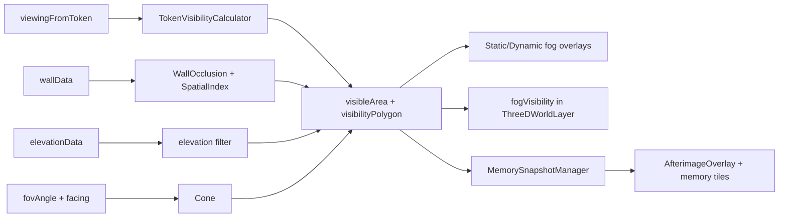

# MYTHRILL / DESCENSION — MASTER AUDIT (LIVING MAP)

LAST VERIFIED: 2026-10-03
BRANCH: master
COMMIT: 307684543ffdfcbe792c3a99e51c1a97eb771810
AUDIT STATUS: Documentation-only. Production code and content were NOT changed, deleted, renamed, or refactored.

> Scope note: the worktree contains a large amount of uncommitted/untracked work
> (multiplayer handlers, persistence services, class-resource contracts, tests, lore/images).
> This audit describes the **on-disk worktree**, not only the committed HEAD.
> Where a claim depends on a file that is modified or untracked, it is described as
> current worktree state. Nothing in this document authorizes deletion even if a path
> is marked DORMANT or UNREFERENCED — this repo is simultaneously a game, an RPG,
> a lore database, and a creative archive.

---

## 1. METHOD, EVIDENCE, AND CONFIDENCE

Verification performed for this audit:

- Static tracing of entry points, imports, consumers, and runtime registration
  (server hander registry, client store registry, route tree, handler registry).
- Dependency/reachability scan of `vtt-react/src`, `server/`, `functions/`
  (temporary read-only scanner run from outside the repo).
- Isolated Node probe of production middleware (`rateLimitService`,
  `validationService`) with synthetic sockets — no network, no Firebase.
- Test execution:
  - `server`: `npm test` → **242 passing** (Mocha).
  - `vtt-react`: 10 selected suites → **88 passing** (Jest/CRA).
- Browser verification against the local dev server (`http://localhost:3000`):
  landing, `/rules`, `/worldmap`, `/game` mounted; 2D→2.5D camera projection toggle
  and tilt control verified; 11 canvases mounted in game view; no page errors observed
  in those routes.

Confidence labels used below:

- **VERIFIED** — read directly from current source or observed at runtime.
- **INFERRED** — strongly implied by source but not executed end-to-end.
- **UNKNOWN** — could not be confirmed without ops/credentials/human decision.

Status vocabulary (per repo agent context):

`SHIPPED / EXECUTED`, `PARTIAL`, `CONFIGURATION OR DATA ONLY`, `DORMANT / UNREFERENCED`,
`LEGACY`, `UNKNOWN`.

---

## 2. REPOSITORY TOPOLOGY (CURRENT WORKTREE)

| Area | Path | Runtime role |
|---|---|---|
| Root tooling | `package.json`, `netlify.toml`, `firebase.json`, `firestore.rules`, `storage.rules`, `Dockerfile` | Build/deploy/rules |
| Frontend app | `vtt-react/` | React 18 CRA (CRACO), Zustand, socket.io-client, Firebase 12, Three.js |
| Multiplayer server | `server/` | Express + Socket.IO, in-memory rooms, Firebase Admin persistence |
| Cloud Functions | `functions/` | Storage quota triggers + cascade cleanup (v2 API) |
| Static data / content | `vtt-react/public/`, `vtt-react/src/data/`, `docs/`, root `*.md`, images | Game content + lore archive |
| Scripts | `scripts/` | Data extraction, audits, validators, deploy helpers |
| CI | `.github/workflows/deploy.yml` | Build, test, bundle budget, Netlify deploy |

Runtime boundaries:

- Browser talks to **Firebase (Auth/Firestore/Storage)** directly and to the
  **Socket.IO server** for live multiplayer/social.
- `server/` talks to Firebase Admin for room persistence and auth verification.
- `functions/` reacts to Firestore/Storage events out-of-band.

---

## 3. FRONTEND ARCHITECTURE

PURPOSE
Single-page React app that hosts the marketing landing, account/character tools,
the VTT tactical surface, multiplayer sessions, the world map/atlas, and the rules codex.

SOURCE OF TRUTH
- Bootstrap: `vtt-react/src/index.js`
- Route tree + global providers: `vtt-react/src/App.jsx`
- Store registry: `vtt-react/src/store/initStoreRegistry.js`, `storeRegistry.js`
- Runtime config: `vtt-react/src/config/env.js`, `config/firebase.js`

IMPORTANT FILES
- `index.js` — `initStoreRegistry()` before render; production console muting;
  global context-menu suppression; StrictMode intentionally disabled
  ("Temporary disable to prevent socket recreation issues in multiplayer").
- `App.jsx` (1601 lines) — providers, lazy routes, global managers, GameScreen.
- `components/GameProvider.jsx` — initializes game store + character system.
- `components/providers/PersistenceProvider.jsx` — cloud hydration for worldbuilding
  and campaign stores with dirty-flag protection.
- `components/providers/CharacterPersistenceProvider.jsx` — character autosave and
  conflict modal.
- `components/Navigation.jsx` — lazy window launcher (Inventory, Toolkit, Spellbook,
  CampaignManager, Journal, Talent Trees, Quest Log, Community, Crafting, Travel).
- `components/Grid.jsx` (4243 lines) — 2D canvas grid + overlays + input.
- `components/multiplayer/MultiplayerApp.jsx` (1249 lines) — live session host.

ROUTES (App.jsx)
`/`, `/account`, `/account/characters`, `/account/characters/create`,
`/account/characters/edit/:id`, `/account/characters/view/:id`, `/game`,
`/multiplayer/:roomCode?`, `/privacy`, `/rules`, `/rules/classes[/:classId]`,
`/classes[/:classId]`, `/worldmap[/:mapId]`, `/immersion` → `/worldmap`,
`/custommap[/:mapId]` → world map renderer, `*` → `/`.

- `PhoneGate` redirects phones away from `/game` and `/multiplayer`
  (character creation, rules, world map remain available on phones).
- `LoginTransitionOverlay` delays navigation ~0.85s to hide lazy-load flash.
- `GameScreen` has an 800ms safety timer that always dismisses the loading overlay.

STATE OWNERSHIP (client)
- **Zustand stores** — 56 files under `vtt-react/src/store/`. The explicit registry
  (`initStoreRegistry.js`) registers 14 core stores used for cross-store lookup via
  `getStore()` (game, character, party, map, chat, characterToken, creature, presence,
  auth, condition, inventory, notification, social, item).
- `characterStore.js` is sliced: core / info / stats / resource / progression /
  multiplayer slices.
- UI state: `windowManagerStore`, `settingsStore`, `notificationStore`,
  `targetingStore`, `dialogueStore`.
- World state: `worldStore`, `factionStore`, `timelineStore`, `npcStore`,
  `interactiveMapStore`, `bookStore`, `familyTreeStore`, `customLineageStore`,
  `deityStore`, `languageStore`, `questStore`.
- Persistence status: `persistenceStatusStore.js` (new, untracked worktree file).

IMPORTANT CONSUMERS
- `App.jsx` lazy-loads `Grid`, `Navigation`, `HUDContainer`, `MultiplayerApp`,
  `WorldMapImmerse`, `LocationSceneStage`, `DiceRollingSystem`, etc.
- `GameScreen` mounts combat/fog/lighting/memory/audio/dialogue managers.
- `MultiplayerApp` re-mounts `Grid`/`Navigation`/HUD components for live sessions.

PERSISTENCE
- Handled by `PersistenceProvider` + per-domain hooks (`useJournalPersistence`,
  `useRoomPersistence`, `useUserItemsPersistence`, `useUserCreaturesPersistence`,
  `useUserMapsPersistence`, `useCharacterPersistence`, `useCampaignPersistence`).
- Zustand `persist` with `createStorageConfig` (`utils/storageUtils.js`) which
  degrades to an in-memory fallback when localStorage quota is exceeded.

MULTIPLAYER BEHAVIOR
- Game routes mount their own socket via `MultiplayerApp`/`useSocketConnection`.
- `GlobalSocketManager` keeps the social/presence socket alive outside game routes
  and deliberately defers when `enteringMultiplayer`/`isInMultiplayer` is set.

TEST COVERAGE
- 174 test files under `vtt-react/src` (components, stores, utils, data contracts).
- Selected 10 suites (combat, inventory, book, spellAoE, visibility, elevation
  pathfinder, class resource contracts, character persistence, spell-cast contracts,
  universal entity graph) pass (88 tests).
- No route-level or full-app Jest tests; browser verification was manual for this audit.

LEGACY PATHS
- `vtt-react/src/components/character-sheet/ActionPoints.jsx` — static AP cost table
  (movement 1 / attack 2 / cast 2) that does not match current spell `resourceCost`
  (mostly 1 AP). Consumer search found no live importer. **LEGACY/UNKNOWN**.
- `vtt-react/src/game/creatures.js` — prototype creature class not referenced by the
  live graph. **DORMANT candidate (do not delete)**.
- `components/level-editor/SpellwizardApp` StepMechanicsConfig / Step10Review are
  unreachable from entry graph (reachable:false) though Step10Review is imported by
  Step7Review. **PARTIAL**.
- `campaignService.js` (client root service, localStorage-backed) still live;
  `services/firebase/campaignService.js` is deleted in worktree.
- `useCampaignPersistence` documents the Firebase campaign path as removed and
  points everything at the localStorage-backed `campaignService`.

KNOWN RISKS
- Giant components concentrate orchestration + rendering + persistence effects
  (`Grid.jsx`, `MultiplayerApp.jsx`, `Navigation.jsx`, rule/window managers).
- Route-level state is assembled imperatively via dynamic `require()`/`import()`
  in many components (breaks static analysis; circular-dependency workaround).
- Body-class CSS scoping (`game-mode` / `landing-mode`) is load-order sensitive;
  `App.jsx` explicitly forbids removing webpack-injected styles on route exit.

---

## 4. SERVER ARCHITECTURE

PURPOSE
Real-time authoritative-enough multiplayer session host: rooms, tokens, combat,
fog/environment, chat, parties, quest relay, audio broadcast, travel, GM tools.

SOURCE OF TRUTH
- Entry: `server/server.js` (369 lines)
- Handler registry: `server/handlers/socketHandlers.js` (665 lines)
- In-memory stores: `rooms`, `players`, `parties`, `userToParty`,
  `partyInvitations`, `onlineSocialUsers`, `pendingPartyCreations` (server.js).
- Rules: `server/utils/constants.js`, `server/utils/validators.js`.

ENTRY / MIDDLEWARE ORDER (VERIFIED)
1. `getAllowedOrigins()` — env allow-list plus mandatory prod origins.
2. `io.use(createSanitizationMiddleware)` — DOMPurify-ish string cleaning; skips
   fields like `password`, `terrainData`, `wallData`, `gridItems`, `content`.
3. `io.use(createValidationMiddleware)` — Joi schema validation with a per-event map.
4. `io.use(rateLimitService.createMiddleware)` — per-event limits, GM 1.5× multiplier,
   optional Redis store when `REDIS_URL` is set.
5. `io.use(createSocketAuthMiddleware)` — missing token ⇒ guest; invalid token ⇒
   reject in production, downgrade in development; dev tokens/JWT decode only when
   not production and `ALLOW_DEV_AUTH=true` or `NODE_ENV=development`.
6. On connection, `registerSocketHandlers` wires 19 handler modules through a shared
   `handlerCtx` (logger, maps, helpers, services).

HANDLERS (all under `server/handlers/`)
`utilityHandlers`, `roomLifecycleHandlers`, `tokenHandlers`, `characterHandlers`,
`mapHandlers`, `gmActionHandlers`, `travelHandlers`, `combatHandlers`,
`chatHandlers`, `environmentHandlers`, `syncHandlers`, `sessionHandlers`,
`partyHandlers`, `sessionInvitationHandlers`, `audioHandlers`, `journalHandlers`,
`questHandlers`, `gmToolsHandlers`, plus `roomHandlers` (CRUD helpers).

SERVICES (all under `server/services/`)
- `firebaseService.js` (824) — Admin SDK init; `getRoomData` reassembles split room
  docs; `updateRoomGameState` splits at 100KB; `saveRoomData` splits at 900KB.
- `syncService.js` — `FirebaseBatchWriter` (500ms flush, 3 retries) and
  `MovementDebouncer` (50ms flush of coalesced token moves).
- `realtimeSync.js` (671) / `deltaSync.js` (642) / `eventBatcher.js` (635) /
  `lagCompensation.js` (614) — advanced delta-sync stack. Largely **PARTIAL**:
  token delta gated behind `ENABLE_TOKENS_DELTA` (`deltaSyncCapabilities.js`).
- `combatAuthority.js` — GM gating behind `COMBAT_AUTHORITY_ENFORCEMENT` (default off).
- `conflictPolicies.js` — HP=min, mana=clamped, AP=boundedMax, ammo=min, XP=max,
  x/y=last-writer.
- `tierService.js` — server-side room/character/player limits per tier.
- `rateLimitService.js` / `rateLimitStore.js` — per-event limits (chat 30/min,
  token move 300/min, cursor 3600/min, map_update 360/min, etc.).
- `socketAuthMiddleware.js`, `sanitizationService.js`, `validationService.js`,
  `logger.js` (file logs + `getRecentLogs`), `errorHandler.js`.

EXPRESS ROUTES
- `GET /health` — liveness.
- `GET /metrics` — aggregate memory/socket/room counters (non-sensitive).
- `GET /debug/logs` — fail-closed unless `DEBUG_API_TOKEN`/`DEBUG_TOKEN` configured
  AND supplied; returns logs (which can contain emails/userIds).
- `GET /api/rooms` — public room list (under `app.use('/api/', apiLimiter)`,
  100 req/15 min/IP).

AUTHORITY & VALIDATION (VERIFIED PATTERNS)
- `validateRoomMembership(socket, roomId, requireGM)` resolves the player from
  `players` by socket id and falls back to the player's own `roomId` when the event
  omits it (roomHandlers.js:101-130).
- Token mutations check GM/owner/delegated controller (`tokenHandlers.js`).
- Environment writes (walls, lights, fog, drawings, objects) are GM-gated.
- Character resource writes block non-GM cross-player targets.
- Quest relay is GM-gated for offers/rewards and membership-gated for responses.
- `stopUndefined` strips `undefined` before Firestore writes.

MULTIPLAYER SYNC MODEL
- Token moves are debounced server-side and broadcast as `token_moved`
  (client also has emit-side throttling/echo detection).
- Room persistence is batched server-side; permanent rooms load from Firestore on
  server start (`initializePersistentRooms`).
- `room.gameState` is the in-memory canonical session object while a server is live.

TEST COVERAGE
- 21 test files; `npm test` → 242 passing. Highlights: combat authority/schemas,
  conflict policies, delta sync, gm tools, quest/session/relay handlers, rate limit
  stores, room handlers (password/merge/cleanup), sanitization, socket auth,
  token authority, `integration.test.js` (real server on port 3099),
  `multiplayer.integration.test.js` (real transport, test-only auth middleware).

LEGACY PATHS
- `combat_action` event schema kept "for back-compat; not emitted by current clients".
- `turnIndex` renamed to `currentTurnIndex` by schema (legacy GMToolsPanel naming).
- `syncService` legacy batch writer coexists with `realtimeSync` — two generations
  of synchronization both loaded in `server.js`.
- `server/tests/helpers/integrationServer.js` stubs `helpers.createRoom` etc. and
  omits production middleware (documented in its header).

KNOWN RISKS
- The production middleware stack is **not** exercised by the transport integration
  tests; a synthetic probe proved the rate-limit wrapper drops ack callbacks and
  Joi schemas strip fields (see §7, §12).
- `syncHandlers.js` peer relay (`sync_tokens` / `sync_grid_items` /
  `sync_character_tokens`) validates sender room membership but resolves
  `recipientPlayerId` across **all** online players, so payloads can be targeted
  cross-room (INFERRED from source; untested path).
- Server logging can include emails/userIds; disk logs live under `server/logs/`.

---

## 5. MULTIPLAYER SESSION MODEL

PURPOSE
Live shared table: tokens, character resources, combat, fog/walls, maps, chat,
dice, audio, travel, quests, GM controls.

SOURCE OF TRUTH
- Client: `MultiplayerApp.jsx`, `useSocketConnection.js`, `socketHandlers/*`,
  `services/gameStateManager.js`, `services/optimisticUpdatesService.js`.
- Server: `socketHandlers.js` + domain handlers.

ROOM LIFECYCLE
- `create_room` (auth required) → `helpers.createRoom` → in-memory room + optional
  Firestore persist via `firebaseService.saveRoomData`.
- `join_room` (auth required) verifies bcrypt password, capacity, tier, and
  re-attaches returning players from `room.disconnectedPlayers` (30 min TTL).
- `leave_room` marks GM left/inactive; `disconnect` stores a disconnected-player
  record for rejoin and cleans parties.
- `cleanupInactiveRooms` every 5 min (30 min inactivity; permanent rooms exempt).
- Permanent rooms rehydrate at boot; GM-only `assertPermanentRoomAccess`.

AUTHORITATIVE VS TRUSTED OPERATIONS
| Domain | Authority |
|---|---|
| Room create/join | Server (auth + password + tier) |
| Token create/move/update/remove | Server validates membership; GM/owner/delegated control for mutations |
| Character resources | Server validates membership; non-GM may only self-target |
| Combat start/end/turn | Cooperative by default; GM/current-turn holder when `COMBAT_AUTHORITY_ENFORCEMENT=true` |
| Walls/lights/fog/drawings/objects | GM-only |
| Map create/delete/terrain | GM-only; per-map broadcast filtering |
| Chat/whisper/global | Server relays; global chat requires auth; mute flag enforced |
| Dice | Server stamps roller identity; honors `room.settings.diceVisibility` (`all`/`gm`/`private`) |
| Spell cast | Relay only (server stamps caster identity) |
| Inventory | Peer broadcast only (`inventory_update`) — client-trusted |
| Quests | Relay + GM-gated offers/rewards; canonical quest list is client-side |
| Travel | GM-gated broadcast/update |
| Audio | GM-gated broadcast; `room.gameState.audioState` for permanent rooms |

CONFLICT HANDLING
- Token moves: server-side `MovementDebouncer` coalesces; clients throttle, use
  `window.recentTokenMovements` and `optimisticUpdatesService` action ids to avoid
  echo-induced jumps.
- Delta sync: `deltaSync.js` versioned state, per-field policies (`conflictPolicies`),
  currently enabled only for tokens via `ENABLE_TOKENS_DELTA`.
- Cross-device personal state: `useRealtimeSync` (Firestore `users/{uid}/...`)
  with `remote-wins` for room state and `ask-user` for character state; write-token
  echo guard (`lastWriteToken`).

RECONNECTION / RECOVERY
- Client reconnects and emits `join_room` with `isReconnect: true` plus the active
  character. **VERIFIED drift:** production `join_room` Joi schema strips
  `isReconnect` and `userId`; reconnect identity works via ongoing auth session and
  `room.disconnectedPlayers`, not the flag.
- Non-persistent rejoin: client clears creature/character tokens before rejoin to
  avoid ghost tokens.
- `request_full_sync` / `request_full_map_sync` / `request_combat_sync` provide
  snapshots; `full_game_state_sync` applies them.

OPTIMISTIC UPDATES
- `optimisticUpdatesService` registers pending moves with rollback; resolves on
  server echo if `actionId` survives. **VERIFIED drift:** `actionId` is not in the
  `token_moved` Joi schema and is stripped; server broadcasts never return it, so
  optimistic entries are cleaned by the 30s stale sweep (or roll back) rather than
  by echo.
- Movement is still visually resolved by the client-side echo guards even without
  `actionId` resolution.

TEST COVERAGE
- Real-transport tests cover auth gating, room creation, token convergence,
  non-member rejection, and `tokens_delta` capability flags.
- Unit tests cover combat authority, schemas, conflict policies, relay handlers,
  quest/session flows.
- Gap: no test drives the browser client ↔ production middleware stack together.

LEGACY PATHS
- Map-specific token maps (`maps[id].tokens`) plus legacy top-level
  `gameState.tokens`/`characterTokens` mirrors are both written for compatibility.
- `ENABLE_TOKENS_DELTA=false` keeps the pre-delta event path (`token_created`,
  `token_updated`, `token_removed`) as the default.
- `combat_action` legacy event retained.

KNOWN RISKS
These are recorded as audit findings; they were **not** fixed.

1. **Rate-limit middleware drops ack callbacks (VERIFIED, isolated probe).**
   `createMiddleware` wraps handlers as `(data) => handler(data)`, discarding ack
   arguments. Client `map_update` and `token_created` acks never fire; any consumer
   awaiting confirmation hangs (e.g. `levelEditorStore.js:275`).
2. **Joi schema strips routing/reconnect fields (VERIFIED).**
   `token_moved` strips `roomId`/`mapId`/`actionId`; `join_room` strips
   `isReconnect`; `token_created` requires `creature`+`position`. Server falls back to
   the player's membership room and `defaultMapId`, which can misroute cross-map
   moves.
3. **Test coverage asymmetry.** `server/tests/helpers/integrationServer.js` bypasses
   validation/sanitization/rate-limit/auth middleware; a token-only payload accepted
   there is rejected by production schema.
4. **Cross-room peer relay.** `syncHandlers.js` can resolve a `recipientPlayerId`
   from a different room and deliver `full_game_state_sync` (INFERRED).
5. **`dialogue_message` has no server handler (VERIFIED by search).**
   `dialogueStore.showDialogue` emits `dialogue_message`; no server module registers
   it, so multiplayer dialogue is silently dropped.
6. **`inventory_update` is peer-trusted** (no server store), so inventory is
   client-authoritative in sessions by design.

---

## 6. PERSISTENCE MAP

PURPOSE
Duplicate-safe, quota-aware storage of user, campaign, character, and room data
across local storage, IndexedDB, Firestore, and Firebase Storage.

SOURCE OF TRUTH
- Product data: Firestore collections in `firestore.rules`.
- Files: Firebase Storage rules in `storage.rules`.
- Room runtime: server memory while live; Firestore when permanent/saving.
- Local: localStorage via `utils/storageUtils.js`; IndexedDB for static data cache
  (`services/dataCache.js`).

COLLECTIONS (rules-verified)
- Users: `users/{uid}` (owner read/write; `subscriptionTier` server-only),
  `userProfiles` public projection (per comments), `presence/{uid}`.
- Characters: `characters/{id}` (owner), `users/{uid}/characterStates/{id}`,
  `characterSessions/{id}` (+ legacy `character_sessions`),
  `character_backups/{id}`, `users/{uid}/libraries`.
- Rooms: `rooms/{id}` (+ `gameState/{doc}`, `chat/{doc}` subcollections),
  `users/{uid}/roomStates/{roomId}`, `roomSessions/{id}`.
- Personal tools: `users/{uid}/journal/**`, `worldbuilding/**` (books, interactiveMaps,
  familyTrees, lineages, factions, timelines, quests, worlds, deities, languages,
  campaigns, entityGraph), `spellbook/**`, `actionBar/**`, `campaigns/**`.
- Community: `community_spells|items|creatures|maps|packs` (+ categories/ratings/
  favorites/comments), `community_summaries`, `sharedCampaigns` (+ `data/state`),
  `user_libraries/{uid}`, `userCustomMaps/{uid}/maps`, map annotations/shares.
- Social/platform: `friendRequests`, `globalChat` + `chat_cooldowns`,
  `contentReports`, `moderationActions`, `filteredWords`, `gameData` (public read,
  server-written).
- Storage paths: `system-assets/**` (auth read, no write), `shared/{uid}/**`,
  `users/{uid}/{category}/**` (tokens 2MB, portraits/cards 4MB, battlemaps/scenes/
  custom-maps/maps/book-images 10MB, banners/journal/lore/misc/quests/board 6MB,
  audio 25MB), plus legacy `avatars`, `audio`, `media`.

IMPORTANT FILES
- Client: `services/firebase/persistenceService.js` (master coordinator),
  `characterPersistenceService.js`, `roomStateService.js`, `journalService.js`,
  `uploadService.js`, `storageLimitService.js`, `sharedCampaignService.js`,
  `entityGraphService.js`, `communitySummaryService.js`;
  `hooks/useRoomPersistence.js`, `useCharacterPersistence.js`,
  `useJournalPersistence.js`, `useUser*Persistence.js`, `useRealtimeSync.js`;
  `services/gameStateManager.js`, `roomService.js`, `campaignService.js`.
- Server: `services/firebaseService.js`, `services/syncService.js`,
  `handlers/roomHandlers.js`.
- Functions: `functions/storageTriggers.js`, `functions/cascadeCleanup.js`.

STATE OWNERSHIP (runtime)
| State | Owner |
|---|---|
| Live room state | Server memory (`rooms` Map) |
| Permanent room state | Firestore `rooms/{id}` + `gameState` subcollection |
| Client session snapshot | `gameStateManager` (30s interval) → `rooms/{id}.gameState` |
| Per-user runtime snapshot | `roomStateService` → `users/{uid}/roomStates/{roomId}` |
| Character canonical | `characterPersistenceService` → `characters/{id}` |
| Character runtime | `users/{uid}/characterStates/{id}` |
| Worldbuilding | per-store `syncToCloud`/`hydrateFromCloud` → `worldbuilding/{key}` singletons |
| Campaigns (GM planning) | localStorage `mythrill-campaigns` → `worldbuilding/campaigns` |
| Static game data | `/public/data/*.json` + IndexedDB cache (`dataCache.js`) |

MULTIPLAYER BEHAVIOR
- Server batches writes; client autosaves on debounce (~3s room / ~2s character)
  and on page hide/unload.
- `useRealtimeSync` mirrors per-user docs across devices; room uses `remote-wins`,
  character asks the user. Own writes are suppressed with a `lastWriteToken`.
- Dirty-flag guard in `PersistenceProvider` prevents offline worldbuilding edits from
  being overwritten by cloud hydration, and avoids a sync write-loop on
  `lastCloudSyncAt`.

MIGRATIONS / VERSIONS
- `characterMigrationService` (localStorage → Firestore, tracked in
  `mythrill-migration-status`).
- Zustand `persist` `migrate`/`version`: `shareableStore` v5, `craftingStore` v5,
  `spellbookStore` v1, `tagRegistryStore` v1, `settingsStore` v1-era version field.
- `utils/arcanoneerMigration.js`, `utils/classMigration.js`,
  `utils/migrateCreatureIcons.js`, `utils/clearSpellCache.js`, `mergeSeededRecords`.
- `normalizeBook` migrates flat legacy book blocks into Chapter→Page→Block.

TEST COVERAGE (relevant)
- `services/__tests__/characterPersistence.test.js`,
  `services/firebase/__tests__/uploadService.test.js`,
  `userItemsService.test.js`, store tests for book/shareable/quest/canon stores,
  `utils/__tests__/storageUtils.test.js`.

LEGACY PATHS
- `roomService.saveCompleteGameState` writes the whole `rooms/{id}.gameState`
  document from the client while the server writes split subcollection fragments.
- `rooms/{id}.chat` subcollection vs `chatHistory` array on the main doc
  (`roomService.addChatMessage` uses `arrayUnion` on the main doc).
- `character_sessions` snake_case collection rules with no current code path.
- `gameData/**` public-read rules with no verified live consumer.
- `campaignService` localStorage singleton remains even though the Firebase campaign
  modules were removed.

KNOWN RISKS
These are recorded as audit findings; they were **not** fixed.

1. **Split/inline room state divergence (VERIFIED).**
   `firebaseService.getRoomData` (lines 128-138) resets `roomData.gameState = {}`
   and only fills from the `gameState/current` fragment; when the fragment does not
   exist it falls back to an already-emptied object, silently ignoring an inline
   `gameState` written by the client path. Server and client therefore disagree on
   the shape location (inline vs fragments), and `rooms/{id}` can contain two
   partial truths.
2. **Silent write failures (VERIFIED).** `FirebaseBatchWriter.flush` ignores
   `updateRoomGameState`'s `false` return: `await ...; return { roomId, success: true }`.
   A refused write is retried only if it throws; a `false` return is treated as
   success, so room state can be silently lost.
3. **Double storage accounting (VERIFIED).**
   `uploadService.uploadAsset` calls `storageLimitService.updateStorageUsage`
   after upload, while `functions/storageTriggers.onStorageObjectFinalized` also
   increments `storageUsedBytes`/`storageUsage.total` on finalize. If the function
   is deployed, stored usage is double-counted per upload; delete decrements twice
   too.
4. **Deletion side effects (VERIFIED source, deployment UNKNOWN).**
   `functions/cascadeCleanup.js` deletes files referenced by URLs in characters,
   campaigns, userCustomMaps, and rooms using Admin credentials, without verifying
   that the storage path belongs to the document owner. If active in production,
   a forged URL in an owned document could have an unrelated `users/{other}/...`
   file deleted.
5. **Storage usage semantics drift (VERIFIED).**
   `persistenceService.getStorageUsage` reads precomputed counters while
   `storageLimitService.measureActualFirestoreBytes` measures real docs; UI can
   under/over-report depending on which path is queried.
6. **Worldbuilding singleton documents.** All stores write whole arrays to one doc
   per key (`worldbuilding/books`, etc.) with last-writer-wins at doc granularity;
   dirty-flag logic mitigates but does not prevent cross-device clobber for the same
   account editing from two devices simultaneously (INFERRED).
7. **Rules: room read is broad (VERIFIED).** `rooms/{roomId}` read allows any
   authenticated non-anonymous user; the rules comment states members-only
   restriction is "deferred to Phase 6". Full room state (game map data) is readable
   by anyone signed in who obtains/guesses a room ID.
8. **Rules: category collections writable by any authenticated user (VERIFIED).**
   `spell_categories`, `item_categories`, `creature_categories`, `map_categories`
   allow `write: if request.auth != null` (not owner/admin scoped).

---

## 7. MULTIPLAYER INTEGRATION-EVIDENCE DETAIL (PROBE RESULTS)

Ran outside production, no repo edits:

```
rate middleware handler acknowledgement argument: undefined
token_created current-client shape: {"isValid":false, errors:[creature required, position required]}
token_moved schema result: {"isValid":true, value:{tokenId, position}}   // roomId/mapId stripped
join_room reconnect flags: {"isValid":true, value:{roomId, playerName}}  // isReconnect stripped
```

Interpretation:

- `token_created` schema mismatch is **not** fatal to the current creature flow:
  `creatureStore.js:209-224` emits `{ token: {...}, creature: {...}, position, tokenId, mapId, targetMapId }`,
  which satisfies `creature` + `position`. What is stripped is the explicit
  top-level `mapId`/`tokenId`/`targetMapId`; the server computes mapId from
  `data.mapId || default` and token id from `data.token.id`, so the canonical
  payload mostly survives. The legacy token-only payload (used in
  `multiplayer.integration.test.js`) is rejected by production.
- `token_moved` stripping is real: `character/store` movement sends `data` without
  roomId and the server resolves the room by membership; `mapId` fallback is
  `room.gameState.defaultMapId`, so a player moving a token on a non-default map
  can have the broadcast labeled to the default map (cross-map packet). Client
  handler filters by `data.mapId` vs `currentMapId`, so remote viewers on the true
  map may drop the update until the next full sync.
- `join_room` stripping is compensated by `room.disconnectedPlayers` reattach and
  session auth; the flag is cosmetic today but indicates the schema has not tracked
  client evolution.
- Ack dropping is the highest-confidence functional defect in the live stack.

---

## 8. RENDERING

PURPOSE
Render the tabletop in 2D canvas and 2.5D orthographic Three.js with walls,
elevation, lighting, fog of war, per-player memory, tokens, props, and drawing.

SOURCE OF TRUTH
- 2D orchestration: `components/Grid.jsx` (4243).
- Tile/object/wall overlays: `components/level-editor/TileOverlay.jsx` (3028),
  `WallOverlay.jsx`, `SvgWallLayer.jsx`, `CanvasWallSystem.jsx`,
  `objects/ObjectSystem.jsx` (3987).
- 3D: `components/level-editor/three/ThreeDWorldLayer.jsx` (782) + managers:
  `ThreeDTerrainManager.js` (2673), `ThreeDWallManager.js` (walls/models),
  `ThreeDWallOccluderManager.js`, `ThreeDPropManager.js` (MODEL_REGISTRY),
  `ThreeDLightingManager.js` (shadow presets), `ThreeDGhostPreviewManager.js`,
  `ThreeDInteractionHandler.js`, `wallMaterialTextures.js`,
  `terrainMaterialTextures.js`, `sunOnlyShadowMask.js`, `fogVisibility.js`.
- Vision/fog: `TokenVisibilityCalculator.jsx` (487),
  `DynamicFogManager.jsx`, `StaticFogOverlay.jsx`, `DynamicLightingManager.jsx`,
  `AfterimageOverlay.jsx`, `MemorySnapshotManager.jsx` (761),
  `utils/VisibilityCalculations.js`, `utils/WallOcclusion.js`,
  `utils/ElevationUtils.js`, `utils/WallSpatialIndex.js`.
- Camera/coords: `utils/InfiniteGridSystem.js`, `utils/ProjectionSystem.js`,
  `utils/mapTransform.js`, `components/grid/CameraCompass.jsx`.

IMPORTANT CONSUMERS
- `Grid.jsx` imports nearly every overlay and both renderers; `MultiplayerApp`
  and `GameSurface` mount the same Grid for sessions.
- `ProfessionalVTTEditor.jsx` (4166) owns editor UI; `three/ThreeDWorldLayer`
  is mounted conditionally by view mode.
- Tokens are DOM objects (`grid/CreatureToken.jsx` 4390, `grid/CharacterToken.jsx`
  3169) positioned imperatively on the canvas layer.

STATE OWNERSHIP
- Camera/grid/view: `gameStore` (`cameraX/Y`, `zoomLevel`, `playerZoom`,
  `viewMode`, `viewRotation`, `viewTilt`, `grid*`).
- Map content: `levelEditorStore` (terrain, walls, elevation, ramps, fog,
  drawings, lights, objects, explored/memory, token vision/facing, 3D flags).
- Tokens: `creatureStore` (`creatureTokens` + `tokens` alias) and
  `characterTokenStore`.

2D / 2.5D / 3D
- 2D: canvas grid + DOM tokens + SVG/CSS overlays; viewMode `2d`.
- 2.5D: `ThreeDWorldLayer` orthographic camera pitch 15-90°; `viewTilt` default 30
  in non-2D mode (verified in browser: tilt slider = 30 after switching to 2.5D).
- Three.js uses a transparent renderer, sun-anchored shadow map, shadow-map auto
  update disabled and re-rendered only on dirty flags, fresh canvas per mount to
  avoid dead WebGL contexts, and WebGL capability guard.

LIGHTING / ELEVATION / WALLS / FOG / VISION / MEMORY
- Lighting: sun settings (azimuth/elevation/color/intensity/ambient) + placed lights;
  `applySunOnlyShadowMask` limits shadow receivers; quality presets cap shadow lights.
- Elevation/ramps: `ElevationUtils`, `RampGeometry`, per-tile elevation data,
  `TerrainSystem.jsx` (2718) renders 2D; 3D terrain manager builds meshes with
  shore/liquid/connecting piece resolution.
- Walls: wall types registry in `levelEditorStore` (stone/wood/brick/metal/energy/
  doors/windows/fences/…); occluder manager feeds vision; wall shadow casting.
- Fog: dynamic fog only when `dynamicFogEnabled`; static fog overlay for
  hand-painted fog; GM sees through vs player visibility.
- Vision: `calculateVisibleTiles` + `calculateVisibilityPolygon`, wall occlusion +
  spatial index, FOV cone (facing 0 is a valid direction — explicit fix), elevation
  filtering, window overlays as vision portals.
- Memory: per-player memories plus legacy dual-write; snapshot identity comparison
  avoids deep JSON diff; wall/object/item snapshots per tile. Deliberately avoids
  stamping a vision circle when the polygon is missing (prevents behind-wall leaks).

TEST COVERAGE
- `three/__tests__/` for fog visibility, sun mask, ghost preview, lighting, props,
  terrain, walls, occluders.
- `utils/__tests__/` for visibility, elevation, wall geometry/occlusion/spatial index,
  projection, pathfinder (diagonal/hex/elevation/occupancy), brush footprint, Ramp,
  AoE templates.

LEGACY PATHS
- Some `levelEditorStore` terrain/wall registries duplicate names between 2D and 3D
  registries (e.g. duplicated wall type entries).
- `gameStore.viewMode` vs `levelEditorStore.gridSettings.viewMode` vs server map
  `viewMode` — three copies of the same concept.
- Memory system dual-writes legacy and per-player stores; readers fall back.

KNOWN RISKS
- `Grid.jsx`, `ObjectSystem.jsx`, `ThreeDWorldLayer.jsx` are high-cohesion but
  high-risk change surfaces (see giant-file table).
- `TokenVisibilityCalculator` comments assert `creatureStore.tokens` is an empty
  alias; meanwhile `gameStateManager.collectGameStateFromStores` reads
  `creatureStore.tokens`. The alias is written alongside `creatureTokens` in most
  setters, so the comment may be stale — but this disagreement is a drift risk.
- Visibility recalculation throttled (50ms / 5px; controlled creatures 200ms);
  complex maps can still stutter.

---

## 9. RPG SYSTEMS

### 9.1 Characters & stats

PURPOSE
Model Mythrill characters: 6 stats (strength, agility, constitution, intelligence,
spirit, charisma), resources, derived combat math, progression.

SOURCE OF TRUTH
- `store/characterStore.js` + `store/characterSlices/{core,info,stats,resource,progression,multiplayer}Slice.js`.
- Derived math: `utils/characterUtils.js` (1005 lines).

MATH (VERIFIED)
- Max HP = constitution × 5 (+ racial/skill/equipment/buff), max mana = intelligence × 5.
- Regen gated by Spirit: `sMod > 0` else 0; HP regen = spirit×2 + floor(con/2),
  mana regen = spirit×2 + floor(int/2), healing power = spirit×2.
- Physical scaling: smashing ← Strength, stabbing/ranged ← Agility,
  slicing ← avg(Str, Agi).
- Initiative = agility mod + racial/equipment/skill/buff.
- AP = racial base (default 3) + equipment/skill/buff.

STATE OWNERSHIP
Character store (client canonical while editing/playing); server syncs a resource
subset per room; Firestore `characters/{id}` is durable.

PERSISTENCE
`useCharacterPersistence` (debounced save, realtime sync with ask-user conflict),
`characterPersistenceService` nested schema (`metadata/basicInfo/stats/resources/
inventory/equipment/spells/lore/gameState`), `characterStateService` runtime doc,
`characterBackupService` auto-backups, `characterSessionService`/`characterSyncService`.

TEST COVERAGE
`classResourceContracts`, heritage tests, persistence service tests, combat store
tests, `raceTraitIntegration`, class contract tests per class (many new/untracked).

LEGACY / DRIFT
- Default placeholders `health {45,50}`, `mana {45,50}`, `actionPoints {1,3}`
  repeated in `presenceStore`, `partyStore`, `socketHandlers.buildPartyMemberData`,
  server createRoom gameState — these are cosmetic defaults that can surface if a
  real character never hydrates.
- `resourceSlice` default classResource type `'classResource'` for unknown classes.

### 9.2 Resources & class resource contracts

PURPOSE
Per-class secondary economies (Fervor, Flux/Body Toll, Authority, Time Shards,
Lunar Phases, Toxin Vials, Quarry Marks, etc.) with normalization, spend/gain,
spell-cost plans, and specialized UI bars.

SOURCE OF TRUTH
- `data/classResourceContracts.js` (router) + `data/*ResourceContract.js`
  (per class) + `data/classResourceBanks.js` (Minstrel notes, Elemental spheres)
  + `data/classResources.js` (legacy initialization).
- UI: `components/hud/ClassResourceBar.jsx` + per-class bars under
  `data/classes/*/components/*ResourceBar.jsx`.

CONSUMERS
`ActionBar.jsx` (cast confirmation + cost application), `SpellCastConfirmation.jsx`,
`SpellActionBar.jsx`, `characterSlices/resourceSlice.js`, `levelUp` flows,
per-class test suites, `RulesPage`/`ClassDetailDisplay`.

PERSISTENCE
`classResource` is part of the character document and character runtime state;
multiplayer sync sends the resource object in `character_resource_updated`
(server clamps/normalizes by field) and `syncResourcesWithMultiplayer`.

TEST COVERAGE
Excellent and current: `data/__tests__/*ResourceContract.test.js` for ~20 classes,
`classResourceBanks`, `classResourceContracts`, per-bar component tests,
`SpellCastResourceContracts`.

LEGACY / DRIFT
- `classResources.js` legacy shape vs contract router; alias layer
  (`classResourceAliases.js`) exists precisely for old ids.
- Martyr's dual model (level vs damage bank) is explicitly compatibility-aware
  (MARTYR_DAMAGE_BANK_MAX 150 vs devotion cap 6) — **protect this**, do not
  "normalize" it to a single counter.

### 9.3 AP, initiative, movement, combat

PURPOSE
Turn-based combat: initiative roll, AP restoration per mode, movement budgets,
turn order, cooldowns, conditions.

SOURCE OF TRUTH
- `store/combatStore.js` (initiative, AP mapping, movement tracking in feet,
  turn advancement, cooldown hooks).
- `store/gameStore.js` rest handling (`handleRest` from cooldownSystem).
- `utils/conditionUtils.js` effective movement/AP restrictions.
- Server: `handlers/combatHandlers.js` + `services/combatAuthority.js`.

AP MODEL (VERIFIED)
- Initiative d20 + agility mod; AP by initiative band: 1-5→0, 6-10→1, 11-15→2,
  16-20→3, 21+→4.
- `apRestorationMode` default `'initiative'`; also `max` and `set` with
  `apRestorationAmount`.
- Character max AP from `actionPoints.max` / derived stats; creature max from
  creature stats (default 6).

MOVEMENT
- Distance tracked in feet per turn; movement visualization + pathfinder
  (`utils/GridPathfinder.js`, square/hex/elevation/occupancy tested).
- `calculateEffectiveMovementSpeed` from conditionUtils.

DAMAGE / SOAK / DR / DODGE (VERIFIED model pieces)
- Characters use Passive DR + Active Soak dice (armor durability) per rules docs
  (`WeaponsRulesDisplay.jsx`, class/talent text); Dodge rating from Agility
  (tooltip: 1 per 15 Agility).
- Creatures are "resistances only" (no soak die) per `creatureTooltipUtils.js`.
- Damage resolution: `utils/spellEffects.js` (average-based planning),
  `services/effectProcessingService.js` (DOT/HOT ticks with per-type resistance
  multiplier and immunities), `utils/characterUtils.js` resistance aggregation
  (`flatDamageReductions` per type).
- Server conflict policies treat HP as min, mana clamped, AP bounded max.

CONDITIONS
- `conditionStore` buffs/debuffs with `endTime`; `AppContent` cleanup interval
  every 1s for creatures/characters; duration adjustment UI in HUD context menus.
- Server `buff_update`/`debuff_update` persist token-keyed objects on
  `room.gameState.buffs/debuffs`; client `conditionStore` stores arrays;
  `gameStateManager` saves arrays. **Schema drift** (object vs array).

TEST COVERAGE
`combatStore.test.js`, server combat authority/schema tests, condition/persistence
tests, pathfinder/visibility/elevation utils.

LEGACY / DRIFT
- Server `combat_action` legacy event.
- `turnIndex` vs `currentTurnIndex` normalized at schema level.
- `ActionPoints.jsx` static cost table (likely unused) contradicts live costs.

### 9.4 Targeting, AoE, spells, cooldowns, triggers, reactions

PURPOSE
Spell creation/casting pipeline: targeting modes, AoE templates, cooldown types,
triggers/procs, reactions.

SOURCE OF TRUTH
- Spell wizard: `components/spellcrafting-wizard/**` (steps, mechanics, data).
- Cast runtime: `ActionBar.jsx`, `SpellCastConfirmation.jsx`,
  `SpellActionBar.jsx`, `hooks/useCharacterSpells.js`.
- Targeting/AoE: `store/targetingStore.js`, `store/spellAoEStore.js`,
  `components/grid/SpellAoEOverlay.jsx`, `utils/AoETemplates.js`.
- Cooldowns: `core/mechanics/cooldownSystem.js` (`handleRest`,
  `processTurnBasedCooldowns`), `gameStore.activeCooldowns`, `ActionBar` timers.
- Triggers: `utils/spellEffects.js` heritage events, `data/triggerUtils.js`,
  `core/mechanics/procSystem.js`, `triggerSystem.js`, `mechanicsIntegration.js`.

CONSUMERS
Character sheet, quick switcher, rules codex, HUD, creature wizard (spell library),
level-up modal, community spells.

MULTIPLAYER
`spell_cast` is a relay with server-stamped caster identity and no authoritative
resolution; damage application is client-side in the caster's game.

TEST COVERAGE
`SpellCastResourceContracts`, `SpellActionBarResourceCast/Assign`, `spellAoEStore`,
`spellEffectsHeritage`, `weaponActionSpells`, `UnifiedSpellCard` formatting tests.

LEGACY / DRIFT
- Two spell schemas coexist: wizard-created spells (`resourceCost.actionPoints`,
  `typeConfig`, `cooldownConfig`) and legacy/hand data (`actionPoints` top-level in
  class data, `typeConfig.school` naming, `resourceCost.resourceValues`).
  `classSpellGenerator.js` + `classResourceAliases` bridge them.
- `mechanicsIntegration.js` still brands systems "WOW" (World of Warcraft) as a
  design source; this is historical vocabulary, not 5e simulation.

### 9.5 Talents

PURPOSE
7-tier per-tree progression: 50 earned points, tier gates at (N-1)×5, capstone at
30, ranks 1/2/3/5, hand-tuned rank upgrades.

SOURCE OF TRUTH
- `data/talentTrees/talentSystem.mjs` (constants, `computeTalentDepths`,
  `resolveTalentSpell`, `convertTalentSpellToLibrarySpell`).
- Per-class tree data under `data/talentTrees/*.js`.

CONSUMERS
TalentTreeWindow, LevelUp modal, talent validator scripts
(`validate:talent-trees` → `utils/talentTreeValidator.mjs`).

TEST COVERAGE
`talent-tree/__tests__/TalentTreeContent.test.jsx`; validator script standalone.

STATUS
Data + validation heavy; runtime conversion into library spells exists. Many tree
files are large content files (gambit.js 2565 lines etc.). **SHIPPED/PARTIAL**.

### 9.6 Creatures, inventory, equipment, crafting, quests

CREATURES
- `creatureStore.js` (tokens with mapId/state, `tokens` alias), creature wizard,
  `data/creatureData.json` (~large), `creatureLibraryData.js`, advanced abilities.
- Server `creature_added`/`creature_updated` relay; `creature_updated` handler
  applies token state updates client-side.
- Tests: creature damage types, ability fan-out, resource bars.

INVENTORY & EQUIPMENT
- `inventoryStore.js` (grid positions/sizes/shapes, currency, encumbrance; emits
  `inventory_update` peer broadcast; records character changes and triggers
  `saveCurrentCharacter` after 100ms).
- `store/itemStore.js` (categories + comprehensive item versioning),
  `utils/equipmentUtils.js`, `equipment/classEquipment.js` (3313 lines).
- Containers: `containerStore` + container windows; shops (`shop/`).
- Tests: `inventoryStore`, `equipmentUtils`, `containerShapeUtils`,
  `userItemsService`.

CRAFTING
- `store/craftingStore.js` (persist v5, 3 professions implemented: alchemy,
  blacksmithing, first aid; recipes from `data/recipes/index.js` + local First Aid).
- **PARTIAL**: profession system generic (10 skill levels) but only 3 professions
  marked `implemented: true`; the "10 professions" item categories in itemStore are
  taxonomy, not implemented crafting systems.

QUESTS
- `store/questStore.js` + client socket handlers + server `questHandlers.js`.
- Protocol: share (GM) → accept/decline → complete request → rewards delivered /
  denied. Shared quests are ephemeral relays; canonical list is per-player client.
- Tests: `questHandlers.test.js` (server), store tests.

### 9.7 World / GM systems

MAPS & LEVEL EDITOR
- `mapStore.js` (map library, portals, thumbnails), `levelEditorStore.js` (5448),
  `ProfessionalVTTEditor.jsx` (4166), editor tools (`level-editor/tools/*`),
  `MapSwitcher`, `GMNotesWindow`, `LayersPanel`.
- Per-map isolation: players have `currentMapId`; `map_update` broadcasts filtered
  by map (`isStructuralUpdate || sameMap`); `pull_players_to_map` GM action.

WORLD MAPS
- `WorldMapImmerse.jsx` (1747) + `MapCanvas`, `LoreSidebar`, `AnnotationToolbar`,
  `AnnotationPopup`, `ShareDialog`, `DevEditor`, `CustomMapEditor`,
  `InteractiveMapStudio.jsx` (3764).
- Data: `regionPolygons`, `subregions`, `subregionMaps`, `locationCoordinates`,
  `zoneData.js` (9259), `deepLocationData`.
- localStorage geometry caches with one-time version guards (hand-drawn cartography
  decision: only Nordhalla/Rime-Spire geometry is canonical currently).
- `interactiveMapStore` cloud sync; `customMapStore`; `mapAnnotationStore` sharing.

NPC / FACTIONS / TIMELINES / FAMILY TREES / LORE
- `npcStore.js` (1763): static NPC_DATA (factions/locations/hooks), no cloud
  persistence; `addNpc` mutates module object — resets on reload.
- `factionStore.js` (2438) + `worldStore.js` (795) + `timelineStore.js` (3150):
  rich interconnected world data with cloud sync (worldbuilding docs).
- `familyTreeStore` + `customLineageStore` cloud sync.
- `shareableStore.js` (journal-backed shareable notes/boards, persist v5 w/ migrate).
- `classLoreStore.js` (mostly blank-line file: 5471 lines / 147 non-blank lines —
  effectively generated whitespace around a lookup index; treat as data).
- Lore docs: `docs/`, root `LORE_*.md`, `SEVEN_CONTINENTS_MASTER_REFERENCE.md`,
  `class-lore-compendium.md`, etc. (content archive; canonical wiki pages also in
  `public/data/lore.json`).

BOOKS / JOURNALS / DIALOGUE / TRAVEL / AUDIO
- Books: `bookStore` (chapters/pages/blocks, trash 7 days, starter books), editor
  `BookDocumentEditor`, block renderer `BookTtrpgBlocks` (3538).
- Journals: `journalService` + hook + `PlayerJournalWindow` + `AccountJournalManager`
  + knowledge boards (`UniversalEntityGraph`, entity linking via
  `universalEntityService`).
- Dialogue: `dialogueStore` local + emits `dialogue_message`; **no server handler
  found** (multiplayer dialogue dropped).
- Travel: `travelStore` (biomes/weather/exhaustion/clock), GM-gated server
  `travelHandlers`, `TravelTrackerWindow`, `PlayerTravelDashboard`,
  `AdvancedTravelDisplay`.
- Audio: `audioStore` + `audioService` (Firebase storage/library),
  `AudioPlayerWidget`, server `audioHandlers` (GM broadcast; persisted
  `room.gameState.audioState` for permanent rooms only).

### 9.8 Platform systems

ACCOUNTS / AUTH
- `authService.js` + `authStore.js`: Firebase Auth (Google provider + email),
  guest mode, demo mode fallback, persistence `browserLocalPersistence`,
  friendId, presence init, idle detection, session management, navigation guard.

TIERS / SUBSCRIPTIONS
- Client: `services/subscriptionService.js` (GUEST/FREE/PRO/ULTIMATE/MYTHIC +
  DEV_PREVIEW; room/character/storage limits; feature flags).
- Server: `services/tierService.js` gates room creation and capacity; tier cache
  5 min.
- **DRIFT/RISK**: client `updateUserTier` writes `subscriptionTier` directly, but
  firestore.rules forbids changing that field; the method can only fail for normal
  clients (intended to be admin/server-only). Verify this is dead admin tooling.

ANALYTICS / MODERATION / STORAGE LIMITS
- `analyticsService` wraps `performanceService`; Firebase Analytics only after
  cookie consent; `CookieConsent` + consent event re-init.
- `contentModerationService` + `ContentModerationDashboard` (admin claim gated in
  rules); word filter list publicly readable (clients filter locally).
- `storageLimitService` per-tier quotas + item size limits; `uploadService` does
  pre-upload quota checks and adaptive compression to fit remaining quota.

PERMISSIONS
- Room GM flag drives in-client tool gating; server re-validates GM for
  environment/GM tools/audio/travel/quest GM events.
- `PhoneGate` and tier flags gate UI features client-side.

---

## 10. TESTING / CI / DEPLOYMENT

TESTING
- Server: Mocha, 21 files, **242 passing**. Notable real-transport integration
  tests; gaps documented above.
- Frontend: Jest via CRA, 174 files. Selected audit run: 10 suites, **88 passing**.
  Broad coverage exists for class resources, visibility, pathfinding, stores.
- Root scripts: `audit:classes`, `audit:damage-types`, `audit:spell-variety`,
  `validate:classes`, `validate:talent-trees`.
- `scripts/load-test.js`, `scripts/test-persistence.js`, `health-check.js`,
  `verify-chat-routing.js`, `test-observability.*`.

CI (`.github/workflows/deploy.yml`)
- Job 1: Node 18, `npm ci --force`, `npm run lint --if-present` (no frontend lint
  script exists → skipped), `npm test -- --coverage --watchAll=false`, production
  build, version manifest, bundle budget (**total 25 MB**, per-chunk 8.5 MB),
  artifact upload.
- Job 2: Node 20, server `npm ci` + `npm test`.
- Job 3: Netlify deploy on master/main (needs jobs 1+2).
- Job 4: Health-check `https://mythrill.netlify.app`.
- Gap: server lint script exists but CI never runs it; frontend lint effectively
  disabled in CI despite a repo `.eslintrc.js`.

DEPLOYMENT
- Frontend: Netlify (`netlify.toml`), build `npm run build:netlify` →
  `scripts/build-with-version.js` (writes `public/version.json`, cleans build).
  Strict CSP, HSTS, immutable bundles, no-cache index/version/service-worker.
  `REACT_APP_SOCKET_URL=https://descension-mythrill.up.railway.app`.
- Server: Railway via `server/nixpacks.toml` (`npm ci`, no build, `npm start`).
  Optional Redis adapter when `REDIS_URL` set (socket.io scaling + Redis rate
  limit store).
- Cloud Functions: `functions/` (v2 storage + firestore triggers, europe-west1).
  Deployment status **UNKNOWN** (requires `firebase deploy`; no CI step).
- Firebase config: `firebase.json` (eur3 Firestore, rules/indexes, storage rules,
  functions codebase), `deploy-rules.bat`.
- Legacy Dockerfile builds the CRA app image and serves with `serve`; superseded by
  Netlify + Railway, likely **DORMANT**.

---

## 11. DESIGN / SCHEMA DRIFT REGISTER (FOUND, NOT FIXED)

| # | Drift | Evidence | Status |
|---|---|---|---|
| D1 | Client writes whole `rooms/{id}.gameState`; server writes split fragments and reads fragments first, ignoring inline if fragment absent | `roomService.js:525-547`; `firebaseService.js:128-160,337-388` | VERIFIED |
| D2 | `token_created` Joi schema vs current/legacy client payload shapes | `validationService.js:53-60`; `creatureStore.js:209-224`; integration test payload | VERIFIED |
| D3 | `token_moved` schema strips `roomId`/`mapId`/`actionId` | probe + `validationService.js:62-70` | VERIFIED |
| D4 | `join_room` schema strips `isReconnect`/`userId` | probe + `validationService.js:22-28` | VERIFIED |
| D5 | Buffs/debuffs stored as `{tokenId: buff}` objects on server, arrays on client | `characterHandlers.js:309-359`; `gameStateManager.js:427-435` | VERIFIED |
| D6 | Top-level `gameState.tokens`/`characterTokens` legacy mirrors beside `maps[id].tokens` | `tokenHandlers.js` and `syncService.js` write both | VERIFIED |
| D7 | Three copies of `viewMode` (gameStore, editor grid settings, server map) | render code + `createRoom` initial state | VERIFIED |
| D8 | AP cost table in `ActionPoints.jsx` (attack 2 AP) vs live spell costs (mostly 1) | `ActionPoints.jsx:4-15` vs class data | VERIFIED (component appears unused) |
| D9 | Placeholder 45/50 HP, 45/50 mana, 1/3 AP defaults across presence/party/server | multiple files | VERIFIED |
| D10 | Placeholder `raceDisplayName: 'Thalren (Human)'` default in character core slice | `coreSlice.js:39-47` | VERIFIED |
| D11 | `combat_action` legacy event; `turnIndex` legacy field normalized in schema | `validationService.js:89-127` | VERIFIED |
| D12 | `character_sessions` snake_case collection rules without code path | `firestore.rules:99-108` | VERIFIED |
| D13 | `campaignService` (localStorage) vs removed Firebase campaign service | `useCampaignPersistence.js` header; deleted `services/firebase/campaignService.js` | VERIFIED |
| D14 | `isFirebaseConfigured` is a boolean but called as function in `sharedCampaignService` (and imported in `communitySummaryService`) | `sharedCampaignService.js:25-167`; `config/firebase.js:44-48` | VERIFIED (feature breaks at runtime) |
| D15 | `creatureStore.tokens` alias declared broken in comments yet used by gameStateManager | `TokenVisibilityCalculator.jsx:70-71`; `gameStateManager.js:362`; setters sync both | PARTIAL/contradictory |
| D16 | Storage quota double-counting (client counter + storage trigger) | `uploadService.js:190-194`; `storageTriggers.js:63-97` | VERIFIED (if function deployed) |
| D17 | Tier writes from client forbidden by rules (`subscriptionTier`) | `subscriptionService.js:~453`; `firestore.rules:20-31` | VERIFIED |
| D18 | Rule-load sample data ships inside `levelEditorStore` (terrain/wall registries) and duplicated model file trees | `levelEditorStore.js:316-1650`; `public/tiles/*` vs `public/assets/models/terrain/*` | VERIFIED |
| D19 | Four-tier legacy mapping sets differ between client/server/storage services | `subscriptionService` vs `tierService` vs `storageLimitService` legacy maps | VERIFIED |
| D20 | `npcStore.addNpc` mutates module-level data (non-persistent) | `npcStore.js:1756-1759` | VERIFIED |

---

## 12. GIANT FILE ANALYSIS (LIVE SOURCE)

Method: line count, non-blank lines, direct dependency count, reachability from
entry points, consumers, and whether size is content or logic.

| File | Lines (non-blank) | Deps | Kind | Rating | Reasoning |
|---|---|---|---|---|---|
| `data/classRacials.js` | 12,420 (12,418) | 1 | Content data | **NONE** | Generated content table; single consumer + test. Splitting is cosmetic; risk is edit-time only. |
| `data/zoneData.js` | 9,259 (9,255) | 0 | Content data | **NONE** | Pure data; 6 map/world consumers. Split only if tooling requires. |
| `components/rules/RulesPage.jsx` | 7,074 (2,196) | 57 | Logic+render | **MEDIUM** | Huge renderer/parser with 57 deps; high change risk, but it serves the codex and is covered by manual flows. Extract content pipeline (markdown/table render) before splitting component. |
| `components/windows/CampaignManagerWindow.jsx` | 6,886 (6,591) | 27 | Logic+render | **MEDIUM** | Full campaign CRUD UI in one file; parse/content mixed with handlers; future extraction of tabs would help but is risky without tests. |
| `components/account/CampaignManager.jsx` | 6,664 (6,354) | 33 | Logic+render | **MEDIUM** | Near-duplicate of the window variant; two implementations of the same domain = drift risk. Investigate consolidation before refactor. |
| `components/spellcrafting-wizard/.../UnifiedSpellCard.jsx` | 6,406 (5,839) | 22 | Render | **LOW** | 28 consumers; pure-ish presentation with formatters. Splitting by effect type is feasible but mechanical; not urgent. |
| `store/classLoreStore.js` | 5,471 (147) | 2 | Data (whitespace) | **NONE** | File is 97% blank lines; low byte size (16KB). No refactor value. |
| `store/levelEditorStore.js` | 5,448 (4,867) | 9 | Logic+data | **MEDIUM** | Central map state + registries; 80+ consumers. Large but cohesive; splitting risks breaking persistence/render contracts. Improve via tested extractions only. |
| `data/classes/arcanoneerData.js` | 5,381 | 0 | Content data | **NONE** | Class content + spells. |
| `data/classes/apexData.js` | 4,925 | 2 | Content data | **NONE** | |
| `data/classes/minstrelData.js` | 4,873 | 0 | Content data | **NONE** | |
| `data/classes/falseProphetData.js` | 4,651 | 1 | Content data | **NONE** | |
| `components/hud/PartyHUD.jsx` | 4,485 (4,073) | 35 | Logic+render | **MEDIUM** | Live HUD with resource/condition mutations; behavior-critical, no dedicated deep tests. Change cautiously. |
| `components/account/AccountJournalManager.jsx` | 4,426 (4,150) | 19 | Logic+render | **LOW** | Journal/board editing; offline feature; extract helpers would help. |
| `components/grid/CreatureToken.jsx` | 4,390 (3,994) | 38 | Logic+render | **HIGH** | Token interaction + movement sync + context menus + abilities in one; 38 deps; frequent change area. Highest refactor value, but only with tests first. |
| `spellcrafting-wizard/core/mechanics/balanceCalculator.js` | 4,388 (3,719) | 1 | Logic | **LOW** | Self-contained math; single consumer (Step9Balance). Testable, safe to modularize later. |
| `data/classes/toxicologistData.js` | 4,355 | 1 | Content data | **NONE** | |
| `data/classes/gambitData.js` | 4,283 | 0 | Content data | **NONE** | |
| `components/Grid.jsx` | 4,243 (3,725) | 50 | Logic+render | **HIGH** | The tactical surface: input, overlays, persistence triggers, 50 deps. Any change risks regressions across all views. Protect; refactor only in tests-first slices. |
| `components/level-editor/ProfessionalVTTEditor.jsx` | 4,166 (3,822) | 36 | Logic+render | **MEDIUM** | Editor tool UI; complex state; tests exist for sub-tools. |
| `data/classes/pyrofiendData.js` | 4,126 | 0 | Content data | **NONE** | |
| `objects/ObjectSystem.jsx` | 3,987 (3,686) | 19 | Logic+render | **MEDIUM** | Object rendering/interaction model; canvas-heavy. |
| `data/items/weapons/index.js` | 3,918 (3,891) | 2 | Content data | **NONE** | |
| `data/classes/berserkerData.js` | 3,884 | 0 | Content data | **NONE** | |
| `spellcrafting-wizard/components/steps/Step4Targeting.jsx` | 3,863 (3,419) | 6 | Render+canvas | **LOW** | Canvas targeting preview; self-contained. |
| `data/classes/martyrData.js` | 3,765 | 0 | Content data | **NONE** | |
| `world-map/InteractiveMapStudio.jsx` | 3,764 (3,516) | 13 | Logic+render | **MEDIUM** | Studio for minting maps; complex canvas interactions. |
| `data/classes/plaguebringerData.js` | 3,660 | 0 | Content data | **NONE** | |
| `data/classes/augurData.js` | 3,560 | 1 | Content data | **NONE** | |
| `books/BookTtrpgBlocks.jsx` | 3,538 (3,323) | 7 | Render | **LOW** | Book block renderer; many formatters. |
| `data/classes/chronarchData.js` | 3,489 | 0 | Content data | **NONE** | |
| `data/classes/lunarchData.js` | 3,418 | 1 | Content data | **NONE** | |
| `character-creation-wizard/steps/Step1CoreDraft.jsx` | 3,779 (2,188) | 42 | Logic+render | **MEDIUM** | Largest wizard step; race/class/background selection with compatibility rules. Tests were added (untracked). |
| `data/classes/inquisitorData.js` | 3,333 | 1 | Content data | **NONE** | |
| `data/classes/wardenData.js` | 3,325 | 1 | Content data | **NONE** | |
| `spellcrafting-wizard/components/steps/Step8Channeling.jsx` | 3,321 (3,073) | 5 | Logic+render | **LOW** | |
| `data/equipment/classEquipment.js` | 3,313 | 0 | Content data | **NONE** | |
| `data/backgroundData.js` | 3,301 | 1 | Content data | **NONE** | 17 consumers (lore + rules). |
| `components/item-generation/EnhancedQuickItemWizard.jsx` | 3,266 (2,997) | 7 | Logic+render | **LOW** | |
| `store/timelineStore.js` | 3,150 (3,107) | 6 | Logic+data | **MEDIUM** | Seed timeline data + CRUD + cloud sync in one store. |
| `components/hud/TargetHUD.jsx` | 3,241 (2,971) | 30 | Logic+render | **MEDIUM** | Mirror of PartyHUD behaviors for target. |
| `components/grid/CharacterToken.jsx` | 3,169 (2,878) | 26 | Logic+render | **HIGH** | Same risk class as CreatureToken. |
| `windows/InventoryWindow.jsx` | 3,282 (2,930) | 26 | Logic+render | **MEDIUM** | Grid inventory interactions + drag/touch. |
| `character-sheet/CharacterStats.jsx` | 2,553 (2,352) | 22 | Render | **LOW** | Stat breakdown display. |
| `windows/PlayerJournalWindow.jsx` | 2,858 (2,681) | 19 | Logic+render | **LOW** | |
| `spellcrafting-wizard/components/library/SpellLibrary.jsx` | 2,728 (2,446) | 22 | Logic+render | **LOW** | |
| `utils/GridPathfinder.js` | — | — | Logic | **LOW** | Well tested (5 suites). |

Rating scale: NONE / LOW / MEDIUM / HIGH refactor urgency. HIGH = behavior-critical
with dense responsibilities and regression exposure; refactor only with tests-first
slices. Content files are intentionally large and should not be split for size alone.

---

## 13. TECHNICAL DEBT REGISTER

Priorities: **P0** data/security/reliability threat · **P1** significant release/
development blocker · **P2** meaningful maintainability problem · **P3** cleanup ·
**P4** cosmetic.

| ID | AREA | PROBLEM | EVIDENCE | USER IMPACT | DEVELOPER IMPACT | RISK | PRIORITY | SUGGESTED INVESTIGATION | SAFE TO PARALLELIZE? |
|---|---|---|---|---|---|---|---|---|---|
| TD-001 | Multiplayer middleware | Rate-limit wrapper drops Socket.IO ack callbacks | `rateLimitService.js:185-226`; probe result | Confirmations for `map_update`/`token_created` never resolve; optimistic flows rely on fallbacks | Any ack-based feature is silently broken behind prod middleware | High functional | **P1** | Fix wrapper to forward `(data, ...args)`; add middleware-composed integration test | Yes (isolated service) |
| TD-002 | Persistence | Inline vs split room document divergence; `getRoomData` ignores inline state when fragment missing | `firebaseService.js:128-160`; `roomService.js:525-547` | Room data can appear lost on rejoin/load | Two writers, one truth gap | High data | **P0** | Decide canonical shape; migrate readers; add round-trip test | No (needs human decision first) |
| TD-003 | Persistence | Batch writer treats `false` return as success | `syncService.js:79-95` vs `firebaseService.js:337-388` | Silent loss of room edits on failed writes | Failures invisible in logs/retries | High data | **P0** | Throw/return structured errors; count failures | Yes (service-local) |
| TD-004 | Persistence | Storage quota double-counting (client counter + trigger) | `uploadService.js:190-194`; `storageTriggers.js:63-97` | Users see inflated usage and premature quota blocks | Wrong limits; hard to reason accounting | High data-accuracy | **P1** | Pick single accounting owner; gate the other; reconcile totals | Yes |
| TD-005 | Security | Cascade cleanup deletes arbitrary referenced storage paths as admin | `functions/cascadeCleanup.js` whole file | Potential deletion of unrelated user files if function deployed | Legal/reliability exposure | Critical if deployed | **P0** | Verify deployment; add owner-path guard (`users/{owner}/**`); audit logs | No (security) |
| TD-006 | Security | `rooms/{id}` readable by any authenticated non-anonymous user (members-only deferred) | `firestore.rules:124-135` | Room map state readable by any signed-in user with a room id | Rules work pending "Phase 6" | High privacy | **P1** | Tighten read to owner/members; ensure server/service reads use Admin | No (needs deploy + test) |
| TD-007 | Multiplayer | `dialogue_message` has no server handler | `dialogueStore.js:73-90`; no server registration | Multiplayer dialogue never reaches other players | Misleading logs say "emitting" | Medium functional | **P2** | Implement relay or remove emit; document | Yes |
| TD-008 | Multiplayer | Cross-room peer relay via `recipientPlayerId` | `syncHandlers.js:50-102` | A user in one room could inject state-shaped payloads to another room's player | Security/correctness | Medium security | **P2** | Scope recipient lookup to sender's room | Yes |
| TD-009 | Validation | Schemas strip routing/reconnect/action fields | probe; `validationService.js` | Cross-map token updates mislabeled to default map; reconnect flag ignored; optimistic IDs never resolve | Client/server contract drift | Medium functional | **P1** | Expand schemas to accept/forward current fields (or move to explicit payload docs) | Yes (schema-local) |
| TD-010 | Social tiers | `sharedCampaignService` calls boolean `isFirebaseConfigured()` | `sharedCampaignService.js:25,102,128,153,167`; `config/firebase.js:44` | Campaign publishing/browsing throws TypeError | Feature dead despite UI | High functional | **P1** | Fix call to value check; add test | Yes |
| TD-011 | Client persistence | `campaignService` localStorage singleton vs cloud worldbuilding campaign doc | `campaignService.js`; `PersistenceProvider` | Campaign list may diverge per device | Two campaign concepts | Medium | **P2** | Confirm intended single path; document; add test | No (product decision) |
| TD-012 | Client data | Buff/debuff shape mismatch server object vs client array | `characterHandlers.js:309-359`; `gameStateManager.js:427-435` | Conditions may not restore on reload/rejoin in some paths | Conversion bugs | Medium | **P2** | Normalize at boundary; regression test round-trip | Yes after decision |
| TD-013 | Client store | `creatureStore.tokens` alias declared broken but still written/read | comments vs setters vs `gameStateManager` | Possible stale token reads in some flows | Confusing contract | Medium | **P2** | Audit all readers; standardize on `creatureTokens`; keep alias for compat | Yes |
| TD-014 | CI | Frontend lint step skipped (`--if-present`, no script); server lint not run | `deploy.yml:38-40`; `vtt-react/package.json` scripts | Style/error regressions pass CI | No static gate | Medium | **P2** | Add `"lint": "eslint src"` and run server lint | Yes |
| TD-015 | Rules | Category collections writable by any authenticated user | `firestore.rules:257-260, 293-296, 335-338, 441-444` | Content categories can be vandalized | Rules gap | Medium security | **P2** | Make admin/owner-owned; seed via Admin | Yes after decision |
| TD-016 | Storage | Duplicate GLB trees (`public/tiles` and `public/assets/models/terrain`) and many modified binaries in worktree | file listing | Build size / asset confusion | Duplicate maintenance | Low | **P3** | Determine canonical tree; dedupe only with human sign-off | No (content) |
| TD-017 | Platform | Client `updateUserTier` writes a rules-protected field | `subscriptionService.js:~453`; rules:27-31 | Fails for real users (expected) | Dead admin path | Low | **P3** | Remove or route through Admin/function | Yes |
| TD-018 | Legacy | `campaignService`, `ActionPoints.jsx`, `game/creatures.js`, Dockerfile, `character_sessions` rules | multiple | None direct | Confusion | Low | **P3** | Mark owners/status; do not delete without content review | Yes |
| TD-019 | Data model | Placeholder defaults (45/50 HP etc.) across presence/party/server | multiple files | Cosmetic wrong numbers if not hydrated | Drift | Low | **P3** | Replace with `Unknown`/0 defaults or derive | Yes |
| TD-020 | Rules/content | `gameData/**` public read with no verified consumer | `firestore.rules:231-234` | None | Dead rule surface | Low | **P4** | Confirm consumer or mark legacy | Yes |
| TD-021 | Ops | `/debug/logs` can return logs containing emails/userIds | `server.js:284-299`; `logger.js` | Privacy exposure if token leaks | Incident surface | Medium | **P2** | Keep fail-closed; consider hashing/redaction | Yes |
| TD-022 | Deployment | Cloud Functions deployment status unknown; CI deploys only frontend/server | `functions/`; `deploy.yml` | Quota/cascade expectations may not match runtime | Ops uncertainty | Medium | **P2** | Confirm `firebase deploy` ownership and environment | No (ops) |
| TD-023 | Content | Campaign manager duplicated in `windows/CampaignManagerWindow.jsx` and `account/CampaignManager.jsx` | both files | UI behavior may diverge | Double maintenance | Medium | **P2** | Diff behaviors; consolidate carefully | No (UI risk) |
| TD-024 | Client | `npcStore` static only; `addNpc` mutation lost on reload | `npcStore.js:1756-1759` | Custom NPCs vanish | Data loss | Medium | **P2** | Persist through worldbuilding store or journal | No (product decision) |
| TD-025 | Data | `viewMode` stored in 3 places | render code + server initial map | Mode may not stick after sync | State drift | Low | **P3** | Single source with derived mirrors | Yes after mapping |

---

## 14. ARCHITECTURE WORTH PROTECTING

These systems/patterns are working well; future agents should not "clean" them away.

1. **In-memory room truth + batched persistence** (`rooms` Map + `FirebaseBatchWriter`).
   It keeps the live table fast while bounding Firestore writes. Protect the
   batching and retry intent (while fixing TD-003's success accounting).
2. **Movement coalescing + echo suppression** (`MovementDebouncer`,
   `window.recentTokenMovements`, write tokens). This is why token drags feel smooth
   across clients. Do not replace with naive per-move broadcasts.
3. **Versioned delta sync with per-field conflict policies**
   (`deltaSync.js`, `conflictPolicies.js`). HP takes min, AP bounded max, XP max —
   these encode game semantics. Do not normalize to blind last-write-wins.
4. **Combat authority as an opt-in flag** (`combatAuthority.js`,
   `COMBAT_AUTHORITY_ENFORCEMENT`). The cooperative default is a product decision;
   keep the flag boundary.
5. **Token ownership/delegation model** (GM/owner/delegated controller with pending
   grant verification in `tokenHandlers.js`). The pending-grant check prevents
   self-granted control; keep it.
6. **Echo-safe realtime personal sync** (`useRealtimeSync` write-token guard,
   identity-stable returns, conflict modal for characters). The comments explain
   scar tissue; don't regress to timestamp comparisons.
7. **Worldbuilding dirty-flag hydration guard** (`PersistenceProvider`). Offline
   edits must never be clobbered on login, and `lastCloudSyncAt` must not create
   write loops. Protect both behaviors.
8. **Memory snapshot identity comparison + dual-write memory**
   (`MemorySnapshotManager`). Stable references make per-tile equality cheap; the
   deliberate removal of the circle fallback prevents behind-wall leaks.
9. **Vision pipeline: wall occlusion + spatial index + elevation + FOV**
   (`WallOcclusion`/`WallSpatialIndex`/`ElevationUtils`/`VisibilityCalculations`).
   Includes the "facing 0 is valid" fix — do not collapse zero to null.
10. **Three.js render discipline** (transparent ortho camera, fresh canvas per
    mount, shadow-map dirty flags, WebGL guard, assets cache). This is what keeps
    2.5D from destabilizing the app.
11. **Safe localStorage wrapper** (`utils/storageUtils.js`) with quota cleanup and
    memory fallback. It prevents hard crashes from quota errors.
12. **Class resource contract architecture** (per-class normalize/update/plan +
    alias bridge + banks). It lets 20+ distinct economies share one HUD/cost
    pipeline. Do not flatten into one generic counter.
13. **Talent economy rules** (50 points, 7 tiers, strict lower-tier prerequisites,
    hand-tuned ranks). The DAG feasibility guarantee is intentional.
14. **Static-data extraction pipeline** (`scripts/extract-data.mjs` →
    `public/data/*.json`, `versions.js`, IndexedDB cache). Keeps huge content out
    of the main JS bundle.
15. **Storage rules quota/category design** (immutable cache headers, per-category
    size caps, shared/public copy path). Keep the owner-scoped private paths.
16. **Cloud Functions triggers for quota + cascade** (intent). Protect the intent;
    fix safety (TD-004/TD-005) without discarding the automation.

---

## 15. RUNTIME DIAGRAMS (MERMAID)

### 15.1 System topology



### 15.2 Multiplayer event authority (token move)

```mermaid
sequenceDiagram
  participant C as Client (owner/GM)
  participant S as Socket server
  participant R as room.gameState
  participant F as Firestore batch
  participant O as Other clients

  C->>S: token_moved {tokenId, position}
  Note over S: Joi schema strips mapId/roomId
  S->>R: membership check -> queue movement
  S->>R: debounce 50ms coalesce
  S-->>O: token_moved (all incl. sender)
  S->>F: queueWrite(room.gameState)
  F-->>F: flush 500ms (3 retries; false=success bug)
  O->>O: throttle + echo guards apply position
```

### 15.3 Persistence layers



### 15.4 Vision / memory / rendering pipeline



---

## 16. TOP 10 INVESTIGATIONS

1. **Compose production middleware in integration tests** — prove or fix TD-001/
   TD-009; add a test that wraps real handlers with real sanitize/validate/rate-limit
   middleware and asserts acks and routing fields survive.
2. **Pick the canonical room persistence shape** (inline vs split) and migrate both
   writers/readers; add a save→reload→rejoin round-trip test (TD-002).
3. **Fix batch-writer success accounting** so `false` is a failure (TD-003), then
   verify permanent-room durability under forced write failures.
4. **Storage accounting single owner** — decide client counter vs Cloud Function;
   reconcile historical totals; re-test upload→delete cycles (TD-004).
5. **Cloud Functions deployment + cascade safety** — confirm what is deployed, add
   owner-path guards, and audit existing deletions (TD-005, TD-022).
6. **Firestore rules hardening pass** — members-only room reads, category write
   ownership, `userProfiles` shape, admin claim propagation (TD-006, TD-015).
7. **`sharedCampaignService` runtime break** — verify TypeError in a live account,
   fix the boolean call, and test publish/browse/import (TD-010).
8. **Multiplayer dialogue relay** — implement or remove `dialogue_message`, and
   align client logs with reality (TD-007).
9. **Token schema evolution** — document `token_created`/`token_moved`/`join_room`
   contracts from both sides, then expand schemas or version them (TD-009).
10. **Creature/character token store contracts** — resolve `tokens` alias usage,
    condition shape, and AP/resource sync paths with round-trip tests
    (TD-012, TD-013).

---

## 17. TOP 10 THINGS NOT TO TOUCH CASUALLY

1. `store/levelEditorStore.js` — map content truth for 2D/3D/fog/elevation; a huge
   consumer fan-out.
2. `components/Grid.jsx` + token components (`CreatureToken`, `CharacterToken`) —
   the tactical surface and its input model.
3. Vision/memory pipeline (`TokenVisibilityCalculator`, `VisibilityCalculations`,
   `WallOcclusion/SpatialIndex`, `MemorySnapshotManager`) — subtle correctness
   (behind-wall leaks, facing 0).
4. Delta sync + conflict policies (`deltaSync.js`, `conflictPolicies.js`) — game
   semantics encoded per field.
5. `useRealtimeSync`/write-token echo logic and `PersistenceProvider` dirty-flag
   guard — regressions here cause data clobber or write loops.
6. Class resource contracts + per-class contracts/banks — Mythrill's distinctive
   economies; flattening them is an IP/design violation.
7. Talent economy constants and tier gating (`talentSystem.mjs`).
8. Content data files (`data/classes/*`, `data/classRacials.js`, `zoneData`,
   `backgroundData`, `creatureData.json`, lore JSON) — creative archive; never
   delete/normalize.
9. Firestore/Storage rules and Cloud Functions triggers — security-critical; only
   change with a deploy + rollback plan.
10. `Map update` broadcast filtering and per-map isolation (MAP ISOLATION comments
    in `MultiplayerApp`) — it prevents cross-map leakage.

---

## 18. QUESTIONS REQUIRING HUMAN DECISIONS

1. **Room state authority:** Is `rooms/{id}.gameState` (client whole-doc) or the
   `gameState/*` fragments (server) the canonical durable shape? What is the
   migration/loss policy for existing rooms?
2. **Cloud Functions:** Are `functions/` deployed in production, and who owns
   deploys? Should quota accounting be moved entirely server-side?
3. **Security posture of room reads:** Is any authenticated user allowed to read any
   room (current rules), or should it be members-only now rather than "Phase 6"?
4. **Combat authority default:** Should `COMBAT_AUTHORITY_ENFORCEMENT` be on for
   public/community games by default?
5. **Inventory authority:** Is peer-trusted `inventory_update` acceptable long-term,
   or should inventory be server-validated like character resources?
6. **Multiplayer dialogue:** Is client-only dialogue intended, or must
   `dialogue_message` be relayed (and possibly persisted)?
7. **Campaign manager consolidation:** Should `CampaignManagerWindow.jsx` and
   `account/CampaignManager.jsx` be unified, or are they intentionally separate
   surfaces (game vs account)?
8. **NPC persistence:** Should `npcStore` custom NPCs move to worldbuilding/journal
   persistence?
9. **Rules vs VTT for AP/soak:** Which artifact is canonical when the rules codex,
   weapon action data, and runtime stores disagree (e.g. AP costs, soak display for
   creatures)? Propose: runtime contracts + codex both generated from one source.
10. **Dockerfile disposition:** Is the container path still used anywhere, or may it
    be marked dormant (not deleted) in docs?
11. **Debug logging:** Should production server logs redact emails/userIds before
    reaching disk and `/debug/logs`?
12. **Token identity fields:** Do we need stable cross-map token IDs and explicit
    `mapId` in movement events (schema expansion), or should clients stop depending
    on them and always re-sync from snapshot?

---

## 19. AUDIT TRAIL (WHAT WAS VERIFIED WHERE)

- Entry/route tree: `vtt-react/src/index.js`, `App.jsx` (routes at ~1339-1530).
- Server wiring: `server/server.js` (middleware order 125-180; export block 359-369).
- Handler registry: `server/handlers/socketHandlers.js` (132-657).
- Authority: `server/handlers/roomHandlers.js` (101-130);
  `server/services/combatAuthority.js`; `server/handlers/tokenHandlers.js` (50-503).
- Validation/rate limit: `server/services/validationService.js` (10-211),
  `server/services/rateLimitService.js` (9-237); probes run outside repo.
- Persistence: `server/services/firebaseService.js` (91-388);
  `server/services/syncService.js` (40-306); `vtt-react/src/services/roomService.js`
  (525-580); `hooks/useRoomPersistence.js`; `hooks/useRealtimeSync.js`;
  `components/providers/PersistenceProvider.jsx`;
  `services/gameStateManager.js` (1-554); `services/firebase/roomStateService.js`.
- Storage rules: `storage.rules`; Firestore rules: `firestore.rules` (1-500 read,
  500-680 sampled) — members-only deferral at 124-135.
- Rendering: `Grid.jsx` import surface (1-52); `ThreeDWorldLayer.jsx` (1-255);
  `TokenVisibilityCalculator.jsx` (1-175); `MemorySnapshotManager.jsx` (1-265);
  browser check of `/game` and 2.5D toggle.
- RPG: `characterUtils.js` (400-524); `combatStore.js` (23-430);
  `classResourceContracts.js` (1-312); `creatureTooltipUtils.js` (1-115);
  `effectProcessingService.js` (1-240); `ActionBar.jsx` cast path (1609-2029).
- World/GM: `npcStore.js` (1620-1763); `questStore.js` (320-629);
  `questHandlers.js` (1-208); `dialogueStore.js` (1-190); `WorldMapImmerse.jsx`
  (1-150); `interactiveMapStore` search.
- Platform: `subscriptionService.js` (1-578); `tierService.js` (1-108);
  `authStore`/`firebase.js`; `analyticsService.js` (1-210);
  `contentModerationService.js` (1-210).
- CI/deploy: `.github/workflows/deploy.yml` (1-201); `netlify.toml`;
  `Dockerfile`; `server/nixpacks.toml`; `scripts/build-with-version.js`.

END OF AUDIT — living document. Update the header (LAST VERIFIED/COMMIT) and the
affected sections whenever runtime contracts change.
