# Myrathil Subraces — Landmarks, Establishments & Notable Figures

> **Visual Directive**:
> - Style: 1995 Samwise Didier Concept Art (Always Be Chunky - ABC). Monochromatic rough charcoal and graphite draft linework with gritty cross-hatching on clean off-white watercolor paper.
> - Single Dynamic Watercolor Splash: The ONLY color is the signature watercolor bloom.
> - In-Focus Architecture: City and building prompts are deep-focus wide-angle interior/street-level views. Zero giant foreground portraits blocking the frame.
> - Canonical Anatomical Locks: 100% matched to approved T-poses and icon benchmarks.

---

## 🌊 1. Deepling Myrathil (Electric Cyan `#00e5ff`)
*Canonical Anatomical Lock*: Youthful, innocent, and graceful aquatic humanoids (exact match to approved benchmark icons `myrathil_deepling_icon_v1.jpg` and `myrathil_deepling_male_icon_v2.jpg`). Adolescent/child-like proportions with soft, beautiful facial features and sweet curious expressions. Eyes: Large, wide solid glowing pale-cyan/starlight-blue pupilless eyes. Hair: Long, thick, wavy dark hair floating weightlessly straight UPWARD and billowing back like submerged kelp ribbons. Ears & Finlets: Delicate translucent fish-fin/manta-fin ears with ribbed cartilage fanning back behind temples; sleek translucent aquatic finlet ridge along outer forearms. Jewelry: Scallop seashell pendant necklace (male) or a collar necklace of scallop shells with beaded strands at neck and waist (female). Attire: Sleeveless crossover V-neck pleated kelp-weave tunic to mid-thigh bound with a thick braided rope sash with frayed tassel ends (male) or flowing pleated tattered kelp-weave dress shredding into fin-like ribbons floating around bare legs (female). Five-fingered webbed hands; bare delicate humanoid feet with high insteps. Accompanied by 2 to 4 tiny translucent glowing bioluminescent baby squids.

### 👤 Part 0: Dedicated Canonical Racial Portrait (1 Prompt)

#### ✅ 0. Canonical Shoreling Racial Portrait (De-Cluttered Bust / Half-Body) [GENERATED]

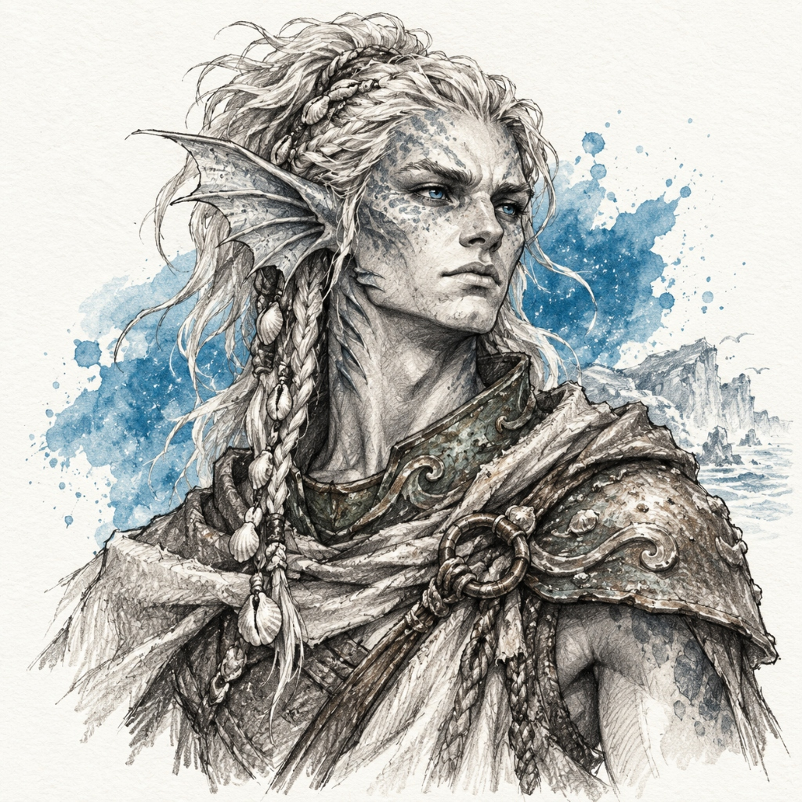
- **Role & Archetype**: Coastal Wave-Guardian and Maritime Diplomat.
- **Style & Medium**: 1995 Samwise Didier fantasy concept art (Always Be Chunky - ABC). Hand-drawn rough black charcoal and graphite draft linework with authoritative contours and gritty cross-hatching, isolated on clean off-white watercolor sketchbook paper.
- **De-Clutter Strategy**: Upper-torso bust portrait, clean breathing space, minimal ambient props, crisp linework.
```text
Crisp, de-cluttered character portrait sketch of EXACTLY ONE Shoreling Myrathil Wave-Guardian, upper-torso bust. Role: Coastal Wave-Guardian and Maritime Diplomat. Style: 1995 fantasy concept art in the style of Samwise Didier, Always Be Chunky (ABC). Hand-drawn rough black charcoal and graphite draft linework with bold, heroic contours and gritty cross-hatching, isolated on clean off-white watercolor sketchbook paper with ample negative space. STRICTLY MONOCHROMATIC CHARACTER & ATTIRE: No color fills on character, armor, or hair. STRICTLY NO TEXT, NO LETTERS, NO WORDS, NO LABELS, NO SIGNATURES, NO WATERMARKS. STRICTLY ONE SINGLE HEROIC FIGURE. AVOID CLUTTER: Clean silhouette with ample negative space around the figure. Canonical Anatomy: Tall, handsome coastal humanoid with sharp jawline, clean chin, piercing deep ocean-blue eyes squinting against sea glare with fine dried white sea-salt crystals clinging to brows and lashes. Broad scalloped wave-fin ears (translucent sea-fan fins with taut cartilage ribs fanning back behind temples); streamlined horizontal neck gill-slits along the throat beneath the jaw. Hair: Wild windswept platinum-white hair resembling crashing wave-foam, tied in a warrior queue with twin side-braids bound with cowrie shells. Attire: Weathered driftwood shoulder pauldron and sculpted sea-bronze neck gorget with hammered wave relief and rich green verdigris patina, worn over a layered brine-cured sailcloth wrap. Minimal background: faint rough graphite sketch lines of sea-spray and distant limestone cliffs fading into clean parchment. Accent: Single dynamic watercolor splash in stormy ocean slate (#0077b6) blooming softly behind the head and shoulder with fluid paint splatters. Pure sketchbook portrait, no borders, no frames.
```

### 🏛️ Part A: Important Buildings & Locations (3 Prompts)

#### ✅ 1. The Sunless Basalt Trench Metropolis (Civic & Residential Core of Mareth's Rift) [GENERATED]

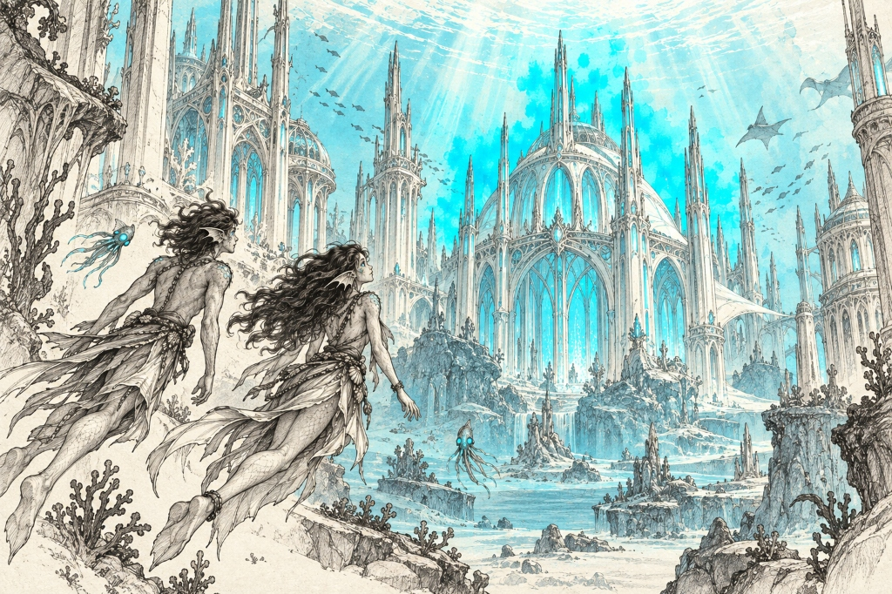
- **Biome & Location**: 4,000 fathoms down in the lightless Treakous Oceanic Rift, carved into sheer vertical basalt cliffs.
- **Lore & Functions**: The sovereign ancestral capital where Deeplings dwell in zero gravity. High arched rope-and-plank suspension bridges span between hexagonal towers where citizens walk. Hydrothermal chimney towers vent billowing bubble plumes. Curved stone-and-shell trade kiosks line the paved plaza where merchants barter clay amphora jugs and glowing sea-glass. Raised stone garden beds host bioluminescent kelp, corals, and sea-anemones, while youths sit cross-legged on the pavement mending fine kelp nets beside woven wicker creels. On the plaza terrace stands a monumental egg-shaped stone monolith deeply inscribed with glowing spiral current runes. Youths glide in 3D space between towers alongside schools of glowing fish and floating light-squids.
```text
Wide-angle architectural concept art sketch looking directly into the vibrant sunken chasm metropolis of the Sunless Basalt Trench, sovereign capital establishment of the Deepling Myrathil, in FULL CRISP FOCUS. Style: 1995 fantasy concept art in the style of Samwise Didier. Hand-drawn rough black charcoal and graphite draft linework with bold structural contours and gritty cross-hatching, isolated on clean off-white watercolor sketchbook paper. STRICTLY MONOCHROMATIC ARCHITECTURE & ENVIRONMENT: No color fills on characters or architecture. STRICTLY NO TEXT, NO LETTERS, NO WORDS, NO LABELS, NO SIGNATURES, NO WATERMARKS. NO GIANT OVERSIZED FOREGROUND PORTRAIT; FULL DEEP-FOCUS CANYON METROPOLIS PERSPECTIVE. Architectural & Urban Focus: A magnificent multi-tiered underwater city built inside a deep oceanic trench between sheer vertical basalt cliffs. Traversal: High arched rope-and-plank suspension bridges spanning between towers where citizens walk, broad stone staircases descending to paved plazas, and open water channels where youths swim and glide weightlessly in 3D space alongside schools of little fish and floating light-squids. Towers & Vent Chimneys: Towering hexagonal and octagonal basalt spires with arched lancet windows and protruding stone balconies, alongside monumental hydrothermal chimney towers venting round billowing bubble clouds upward into the water. Commerce & Kiosks: Sleek curved stone-and-shell trading kiosks and open counters along the main plaza where youthful Deepling merchants barter clay amphora jugs, strings of glowing sea-glass beads, and dried kelp-silk. Crafting, Gardening & Net-Weaving: On the left, a raised stone garden bed where a Deepling girl harvests glowing aquatic kelp, corals, and sea-anemones; in the center plaza, two Deepling youths seated cross-legged on the pavement weave and mend fine kelp fishing nets, with woven wicker baskets and clay jars resting beside them. Mysticism & Sacred Shards: On the right plaza terrace stands a monumental smooth oval egg-shaped stone monolith deeply inscribed with glowing spiral current runes. In-Scale Citizens: Numerous youthful, innocent Deepling citizens (slender adolescent swimmer builds, glowing pale-cyan pupilless eyes, thick dark hair floating upward in water, fin-ears, forearm finlets, crossover kelp tunics with rope sashes and pleated dresses) actively gardening, net-mending, shopping at kiosks, walking bridges, and swimming between towers in natural architectural scale. Accent: Single massive explosive watercolor splash in radiant starlight cyan and electric aquamarine (#00e5ff) blooming behind the central basalt spires and bubble chimneys with fluid paint splatters. Pure isolated sketch, no borders, no frames.
```

#### ✅ 2. The Ulvir Acoustic Resonance Chambers (The Deep Trench Listening Sanctum) [GENERATED]

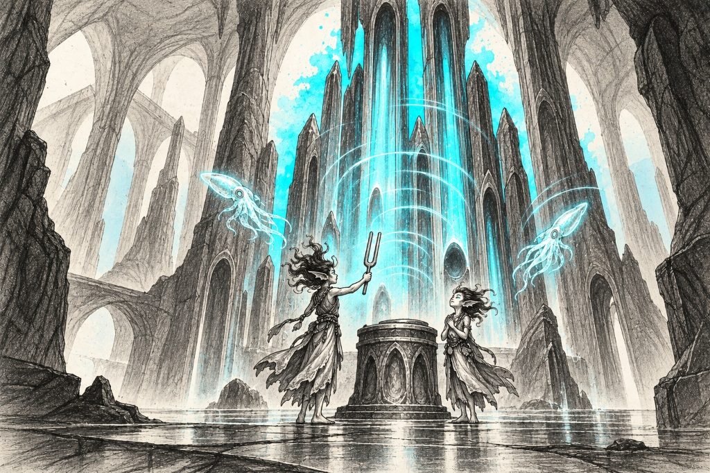
- **Biome & Location**: The abyssal precipice directly overlooking the bottomless drop of the Treakous Oceanic Rift.
- **Lore & Functions**: Founded by Ulvir the Listen-Long. A massive subterranean acoustic cathedral hollowed out of black volcanic basalt. Gigantic organ-like acoustic basalt flutes funnel deep-sea pressure currents into low-frequency harmonic vibrations. Elder Listeners stand along stone resonance balconies holding long whalebone tuning forks, striking them against acoustic pillars to decipher seismic whispers and the hum of the Sundered Monolith.
```text
Wide-angle interior perspective looking through the monumental vaulted nave of the Ulvir Acoustic Resonance Chambers carved directly out of abyssal black basalt. Colossal hollow basalt acoustic organ flutes rise from the floor toward vaulted ribbed stalactite arches, funneling deep-sea pressure currents into visible harmonic acoustic ripples. Wide, smooth stone flagstones with ample breathable floor space. In the center mid-ground, exactly two Deepling Listeners stand peacefully beside a carved resonance pedestal: one strikes a large ancient whalebone tuning fork, while the other listens with closed eyes, surrounded by soft ripples and two hovering bioluminescent squids. Grand, serene, and uncluttered composition. Traditional hand-drawn charcoal and gritty graphite cross-hatching, with a single concentrated splash of Electric Cyan (#00e5ff) watercolor wash blooming behind the acoustic organ pipes.
```

#### ✅ 3. The Drift-Home (The Open-Ocean Floating Coral Raft-Cathedral) [GENERATED]

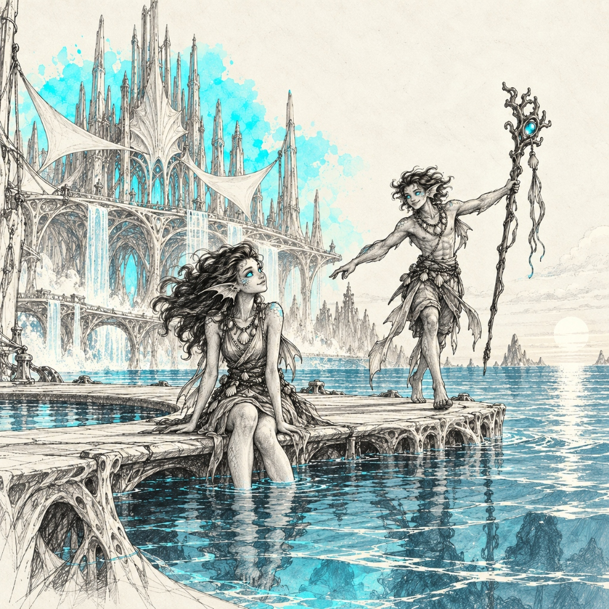
- **Biome & Location**: The open Iceheart Sea, drifting over submerged volcanic seamounts.
- **Lore & Functions**: The largest permanent surface-adjacent Deepling community. Built on living cultivated coral platforms and massive floating raft-decks tethered together with kelp-cables, anchored to colossal domesticated anchor-crabs the size of galleons. It has no solid walls; privacy comes from curtain-kelp. At its center is a submerged immersion pool where Listeners communicate with the deep while surface tenders dry kelp on timber racks.
```text
Low-angle, atmospheric eye-level view along a wide living coral-and-timber platform at the edge of the Drift-Home, the open-ocean floating sanctuary. Heavy kelp mooring cables trail into the deep water where the shadowy shell of a titanic anchor-crab rests beneath the waves. Calm oceanic swells lap gently against the curved platform edge beside an open circular diving moon-pool. In the center mid-ground, exactly two Deepling travelers stand near the water's edge: one young female Deepling sits on the platform with her legs submerged in the calm water, looking up at a companion who points toward the horizon with a carved drift-staff. Clean, airy composition with wide open sky and reflective sea surface, devoid of clutter. Traditional graphite and black charcoal drawing on off-white parchment, with a single subtle splash of Electric Cyan (#00e5ff) watercolor blooming across the central coral shrine.
```

### 👤 Part B: Notable & Legendary Figures (5 Figures)

#### ✅ 1. Ulvir the Listen-Long (The Father of Abyssal Mysticism) [GENERATED]

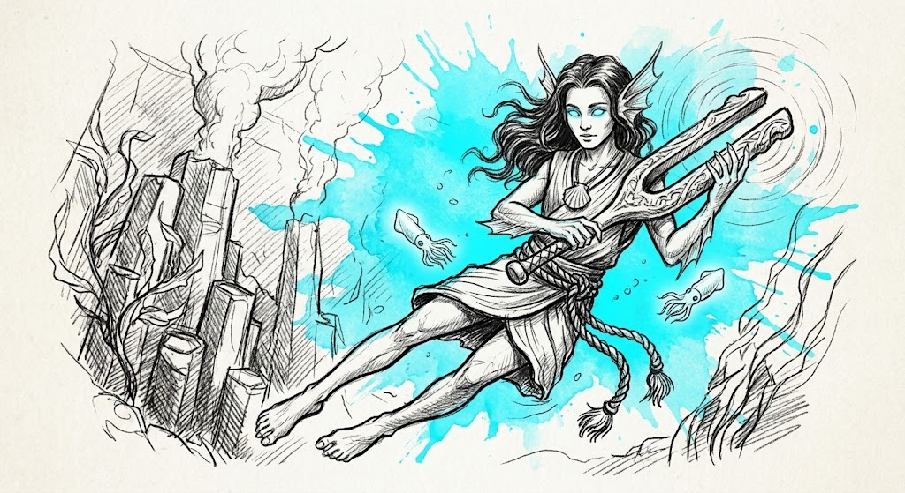
- **Lore Backstory**: Spawned in open ocean during a moonless gale, Ulvir arrived at a drift-raft speaking only the low-frequency underwater hum. He spent decades humming into the Treakous Rift and was the first to hear the resonance of the Sundered Monolith sleeping in the lightless deep.
```text
Single character concept art sketch of EXACTLY ONE Legendary Male Deepling Mystic, Ulvir the Listen-Long. Style: 1995 fantasy concept art in the style of Samwise Didier. Hand-drawn rough black charcoal and graphite draft linework with expressive gritty cross-hatching, isolated on clean off-white watercolor sketchbook paper. STRICTLY MONOCHROMATIC CHARACTER & GEAR: No color fills on character or garments. STRICTLY NO TEXT, NO LETTERS, NO WORDS, NO LABELS, NO SIGNATURES, NO WATERMARKS. ABSOLUTE PROHIBITION ON MULTIPLE FIGURES: RENDER EXACTLY ONE SINGLE HEROIC FIGURE IN A REVERENT WEIGHTLESS POSE. Canonical Anatomy: Slender, lithe aquatic humanoid with youthful ageless features, haunting pure glowing starlight-cyan pupilless eyes, delicate translucent fish-fin ears with ribbed cartilage, and long dark wavy hair billowing weightlessly straight upward in water currents. Forearms have translucent finlet ridges. Attire: Layered pressure-cured kelp-silk wrap tunic to mid-thigh, tied with a thick braided rope sash with frayed tassel ends at the hip, a carved scallop seashell amulet hanging at his neck. Gear: Revering both hands around a massive carved ancient whalebone tuning fork that hums with visible acoustic ripples in the water. Bare delicate webbed feet trailing in zero-gravity open ocean water, accompanied by two glowing baby light-squids swimming near his hands. Setting & Crude Background: Seen in his element in the lightless Treakous Rift with crude, hand-drawn 1995 Samwise Didier draft style background scenery sketched in rough graphite linework and gritty cross-hatching—looming hexagonal basalt trench columns, billowing hydrothermal chimney bubble plumes rising upward, drifting kelp strands, and acoustic ripples radiating from his tuning fork. The sketched scenery vignettes loosely into the off-white paper. Accent: Single explosive watercolor splash in radiant starlight cyan (#00e5ff) blooming dynamically behind the mystic with fluid paint splatters, tinting the linework and water. Pure sketchbook draft page, no formal borders or frames.
```

#### ⏳ 2. Sola the Glider (The Surface Ambassador & First Squid-Herder) [PENDING GENERATION]
- **Lore Backstory**: The adventurous young female Deepling who was the first of her generation to breach the sunlit surface boundary during calm weather and establish communication with Shoreling trade posts. Creator of the bioluminescent squid-lure beacon.
```text
Single character concept art sketch of EXACTLY ONE Female Deepling Explorer, Sola the Glider. Style: 1995 fantasy concept art in the style of Samwise Didier. Hand-drawn rough black charcoal and graphite draft linework with expressive gritty cross-hatching, isolated on clean off-white watercolor sketchbook paper. STRICTLY MONOCHROMATIC CHARACTER & GEAR: No color fills on character, dress, or squids. STRICTLY NO TEXT, NO LETTERS, NO WORDS, NO LABELS, NO SIGNATURES, NO WATERMARKS. ABSOLUTE PROHIBITION ON MULTIPLE FIGURES: RENDER EXACTLY ONE SINGLE HEROIC FIGURE IN AN ICONIC SURFACE-BREACHING AND SQUID-HERDING POSE. Canonical Anatomy: A youthful, innocent aquatic maiden with lithe, graceful swimmer proportions, soft beautiful facial features, curious fearless expression. Eyes: Large, wide solid glowing pale-cyan pupilless eyes. Hair: Long, thick, wavy dark hair floating weightlessly upward and billowing back in water currents. Ears: Delicate translucent fish-fin ears fanning back behind temples; translucent finlet frills along outer forearms. Jewelry: A collar necklace of small carved scallop seashells and sea-beads, and a beaded waistband with hanging oval shell drops. Attire: Flowing pleated tattered kelp-weave dress shredding into fin-like ribbons floating weightlessly around her bare legs. Hands & Feet: Slender arms with shell bracelets, five-fingered hands with swimming webbing, bare delicate humanoid feet. Iconic Action: Sola is depicted at the sunlit ocean surface boundary, her upper torso breaking through the calm water surface into open air with water droplets beading on her skin. In her right hand, she holds aloft a carved nautilus-shell light-lure beacon projecting a focused shaft of starlight-cyan light, guiding a swirling helical vortex of six glowing baby squids spiraling playfully around her arm and torso. With her left webbed hand, she reaches forward offering a glowing sphere of polished sea-glass toward an unseen trade partner. Setting & Crude Background: Seen in her element at the oceanic surface interface with crude, hand-drawn 1995 Samwise Didier draft style background scenery sketched in rough graphite linework and gritty cross-hatching—the undulating mirror-like surface membrane of the ocean viewed from below, sun rays piercing through emerald water, drifting golden kelp ribbons, and the curved timber outrigger hull of a nearby Shoreling catamaran raft resting on the surface. Loosely vignetted sketch background. Accent: Single explosive watercolor splash in radiant starlight cyan and electric aquamarine (#00e5ff) blooming dynamically behind the light-lure beacon and squids with fluid paint splatters. Pure sketchbook draft page, no formal borders or frames.
```

#### ⏳ 3. Kael the Trench-Watcher (Guardian of the Sundered Monolith) [PENDING GENERATION]
- **Lore Backstory**: A vigilant young male Deepling sentinel stationed on the volcanic ridge overlooking the lightless drop of the Treakous Rift. When seismic tremors shudder from the sleeping Sundered Monolith, Kael strikes the colossal basalt alarm gong, sending reverberations through the oceanic depths to warn the trench metropolis.
```text
Single character concept art sketch of EXACTLY ONE Male Deepling Sentinel, Kael the Trench-Watcher. Style: 1995 fantasy concept art in the style of Samwise Didier. Hand-drawn rough black charcoal and graphite draft linework with bold heroic contours and gritty cross-hatching, isolated on clean off-white watercolor sketchbook paper. STRICTLY MONOCHROMATIC CHARACTER & GEAR: No color fills on character or gear. STRICTLY NO TEXT, NO LETTERS, NO WORDS, NO LABELS, NO SIGNATURES, NO WATERMARKS. ABSOLUTE PROHIBITION ON MULTIPLE FIGURES: RENDER EXACTLY ONE SINGLE HEROIC FIGURE IN AN ICONIC ALARM-GONG STRIKING POSE. Canonical Anatomy: Youthful aquatic boy with lean, wiry, athletic swimmer proportions, soft handsome facial features, intense alert expression. Eyes: Large wide solid glowing pale-cyan pupilless eyes radiating inner light. Hair: Thick, wavy dark hair billowing weightlessly straight UPWARD. Ears & Finlets: Delicate translucent fish-fin ears with ribbed cartilage; translucent aquatic finlet ridge along outer forearms. Jewelry & Attire: Cord necklace with a carved scallop shell pendant, sleeveless crossover V-neck pleated kelp-weave wrap tunic bound with a thick braided rope sash with frayed tassel ends at the hip. Hands & Feet: Five-fingered webbed hands, bare delicate humanoid feet with high insteps. Iconic Action: Caught in the dramatic instant of striking a monumental circular basalt alarm gong mounted on an ancient stone pylon. Swings a heavy carved stone hammer with both hands, muscles flexed, impacting the gong's center so that visible concentric acoustic shockwaves, acoustic ripples, and cavitation bubbles radiate violently outward through the water. Setting & Crude Background: Seen in his element perched on a vertiginous volcanic basalt ledge with crude, hand-drawn 1995 Samwise Didier draft style background scenery sketched in rough graphite linework and gritty cross-hatching—the bottomless lightless abyss of the Treakous Rift yawning below, the colossal dormant silhouette of the Sundered Monolith humming with faint volcanic fissures in the deep distance, billowing hydrothermal bubble chimneys, and frightened baby squids scattering from the seismic shockwave. Loosely vignetted sketch background. Accent: Single dynamic explosive watercolor splash in radiant starlight cyan (#00e5ff) blooming violently behind the impacted alarm gong with fluid paint splatters. Pure sketchbook draft page, no formal borders or frames.
```

#### ⏳ 4. Lyra the Net-Weaver (Innocent Keeper of the Glowing Kelp Gardens) [PENDING GENERATION]
- **Lore Backstory**: Master artisan of the abyssal gardens who weaves the living bioluminescent kelp filter-curtains. Her gossamer webs protect the infant nursery beds from turbulent undertows while sifting glowing plankton to feed newly spawned Deeplings.
```text
Single character concept art sketch of EXACTLY ONE Female Deepling Artisan, Lyra the Net-Weaver. Style: 1995 fantasy concept art in the style of Samwise Didier. Hand-drawn rough black charcoal and graphite draft linework with intricate delicate cross-hatching, isolated on clean off-white watercolor sketchbook paper. STRICTLY MONOCHROMATIC CHARACTER & GEAR: No color fills on character, net, or gear. STRICTLY NO TEXT, NO LETTERS, NO WORDS, NO LABELS, NO SIGNATURES, NO WATERMARKS. ABSOLUTE PROHIBITION ON MULTIPLE FIGURES: RENDER EXACTLY ONE SINGLE HEROIC FIGURE IN AN ICONIC KELP-WEB WEAVING POSE. Canonical Anatomy: Innocent, sweet youthful aquatic maiden with soft cheeks, gentle focused expression, large solid glowing pale-cyan pupilless eyes, delicate translucent fish-fin ears, thick wavy dark hair billowing weightlessly straight upward in water currents, and translucent forearm finlet ridges. Attire: Pleated tattered kelp-weave dress with flowing fin-like ribbon hems, collar of small scallop shells, braided sea-grass cord belt. Hands & Feet: Delicate five-fingered hands with swimming webbing, bare feet with high insteps. Iconic Action: Suspended weightlessly in mid-water, actively weaving an enormous glowing gossamer kelp web strung between two living bioluminescent coral pillars. Holds a carved mother-of-pearl weaving shuttle in her webbed hands, threading fine glowing kelp-silk strands that sparkle with trapped bioluminescent plankton. Three tiny glowing baby squids playfully poke their tentacles through the web mesh, while an anchored wicker creel filled with harvested glowing sea-anemones floats beside her. Setting & Crude Background: Seen in her element inside the underwater trench nursery gardens with crude, hand-drawn 1995 Samwise Didier draft style background scenery sketched in rough graphite linework and gritty cross-hatching—raised stone planting beds of waving bioluminescent kelp, branching staghorn corals, wicker drying frames, and the distant arched bridges of the basalt trench city. Loosely vignetted sketch background. Accent: Dynamic explosive watercolor splash in radiant starlight cyan (#00e5ff) blooming behind the glowing kelp web with fluid paint splatters. Pure sketchbook draft page, no formal borders or frames.
```

#### ⏳ 5. Vaelen the Abyssal Herder (Master of the Deep Current Migration) [PENDING GENERATION]
- **Lore Backstory**: The legendary deep-sea pathfinder who guides the seasonal migrations of colossal drift-rays, siphonophores, and abyssal squids across pitch-black ocean trenches, navigating by low-frequency acoustic hums and crystal light-beacons.
```text
Single character concept art sketch of EXACTLY ONE Male Deepling Herder, Vaelen the Abyssal Herder. Style: 1995 fantasy concept art in the style of Samwise Didier. Hand-drawn rough black charcoal and graphite draft linework with sweeping marine perspective and gritty cross-hatching, isolated on clean off-white watercolor sketchbook paper. STRICTLY MONOCHROMATIC CHARACTER & GEAR: No color fills on character, ray, or siphonophores. STRICTLY NO TEXT, NO LETTERS, NO WORDS, NO LABELS, NO SIGNATURES, NO WATERMARKS. ABSOLUTE PROHIBITION ON MULTIPLE FIGURES: RENDER EXACTLY ONE SINGLE HEROIC FIGURE IN AN ICONIC DRIFT-MIGRATION HERDING POSE. Canonical Anatomy: Slender, youthful yet battle-tested aquatic swimmer with large solid glowing pale-cyan pupilless eyes, translucent ribbed fish-fin ears, thick wavy dark hair billowing upward in water currents, forearm finlet ridges, and bare webbed feet. Attire: Pressure-cured sleeveless crossover kelp tunic bound with a thick braided rope sash, wearing a cluster of scallop shell pendants that click together in water currents. Iconic Action: Gliding effortlessly in the slipstream directly atop the broad back of a titanic bioluminescent manta drift-ray. Holds aloft an ornate driftwood herding crook crowned with a pulsing crystal bulb that casts a long, piercing beam of starlight-cyan light into the pitch-black abyss. With his other hand, he signals a magnificent migrating river of hundred-foot bioluminescent siphonophores and glowing drift-squids swimming in an undulating formation behind him. Setting & Crude Background: Seen in his element in a deep abyssal transit canyon with crude, hand-drawn 1995 Samwise Didier draft style background scenery sketched in rough graphite linework and gritty cross-hatching—sheer vertical basalt rift canyon walls inscribed with ancient current glyphs, rising hydrothermal bubble plumes, and schools of small silver trench fish scattering in the wake of the colossal drift-ray. Loosely vignetted sketch background. Accent: Single dynamic explosive watercolor splash in radiant starlight cyan (#00e5ff) blooming behind the crystal herding beacon with fluid paint splatters. Pure sketchbook draft page, no formal borders or frames.
```

---

## 🛡️ 2. Shoreling Myrathil (Ocean Slate `#0077b6`)
*Canonical Anatomical Lock*: Tall, lean, athletic coastal wave-guardians and maritime diplomats (tall athletic swimmer build, broad powerful shoulders, long sinewy limbs, NOT stocky, NOT stumpy). Handsome, sun-baked and weather-etched clean-shaven noble face with sharp jawline, clean chin, piercing deep ocean-blue eyes squinting against sea-glare, with fine dried white sea-salt crystals clinging to brows and eyelashes. Complexion: Sun-baked, salt-bronzed skin with delicate iridescent nacre sheen across shoulders and clavicle; shifting bioluminescent tidal vein patterns along collarbones, forearms, and calves (glowing sea-teal in calm, stormy slate-grey before gales). Broad scalloped wave-fin ears (translucent sea-fan fins with taut cartilage ribs fanning back behind temples); streamlined horizontal neck gill-slits along the throat beneath the jawline that flare when breathing sea spray. Hair: Wild windswept platinum-white hair resembling crashing wave-foam, tied in a warrior queue with twin temple braids bound with sea-grass cord and small cowrie shells (male) or an intricate fishtail plait with mother-of-pearl hair-spikes (female). Hands: Five-fingered hands with flexible swimming webbing. Feet: Tough, grippy coastal humanoid feet (human foot structure): high flexible arches, long dexterous humanoid toes, calloused textured grip soles built for sprinting barefoot across razor-sharp barnacle-covered rocks, wet limestone reefs, and crashing surf without slipping, with subtle swimming webbing between toes. Attire: Layered brine-cured sailcloth wrap, wave-treated linen kilt, weathered driftwood shoulder pauldron and chest harness reinforced with overlapping scalloped sea-shell plates and hammered sea-bronze fittings with rich green verdigris patina. Armed with a gnarled driftwood wave-staff with branching coral-and-bronze tines, or sheathed maritime short sword.

### 🏛️ Part A: Important Buildings & Locations (3 Prompts)

#### ✅ 1. Salt-Hinge Harbor Fortress & Tidal Bazaar (The Trade Capital) [GENERATED]

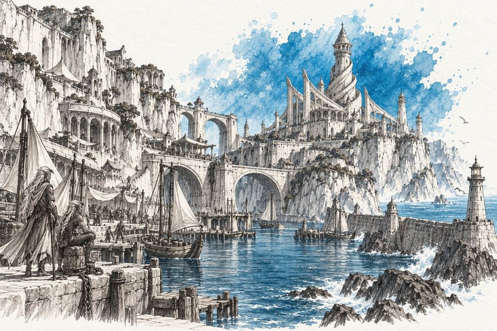
- **Biome & Location**: Coastal white limestone cliffs and tidal estuary where the Great River meets the ocean.
- **Lore & Functions**: The sovereign trade capital of the Shoreling. Monumental limestone sea-walls hold back ocean breakers. Tiered canal basins and wooden boom-cranes transfer boats between tide levels. Along the wharves, the Salt-Hinge Accords market buzzes under sailcloth canopies where merchants trade sea-glass, cultured pearls, dried kelp-cloth, and verdigris sea-bronze. Tidal fish-sluices trap coastal schools on the ebbing tide, and oyster beds terrace the rock shelves. Navigators in conch-spire lighthouses study brass astrolabes and tide charts.
```text
Wide-angle architectural concept art sketch looking directly into the bustling fortified harbor establishment of Salt-Hinge, sovereign capital of the Shoreling Myrathil, in FULL CRISP FOCUS. Style: 1995 fantasy concept art in the style of Samwise Didier, Always Be Chunky (ABC). Hand-drawn rough black charcoal and graphite draft linework with grand coastal architectural perspective and gritty cross-hatching, isolated on clean off-white watercolor sketchbook paper. STRICTLY MONOCHROMATIC ARCHITECTURE & ENVIRONMENT: No color fills on characters or architecture. STRICTLY NO TEXT, NO LETTERS, NO WORDS, NO LABELS, NO SIGNATURES, NO WATERMARKS. NO GIANT OVERSIZED FOREGROUND PORTRAIT; FULL PANORAMIC URBAN DEPTH. Architectural & Urban Focus: A colossal coastal metropolis carved directly into white calcified limestone cliffs and wave-battered granite reefs. Traversal: Multi-tier arched stone aqueduct bridges spanning crashing surge channels, wide limestone stair-cascades connecting cliff terraces to tidal docks, heavy counterweighted wooden boom-cranes transferring fishing skiffs between canal levels, and curved breakwater sea-walls holding back oceanic breakers. Commerce & Markets: The sprawling Salt-Hinge Accords market square along the inner harbor quays—merchants under brine-cured sailcloth canopies trading sea-glass jewelry, cultivated pearl strands, salted cod, bolts of waterproof kelp-cloth, salvaged driftwood beams, and verdigris sea-bronze hardware from open stone stalls. Harvesting & Fisheries: Tiered tidal sluice-gates and stone weir pens where fishers trap incoming schools of fish with the falling tide, terraced oyster and abalone beds carved into intertidal rocks, and salt-drying pans shimmering on outer terraces. Study & Governance: The open-air circular Tide-Council amphitheatre paved with conch-shell mosaics overlooking the ocean, flanked by spiraling conch-spire signal lighthouses where navigators study brass astrolabes and tide charts. In-Scale Citizens: Shoreling citizens, wave-guardians, and merchants (wild windswept platinum wave-foam hair, dried salt on brows, scalloped wave-fin ears, calloused coastal grip feet, sailcloth wraps, driftwood armor) bustling through the market, repairing nets, hauling crates, and navigating docks in natural perspective scale. Accent: Single dynamic explosive watercolor splash in stormy ocean slate (#0077b6) blooming behind the central conch lighthouses with fluid paint splatters. Pure isolated sketch, no borders, no frames.
```

#### ✅ 2. The First Shore & Spawning Cairns (The Historic Emergence Beach) [GENERATED]

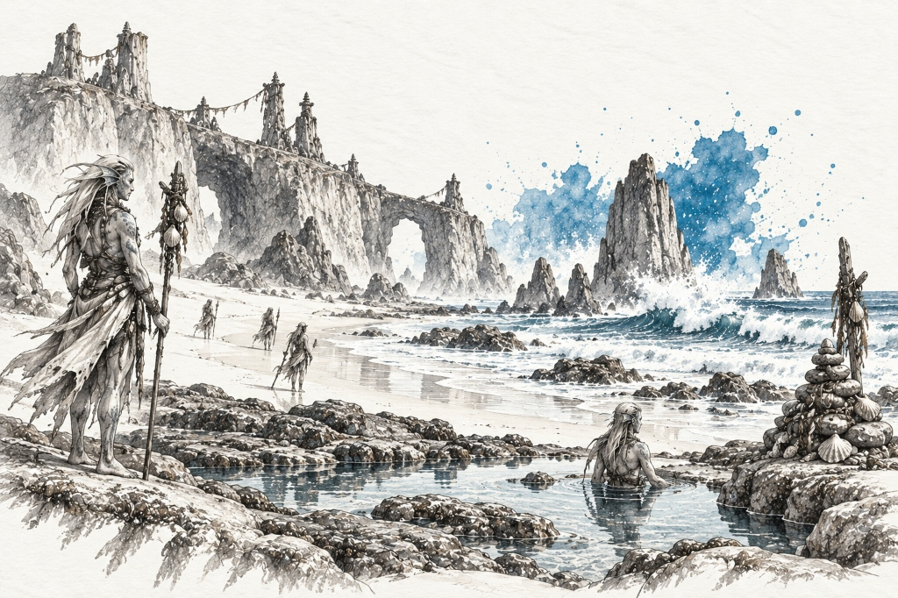
- **Biome & Location**: A sweeping crescent of white crushed shell-grit beach on the western ocean coast where violent surf churns into foam.
- **Lore & Functions**: Revered as the ancestral emergence beach where the earliest Shoreling Myrathil first took physical form from oceanic foam. While Myrathil across the world adhere to their subrace based entirely upon the waters where they coalesce (coastal ocean breakers for Shorelings, freshwater rapids and rivers for Riverlings, and abyssal oceanic trenches for Deeplings), the First Shore is celebrated as the historic cradle of coastal kind. Littered with hundreds of weathered stone cairns, each commemorating an emergence where a Shoreling first stood up from the sea-foam. Natural limestone tide pools fill and empty with the tidal swell, offering sacred immersion baths for travelers and pilgrims. Driftwood offering posts hung with sea-glass, cowrie shells, and braided strands of kelp-weave line the upper tide-line.
```text
Wide-angle landscape and architectural concept art sketch of the First Shore and Sacred Spawning Cairns of the Shoreling Myrathil, in FULL CRISP FOCUS. Style: 1995 fantasy concept art in the style of Samwise Didier. Hand-drawn rough black charcoal and graphite draft linework with expressive gritty cross-hatching and bold oceanic textures, isolated on clean off-white watercolor sketchbook paper. STRICTLY MONOCHROMATIC SUBJECT & ENVIRONMENT: No color fills on characters or scenery. STRICTLY NO TEXT, NO LETTERS, NO WORDS, NO LABELS, NO SIGNATURES, NO WATERMARKS. NO GIANT FOREGROUND PORTRAIT; FULL SACRED SHORE PERSPECTIVE. Architectural & Landscape Focus: A sweeping crescent beach of white crushed shell-grit meeting violently churning foam and breakers. Traversal: Winding footpaths over wet granite reefs and limestone tide pools where wave-foam swirls. Sacred Monuments: Hundreds of weathered stone cairns standing across the upper tideline, each adorned with smooth beach stones, conch shells, and carved driftwood totem posts hung with swaying strings of sea-glass and dried kelp offerings. Pilgrims & Rites: Shoreling pilgrims (wild windswept wave-foam platinum hair, dried salt on brows, scalloped wave-fin ears, sailcloth wraps) walking barefoot over barnacle-covered rock shelves, floating peacefully in deep natural tide pools, and adding stones to ancestral cairns. Sea mist and ocean spray billow across the rocky headlands. Accent: Single explosive watercolor splash in stormy ocean slate and wave-teal (#0077b6) bursting behind the sea-foam breakers with fluid paint splatters. Pure isolated sketch, no borders, no frames.
```

#### ✅ 3. The Spindrift Tide-Council Rotunda (The Coastal Treaty Pavilion) [GENERATED]

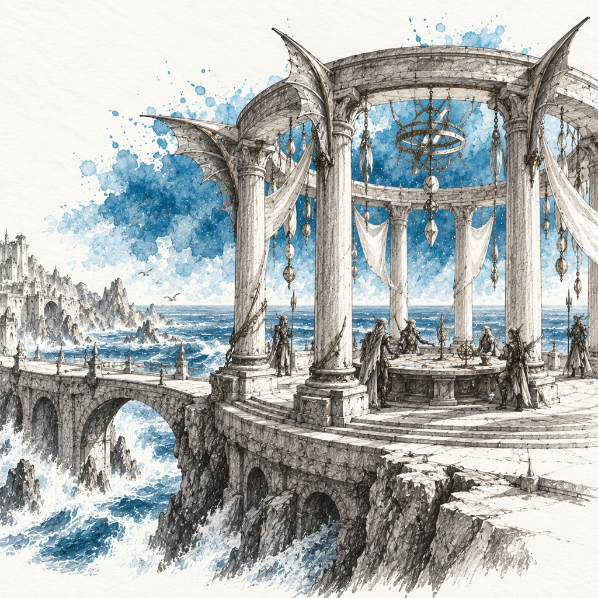
- **Biome & Location**: Perched atop a massive wave-carved granite sea-stack connected to the cliffs of Salt-Hinge by an arched stone bridge.
- **Lore & Functions**: The diplomatic heart of Myrathil society where the Salt-Hinge Accords were drafted. An open-air circular colonnade of fluted limestone pillars carved with wave motifs. In the center is a massive circular tidal chart-table made of inlaid mother-of-pearl and bronze, upon which rotating bronze astrolabes track ocean currents, storm swells, and trade routes.
```text
Wide-angle architectural concept art sketch of the Spindrift Tide-Council Rotunda in Salt-Hinge, in FULL CRISP FOCUS. Style: 1995 fantasy concept art in the style of Samwise Didier. Hand-drawn rough black charcoal and graphite draft linework with grand open-air architectural contours and gritty cross-hatching, isolated on clean off-white watercolor sketchbook paper. STRICTLY MONOCHROMATIC ARCHITECTURE & ENVIRONMENT: No color fills on characters or architecture. STRICTLY NO TEXT, NO LETTERS, NO WORDS, NO LABELS, NO SIGNATURES, NO WATERMARKS. NO GIANT FOREGROUND PORTRAIT; FULL ROTUNDA CIVIC PERSPECTIVE. Architectural & Civic Focus: A monumental circular limestone pavilion perched on a wave-battered granite sea-stack overlooking crashing oceanic breakers. Traversal: An arched stone bridge connecting the rotunda to the mainland cliffs, open-air colonnaded promenades, and low stone balustrades where ocean spray billows up from sea caves below. Governance & Cartography: Fluted pillars support an open-sky ring lintel hung with mother-of-pearl wind-chimes; in the center, a colossal circular chart-table inlaid with sea-glass maps and rotating brass nautical astrolabes where diplomats negotiate trade agreements. In-Scale Citizens: Shoreling diplomats and wave-guardians in sculpted verdigris bronze armor and sailcloth wraps conferring over parchment treaties, studying charts, and observing the tide in natural architectural scale. Accent: Single dynamic explosive watercolor splash in deep stormy ocean slate (#0077b6) blooming behind the pavilion pillars with fluid paint splatters. Pure isolated sketch, no borders, no frames.
```

### 👤 Part B: Notable & Legendary Figures (5 Figures)

#### ✅ 1. Saelith of the First Tide (The Voice That Crossed — Founder of Salt-Hinge) [GENERATED]

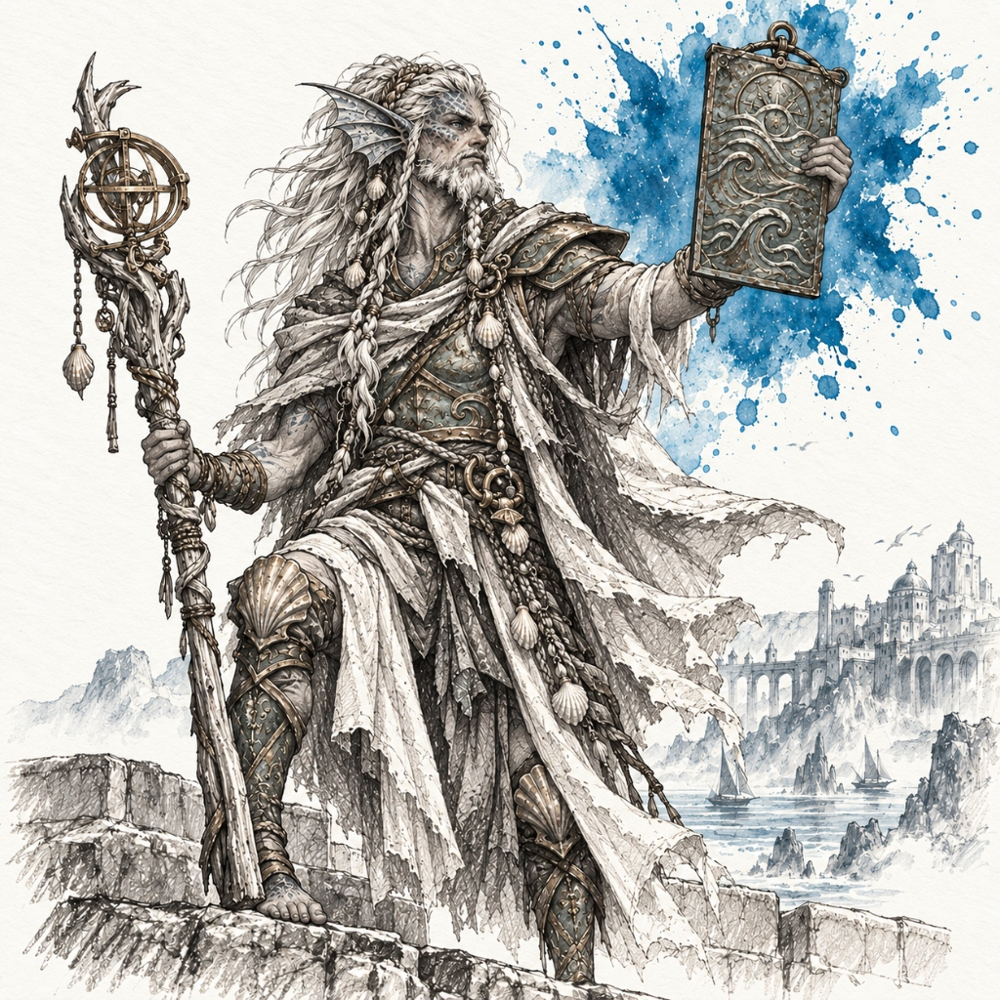
- **Lore Backstory**: The first Shoreling to walk into human port cities and negotiate trade agreements as an equal. She authored the Salt-Hinge Accords, guaranteeing mutual maritime protection and fair trade across species, and founded the harbor city.
```text
Single character concept art sketch of EXACTLY ONE Legendary Shoreling Diplomat, Saelith of the First Tide. Style: 1995 fantasy concept art in the style of Samwise Didier. Hand-drawn rough black charcoal and graphite draft linework with dignified gritty cross-hatching, isolated on clean off-white watercolor sketchbook paper. STRICTLY MONOCHROMATIC CHARACTER & GEAR: No color fills on character, armor, tablet, or staff. STRICTLY NO TEXT, NO LETTERS, NO WORDS, NO LABELS, NO SIGNATURES, NO WATERMARKS. ABSOLUTE PROHIBITION ON MULTIPLE FIGURES: RENDER EXACTLY ONE SINGLE HEROIC FIGURE IN AN ICONIC TREATY-PROCLAMATION POSE. Canonical Anatomy: Tall, dignified athletic coastal diplomat with broad shoulders and statuesque poise. Face: Noble, sun-baked salt-bronzed face, piercing ocean-blue eyes squinting with calm authority, dried white sea-salt crystals clinging to brows and lashes. Head & Ears: Broad scalloped wave-fin ears with cartilage ribs fanning back behind temples; horizontal neck gill-slits; wild windswept platinum-white hair resembling wave-foam tied in an intricate fishtail plait bound with sea-grass cord and mother-of-pearl hair-spikes. Hands & Feet: Flexible swimming webbing between fingers, tough calloused coastal feet with textured non-slip grip soles planted firmly on wet granite. Attire: Layered brine-cured sailcloth wrap under a sculpted sea-bronze cuirass with rich green verdigris patina, scallop-shell knee poleyns. Iconic Action: Caught in the historic act of proclaiming the Salt-Hinge Accords: holding aloft a heavy verdigris bronze treaty tablet inscribed with maritime wave-glyphs in one hand, while planting the butt of her monumental gnarled driftwood wave-staff crowned with a rotating brass astrolabe firmly into the rock, declaring open peace between land and sea. Setting & Crude Background: Seen in her element atop the wave-swept limestone ramparts of Salt-Hinge with crude, hand-drawn 1995 Samwise Didier draft style background scenery sketched in rough graphite linework and gritty cross-hatching—cyclopean stone sea-walls holding back crashing ocean surf, a spiraling conch-spire signal lighthouse on the headland, unrolled sea charts on a stone parapet, and sea mist swirling in the wind. Vignetted sketch background. Accent: Single dynamic explosive watercolor splash in stormy ocean slate (#0077b6) blooming behind the treaty tablet with fluid paint splatters. Pure sketchbook draft page, no formal borders or frames.
```

#### ✅ 2. Commander Morvath of the Wave-Guard (Defender of the Breakwaters) [GENERATED]

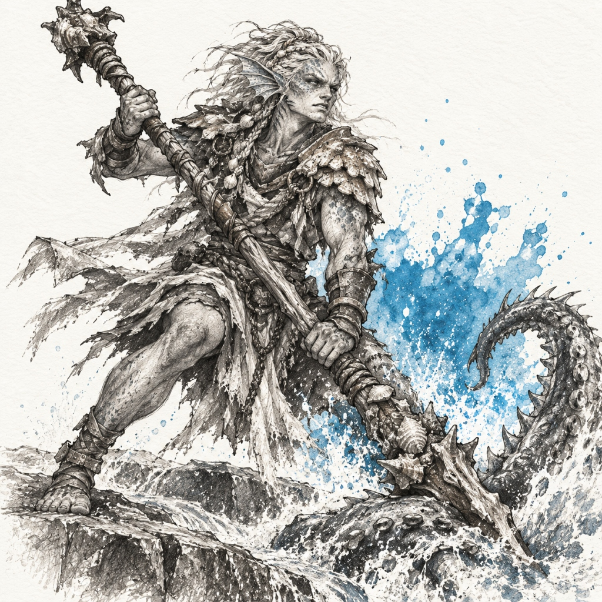
- **Lore Backstory**: A battle-hardened coastal warrior who has spent fifty winters defending the sea-walls of Salt-Hinge against raiders and leviathans. Renowned for his heavy two-handed driftwood wave-staff and deep storm-grey tidal veins.
```text
Single character concept art sketch of EXACTLY ONE Male Shoreling Warrior, Commander Morvath of the Wave-Guard. Style: 1995 fantasy concept art in the style of Samwise Didier. Hand-drawn rough black charcoal and graphite draft linework with bold muscular contours and gritty cross-hatching, isolated on clean off-white watercolor sketchbook paper. STRICTLY MONOCHROMATIC CHARACTER & GEAR: No color fills on character, armor, or weapon. STRICTLY NO TEXT, NO LETTERS, NO WORDS, NO LABELS, NO SIGNATURES, NO WATERMARKS. ABSOLUTE PROHIBITION ON MULTIPLE FIGURES: RENDER EXACTLY ONE SINGLE HEROIC FIGURE IN AN ICONIC BREAKWATER-DEFENSE POSE. Canonical Anatomy: Tall, lean, muscular coastal warrior (broad powerful shoulders, sculpted latissimus dorsi, long sinewy legs). Face: Handsome, weather-etched clean-shaven jawline, piercing ocean-blue eyes squinting against sea-glare, dried white sea-salt crystals on brows. Complexion: Sun-baked salt-bronzed skin with shifting bioluminescent tidal veins glowing storm-grey along forearms and collarbones. Ears & Gills: Broad scalloped wave-fin ears fanning back; horizontal neck gill-slits flaring. Hair: Wild windswept platinum-white hair tied in a warrior queue with twin side-braids bound with cowrie shells. Feet: Tough, calloused coastal humanoid feet with textured grip soles gripping slick sea-wall stone. Attire: Layered brine-cured sailcloth wrap, weathered driftwood shoulder pauldron, green-verdigris sea-bronze chest harness with scallop-shell plates. Iconic Action: Caught in the dramatic instant of defending the breach: bracing low with muscular thighs against a titanic crashing breaker, thrusting his heavy two-handed gnarled driftwood wave-staff downward with crushing force to pin a thrashing spined sea-leviathan tentacle that has coiled over the battered limestone rampart, teeth clenched in defiance. Setting & Crude Background: Seen in his element standing on the wave-battered breakwater of Salt-Hinge with crude, hand-drawn 1995 Samwise Didier draft style background scenery sketched in rough graphite linework and gritty cross-hatching—violent oceanic breakers smashing against jagged granite sea-stacks, spray billowing upward, heavy wooden boom-cranes on the dock in the distance, and shattered timber wreckage. Vignetted sketch background. Accent: Single dynamic explosive watercolor splash in stormy ocean slate (#0077b6) blooming violently behind the impacted wave-staff with fluid paint splatters. Pure sketchbook draft page, no formal borders or frames.
```

#### ✅ 3. Envoy Talia Spindrift-Tongue (Chief Mediator of the Accords) [GENERATED]

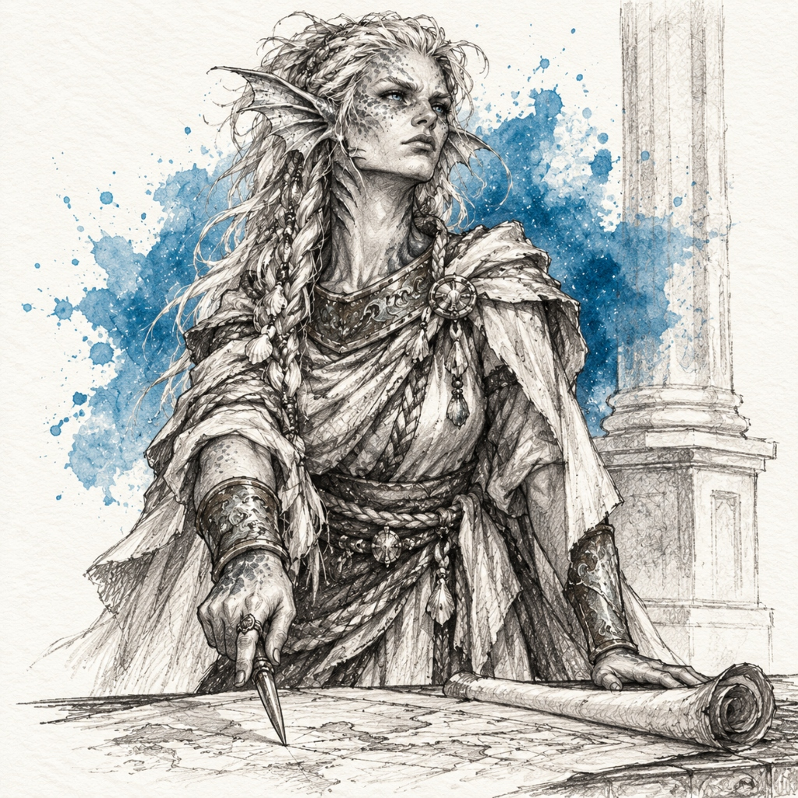
- **Lore Backstory**: A brilliant young diplomat who mediates disputes between land-folk merchants and sea-folk clans. Her shifting tidal veins flush bright teal when she detects deceit, earning her the title of "The Mirror of the Tide."
```text
Single character concept art sketch of EXACTLY ONE Female Shoreling Diplomat, Envoy Talia Spindrift-Tongue. Style: 1995 fantasy concept art in the style of Samwise Didier. Hand-drawn rough black charcoal and graphite draft linework with expressive cross-hatching, isolated on clean off-white watercolor sketchbook paper. STRICTLY MONOCHROMATIC CHARACTER & GEAR: No color fills on character or garments. STRICTLY NO TEXT, NO LETTERS, NO WORDS, NO LABELS, NO SIGNATURES, NO WATERMARKS. ABSOLUTE PROHIBITION ON MULTIPLE FIGURES: RENDER EXACTLY ONE SINGLE FIGURE IN AN ICONIC TRUTH-EXPOSING ARBITRATION POSE. Canonical Anatomy: Tall, statuesque athletic coastal diplomat (sun-baked salt-bronzed skin, shifting bioluminescent tidal veins tracing along collarbones and calves, dried sea-salt crystals on brows, piercing ocean-blue eyes). Head & Ears: Scalloped wave-fin ears with delicate cartilage ribs; horizontal neck gill-slits; long wild platinum-white hair woven into an intricate fishtail braid secured with mother-of-pearl pins. Attire: Fitted wave-silk tunic under tailored brine-sailcloth battle-tassets, lightweight verdigris bronze gorget with wave relief, belt of braided mariner hemp hung with polished sea-glass amulets. Bare calloused coastal feet with textured grip soles planted gracefully on marble pavement. Iconic Action: In the midst of arbitrating a tense treaty dispute inside the Tide-Council rotunda: pointing an accusing brass stylus directly down onto a falsified nautical map roll on the chart-table, her chin held high and piercing eyes fixed forward, while the shifting bioluminescent tidal veins across her collarbones and throat flare brilliantly in radiant teal, visibly exposing the fraudulent claim. Setting & Crude Background: Seen in her element inside the open-air Spindrift Tide-Council rotunda with crude, hand-drawn 1995 Samwise Didier draft style background scenery sketched in rough graphite linework and gritty cross-hatching—fluted limestone columns overlooking the sea, unrolled trade charters and parchment rolls on a mother-of-pearl chart table, rotating brass astrolabes, and ocean spray drifting past the balustrade. Vignetted sketch background. Accent: Dynamic explosive watercolor splash in stormy ocean slate (#0077b6) blooming behind the envoy with fluid paint splatters. Pure sketchbook draft page, no formal borders or frames.
```

#### ✅ 4. Old Barnaby the Reef-Runner (Veteran Barnacle-Grip Sentry) [GENERATED]

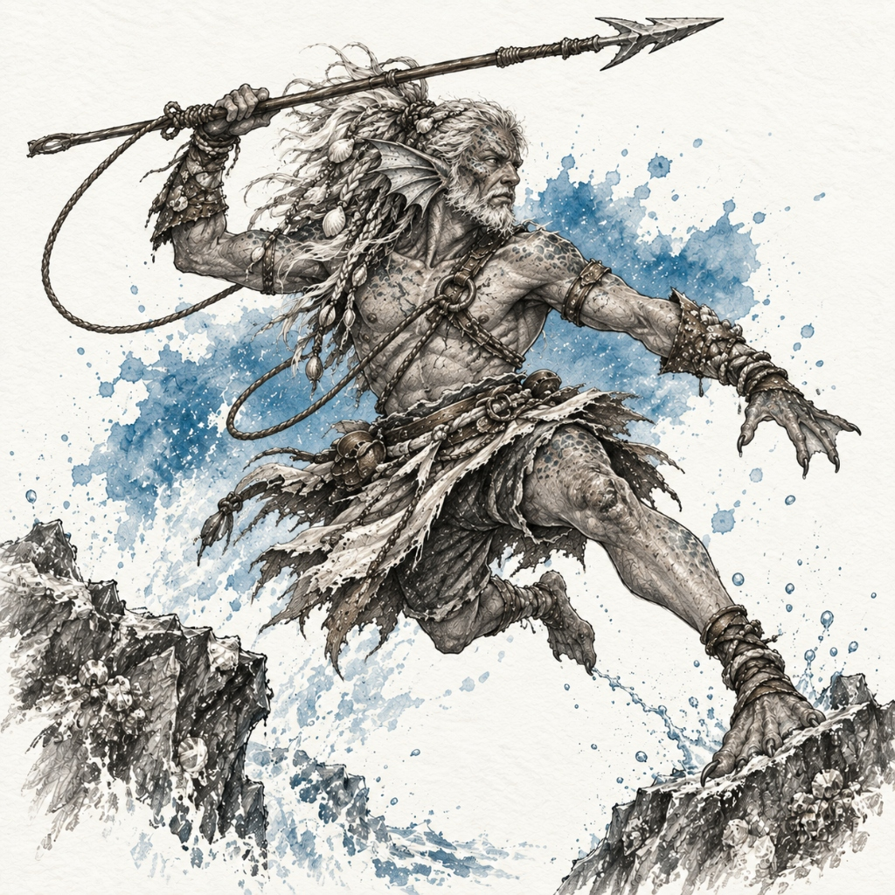
- **Lore Backstory**: A veteran sentry whose calloused feet can sprint across razor-sharp barnacle beds and breaking surf at full speed without bleeding. He tracks storm fronts by tasting salt spray on the rocks.
```text
Single character concept art sketch of EXACTLY ONE Veteran Male Shoreling Sentry, Old Barnaby the Reef-Runner. Style: 1995 fantasy concept art in the style of Samwise Didier, Always Be Chunky (ABC). Hand-drawn rough black charcoal and graphite draft linework with rugged gritty cross-hatching, isolated on clean off-white watercolor sketchbook paper. STRICTLY MONOCHROMATIC CHARACTER & GEAR: No color fills on character or gear. STRICTLY NO TEXT, NO LETTERS, NO WORDS, NO LABELS, NO SIGNATURES, NO WATERMARKS. ABSOLUTE PROHIBITION ON MULTIPLE FIGURES: RENDER EXACTLY ONE SINGLE FIGURE IN AN ICONIC REEF-SPRINTING POSE. Canonical Anatomy: Lean, wiry, weather-beaten coastal runner with salt-bronzed skin, heavy white salt crust on brows and cheekbones, piercing squinting blue eyes, scalloped wave-fin ears, horizontal neck gill-slits. Wild windswept platinum wave-foam hair tied with coarse kelp-twine. Extremities: Webbed hands, remarkably tough, heavily calloused leathery coastal feet with textured non-slip grip soles built for sharp barnacles. Attire: Ragged oiled sailcloth kilt, cross-tied mariner rope harness, studded leather forearm bracers. Iconic Action: Caught in an explosive airborne stride, leaping dynamically across a foaming chasm between two razor-sharp, barnacle-encrusted granite reef spires in mid-storm. In mid-air, he rears back with one arm to loose a heavy bone-tipped harpoon spear with coiled hemp line into the violent surf to tether a capsizing skiff, water droplets spraying off his trailing webbed foot. Setting & Crude Background: Seen in his element traversing razor-sharp barnacle-encrusted granite tidal reefs with crude, hand-drawn 1995 Samwise Didier draft style background scenery sketched in rough graphite linework and gritty cross-hatching—violently crashing surf and foam swirling through deep rock gullies, weathered driftwood marker poles hung with kelp, and dramatic coastal sea stacks lashed by storm winds. Vignetted sketch background. Accent: Single explosive watercolor splash in stormy ocean slate (#0077b6) bursting behind the leaping scout with fluid paint splatters. Pure sketchbook draft page, no formal borders or frames.
```

#### ✅ 5. High Tide-Weaver Klynn (Grand Animist of the Verdigris Relics) [GENERATED]

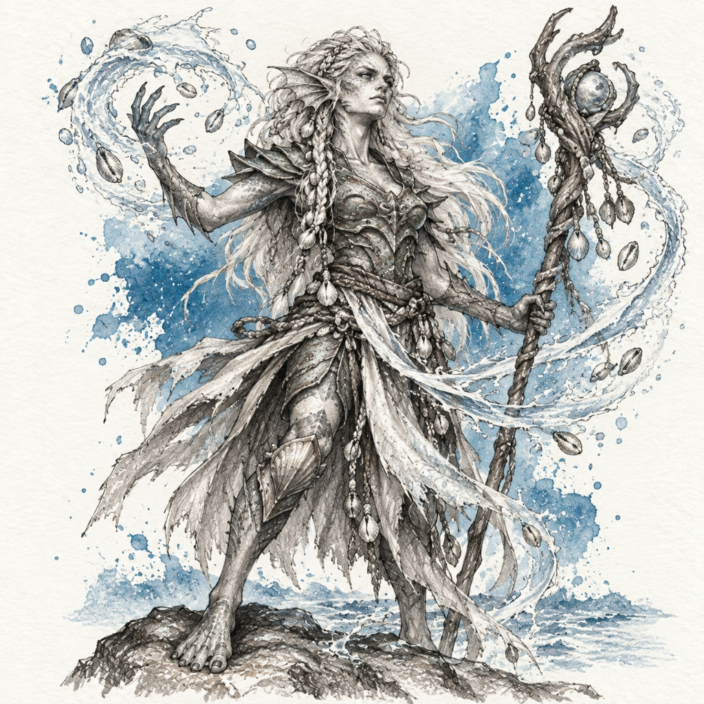
- **Lore Backstory**: Guardian of the ancestral sea-bronze artifacts and tide-pools of the First Shore. Klynn is an animist who sings the Tide-Sing during spawning gales to calm lethal undertows and guide newly formed Shorelings safely out of the crashing breakers.
```text
Single character concept art sketch of EXACTLY ONE Female Shoreling Tide-Weaver, High Tide-Weaver Klynn. Style: 1995 fantasy concept art in the style of Samwise Didier. Hand-drawn rough black charcoal and graphite draft linework with expressive gritty cross-hatching, isolated on clean off-white watercolor sketchbook paper. STRICTLY MONOCHROMATIC CHARACTER & GEAR: No color fills on character or garments. STRICTLY NO TEXT, NO LETTERS, NO WORDS, NO LABELS, NO SIGNATURES, NO WATERMARKS. ABSOLUTE PROHIBITION ON MULTIPLE FIGURES: RENDER EXACTLY ONE SINGLE FIGURE IN AN ICONIC TIDAL-SING COMMUNION POSE. Canonical Anatomy: Tall, statuesque athletic animist with sun-baked salt-bronzed skin, shifting bioluminescent tidal veins along collarbones and ribs, dried white salt crystals on lashes, piercing ocean-blue eyes. Scalloped wave-fin ears; wild windswept platinum-white hair woven with cowrie shells and mother-of-pearl hair-spikes. Attire: Sculpted sea-bronze cuirass with rich green verdigris patina, wave-relief pauldrons, scallop-shell knee poleyns, layered brine-sailcloth battle-tassets. Bare calloused grip feet planted firmly on a wet mossy coastal boulder at the water's edge. Iconic Action: Actively channeling a violent tidal surge during a spawning gale: both webbed hands outstretched conducting the crashing waves, gracefully levitating a swirling vortex of sea-foam, polished cowrie shells, and crystal water droplets around her gnarled driftwood wave-staff to calm a lethal undertow and open a safe channel for newborn bathers in the tide-pools behind her. Setting & Crude Background: Seen in her element at the sacred First Shore with crude, hand-drawn 1995 Samwise Didier draft style background scenery sketched in rough graphite linework and gritty cross-hatching—sweeping white shell-grit beaches meeting surging waves, ancient stone ancestor cairns adorned with sea-glass, natural limestone tide pools, and swirling ocean foam. Vignetted sketch background. Accent: Single dynamic explosive watercolor splash in stormy ocean slate and wave-teal (#0077b6) blooming behind the animist with fluid paint splatters. Pure sketchbook draft page, no formal borders or frames.
```

---

## 🌿 3. Riverling Myrathil (River Jade `#10b981`)
*Canonical Anatomical Lock (Refined Benchmark)*: Athletic amphibious freshwater river humanoids characterized by expressive river-dwelling adaptations. **Eyes**: Distinctively large, glossy luminous light jade-green river-eyes adapted for seeing through murky freshwater rapids and dark silt eddies. **Skin & Texture**: Smooth, moist frog-like amphibious skin patterned with fine circular pebble-spots and freckled stippling across the brow, temples, cheekbones, shoulders, and limbs. **Head & Tendrils**: Upward-branching antler-like fleshy river-tendrils emerging behind the ears and temples, curving upward with 3 to 4 smooth pronged branches resembling staghorn coral or river twigs (strictly NOT feathery axolotl gills, strictly NOT fish-fan ears). **Hands & Feet (Webbed Salamander Digits - Strictly No Claws)**: Broad amphibious hands with prominent translucent swimming webbing between long, smooth fingers tipped with rounded spatulate salamander adhesive suction pads that adhere securely to wet, slippery mossy boulders, log flumes, and cypress stilts without slipping. Bare webbed feet with long dexterous toes tipped with adhesive suction pads. **Diversity**: Each individual features distinct, unique facial bone structures (explorers, scholars, hunters, and smiths differ markedly in age, jawline, and expression). **Style**: 1995 Samwise Didier concept art (ABC). Crisp rough charcoal linework, gritty cross-hatching, isolated on off-white sketchbook paper with ample negative space and a single vibrant River Jade (`#10b981`) watercolor splash.

### 👤 Part 0: Dedicated Canonical Racial Portrait (1 Prompt)

#### 0. Canonical Riverling Racial Portrait (De-Cluttered Bust)
- **Role & Face**: Young Freshwater River Scout. Lean, inquisitive face with sharp young jawline, alert open expression, and distinctive large, luminous jade-green river-eyes.
- **De-Clutter Strategy**: Clean upper bust, expansive off-white negative space, minimal props, crisp linework.
```text
De-cluttered character concept art sketch of EXACTLY ONE Riverling Myrathil Scout, upper-torso bust portrait with ample negative space. Style: 1995 fantasy concept art by Samwise Didier, Always Be Chunky (ABC). Bold rough black charcoal and graphite draft linework with authoritative contours and gritty cross-hatching on off-white watercolor sketchbook paper. STRICTLY MONOCHROMATIC FIGURE: No color fills on character or vest. STRICTLY NO TEXT, NO WORDS, NO LABELS, NO SIGNATURES, NO WATERMARKS. SINGLE HEROIC FIGURE. Distinctive Face & Anatomy: Young, inquisitive athletic face with lean jawline, smooth frog-like river skin patterned with circular pebble-spots across temples and cheeks, and strikingly large, wide luminous jade-green river-eyes. Upward-branching antler-like fleshy river-tendrils (3-4 smooth prongs) sweep upward behind the ears. Dark hair combed straight back with a thick braided rope plait draped over the chest with a four-leaf water-clover brass clasp. Webbed Salamander Hands (Strictly No Claws): One hand resting near the chest showing broad translucent swimming webbing between long smooth fingers tipped with rounded spatulate salamander adhesive suction pads. Attire: Tailored brown oiled leather utility scout vest with brass buckles over an unbleached linen tunic. Background: Clean sketchbook parchment with ample breathing room, faint graphite ripples. Accent: Single dynamic watercolor splash in vibrant river jade (#10b981) blooming softly behind head and shoulder with fluid droplets. Pure sketch, no border, no frame.
```

### 🏛️ Part A: Important Buildings & Locations (3 Prompts)

#### ✅ 1. Cataract Reach (The Cascading Stilt-City & Waterway Gorge) [GENERATED]

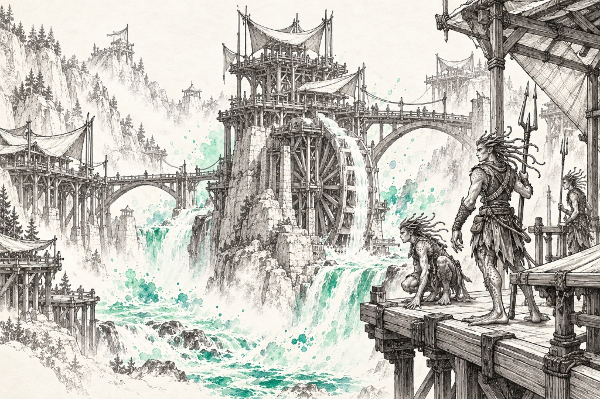
- **Biome & Architecture**: A grand river canyon where soaring cypress-wood stilts and arched timber bridges span a roaring waterfall.
- **De-Clutter Architecture**: Wide-angle deep-focus perspective with expansive negative space, airy river mist, and clean architectural contours.
- **Precise Racial Inhabitants**: Mid-ground Riverling scouts rendered in clean, athletic silhouettes with distinctive upward antler-like head tendrils, webbed salamander hands, and 3-pronged gig tridents.
```text
Radically de-cluttered wide-angle architectural concept art sketch of Cataract Reach, sovereign stilt metropolis of the Riverling Myrathil, in FULL CRISP FOCUS. Style: 1995 fantasy concept art by Samwise Didier, Always Be Chunky (ABC). Authoritative rough black charcoal linework and clean architectural cross-hatching on off-white watercolor paper with vast negative space. STRICTLY MONOCHROMATIC ARCHITECTURE: No color fills on structures or figures. STRICTLY NO TEXT, NO LABELS, NO SIGNATURES, NO WATERMARKS. STRICTLY NO FOREGROUND FACES BLOCKING THE VIEW; FULL CLEAN GORGE PERSPECTIVE. ZERO CLUTTER: Airy, minimalist architectural draft with vast open breathing room and clean geometric lines. Architectural Focus: A grand misty mountain river canyon where monumental vertical cypress-wood stilts and smooth stone pylons support clean tiered timber terraces and high arched footbridges spanning a roaring white-water waterfall. One colossal waterwheel turns gracefully beside the cascading foam. Mid-Ground Riverling Inhabitants: A few agile Riverling scouts standing poised along the high timber balconies and bridges in clear, uncluttered mid-ground scale. Canonical Subrace Anatomy: Lean amphibious river humanoids instantly recognizable by their distinctive upward-branching antler-like fleshy river-tendrils rising behind their ears, smooth river skin, tailored leather vests, and webbed salamander hands (with adhesive suction pads, strictly no claws) holding sleek 3-pronged gig tridents as they gaze across the gorge. Accent: Single dynamic explosive watercolor splash in vibrant river jade (#10b981) blooming behind the central waterfall with fluid paint splatters. Pure sketchbook art, no borders, no frames.
```

#### ✅ 2. Mother's Mirror (The Vast Freshwater Inland Sea Sanctuary) [GENERATED]

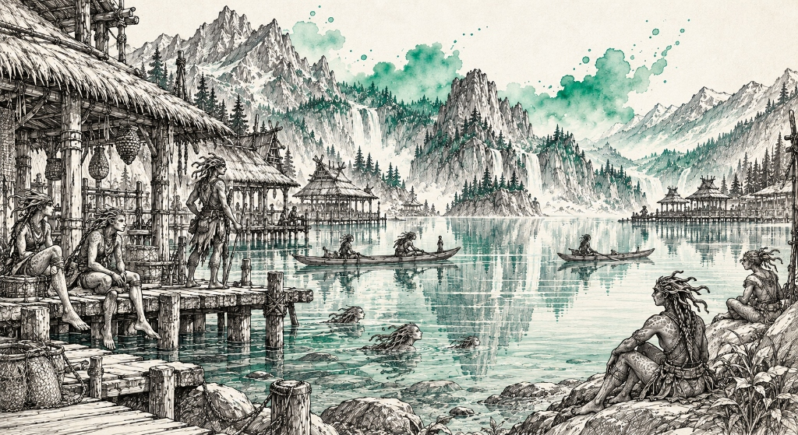
- **Biome & Landscape**: Sacred glassy-clear mountain lake framed by pine peaks. Wide, serene, uncluttered landscape with floating reed pavilions.
```text
Wide-angle landscape concept art sketch of Mother's Mirror, sacred freshwater inland sea sanctuary of the Riverling Myrathil, in FULL CRISP FOCUS. Style: 1995 fantasy concept art by Samwise Didier. Hand-drawn rough black charcoal and graphite draft linework with serene contours and gritty cross-hatching on clean off-white watercolor paper. STRICTLY MONOCHROMATIC SCENERY: No color fills on landscape or figures. STRICTLY NO TEXT, NO LABELS, NO SIGNATURES, NO WATERMARKS. Landscape Focus: A vast, mirror-calm freshwater inland sea stretching between rugged pine-clad mountain peaks and distant cascading waterfalls. Floating woven reed boardwalks, thatched stilt pavilions extending into clear turquoise water, and slender dugout canoes gliding peacefully across the glassy surface. Thatched open-air rest lodges on pebble beaches with simple driftwood drying frames. In-Scale Inhabitants: Resting Riverling scouts and animists (large luminous river-eyes, antler-like head tendrils, webbed salamander suction-pad limbs, strictly no claws) swimming peacefully, paddling canoes, and relaxing on open-air platforms in natural environmental scale. Airy, spacious composition with open sky and reflective water. Accent: Single vibrant watercolor splash in river jade and emerald (#10b981) blooming across the mountain horizon with fluid paint splatters. Pure sketchbook art, no borders.
```

#### ✅ 3. Venn’s Sluice-Way & Delta Market (The Great Silt-Bazaar) [GENERATED]

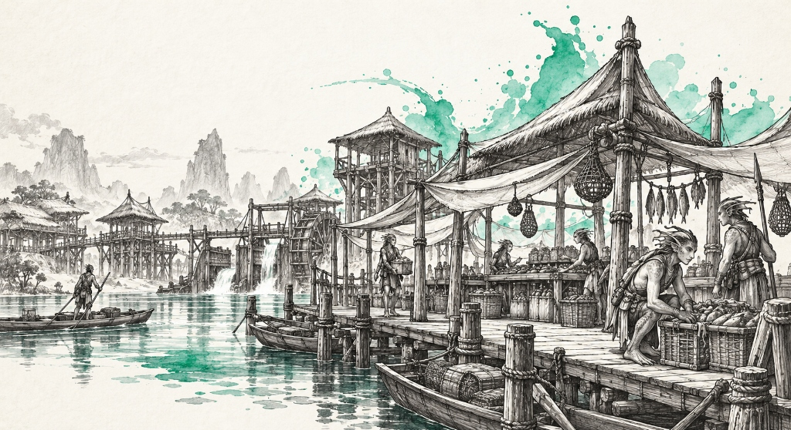
- **Biome & Architecture**: Bustling delta trading post built over muddy silt flats on cypress pilings. Boardwalks, sluice gates, and river barges.
```text
Wide-angle architectural concept art sketch of Venn's Sluice-Way Delta Market, in FULL CRISP FOCUS. Style: 1995 fantasy concept art by Samwise Didier, Always Be Chunky (ABC). Bold rough black charcoal draft linework and rich wetland cross-hatching on off-white watercolor sketchbook paper. STRICTLY MONOCHROMATIC ARCHITECTURE: No color fills on scenery or figures. STRICTLY NO TEXT, NO LABELS, NO SIGNATURES, NO WATERMARKS. FULL PANORAMIC DELTA DEPTH. Architectural Focus: Sprawling river-and-sea trading post built on heavy cypress pilings over delta channels. Raised corduroy boardwalks, timber sluice-gates regulating river currents, turning waterwheels, and moored flat-bottom cargo barges. Market stalls under woven reed awnings trading rolled waterway charts in leather tubes, smoked trout, and forged tridents. In-Scale Inhabitants: Active Riverling merchants and scouts with large glossy river-eyes, antler tendrils, and webbed salamander suction-pad hands (strictly no claws) loading cargo crates, bartering, and checking currents in natural architectural scale. De-cluttered, clear spatial perspective. Accent: Single dynamic watercolor splash in vibrant river jade (#10b981) blooming behind the waterwheels with fluid paint splatters. Pure isolated sketch, no borders.
```

### 👤 Part B: Notable & Legendary Figures (5 Figures)

#### ✅ 1. Venn the Salt-Walker (The Pioneer Explorer) [GENERATED]

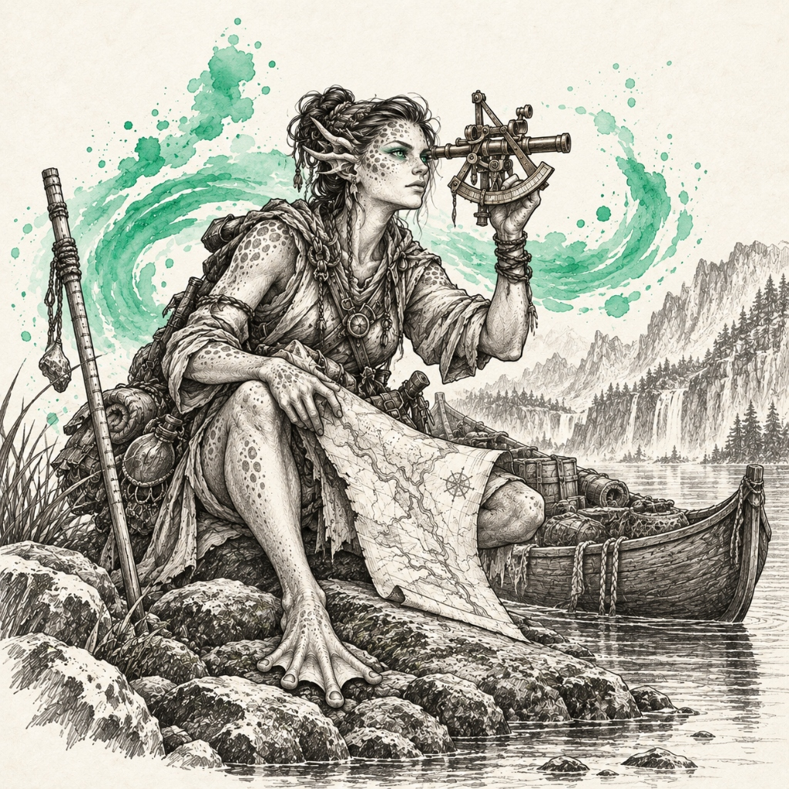
- **Individual Face**: Weather-beaten, determined female pioneer with high prominent cheekbones, firm sun-creased jawline, and wide, observant, intelligent river-eyes.
- **Hair & Attire**: Dark hair tied into a practical explorer’s braided bun secured with wooden bodkins; tailored pocketed scout vest, leather map tube, utility belt.
```text
Single character concept art sketch of EXACTLY ONE Legendary Female Riverling Explorer, Venn the Salt-Walker. Style: 1995 fantasy concept art by Samwise Didier, Always Be Chunky (ABC). Authoritative rough black charcoal and graphite draft linework with bold contours and gritty cross-hatching on clean off-white watercolor paper with ample negative space. STRICTLY MONOCHROMATIC FIGURE & GEAR: No color fills on character or map. STRICTLY NO TEXT, NO LABELS, NO SIGNATURES, NO WATERMARKS. SINGLE HEROIC FIGURE. Distinctive Face & Anatomy: Weather-tested female pioneer with prominent high cheekbones, firm determined jaw, smooth frog-like skin with pebble-spots on temples, and strikingly large, observant luminous jade river-eyes. Upward-branching antler-like fleshy river-tendrils curve behind her ears. Dark hair gathered in a practical braided bun with wooden bodkins. Hands & Feet (Webbed Salamander Digits - Strictly No Claws): Broad webbed amphibious hands and bare webbed feet with long smooth digits tipped with rounded spatulate adhesive suction pads adhering to wet river stones. Iconic Action: Seated in a sure-footed crouch on lakeshore pebbles, holding an unrolled parchment waterway map across one knee while sighting through an antique brass river-sextant with her webbed suction-pad hand, a notched depth staff planted beside her. Setting: Clean, uncluttered lakeshore background of Mother's Mirror with distant mountain silhouettes and a wooden dugout canoe fading into parchment. Accent: Single dynamic watercolor splash in vibrant river jade (#10b981) blooming behind the explorer with fluid paint splatters. Pure sketchbook drawing, no borders.
```

#### ✅ 2. Kaelen the Rapid-Leaper (Veteran Trident Hunter) [GENERATED]

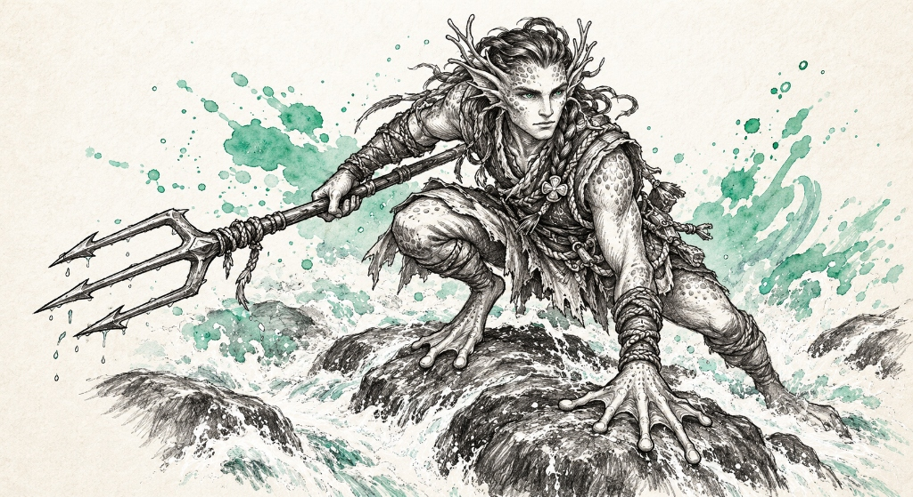
- **Individual Face**: Fierce, predatory young male hunter with sharp angular jawline, intense focused wide predator river-eyes, and alert hunting grit.
- **Hair & Attire**: Dark hair combed straight back with a braided plait pinned with a clover badge; tailored pocketed scout vest, studded bracers, split kilt.
```text
Single character concept art sketch of EXACTLY ONE Male Riverling Hunter, Kaelen the Rapid-Leaper. Style: 1995 fantasy concept art by Samwise Didier, Always Be Chunky (ABC). Bold rough black charcoal and graphite draft linework with energetic contours and gritty cross-hatching on clean off-white watercolor sketchbook paper. STRICTLY MONOCHROMATIC FIGURE & GEAR: No color fills on character, vest, or weapon. STRICTLY NO TEXT, NO LABELS, NO SIGNATURES, NO WATERMARKS. SINGLE HEROIC FIGURE. Distinctive Face & Anatomy: Fierce, angular young hunter face with sharp jawline, smooth frog-like river skin speckled with pebble-spots on brow and temples, and strikingly large, intense luminous jade-green predator river-eyes tracking movement. Upward-branching antler-like fleshy river-tendrils curve behind his ears. Thick braided rope plait draped over his chest with four-leaf water-clover badge. Hands & Feet (Webbed Salamander Digits - Strictly No Claws): Broad amphibious hands with prominent translucent swimming webbing between long smooth fingers, tipped with rounded spatulate salamander adhesive suction pads; bare webbed feet with suction-pad toes. Iconic Action: Balanced in an athletic, low frog-like perching crouch atop a slick river boulder in roaring white-water rapids, one webbed hand with suction-pad fingertips suctioned flat adhering to the wet rock, the other brandishing a sleek 3-pronged barbed iron gig trident ready to strike leaping river fish. Setting: Uncluttered white-water boulder scene with foaming current lines fading into clean paper. Accent: Single explosive watercolor splash in vibrant river jade (#10b981) bursting behind the hunter and trident with fluid paint splatters. Pure sketchbook art, no borders.
```

#### ⏳ 3. Guildmistress Mira the Cartographer (Master of Silt-Scrolls)
- **Individual Face**: Studious, intellectual female face with large round analytical river-eyes, calm composed brow, soft cheekbones, and thoughtful scholarly gaze.
- **Hair & Attire**: Neat braided chignon with carved wooden hairpins; tailored pocketed vest over long-sleeved linen tunic, bracers.
```text
Single character concept art sketch of EXACTLY ONE Female Riverling Cartographer, Guildmistress Mira. Style: 1995 fantasy concept art by Samwise Didier. Hand-drawn rough black charcoal and graphite draft linework with expressive gritty cross-hatching on clean off-white watercolor paper with ample negative space. STRICTLY MONOCHROMATIC FIGURE & PROPS: No color fills on character, desk, or scrolls. STRICTLY NO TEXT, NO LABELS, NO SIGNATURES, NO WATERMARKS. SINGLE HEROIC FIGURE. Distinctive Face & Anatomy: Studious, thoughtful female face with soft jawline, calm brow, delicate pebble-spots along temples, and remarkably large, round analytical jade-green river-eyes. Upward-branching antler-like fleshy river-tendrils curve behind her ears. Dark hair in an elegant braided chignon with carved hairpins. Hands & Feet (Webbed Salamander Digits - Strictly No Claws): Broad amphibious hands with translucent webbing between smooth fingers tipped with rounded spatulate salamander suction pads; bare webbed suction-pad feet planted on plank floor. Iconic Action: Standing composed at an angled drafting table, carefully measuring a rapids corridor with brass drafting calipers in one suction-pad hand while inking delicate river currents onto an unrolled parchment map scroll with a reed quill. Setting: De-cluttered timber guildhall interior with drafting table, hanging drying charts, and open rafters fading into parchment. Accent: Dynamic watercolor splash in glowing river jade (#10b981) blooming softly behind the drafting desk with fluid paint splatters. Pure sketchbook drawing, no borders.
```

#### ⏳ 4. Torin the Delta-Smith (Master Forger of Barbed Gig Tridents)
- **Individual Face**: Heavy-set, burly, square-jawed male blacksmith with thick brow ridge, soot-dusted rough cheekbones, and intense fiery squint.
- **Hair & Attire**: Thick dark hair tied back with a leather cord; heavy oiled leather work apron over a sleeveless tunic, studded bracers, tongs, and forging hammer.
```text
Single character concept art sketch of EXACTLY ONE Male Riverling Weapon-Smith, Torin the Delta-Smith. Style: 1995 fantasy concept art by Samwise Didier, Always Be Chunky (ABC). Heavy rough black charcoal and graphite linework with muscular contours and gritty cross-hatching on off-white watercolor sketchbook paper. STRICTLY MONOCHROMATIC FIGURE & WORKSHOP: No color fills on character, forge, or steel. STRICTLY NO TEXT, NO LABELS, NO SIGNATURES, NO WATERMARKS. SINGLE HEROIC FIGURE. Distinctive Face & Anatomy: Burly, broad-shouldered craftsman with a heavy square jaw, rugged brow, soot-dusted pebble-spotted skin on temples and arms, and large piercing luminous jade-green river-eyes reflecting forge light. Thick upward-branching antler-like fleshy river-tendrils emerge behind his ears. Thick hair tied back in a leather wrap. Hands & Feet (Webbed Salamander Digits - Strictly No Claws): Massive muscular amphibious hands with broad webbing between thick smooth fingers, tipped with rounded salamander suction pads firmly gripping forged iron tongs; bare webbed suction-pad feet planted wide on workshop floor. Iconic Action: Mid-strike weapon craft: holding a glowing hot iron three-pronged gig trident head firmly on a boulder anvil with heavy tongs, raising his forged smithing hammer at the peak of its downward stroke with sparks flying into the air. Setting: De-cluttered stone forge hearth and hanging racks of finished tridents fading into clean parchment. Accent: Single explosive watercolor splash in vibrant river jade (#10b981) bursting violently behind the anvil with fluid paint splatters. Pure sketchbook draft, no borders.
```

#### ⏳ 5. Elyra of the Mirror (Guardian of the Freshwater Sanctuary)
- **Individual Face**: Ethereal, gentle rounded oval face with serene youthful contours, soft tranquil lips, and large, deep, gentle liquid-pool jade river-eyes.
- **Hair & Attire**: Dark hair styled in a graceful braided crown woven with freshwater reed flowers; flowing sleeveless river-cloth tunic with split kilt.
```text
Single character concept art sketch of EXACTLY ONE Female Riverling Animist, Elyra of the Mirror. Style: 1995 fantasy concept art by Samwise Didier. Expressive hand-drawn rough black charcoal and graphite draft linework with delicate cross-hatching on clean off-white watercolor paper with ample negative space. STRICTLY MONOCHROMATIC FIGURE & WATER: No color fills on character or stone basin. STRICTLY NO TEXT, NO LABELS, NO SIGNATURES, NO WATERMARKS. SINGLE HEROIC FIGURE. Distinctive Face & Anatomy: Serene, ethereal maiden face with soft rounded cheeks, tranquil expression, fine pebble-stippling on temples, and extraordinarily large, gentle liquid-pool jade-green river-eyes. Slender upward-branching antler-like fleshy river-tendrils curve gracefully behind her ears. Dark hair in an elegant braided crown with reed flowers. Hands & Feet (Webbed Salamander Digits - Strictly No Claws): Slender amphibious hands with delicate translucent swimming webbing between long smooth fingers, tipped with soft rounded spatulate salamander suction pads; bare webbed suction-pad feet resting gracefully on stone. Iconic Action: Kneeling gently beside a mossy stone spring basin, cupping clear freshwater in both webbed hands to pour it reverently over a sacred stone font, with a graceful spiral arc of floating water droplets and water-clover petals hovering in mid-air. Setting: De-cluttered grotto shrine with mossy boulder, clear pool, and distant willow vines fading into parchment. Accent: Single dynamic watercolor splash in lush river jade (#10b981) blooming behind the water font with fluid paint splatters. Pure sketchbook draft, no borders.
```


