# Human Subraces — Landmarks, Establishments & Notable Figures

> **Visual Directive**:
> - Style: 1995 Samwise Didier Concept Art (Always Be Chunky - ABC). Monochromatic rough charcoal and graphite draft linework with gritty cross-hatching on clean off-white watercolor paper.
> - Single Dynamic Watercolor Splash: The ONLY color is the signature watercolor bloom.
> - In-Focus Architecture: City and building prompts are deep-focus wide-angle interior/street-level views. Zero giant foreground portraits blocking the frame.
> - Canonical Anatomical Locks: 100% matched to approved T-poses and icon benchmarks.

---

## 📜 1. Thalren Human (Mist Grey `#64748b`)
*Canonical Anatomical Lock*: Stoic, cerebral, weather-worn human archivists and border scholars (matching `human_thalren_icon_v1.png` and `thalren_city_greymark.png`). Lean, bookish yet rugged builds accustomed to freezing mountain drafts. Serious, concentrated facial expressions with thoughtful brow lines, clean-shaven or trim goatees, hair tied back neatly in scholarly queues or short functional crops. Attire: Heavy tailored wool traveling coats with upturned fur-lined collars, multi-layered oiled parchment vests with ink-horn holsters, brass-buckled leather belts carrying brass compasses and map tubes, sturdy lace-up leather boots. Armed with brass-tipped walking staves that double as surveying rods, or short steel daggers.

### 👤 Part 0: Dedicated Canonical Racial Portrait (1 Prompt)

#### ✅ 0. Canonical Thalren Racial Portrait (De-Cluttered Bust) [GENERATED]

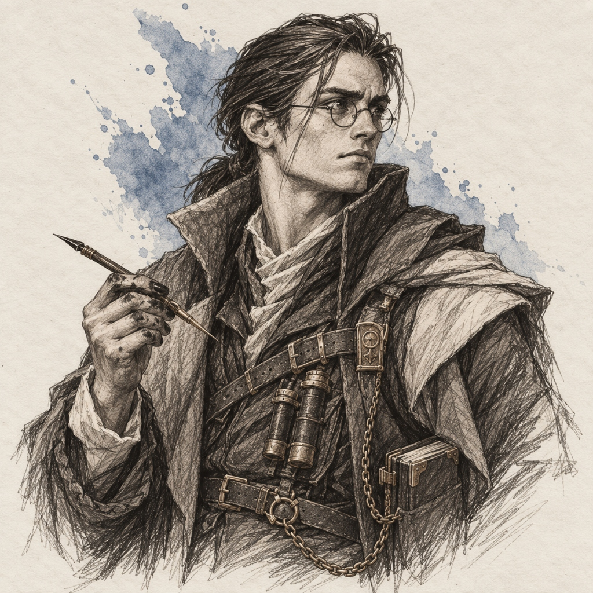
- **Role & Face**: Frontier Scribe & Lineage Archivist (Upper-Torso Bust). Lean, intellectual human archivist in his early 30s. Pale, cool-toned complexion from a lifetime in the misty mountain forests. Sharp, observant jawline, keen hazel/grey eyes behind small, delicate round wire-rimmed reading spectacles, faint squint lines from studying vellum. Dark brown hair tied back in a neat, functional scholar's queue. Clean-shaven with a faint shadow along the jawline.
- **Hands & Details**: One hand raised near the chest, fingers showing permanent dark soot-ink stains around the cuticles and fingertips, holding a slender carved horn pen. An iron chain leads from his leather belt to a brass-bound pocket journal.
- **De-Clutter Strategy**: Clean upper bust, expansive off-white negative space, minimal props, crisp linework.
```text
De-cluttered character concept art sketch of EXACTLY ONE Thalren Human Scribe, upper-torso bust portrait with ample negative space. Style: 1995 fantasy concept art by Samwise Didier, Always Be Chunky (ABC). Authoritative rough black charcoal and graphite draft linework with bold contours and gritty cross-hatching on off-white watercolor sketchbook paper. STRICTLY MONOCHROMATIC FIGURE: No color fills on character, coat, or vest. STRICTLY NO TEXT, NO WORDS, NO LABELS, NO SIGNATURES, NO WATERMARKS. SINGLE HEROIC FIGURE. Distinctive Face & Anatomy: Lean, intellectual human archivist in his early 30s with a pale, cool-toned complexion from perpetual mountain fog. Sharp, observant jawline, clean chin, and keen analytical eyes behind small, delicate round wire-rimmed reading spectacles. Dark hair combed back neatly into a practical scholar's queue. Hands & Details: One hand raised near the chest with permanent dark soot-ink stains around the cuticles and fingertips, holding a slender carved horn stylus pen; an iron link-chain extends from his belt into his coat pocket where a small brass-cornered leather journal rests. Attire: Tailored charcoal wool traveling coat with an upturned shearling fur collar over an oiled leather utility vest with brass buckle straps and small ink-horn holsters across the chest. Background: Clean sketchbook parchment with ample breathing room, faint graphite architectural arches fading into the paper. Accent: Single dynamic watercolor splash in moody mist grey and slate blue (#64748b) blooming softly behind the head and shoulder with fluid droplets. Pure sketch, no borders, no frames.
```

### 🏛️ Part A: Important Buildings & Locations (3 Prompts)

#### ✅ 1. Greymark Archive Citadel & Library-Spire (The Sovereign Capital) [GENERATED]

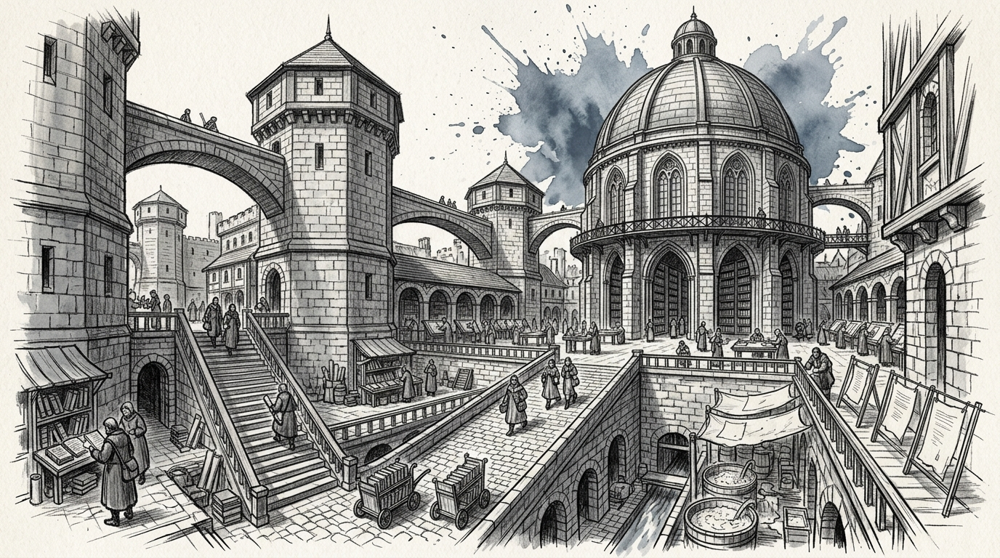
- **Biome & Location**: Perched atop the mist-shrouded limestone bluffs of Frostwood Reach.
- **Lore & Functions**: The capital of the Thalren people. A fortress-city built around colossal limestone library spires. Sky-bridges connect tiered scriptoriums. Streets are paved with slate flags where cartographers wheel book-barrows. Covered book-stalls and paper mills line the central plaza where scribes barter sheepskin vellum, oak-gall ink, and brass book clasps. Scriptorium towers have massive leaded-glass bay windows where copyists work by candlelight.
```text
Wide-angle architectural concept art sketch looking directly into the bustling courtyard and grand library-spires of Greymark, sovereign capital of the Thalren Humans, in FULL CRISP FOCUS. Style: 1995 fantasy concept art in the style of Samwise Didier, Always Be Chunky (ABC). Hand-drawn rough black charcoal and graphite draft linework with bold structural contours and gritty cross-hatching, isolated on clean off-white watercolor sketchbook paper. STRICTLY MONOCHROMATIC ARCHITECTURE & ENVIRONMENT: No color fills on characters or architecture. STRICTLY NO TEXT, NO LETTERS, NO WORDS, NO LABELS, NO SIGNATURES, NO WATERMARKS. NO GIANT OVERSIZED FOREGROUND PORTRAIT; FULL DEEP-FOCUS ARCHIVE CITADEL PERSPECTIVE. Architectural & Urban Focus: A monumental walled academic citadel constructed from grey ashlar granite and heavy timber. Traversal: Arched stone sky-bridges connecting soaring hexagonal archive towers, broad slate staircases crowded with scholars, and iron-wheeled book carts traversing cobblestone ramps. Commerce & Scriptoriums: Open-air scriptorium arcades beneath heavy timber eaves where scribes transcribe ancient scrolls at slanted drafting benches; outdoor book stalls trading bound tomes, ink-horns, vellum rolls, and brass measuring instruments. Harvesting & Industry: Paper-pulp vats churning near a millrace canal, drying sheets of parchment stretched on wooden frames across balconies. Study & Governance: The monumental Grand Rotunda Archive with its ribbed dome, tall arched lancet windows, and iron catwalks lined with floor-to-ceiling book presses. In-Scale Citizens: Numerous Thalren scholars, scribes, and border sentries (heavy wool coats, ink-stained aprons, spectacles, map cylinders, brass measuring rods) bustling between archive vaults and studying manuscripts in natural perspective scale. Accent: Single dynamic explosive watercolor splash in moody mist grey and slate blue (#64748b) blooming behind the central archive dome with fluid paint splatters. Pure isolated sketch, no borders, no frames.
```

#### ✅ 2. Scriptorium of the Last Candle (The Sacred Copyist Vault) [GENERATED]

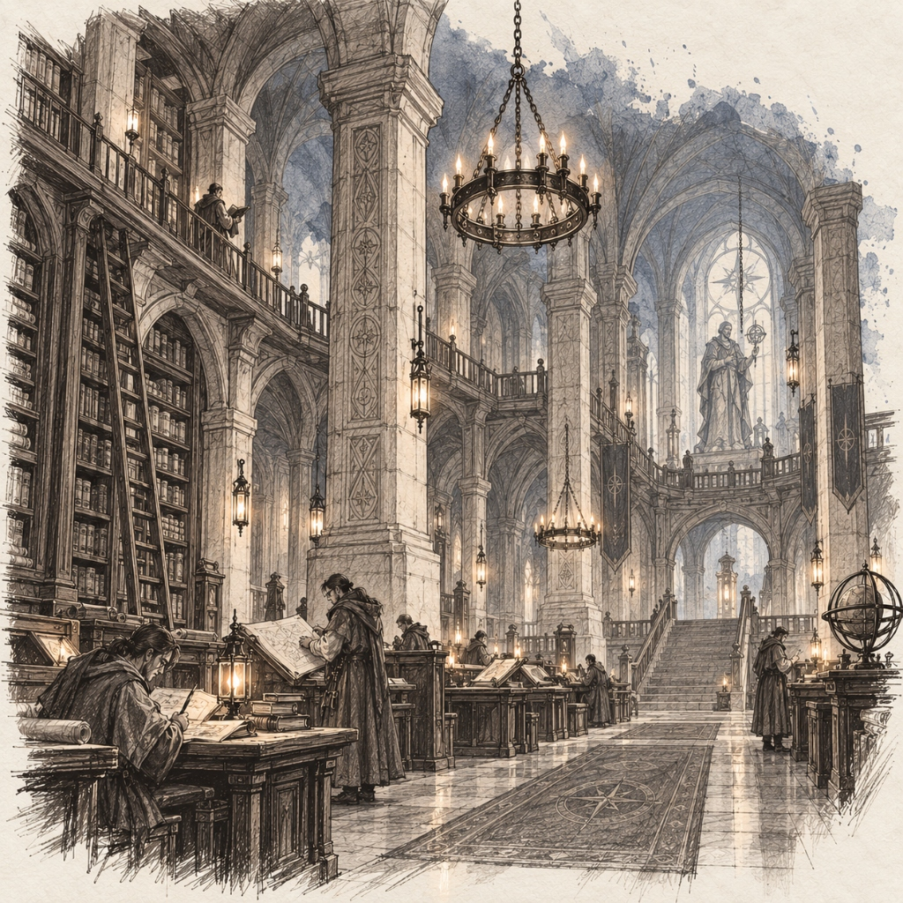
- **Biome & Location**: The deep subterranean dry vaults beneath the Greymark bluffs.
- **Lore & Functions**: A temperature-controlled, draft-proof subterranean cathedral where the oldest historical contracts, genealogies, and treaties are preserved. Hundreds of copyists sit at endless rows of oak desks lit by tallow lamps, transcribing oral histories onto durable cured vellum.
```text
Wide-angle architectural concept art sketch of the interior of the Scriptorium of the Last Candle in Greymark, in FULL CRISP FOCUS. Style: 1995 fantasy concept art in the style of Samwise Didier, Always Be Chunky (ABC). Hand-drawn rough black charcoal and graphite draft linework with grand subterranean vaulted perspective and gritty cross-hatching, isolated on clean off-white watercolor sketchbook paper. STRICTLY MONOCHROMATIC ARCHITECTURE & ENVIRONMENT: No color fills on characters or architecture. STRICTLY NO TEXT, NO LETTERS, NO WORDS, NO LABELS, NO SIGNATURES, NO WATERMARKS. NO GIANT FOREGROUND PORTRAIT; FULL SCRIPTORIAL HALL PERSPECTIVE. Architectural & Scholarly Focus: A colossal vaulted stone underground scriptorium with ribbed ceiling arches supported by massive granite pillars carved with runic catalog glyphs. Traversal: Long stone aisles between continuous rows of slanted oak copying desks, mobile rolling ladder scaffolds accessing towering wall-niches filled with leather-bound ledgers. Study & Preservation: Dozens of Thalren copyists and scholars quietly writing with quill pens, grinding ink blocks in stone mortars, and cataloging parchment scrolls into brass canisters under the warm glow of suspended oil chandeliers and wax lanterns. In-Scale Citizens: Thalren scribes in heavy woolen robes with reading spectacles and ink-smudged fingers diligently transcribing manuscripts and conferring over maps in natural architectural scale. Accent: Single explosive watercolor splash in scholarly mist grey and charcoal (#64748b) blooming behind the vaulted nave with fluid paint splatters. Pure isolated sketch, no borders, no frames.
```

#### ✅ 3. Cold-Lantern Waystation (The Mist-Border Outpost) [GENERATED]

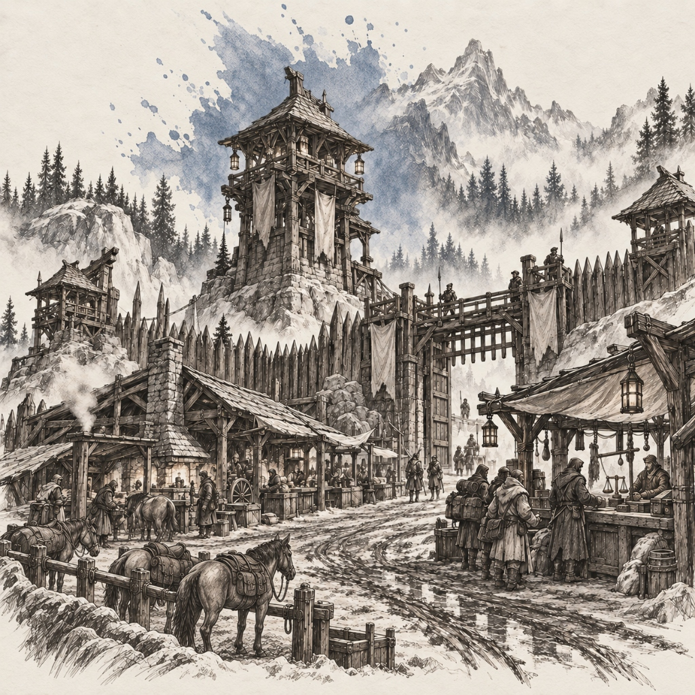
- **Biome & Location**: The foggy border pine forest where Frostwood Reach meets the wild highlands.
- **Lore & Functions**: The fortified waystation where traveling merchants and cartographers register before entering the realm. Built of rough-hewn pine logs and drystone walls, with high watchtowers burning blue coal lanterns to cut through the mountain fog. The courtyard features weighing scales, pack-pony stalls, and a warm hearth-tavern.
```text
Wide-angle architectural concept art sketch of the Cold-Lantern Waystation outpost in the misty mountain pines, in FULL CRISP FOCUS. Style: 1995 Warcraft fantasy concept art in the style of Samwise Didier, Always Be Chunky (ABC). Hand-drawn rough black charcoal and graphite draft linework with rugged frontier timber textures and gritty cross-hatching, isolated on clean off-white watercolor sketchbook paper. STRICTLY MONOCHROMATIC ARCHITECTURE & ENVIRONMENT: No color fills on characters or architecture. STRICTLY NO TEXT, NO LETTERS, NO WORDS, NO LABELS, NO SIGNATURES, NO WATERMARKS. NO GIANT FOREGROUND FIGURE; FULL FORTIFIED OUTPOST PERSPECTIVE. Architectural & Frontier Focus: A sturdy log-and-boulder frontier post surrounded by a sharpened pine palisade. Traversal: Heavy timber gates with raised iron portcullises, elevated wooden sentry catwalks, and muddy wagon tracks leading through the courtyard. Commerce & Customs: The toll-office and customs shed where Thalren wardens weigh pack cargo on brass balance scales, stamp travel passes with wax seals, and trade fresh rations and lantern oil to visiting frontiersmen. Stable & Hearth: A smoking blacksmith forge shoeing pack mules, timber hitching posts, and the welcoming stone chimney of the traveller's bunkhouse. In-Scale Citizens: Thalren rangers, customs officers, and passing traders (heavy fur coats, travel cloaks, crossbows, ledger slates) going about frontier business in natural perspective scale. Accent: Single dynamic explosive watercolor splash in mist grey (#64748b) blooming behind the central watchtower with fluid paint splatters. Pure isolated sketch, no borders, no frames.
```

### 👤 Part B: Notable & Legendary Figures (5 Figures)

#### ✅ 1. Thalra Greymark (The Last Archivist — Sovereign Historian) [GENERATED]

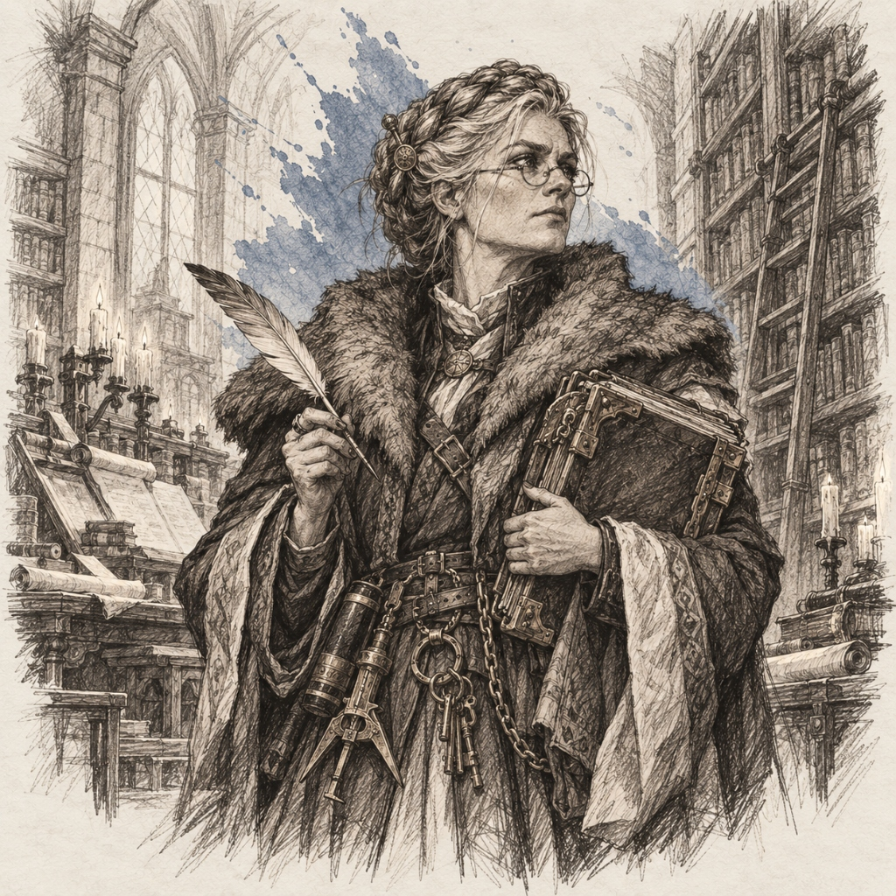
- **Lore Backstory**: Direct descendant of the fortress founders, Thalra has dedicated her life to cataloging the pre-Calamity codices. She is rarely seen without her heavy brass-hinged ledger and measuring astrolabe.
```text
Single character concept art sketch of EXACTLY ONE Legendary Female Thalren Scholar, Thalra Greymark. Style: 1995 fantasy concept art in the style of Samwise Didier, Always Be Chunky (ABC). Hand-drawn rough black charcoal and graphite draft linework with expressive gritty cross-hatching, isolated on clean off-white watercolor sketchbook paper. STRICTLY MONOCHROMATIC CHARACTER & GEAR: No color fills on character, robe, or book. STRICTLY NO TEXT, NO LETTERS, NO WORDS, NO LABELS, NO SIGNATURES, NO WATERMARKS. ABSOLUTE PROHIBITION ON MULTIPLE FIGURES: RENDER EXACTLY ONE SINGLE HEROIC FIGURE IN A RESOLUTE SCHOLARLY STANCE. Canonical Anatomy: Dignified, intellectual mature human woman (elderly matriarch) with keen analytical grey eyes, focused brow, hair woven in a neat coronet braid pinned with silver bodkins. Attire: Heavy tailored wool traveling coat with deep fur collar, long pleated scholar's robe, leather belt hung with ink-horns, key rings, and brass caliper cases, with an iron chain binding a heavy brass-hinged lineage ledger to her belt. Gear: Holding an enormous brass-bound archive ledger securely under one arm, holding a long swan-feather quill pen in her right hand, wearing small round wire-rimmed reading spectacles. Setting & Crude Background: Seen in her element deep inside the towering archive stacks of Greymark with crude, hand-drawn 1995 Samwise Didier draft style background scenery sketched in rough graphite linework and gritty cross-hatching—floor-to-ceiling oak bookshelves loaded with leather folios, rolling library ladders, arched stone leaded windows letting in soft mist, and a candlelit drafting table stacked with vellum scrolls. Loosely vignetted sketch background. Accent: Single dynamic explosive watercolor splash in mist grey (#64748b) blooming behind the archivist with fluid paint splatters. Pure sketchbook draft page, no formal borders or frames.
```

#### ✅ 2. High Scribe Kaelen the Map-Maker (Master of the Frontier Cartography) [GENERATED]

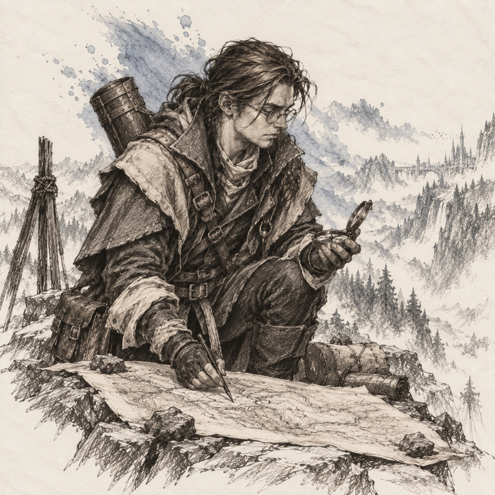
- **Lore Backstory**: Renowned surveyor who charted the treacherous mountain passes of the Frostwood. His maps are regarded as the gold standard of precision throughout the Northern territories.
```text
Single character concept art sketch of EXACTLY ONE Male Thalren Cartographer, High Scribe Kaelen. Style: 1995 fantasy concept art in the style of Samwise Didier, Always Be Chunky (ABC). Hand-drawn rough black charcoal and graphite draft linework with gritty cross-hatching, isolated on clean off-white watercolor sketchbook paper. STRICTLY MONOCHROMATIC CHARACTER & GEAR: No color fills on character or gear. STRICTLY NO TEXT, NO LETTERS, NO WORDS, NO LABELS, NO SIGNATURES, NO WATERMARKS. ABSOLUTE PROHIBITION ON MULTIPLE FIGURES: RENDER EXACTLY ONE SINGLE HEROIC FIGURE IN A SURVEYING POSE. Canonical Anatomy: Lean, weathered human man in his prime (mid-30s), thoughtful jawline with trim beard, sharp perceptive eyes squinting against mountain winds. Attire: Heavy tailored wool scout coat over leather doublet, calfskin gloves with cut fingertips for drafting, sturdy mountain boots. Gear: Holding an unrolled topographic parchment map in one hand and a brass sighting compass in the other, an octagonal wooden cylindrical map tube slung across his back. Setting & Crude Background: Seen in his element in a windswept mountain pass above Frostwood with crude, hand-drawn 1995 Samwise Didier draft style background scenery sketched in rough graphite linework and gritty cross-hatching—craggy limestone cliffs shrouded in dense pine forest mist, wooden surveying stakes driven into rocky ground, an unrolled topographical map weighted down with stones, and distant archive spires. Loosely vignetted sketch background. Accent: Dynamic explosive watercolor splash in mist grey (#64748b) blooming behind the surveyor with fluid paint splatters. Pure sketchbook draft page, no formal borders or frames.
```

#### 3. Vael the Ledger-Warden (Chief Comptroller of Greymark)
- **Lore Backstory**: The incorruptible keeper of the public ledgers and border tariffs. He ensures that every grain of wheat and bar of silver passing through Greymark's gates is recorded with absolute fidelity.
```text
Single character concept art sketch of EXACTLY ONE Male Thalren Ledger-Warden, Vael. Style: 1995 fantasy concept art in the style of Samwise Didier, Always Be Chunky (ABC). Hand-drawn rough black charcoal and graphite draft linework with sturdy contours and gritty cross-hatching, isolated on clean off-white watercolor sketchbook paper. STRICTLY MONOCHROMATIC CHARACTER & GEAR: No color fills on character or ledger. STRICTLY NO TEXT, NO LETTERS, NO WORDS, NO LABELS, NO SIGNATURES, NO WATERMARKS. ABSOLUTE PROHIBITION ON MULTIPLE FIGURES: RENDER EXACTLY ONE SINGLE FIGURE IN A STERN BUREAUCRATIC POSE. Canonical Anatomy: Broad, sturdy mature human man with severe jawline, clean-shaven face, sharp calculating gaze, spectacles perched on nose. Attire: Layered woolen tunic with embroidered hem, heavy leather tabard with brass grommets, thick leather belt holding an oversized iron ring of archive vault keys and two wax seal stamps. Gear: Holding an open leather-bound account ledger in both hands, checking columns with an ink-tipped brass stylus. Setting & Crude Background: Seen in his element at the high customs desk of Greymark main gate with crude, hand-drawn 1995 Samwise Didier draft style background scenery sketched in rough graphite linework and gritty cross-hatching—massive iron-studded gate doors, arched stone customs stalls, hanging iron balance scales, stacks of tariff ledgers, and passing merchant wagon teams in the background. Loosely vignetted sketch background. Accent: Single explosive watercolor splash in mist grey (#64748b) blooming behind the warden with fluid paint splatters. Pure sketchbook draft page, no formal borders or frames.
```

#### 4. Lyanna Mist-Walker (Chief Scout of the Border Sentry)
- **Lore Backstory**: Elite scout who guides academic expeditions through the blinding mists of the border crags, armed with a heavy recurve hunting bow and keen mountain instincts.
```text
Single character concept art sketch of EXACTLY ONE Female Thalren Ranger, Lyanna Mist-Walker. Style: 1995 fantasy concept art in the style of Samwise Didier. Hand-drawn rough black charcoal and graphite draft linework with athletic contours and gritty cross-hatching, isolated on clean off-white watercolor sketchbook paper. STRICTLY MONOCHROMATIC CHARACTER & GEAR: No color fills on character or garments. STRICTLY NO TEXT, NO LETTERS, NO WORDS, NO LABELS, NO SIGNATURES, NO WATERMARKS. ABSOLUTE PROHIBITION ON MULTIPLE FIGURES: RENDER EXACTLY ONE SINGLE HEROIC FIGURE IN A VIGILANT PATROL STANCE. Canonical Anatomy: Athletic, wiry human scout with wind-burned cheeks, alert keen eyes, dark hair tied back in a rugged warrior plait. Attire: Quilted linen gambeson under studded leather armor, wolf-fur shoulder mantle, heavy leather bracers, reinforced traveling boots. Gear: Holding a stout composite recurve bow in one hand, quiver of broadhead arrows at her hip, a hooded brass oil lantern hanging from her belt. Setting & Crude Background: Seen in her element patrolling the foggy border crags of Frostwood Reach with crude, hand-drawn 1995 Samwise Didier draft style background scenery sketched in rough graphite linework and gritty cross-hatching—gnarled highland pine boughs dripping with mist, rough limestone boulders, a glowing oil lantern hung from a tree branch, and distant mountain peaks. Loosely vignetted sketch background. Accent: Dynamic explosive watercolor splash in mist grey (#64748b) blooming behind the scout with fluid paint splatters. Pure sketchbook draft page, no formal borders or frames.
```

#### 5. Master Archivist Orren the Binder (The Book-Doctor of the Deep Vaults)
- **Lore Backstory**: Master artisan of book conservation. Orren can salvage water-damaged vellum and rebind five-hundred-year-old codices using specialized pine resins and whale-gut cord.
```text
Single character concept art sketch of EXACTLY ONE Male Thalren Artisan, Master Archivist Orren. Style: 1995 fantasy concept art in the style of Samwise Didier. Hand-drawn rough black charcoal and graphite draft linework with expressive gritty cross-hatching, isolated on clean off-white watercolor sketchbook paper. STRICTLY MONOCHROMATIC CHARACTER & GEAR: No color fills on character or tools. STRICTLY NO TEXT, NO LETTERS, NO WORDS, NO LABELS, NO SIGNATURES, NO WATERMARKS. ABSOLUTE PROHIBITION ON MULTIPLE FIGURES: RENDER EXACTLY ONE SINGLE HEROIC FIGURE IN A RESTORATION POSE. Canonical Anatomy: Elderly, dignified human craftsman with lined wise face, bushy eyebrows, silver hair, steady calloused hands. Attire: Heavy leather bookbinder's apron with multiple pockets for awls, bone folders, and shears, over a rough wool tunic. Gear: Holding an antique bookbinding press screw in one hand and a carved bone paper-folder in the other, examining the split spine of an ancient leather folio resting on a timber workbench. Setting & Crude Background: Seen in his element in the subterranean preservation workshop of Greymark with crude, hand-drawn 1995 Samwise Didier draft style background scenery sketched in rough graphite linework and gritty cross-hatching—heavy oak bookbinding presses, drying racks with hanging vellum sheets, jars of pine resin and bone glue, and tool racks filled with awls and book-clasps. Loosely vignetted sketch background. Accent: Single explosive watercolor splash in mist grey (#64748b) blooming behind the craftsman with fluid paint splatters. Pure sketchbook draft page, no formal borders or frames.
```

---

## ❄️ 2. Skald Human (Glacial Blue `#0284c7`)
*Canonical Anatomical Lock*: Massive, broad-shouldered, battle-hardened glacial human warriors and sea-reavers. Powerful, thick-limbed physiques built for sub-zero survival. Weather-beaten faces with frost-bitten cheekbones, intense pale ice-blue eyes, wild wind-whipped blonde or auburn hair and braided beards adorned with bone rings and iron beads (male) or intricate braided valkyrie crowns (female). Attire: Heavy cured bear-pelt and seal-fur mantles, iron-studded boiled leather doublets, chainmail hauberks, heavy fur-lined boots with iron ice-cleats. Armed with heavy bearded battleaxes, horn-tipped whaling harpoons, and round wooden shields with iron bosses.

### 👤 Part 0: Dedicated Canonical Racial Portrait (1 Prompt)

#### ✅ 0. Canonical Skald Racial Portrait (De-Cluttered Bust) [GENERATED]

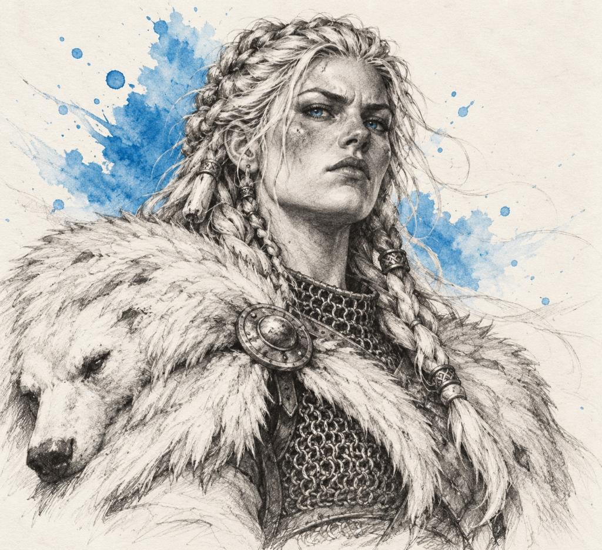
- **Role & Face**: Glacial Shield-Maiden / Fjord Berserker (Upper-Torso Bust). Broad-shouldered, weather-tested warrior in her late 20s. Fierce, proud facial structure with high frost-chapped cheekbones, piercing pale ice-blue eyes with intense cold focus, faint battle nick across the bridge of the nose. Wild platinum-blonde hair tied in thick warrior braids woven with small iron beads and bone rings.
- **Attire & Armor**: Thick white polar bear pelt shoulder mantle draped over a heavy iron-ring chainmail hauberk collar, fastened with a heavy circular iron penannular brooch.
- **De-Clutter Strategy**: Clean upper bust, expansive off-white negative space, minimal props, crisp linework.
```text
De-cluttered character concept art sketch of EXACTLY ONE Skald Human Shield-Maiden, upper-torso bust portrait with ample negative space. Style: 1995 Warcraft fantasy concept art by Samwise Didier, Always Be Chunky (ABC). Authoritative rough black charcoal and graphite draft linework with bold heroic contours and gritty cross-hatching on off-white watercolor sketchbook paper. STRICTLY MONOCHROMATIC FIGURE: No color fills on character, armor, or fur. STRICTLY NO TEXT, NO WORDS, NO LABELS, NO SIGNATURES, NO WATERMARKS. SINGLE HEROIC FIGURE. Distinctive Face & Anatomy: Broad-shouldered, battle-hardened glacial warrior in her late 20s with proud, fierce facial features, high frost-bitten cheekbones, and intense, piercing pale ice-blue eyes. Wild platinum-blonde hair styled in thick, intricate warrior braids secured with small iron beads and carved bone rings. Attire & Armor: Heavy polar bear pelt shoulder mantle draped over an iron-ring mail hauberk collar, fastened at the shoulder with a heavy circular iron brooch. Background: Clean sketchbook parchment with ample breathing room, faint graphite wind-flurry sketch lines fading into the paper. Accent: Single dynamic watercolor splash in fierce glacial blue (#0284c7) blooming softly behind the head and shoulder with fluid droplets. Pure sketch, no borders, no frames.
```

### 🏛️ Part A: Important Buildings & Locations (3 Prompts)

#### ✅ 1. Skalvyrhold Glacier Keep & Longhouse (The Sovereign Capital) [GENERATED]

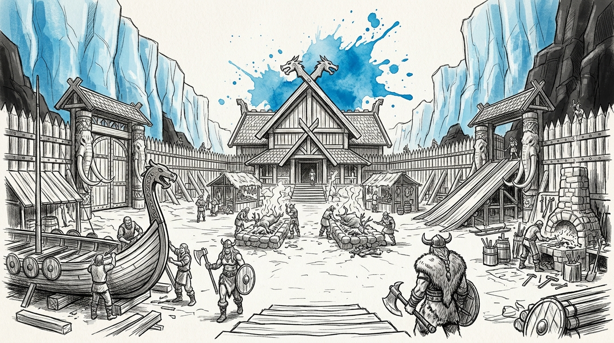
- **Biome & Location**: The icy precipice of Nordhalla overlooking the jagged frozen fjords.
- **Lore & Functions**: The mighty seat of Skald power. Carved directly into glacial ice and dark basalt sea cliffs. Massive timber longhouses with dragon-prow gables are braced against blizzards. Great open fire-trenches burn day and night in the great hall. The courtyard holds longship drydocks where warriors carve runic protections into keelbeams, meat-smoking smokehouses, and iron forges where smiths hammer battleaxes.
```text
Wide-angle architectural concept art sketch looking directly into the fortified courtyard and grand timber longhouse of Skalvyrhold, sovereign capital of the Skald Humans, in FULL CRISP FOCUS. Style: 1995 Warcraft fantasy concept art in the style of Samwise Didier, Always Be Chunky (ABC). Hand-drawn rough black charcoal and graphite draft linework with massive timber construction and gritty cross-hatching, isolated on clean off-white watercolor sketchbook paper. STRICTLY MONOCHROMATIC ARCHITECTURE & ENVIRONMENT: No color fills on characters or architecture. STRICTLY NO TEXT, NO LETTERS, NO WORDS, NO LABELS, NO SIGNATURES, NO WATERMARKS. NO GIANT OVERSIZED FOREGROUND PORTRAIT; FULL FJORD GLACIER FORTRESS PERSPECTIVE. Architectural & Urban Focus: A monumental fjord fortress carved between blue glacial ice walls and black volcanic basalt cliffs. Traversal: Ramparts of split pine logs bound with iron bands, wooden sled runways descending to the ice-locked harbor, and massive timber gates flanked by carved mammoth-tusk totems. Commerce & Hall Life: The central open courtyard buzzing around enormous stone fire-trenches roasting whole caribou; open-air trading booths where Skald hunters barter thick winter pelts, walrus ivory carvings, dried stockfish, and forged iron weapon heads. Shipwrights & Forges: On the left, shipwrights repairing the curved dragon prow of a sturdy wooden longship on timber blocks; on the right, an outdoor armorer's forge clanging with hammers. In-Scale Citizens: Muscular Skald warriors, shield-maidens, and harpooners (bear pelts, horned helmets, braided hair, heavy battleaxes, round shields) bustling between longhouses and patrolling parapets in natural architectural scale. Accent: Single dynamic explosive watercolor splash in fierce glacial blue (#0284c7) blooming behind the central longhouse dragon gables with fluid paint splatters. Pure isolated sketch, no borders, no frames.
```

#### ✅ 2. The Frost-Barrow of the First Reavers (The Ancestral Mound) [GENERATED]

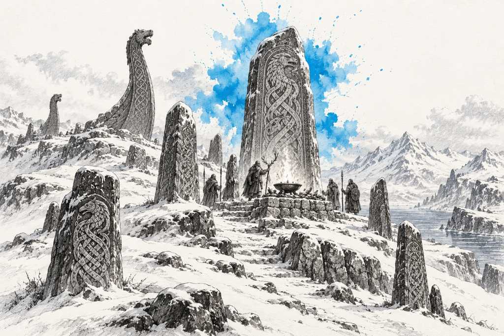
- **Biome & Location**: A windswept frozen plateau above the fjord, perpetually raked by howling snowstorms.
- **Lore & Functions**: The sacred burial grounds where Skald kings and shield-maidens are entombed inside stone ship-cairns. Towering runestones inscribed with heroic deeds stand against the blizzard. Runesmiths come here to carve oaths in bone, and warriors swear blood-brotherhood over ancestral graves.
```text
Wide-angle landscape and architectural concept art sketch of the Frost-Barrow of the First Reavers in Nordhalla, in FULL CRISP FOCUS. Style: 1995 fantasy concept art in the style of Samwise Didier, Always Be Chunky (ABC). Hand-drawn rough black charcoal and graphite draft linework with rugged epic stone textures and gritty cross-hatching, isolated on clean off-white watercolor sketchbook paper. STRICTLY MONOCHROMATIC SUBJECT & ENVIRONMENT: No color fills on characters or scenery. STRICTLY NO TEXT, NO LETTERS, NO WORDS, NO LABELS, NO SIGNATURES, NO WATERMARKS. NO GIANT FOREGROUND PORTRAIT; FULL SACRED BARROW PERSPECTIVE. Architectural & Monumental Focus: A solemn windswept glacial ridge covered in monumental ship-shaped stone settings and megalithic burial cairns. Traversal: Winding snowy footpaths carved with runic boundary markers leading between snowdrifts. Monuments & Rites: Massive upright runestones standing tall against driving snow, deeply carved with interlaced knotwork beasts and clan sagas; a central stone fire-altar burning with fragrant pine embers where Skald shamans cast runic bones onto sacred slate slabs. In-Scale Citizens: Skald warriors and clan elders in heavy fur capes and chainmail hauberks standing in solemn assembly, holding spears and round shields in natural perspective scale. Accent: Single dynamic explosive watercolor splash in stark glacial blue (#0284c7) blooming behind the central runestone with fluid paint splatters. Pure isolated sketch, no borders, no frames.
```

#### ✅ 3. Whaler's Slip & Lamphera Vats (The Industrial Fjord Wharves) [GENERATED]

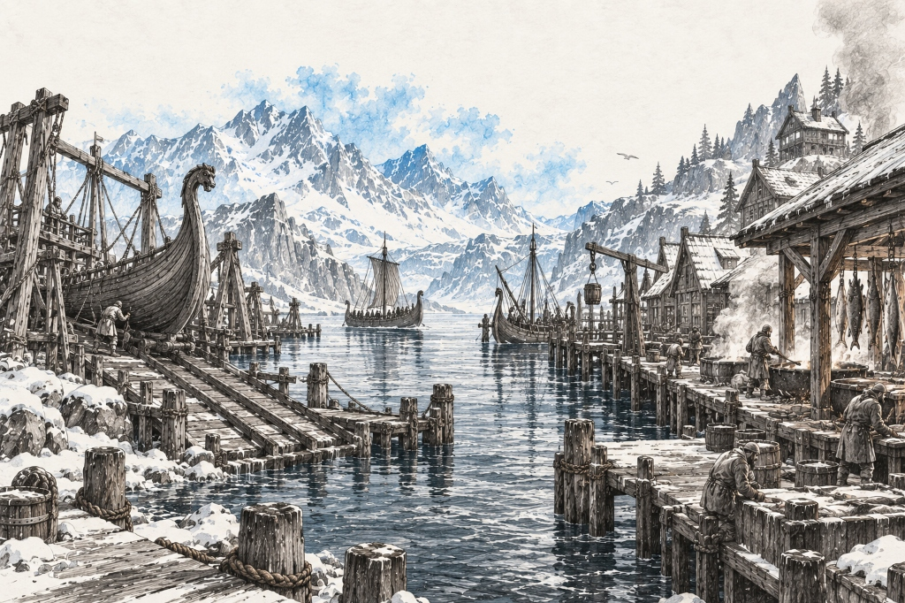
- **Biome & Location**: The sheltered inner cove of Skalvyrhold where longships dock amidst floating pack ice.
- **Lore & Functions**: The industrial heartbeat of Skald survival. Sloping timber slipways pull massive sea-mammals and whales ashore. Colossal wooden brine vats preserve tons of blubber and fish for winter. Smoke-shacks cure seal meat, while bone-carvers work on whaling platforms crafting harpoon heads.
```text
Wide-angle architectural concept art sketch of the Whaler's Slip and Lamphera Vats at Skalvyrhold harbor, in FULL CRISP FOCUS. Style: 1995 Warcraft fantasy concept art in the style of Samwise Didier, Always Be Chunky (ABC). Hand-drawn rough black charcoal and graphite draft linework with heavy maritime carpentry and gritty cross-hatching, isolated on clean off-white watercolor sketchbook paper. STRICTLY MONOCHROMATIC ARCHITECTURE & ENVIRONMENT: No color fills on characters or architecture. STRICTLY NO TEXT, NO LETTERS, NO WORDS, NO LABELS, NO SIGNATURES, NO WATERMARKS. NO GIANT FOREGROUND PORTRAIT; FULL HARBOR SLIPWAY PERSPECTIVE. Architectural & Maritime Focus: Rugged coastal wharves built from massive frost-cured pine logs jutting into icy fjord waters. Traversal: Sloping timber slipways with grease-skids, iron capstans with thick hemp ropes hauling longships, and elevated wooden boardwalks spanning boiling blubber cauldrons. Fisheries & Industry: Mammoth wooden vats brimming with brine-cured herring, racks of wind-drying cod hanging under open shed roofs, and open iron cauldrons rendering whale oil with plumes of greasy smoke rising into the cold air. In-Scale Citizens: Burly Skald whalers, deck-hands, and fish-wives in oilcloth aprons and seal-skin boots hauling heavy barrels, sharpening flensing knives, and coiling thick harpoon lines in natural architectural scale. Accent: Single dynamic explosive watercolor splash in frosty glacial blue (#0284c7) blooming behind the harbor slipways with fluid paint splatters. Pure isolated sketch, no borders, no frames.
```

### 👤 Part B: Notable & Legendary Figures (5 Figures)

#### ✅ 1. Ragna Skalvyr (The Ice-Widow — Sovereign Jarl of the Fjord) [GENERATED]

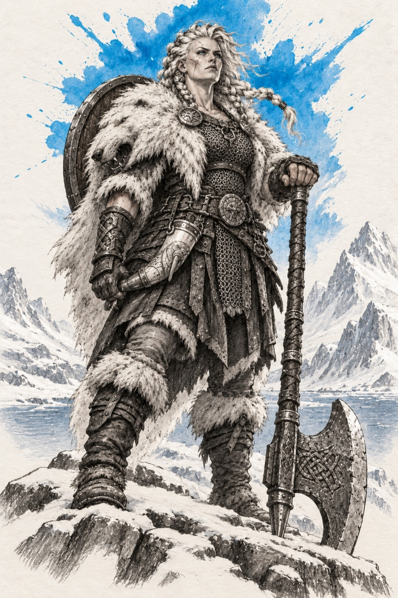
- **Lore Backstory**: Legendary ruler of Skalvyrhold who took command after her clan was ambushed on the ice shelves. She personally cleaved the sea-serpent of the northern floes, wearing its ivory fangs as battle trophies.
```text
Single character concept art sketch of EXACTLY ONE Legendary Female Skald Jarl, Ragna Skalvyr. Style: 1995 Warcraft fantasy concept art in the style of Samwise Didier, Always Be Chunky (ABC). Hand-drawn rough black charcoal and graphite draft linework with fierce heroic contours and gritty cross-hatching, isolated on clean off-white watercolor sketchbook paper. STRICTLY MONOCHROMATIC CHARACTER & GEAR: No color fills on character, armor, or weapons. STRICTLY NO TEXT, NO LETTERS, NO WORDS, NO LABELS, NO SIGNATURES, NO WATERMARKS. ABSOLUTE PROHIBITION ON MULTIPLE FIGURES: RENDER EXACTLY ONE SINGLE HEROIC FIGURE IN A COMMANDING WAR-LEADER POSE. Canonical Anatomy: Broad-shouldered, muscular human shield-maiden with battle-tested physique, proud fierce facial features, piercing ice-blue eyes, cheek scar, wild platinum hair tied in thick warrior braids bound with silver rings. Attire: Heavy polar bear pelt mantle draped over an iron-ring mail hauberk, studded leather combat kilt, fur-lined knee boots with iron crampons. Gear: Resting a massive two-handed bearded steel greataxe upright on the ground with one hand, a carved walrus-ivory horn slung at her hip, a heavy round wooden shield with an iron boss strapped to her back. Setting & Crude Background: Seen in her element upon the storm-lashed timber ramparts of Skalvyrhold with crude, hand-drawn 1995 Samwise Didier draft style background scenery sketched in rough graphite linework and gritty cross-hatching—carved wooden dragon-head gables, jagged glacial ice cliffs towering over the frozen fjord, driving snow flurries, and roaring outdoor fire trenches casting embers into the blizzard. Loosely vignetted sketch background. Accent: Single explosive watercolor splash in piercing glacial blue (#0284c7) blooming violently behind the jarl with fluid paint splatters. Pure sketchbook draft page, no formal borders or frames.
```

#### ✅ 2. Jarl Torvald Ice-Breaker (Lord of the Longships) [GENERATED]

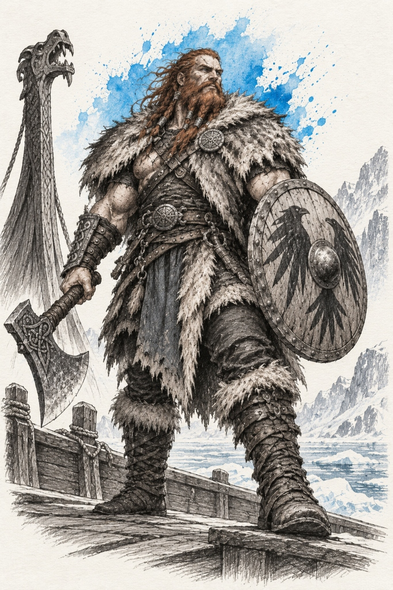
- **Lore Backstory**: Master navigator and reaver who has led seventy successful coastal voyages. His legendary iron-shod longship has smashed through solid pack ice to rescue trapped hunting parties.
```text
Single character concept art sketch of EXACTLY ONE Male Skald Warrior, Jarl Torvald Ice-Breaker. Style: 1995 Warcraft fantasy concept art in the style of Samwise Didier, Always Be Chunky (ABC). Hand-drawn rough black charcoal and graphite draft linework with bulky muscular proportions and gritty cross-hatching, isolated on clean off-white watercolor sketchbook paper. STRICTLY MONOCHROMATIC CHARACTER & GEAR: No color fills on character or weapons. STRICTLY NO TEXT, NO LETTERS, NO WORDS, NO LABELS, NO SIGNATURES, NO WATERMARKS. ABSOLUTE PROHIBITION ON MULTIPLE FIGURES: RENDER EXACTLY ONE SINGLE HEROIC FIGURE IN A DEFIANT READY STANCE. Canonical Anatomy: Towering, massive human reaver with colossal chest and arms, weather-cracked jawline, fierce frosty blue eyes, thick braided auburn beard adorned with iron beads. Attire: Layered wolf-pelt shoulder cape, heavy steel-banded leather cuirass, studded bracers, thick fur boots. Gear: Brandishing a heavy one-handed broadaxe in one fist and holding a stout round wooden shield painted with raven crests in the other. Setting & Crude Background: Seen in his element on the curved wooden deck of an ice-cutting longship with crude, hand-drawn 1995 Samwise Didier draft style background scenery sketched in rough graphite linework and gritty cross-hatching—carved dragon prow smashing through floating sea-ice floes, heavy furled square sails, coiled mooring ropes, and jagged frost-capped fjord cliffs in the background. Loosely vignetted sketch background. Accent: Single dynamic explosive watercolor splash in glacial blue (#0284c7) blooming behind the warrior with fluid paint splatters. Pure sketchbook draft page, no formal borders or frames.
```

#### 3. Freya the Rune-Carver (Keeper of the Ancestral Sagas)
- **Lore Backstory**: High skald and runic historian who records the names of the fallen upon the great standing stones of Nordhalla. She interprets prophecies cast from carved caribou knuckles.
```text
Single character concept art sketch of EXACTLY ONE Female Skald Runesmith, Freya. Style: 1995 fantasy concept art in the style of Samwise Didier. Hand-drawn rough black charcoal and graphite draft linework with expressive cross-hatching, isolated on clean off-white watercolor sketchbook paper. STRICTLY MONOCHROMATIC CHARACTER & GEAR: No color fills on character or runes. STRICTLY NO TEXT, NO LETTERS, NO WORDS, NO LABELS, NO SIGNATURES, NO WATERMARKS. ABSOLUTE PROHIBITION ON MULTIPLE FIGURES: RENDER EXACTLY ONE SINGLE HEROIC FIGURE IN A RITUAL CASTING POSE. Canonical Anatomy: Tall, strong human mystic with intense pale eyes, high cheekbones painted with ritual ash streaks, long blonde hair bound with antler pins. Attire: Seal-skin tunic trimmed with ermine fur, leather belt hung with pouch of bone runes and carving chisels, soft buckskin moccasins. Gear: Holding an iron-tipped rune mallet and chisel poised over a slate tablet, her belt hung with clattering wolf-bone charms. Setting & Crude Background: Seen in her element at the sacred Frost-Barrows of Nordhalla with crude, hand-drawn 1995 Samwise Didier draft style background scenery sketched in rough graphite linework and gritty cross-hatching—towering upright granite runestones carved with knotwork beasts, snowdrifts piled high around ancestral cairns, and a crackling stone fire-pit with rising fragrant pine smoke. Loosely vignetted sketch background. Accent: Dynamic explosive watercolor splash in vibrant glacial blue (#0284c7) blooming behind the mystic with fluid paint splatters. Pure sketchbook draft page, no formal borders or frames.
```

#### 4. Sven Whale-Bane (Chief Harpooner of the Fjord Fleet)
- **Lore Backstory**: Veteran hunter who can throw an eight-foot iron harpoon through a raging squall with pinpoint accuracy. He bears scars from a kraken tentacle across his chest.
```text
Single character concept art sketch of EXACTLY ONE Male Skald Harpooner, Sven Whale-Bane. Style: 1995 Warcraft fantasy concept art in the style of Samwise Didier, Always Be Chunky (ABC). Hand-drawn rough black charcoal and graphite draft linework with rugged burly contours and gritty cross-hatching, isolated on clean off-white watercolor sketchbook paper. STRICTLY MONOCHROMATIC CHARACTER & GEAR: No color fills on character or harpoon. STRICTLY NO TEXT, NO LETTERS, NO WORDS, NO LABELS, NO SIGNATURES, NO WATERMARKS. ABSOLUTE PROHIBITION ON MULTIPLE FIGURES: RENDER EXACTLY ONE SINGLE HEROIC FIGURE IN A HARPOON THROWING STANCE. Canonical Anatomy: Powerful, barrel-chested human mariner with thick forearms, squinting weather-hardened eyes, short bristly grey beard, bald head with tribal knotwork tattoos. Attire: Heavy oilskin vest lined with sheepskin, rolled wool sleeves, thick sea-boots, rope belt. Gear: Poising a massive barbed iron whaling harpoon with heavy braided hemp retrieval line coiled around his forearm, ready to strike into the waves. Setting & Crude Background: Seen in his element on the slippery timber slipway of Skalvyrhold harbor with crude, hand-drawn 1995 Samwise Didier draft style background scenery sketched in rough graphite linework and gritty cross-hatching—massive wooden brine vats, racks of hanging salted cod, heavy iron capstans with thick hemp ropes, and freezing ocean spray crashing over the harbor breakwater. Loosely vignetted sketch background. Accent: Single explosive watercolor splash in glacial blue (#0284c7) bursting behind the harpooner with fluid paint splatters. Pure sketchbook draft page, no formal borders or frames.
```

#### 5. Astrid Frost-Voice (The War-Horn Skald)
- **Lore Backstory**: Revered herald whose war-horns echo across the mountain passes, rallying the clans and striking terror into invading raiders before a single blow is struck.
```text
Single character concept art sketch of EXACTLY ONE Female Skald Herald, Astrid Frost-Voice. Style: 1995 fantasy concept art in the style of Samwise Didier. Hand-drawn rough black charcoal and graphite draft linework with dynamic contours and gritty cross-hatching, isolated on clean off-white watercolor sketchbook paper. STRICTLY MONOCHROMATIC CHARACTER & GEAR: No color fills on character or horn. STRICTLY NO TEXT, NO LETTERS, NO WORDS, NO LABELS, NO SIGNATURES, NO WATERMARKS. ABSOLUTE PROHIBITION ON MULTIPLE FIGURES: RENDER EXACTLY ONE SINGLE HEROIC FIGURE IN A SOUNDING POSE. Canonical Anatomy: Lean, athletic human herald with proud posture, sharp spirited features, wild wind-blown hair bound with silver leather ties. Attire: Woolen combat dress under boiled leather cuirass with embossed interlace knotwork, fur-trimmed mantle, strapped leather boots. Gear: Raising an enormous carved mammoth-tusk war horn to her lips with both hands, blowing a sounding call, a notched iron broadsword hanging at her hip. Setting & Crude Background: Seen in her element atop a sheer glacial overlook above the fjord with crude, hand-drawn 1995 Samwise Didier draft style background scenery sketched in rough graphite linework and gritty cross-hatching—howling mountain blizzards, dramatic blue-ice crevasses, fluttering clan raven banners on pine poles, and the sounding vibrations echoing through the mountain pass. Loosely vignetted sketch background. Accent: Dynamic explosive watercolor splash in radiant glacial blue (#0284c7) blooming behind the war horn with fluid paint splatters. Pure sketchbook draft page, no formal borders or frames.
```

---

## ⛰️ 3. Tessen Human (Forge Amber `#b45309`)
*Canonical Anatomical Lock*: Stocky, muscular, industrial human miners, iron-smiths, and chasm engineers. Compact, powerful low-center-of-gravity builds accustomed to steep vertical climbs and heavy foundry labor. Dark hair cut short or tied in practical topknots, pale indoor-keep complexion with soot-smudged cheekbones, intense amber or hazel eyes shielded by brass-rimmed forge goggles, clean-shaven or heavy jaw-beards. Attire: Heavy fireproof treated leather smithing aprons, reinforced canvas trousers with knee patches, riveted leather bracers, steel-toed climbing boots with sole spikes. Armed with heavy sledgehammers, pickaxes, surveying chains, and brass calipers.

### 👤 Part 0: Dedicated Canonical Racial Portrait (1 Prompt)

#### 0. Canonical Tessen Racial Portrait (De-Cluttered Bust)
- **Role & Face**: Bastion Stone-Architect & Chasm Foundryman (Upper-Torso Bust). Compact, muscular human craftsman in his early 30s. Square, determined jawline, pale complexion from indoor stone keeps with subtle soot marks across high cheekbones, intense focused amber-brown eyes, brass-rimmed forge goggles pushed up onto the forehead. Dark hair cut in a practical, short functional crop.
- **Attire & Gear**: Calloused hand raised near chest holding a heavy forged iron drafting caliper. Heavy fireproof leather work apron with brass rivets worn over a coarse rolled-sleeve linen tunic; thick riveted leather bracers.
- **De-Clutter Strategy**: Clean upper bust, expansive off-white negative space, minimal props, crisp linework.
```text
De-cluttered character concept art sketch of EXACTLY ONE Tessen Human Stone-Architect, upper-torso bust portrait with vast breathable negative space. Style: 1995 fantasy concept art by Samwise Didier, Always Be Chunky (ABC). Authoritative rough black charcoal and graphite draft linework with bold structural contours and gritty cross-hatching on clean off-white watercolor sketchbook paper. STRICTLY MONOCHROMATIC FIGURE: No color fills on character, apron, or goggles. STRICTLY NO TEXT, NO WORDS, NO LABELS, NO SIGNATURES, NO WATERMARKS. SINGLE HEROIC FIGURE. RADICALLY MINIMALIST AND DE-CLUTTERED: Absolutely zero loose props, zero flying debris, zero distracting background clutter. Distinctive Face & Anatomy: Compact, muscular human craftsman in his early 30s with a solid square jawline, pale indoor-keep complexion, subtle soot smudges on high cheekbones, and intense, observant amber-brown eyes. Dark hair in a short practical crop; round brass-rimmed forge goggles pushed up onto his brow. Hands & Gear: One broad, calloused hand raised near the chest holding a single heavy forged iron architectural caliper; wearing thick riveted leather forearm bracers. Attire: Heavy fireproof split-leather artisan apron with brass grommets over a coarse linen tunic open at the throat. Background: Expansive, clean sketchbook parchment with ample breathing room, faint graphite architectural stonework lines fading cleanly into the paper. Accent: Single dynamic watercolor splash in fiery forge amber and molten bronze (#b45309) blooming softly behind the head and shoulder with fluid droplets. Pure sketch, no borders, no frames.
```

### 🏛️ Part A: Important Buildings & Locations (3 Prompts)

#### ✅ 1. Tesshan Vertical Chasm Keep (The Sovereign Capital) [GENERATED]

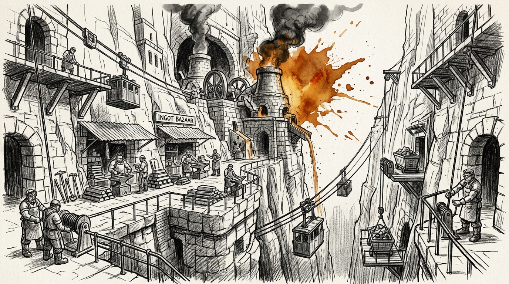
- **Biome & Location**: The sheer granite cliffs of Cragjaw Peaks, suspended over a deep mining gorge.
- **Lore & Functions**: The industrial mountain keep of the Tessen. Built vertically along canyon walls. Counterweighted iron cable-car gondolas haul ore between cliff tiers. Steam-powered winch platforms hoist miners. The main terrace houses the Great Ingot Bazaar where merchants barter pig-iron, brass ingots, mining explosives, and precision measuring tools under heavy tin awnings.
```text
Wide-angle architectural concept art sketch looking directly into the vertical cliffside stronghold of Tesshan Keep, sovereign capital of the Tessen Humans, in FULL CRISP FOCUS. Style: 1995 fantasy concept art in the style of Samwise Didier, Always Be Chunky (ABC). Hand-drawn rough black charcoal and graphite draft linework with heavy industrial masonry and gritty cross-hatching, isolated on clean off-white watercolor sketchbook paper. STRICTLY MONOCHROMATIC ARCHITECTURE & ENVIRONMENT: No color fills on characters or architecture. STRICTLY NO TEXT, NO LETTERS, NO WORDS, NO LABELS, NO SIGNATURES, NO WATERMARKS. NO GIANT OVERSIZED FOREGROUND PORTRAIT; FULL VERTICAL CHASM KEEP PERSPECTIVE. Architectural & Urban Focus: A massive multi-tiered fortress built into sheer vertical granite canyon cliffs. Traversal: Heavy iron cable-car gondolas gliding across yawning chasms on thick steel ropes, counterweighted winch platforms lifting carts of raw ore, and vertiginous stone catwalks bolted directly into the rock face with heavy iron railings. Commerce & Foundries: The sprawling Ingot Bazaar on the mid-cliff terrace—open stone stalls with iron anvils where Tessen smelters barter stacked bronze and pig-iron ingots, mining picks, brass calipers, and tempered steel drill bits under corrugated tin awnings. Industry & Furnaces: Colossal blast furnaces built into cavern openings billowing thick black smoke, glowing slag chutes pouring molten waste into the gorge below, and turning steam pump flywheels. In-Scale Citizens: Stocky, muscular Tessen smiths, engineers, and winch operators (leather aprons, brass forge goggles, heavy boots, sledgehammers) operating cable windlasses and inspecting metalwork in natural architectural scale. Accent: Single dynamic explosive watercolor splash in fiery forge amber and molten bronze (#b45309) blooming behind the central blast furnace with fluid paint splatters. Pure isolated sketch, no borders, no frames.
```

#### ✅ 2. The Smoldering Ingot Bazaar & Great Scales (The Metal Exchange) [GENERATED]

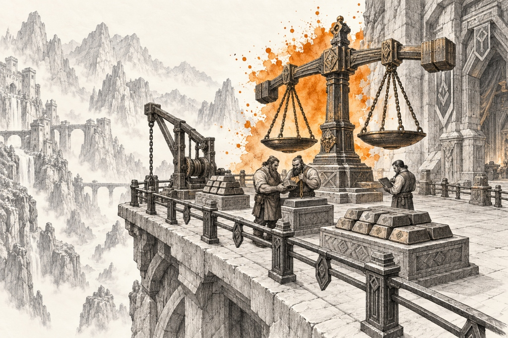
- **Biome & Location**: The central cantilevered stone terrace of Tesshan Keep jutting out over the misty gorge.
- **Lore & De-Cluttered Focus**: A wide stone terrace cantilevered over the chasm, ringed by heavy stone pillars and iron guardrails. A monumental counterbalanced bronze balance scale stands in the center. Neat stacks of stamped copper and iron ingots rest on low stone plinths. Exactly two Tessen metal-traders in leather aprons inspect an ingot with calipers, while a clerk checks weights. Airy mountain canyon background with vast negative space, free of visual clutter.
```text
Wide-angle architectural concept art sketch of the Smoldering Ingot Bazaar and Great Scales in Tesshan Keep, in FULL CRISP FOCUS. Style: 1995 fantasy concept art in the style of Samwise Didier, Always Be Chunky (ABC). Hand-drawn rough black charcoal and graphite draft linework with robust industrial perspective and clean cross-hatching on off-white watercolor paper with vast open negative space. STRICTLY MONOCHROMATIC ARCHITECTURE & ENVIRONMENT: No color fills on characters or stone. STRICTLY NO TEXT, NO LETTERS, NO WORDS, NO LABELS, NO SIGNATURES, NO WATERMARKS. NO GIANT FOREGROUND PORTRAIT; FULL OPEN TERRACE PERSPECTIVE. RADICALLY DE-CLUTTERED, LOGICAL ARCHITECTURAL COMPOSITION: A clean, sensible trading terrace that makes architectural and physical sense; strictly NO scattered junk, NO loose debris, NO random tool piles strewn on the ground. Focal Architecture: A wide cantilevered granite terrace overlooking a misty mountain canyon, bordered by clean heavy iron guardrails. A monumental counterbalanced bronze balance scale stands proudly as the sole central feature. A few neat, orderly stacks of stamped bronze and iron ingots rest cleanly on low carved stone plinths beside an iron crane winch. In-Scale Citizens: Exactly two burly Tessen iron-merchants in leather aprons and rolled sleeves calmly examining a single stamped ingot with a brass caliper, while one clerk records weights on a slate tablet in natural environmental scale. Setting: Expansive airy mountain chasm with clean granite cliffs fading softly into the clean off-white parchment. Accent: Single explosive watercolor splash in warm forge amber (#b45309) blooming behind the great balance scale with fluid paint splatters. Pure isolated sketch, no borders, no frames.
```

#### ✅ 3. Cable-Car Gantry & Sump-Pumps (The Engineering Hub) [GENERATED]

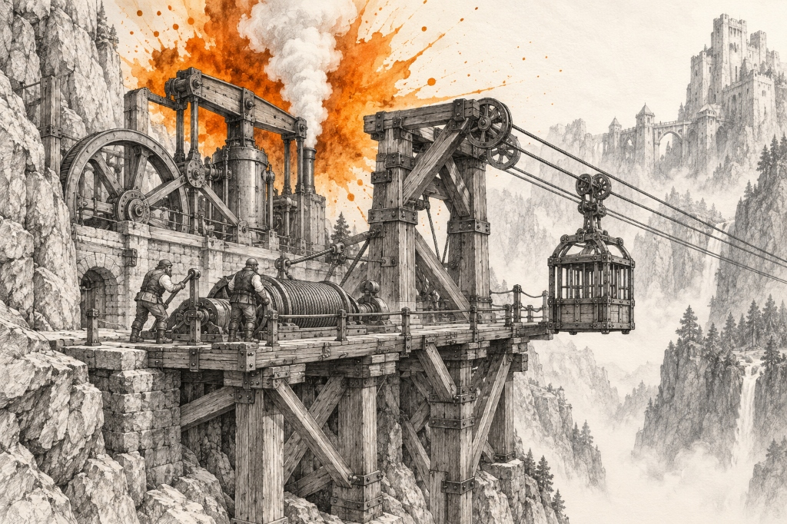
- **Biome & Location**: The engineering terrace at the base of Tesshan Keep where mining shafts descend into the cliff.
- **Lore & De-Cluttered Focus**: A massive multi-level timber-and-iron cable winch gantry anchored into vertical granite canyon rock. A single heavy iron-caged passenger gondola is docked at a cantilevered timber platform. A rhythmic walking-beam water pump with an iron flywheel vents a clean white steam plume into the canyon. Two Tessen mine engineers operate levers in natural architectural scale. Airy, logical spatial composition.
```text
Wide-angle architectural concept art sketch of the Cable-Car Gantry and Sump-Pump Station at the base of Tesshan Keep, in FULL CRISP FOCUS. Style: 1995 fantasy concept art in the style of Samwise Didier, Always Be Chunky (ABC). Hand-drawn rough black charcoal and graphite draft linework with grand industrial timber carpentry and clean cross-hatching on off-white watercolor paper with vast negative space. STRICTLY MONOCHROMATIC ARCHITECTURE: No color fills on structures or figures. STRICTLY NO TEXT, NO LETTERS, NO WORDS, NO LABELS, NO SIGNATURES, NO WATERMARKS. FULL DEEP-FOCUS CANYON PERSPECTIVE. RADICALLY DE-CLUTTERED, SENSIBLE MECHANICAL SCENE: A coherent engineering setting that makes structural and mechanical sense; strictly NO loose debris, NO tangled piles of junk, NO random machinery cluttering the floor. Architectural & Mechanical Focus: A monumental timber-and-iron cable gantry anchored cleanly against vertical granite cliffs. Heavy steel suspension cables stretch neatly across the canyon to a single suspended iron-cage cable gondola docked at a timber platform with safety railings. A massive walking-beam pump with an iron flywheel vents a single smooth plume of steam upward into the canyon. In-Scale Inhabitants: Exactly two Tessen mine mechanics in heavy work vests and boots standing at the winch controls, operating an iron lever and inspecting a cable drum in natural perspective scale. Background: Sheer granite cliff face and open canyon mist fading softly into the clean parchment. Accent: Single dynamic explosive watercolor splash in fiery forge amber (#b45309) blooming behind the steam gantry with fluid paint splatters. Pure isolated sketch, no borders, no frames.
```

### 👤 Part B: Notable & Legendary Figures (5 Figures)

#### ✅ 1. Master Founder Kael Tesshan (High Smelter of the Chasm) [GENERATED]

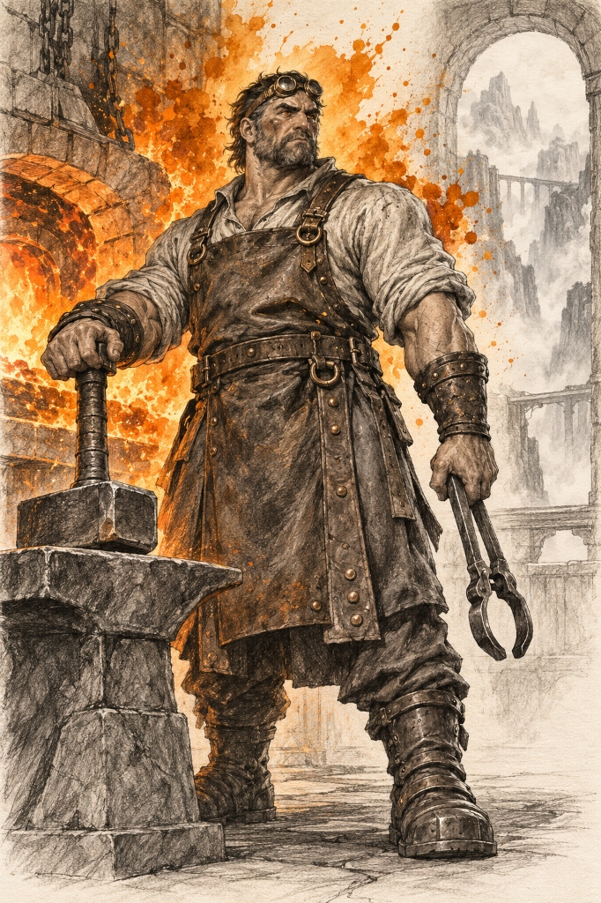
- **Lore Backstory**: Chief architect of Tesshan's vertical expansion and master metallurgist. He perfected the coal-flux smelting process that makes Tesshan steel resistant to mountain frost-cracking.
```text
Single character concept art sketch of EXACTLY ONE Legendary Male Tessen Master Founder, Kael Tesshan. Style: 1995 Warcraft fantasy concept art in the style of Samwise Didier, Always Be Chunky (ABC). Hand-drawn rough black charcoal and graphite draft linework with heavy muscular contours and gritty cross-hatching, isolated on clean off-white watercolor sketchbook paper. STRICTLY MONOCHROMATIC CHARACTER & GEAR: No color fills on character, armor, or tools. STRICTLY NO TEXT, NO LETTERS, NO WORDS, NO LABELS, NO SIGNATURES, NO WATERMARKS. ABSOLUTE PROHIBITION ON MULTIPLE FIGURES: RENDER EXACTLY ONE SINGLE HEROIC FIGURE IN A STURDY FOUNDRY POSE. RADICALLY DE-CLUTTERED, COHERENT SCENE: Clean, powerful silhouette with expansive negative space; strictly NO loose tools lying on the floor, NO clutter piles, NO scattered debris. Canonical Anatomy: Broad-shouldered, stocky, powerfully built human smith in his late 40s with thick chest, weathered square jaw, intense amber eyes reflecting heat, subtle soot marks across cheekbones, round brass forge goggles pushed up onto forehead. Attire: Heavy fireproof split-leather smithing apron with brass rivets worn over a coarse linen tunic with rolled sleeves, thick studded leather bracers, reinforced iron-toed work boots. Gear: Resting a colossal square-headed steel forging hammer firmly upright on a flat stone anvil with one calloused hand, holding heavy iron crucible tongs in the other. Setting & Background: Clean, minimal workshop draft background sketched in rough graphite linework—a sturdy stone smelting furnace arch venting heat, clean stone wall, and an open arched window looking out into the misty chasm, fading softly into parchment. Accent: Single dynamic explosive watercolor splash in fiery forge amber and molten bronze (#b45309) blooming violently behind the smith with fluid paint splatters. Pure sketchbook draft page, no formal borders or frames.
```

#### 2. Varek the Iron-Surveyor (Chief Chasm Cartographer)
- **Lore Backstory**: Veteran surveyor who mapped the vertical cliff faces and designed the aerial cable-car spans connecting Tesshan's mining bastions across the gorge.
```text
Single character concept art sketch of EXACTLY ONE Male Tessen Surveyor, Varek. Style: 1995 fantasy concept art in the style of Samwise Didier. Hand-drawn rough black charcoal and graphite draft linework with sturdy contours and gritty cross-hatching, isolated on clean off-white watercolor sketchbook paper. STRICTLY MONOCHROMATIC CHARACTER & GEAR: No color fills on character or tools. STRICTLY NO TEXT, NO LETTERS, NO WORDS, NO LABELS, NO SIGNATURES, NO WATERMARKS. ABSOLUTE PROHIBITION ON MULTIPLE FIGURES: RENDER EXACTLY ONE SINGLE HEROIC FIGURE IN A BALANCED CLIFF-MEASURING POSE. Canonical Anatomy: Stocky, athletic human mountaineer with alert eyes, rugged beard, weather-beaten complexion, climbing helmet with brass lamp bracket. Attire: Heavy canvas work doublet, climbing harness with iron carabiners and piton coils, spiked leather boots. Gear: Holding an oversized brass leveling theodolite on a timber tripod with one hand and a plumb-line in the other, leather blueprints slung at his back. Setting & Crude Background: Seen in his element on a narrow cantilevered wooden surveying balcony over the chasm with crude, hand-drawn 1995 Samwise Didier draft style background scenery sketched in rough graphite linework and gritty cross-hatching—sheer vertical granite canyon cliffs, heavy steel cable-car ropes spanning the abyss, gliding ore gondolas, and distant foundry smoke stacks. Loosely vignetted sketch background. Accent: Dynamic explosive watercolor splash in forge amber (#b45309) blooming behind the surveyor with fluid paint splatters. Pure sketchbook draft page, no formal borders or frames.
```

#### ✅ 3. Moira the Cable-Rigger (Master of the High Spans) [GENERATED]

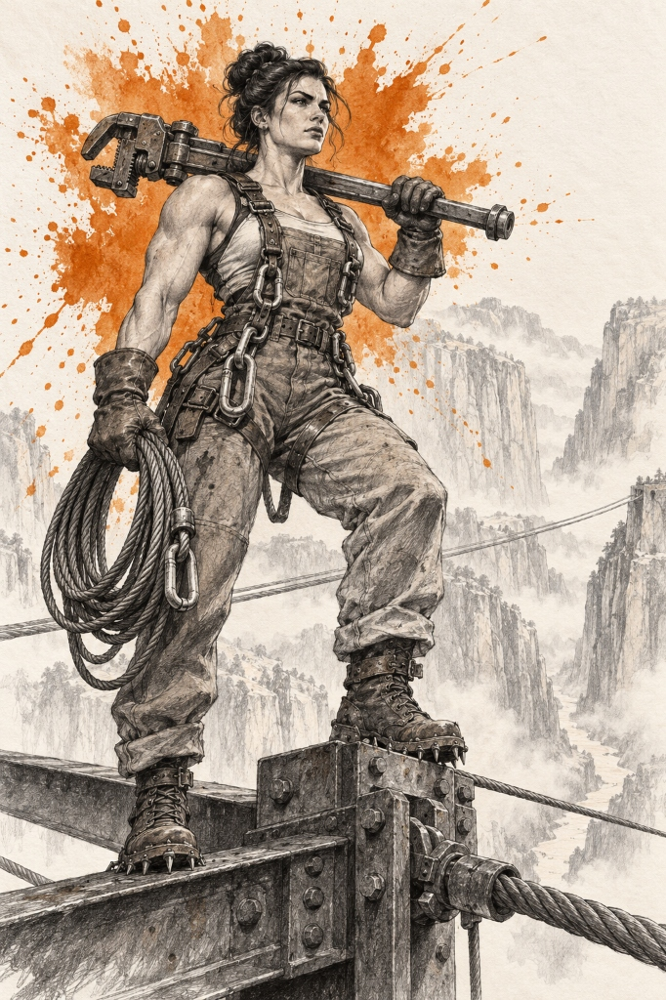
- **Lore Backstory**: Daring high-altitude rigger who inspects and repairs the steel cables suspended thousands of feet above the chasm floor, unfazed by howling alpine winds.
```text
Single character concept art sketch of EXACTLY ONE Female Tessen Cable-Rigger, Moira. Style: 1995 fantasy concept art in the style of Samwise Didier, Always Be Chunky (ABC). Hand-drawn rough black charcoal and graphite draft linework with agile muscular contours and gritty cross-hatching, isolated on clean off-white watercolor sketchbook paper. STRICTLY MONOCHROMATIC CHARACTER & GEAR: No color fills on character or gear. STRICTLY NO TEXT, NO LETTERS, NO WORDS, NO LABELS, NO SIGNATURES, NO WATERMARKS. ABSOLUTE PROHIBITION ON MULTIPLE FIGURES: RENDER EXACTLY ONE SINGLE HEROIC FIGURE IN AN ALERT RIGGING STANCE. RADICALLY DE-CLUTTERED HEROIC COMPOSITION: Dynamic athletic silhouette with expansive negative space; strictly NO loose clutter or unnecessary props. Canonical Anatomy: Compact, muscular human woman in her late 20s with powerful forearms, determined square jawline, sharp focused eyes, dark hair tied tight in a high bun. Attire: Tough canvas work overalls, thick cowhide grip gloves, leather harness with iron safety carabiners, heavy spiked climbing boots. Gear: Resting a heavy forged iron cable-clamp wrench across one shoulder, holding a coiled safety rope in her other hand. Setting & Background: Perched sure-footed upon a massive cantilevered iron beam junction high above the canyon, sketched in rough graphite—clean steel cable lines stretching across the misty abyss, with sheer vertical granite cliffs fading softly into the clean off-white parchment. Accent: Single dynamic explosive watercolor splash in fiery forge amber (#b45309) blooming behind the rigger with fluid paint splatters. Pure sketchbook draft page, no formal borders or frames.
```

#### 4. Elder Brom Smelt-Master (The Keeper of the Blast-Flames)
- **Lore Backstory**: Senior foundry master who can determine the exact carbon and iron purity of molten metal simply by the color and smell of the furnace smoke.
```text
Single character concept art sketch of EXACTLY ONE Male Tessen Smelter, Elder Brom. Style: 1995 Warcraft fantasy concept art in the style of Samwise Didier, Always Be Chunky (ABC). Hand-drawn rough black charcoal and graphite draft linework with rugged venerable contours and gritty cross-hatching, isolated on clean off-white watercolor sketchbook paper. STRICTLY MONOCHROMATIC CHARACTER & GEAR: No color fills on character or tools. STRICTLY NO TEXT, NO LETTERS, NO WORDS, NO LABELS, NO SIGNATURES, NO WATERMARKS. ABSOLUTE PROHIBITION ON MULTIPLE FIGURES: RENDER EXACTLY ONE SINGLE HEROIC FIGURE IN A PATRIARCHAL FOUNDRY POSE. Canonical Anatomy: Broad, heavy-set elder human with snow-white beard singed at the ends, deep laugh lines, piercing eyes behind thick round brass spectacles. Attire: Multiple layers of charred leather aprons, thick asbestos work mitts, heavy iron-plated boots. Gear: Holding a long iron skimming ladle used to remove slag from molten cauldrons, a notched purity-test ingot held in his left hand. Setting & Crude Background: Seen in his element beside the boiling ore crucibles of the Ingot Bazaar with crude, hand-drawn 1995 Samwise Didier draft style background scenery sketched in rough graphite linework and gritty cross-hatching—stacks of freshly stamped bronze and pig-iron ingots, massive bronze balance scales, iron ladles, and stone chimneys venting white-hot heat into the cavern. Loosely vignetted sketch background. Accent: Single explosive watercolor splash in forge amber (#b45309) bursting behind the smelter with fluid paint splatters. Pure sketchbook draft page, no formal borders or frames.
```

#### 5. Sura the Chasm-Runner (Courier of the Aerial Gondolas)
- **Lore Backstory**: Fearless young courier who leaps between moving ore buckets and gondolas to deliver vital assay reports and emergency mechanical components across the chasm.
```text
Single character concept art sketch of EXACTLY ONE Female Tessen Courier, Sura. Style: 1995 fantasy concept art in the style of Samwise Didier. Hand-drawn rough black charcoal and graphite draft linework with energetic contours and gritty cross-hatching, isolated on clean off-white watercolor sketchbook paper. STRICTLY MONOCHROMATIC CHARACTER & GEAR: No color fills on character or gear. STRICTLY NO TEXT, NO LETTERS, NO WORDS, NO LABELS, NO SIGNATURES, NO WATERMARKS. ABSOLUTE PROHIBITION ON MULTIPLE FIGURES: RENDER EXACTLY ONE SINGLE HEROIC FIGURE IN A POISED CROUCH. Canonical Anatomy: Lithe, muscular, quick-footed human girl with sharp features, energetic expression, dark hair braided with brass rings. Attire: Fitted leather tunic, reinforced work leggings, spiked climbing boots, leather fingerless gloves. Gear: Balancing on a narrow iron rail, carrying an iron-reinforced courier dispatch pouch across her shoulder, holding a short grappling hook and rope ready to throw. Setting & Crude Background: Seen in her element leaping onto a moving iron ore gondola with crude, hand-drawn 1995 Samwise Didier draft style background scenery sketched in rough graphite linework and gritty cross-hatching—creaking aerial cable lines, swaying ore buckets, vertigo-inducing views of the chasm depths, and cantilevered timber platforms. Loosely vignetted sketch background. Accent: Dynamic explosive watercolor splash in forge amber (#b45309) blooming behind the courier with fluid paint splatters. Pure sketchbook draft page, no formal borders or frames.
```

---

### ⚓ 4. Merryn Human (Wave Indigo `#0369a1`)
*Canonical Anatomical Lock*: Weather-beaten, salt-crusted maritime human whalers, fishers, and privateers. Tall, broad, agile sailor physiques hardened by tossing decks and arctic squalls. Sun-browned skin etched with sea spray lines, piercing sea-blue or grey eyes squinting against ocean glare, wild windswept hair (salt-and-pepper or raven) tied back, intricate dark indigo kraken and compass tattoos covering arms, chest, and neck. Attire: Waxed sailcloth smocks, heavy oilskin trousers, striped sailor jerseys, rope belts, bare calloused sailor feet or heavy deck boots. Armed with bone-handled sailor knives, iron gaff hooks, belaying pins, and cutlasses.

### 👤 Part 0: Dedicated Canonical Racial Portrait (1 Prompt)

#### ✅ 0. Canonical Merryn Racial Portrait (De-Cluttered Bust) [GENERATED]

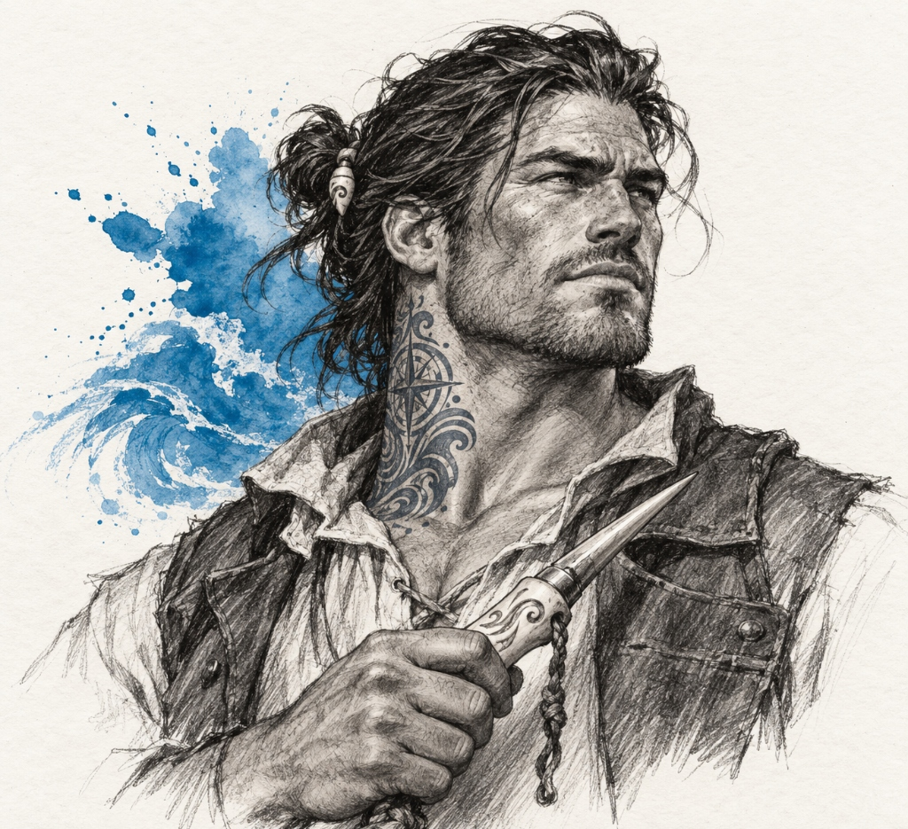
- **Role & Face**: Weather-beaten Maritime Boatswain & Whaler (Upper-Torso Bust). Athletic human mariner in early 30s. Broad, determined square jawline, sun-etched squinting sea-eyes, windswept dark hair tied back in a practical sailor knot with a carved bone bead. Intricate dark indigo tidal wave and compass glyph tattoo curving along the side of the neck.
- **Attire & Gear**: Open-collar coarse linen sailor shirt under a weathered oilskin vest; one broad calloused hand raised near chest holding a polished bone-handled marlinspike.
- **De-Clutter Strategy**: Clean upper bust, expansive off-white negative space, minimal props, crisp linework.
```text
De-cluttered character concept art sketch of EXACTLY ONE Merryn Human Boatswain, upper-torso bust portrait with vast breathable negative space. Style: 1995 video game fantasy concept art by Samwise Didier, Always Be Chunky (ABC). Hand-drawn rough black charcoal and gritty graphite pencil draft linework on clean off-white watercolor sketchbook paper. STYLIZED EXPRESSIVE CONCEPT ART, NOT PHOTOREALISTIC, NOT AN ACADEMIC PORTRAIT, NOT A SMOOTH DIGITAL PAINTING: Exaggerated heroic fantasy proportions, chunky muscular contours, heavy bold charcoal outlines, visible raw sketchbook pencil hatching. STRICTLY PURE BLACK CHARCOAL AND GRAPHITE PENCIL DRAWING ONLY: 100% monochrome grayscale for character, skin, hair, vest, and tool. ABSOLUTELY ZERO color tints, no sepia, no brown leather tones, no flesh tones, no colored lighting. RADICALLY MINIMALIST AND DE-CLUTTERED: Absolutely zero loose props, zero flying debris, zero distracting background clutter. Distinctive Face & Anatomy: Athletic human mariner in early 30s with a broad, determined square jawline, weather-creased squinting sea-eyes, and wind-blown dark hair tied in a rough sailor knot with a carved bone bead. Intricate dark indigo tidal wave and compass glyph tattoo coiling along the side of the neck. Hands & Gear: One broad, calloused hand raised near the chest holding a polished bone-handled marlinspike. Attire: Coarse linen sailor tunic open at the collar under a sturdy oilskin vest. Background: Clean sketchbook parchment with ample breathing room, faint graphite wave contours fading cleanly into the paper. Accent: Single dynamic accent watercolor splash in deep wave indigo (#0369a1) blooming softly behind the head and shoulder with fluid paint droplets. Pure sketch, no borders, no frames.
```

### 🏛️ Part A: Important Buildings & Locations (3 Prompts)

#### ✅ 1. Drift-Anchor Haven & Sovereign Wharves (The Maritime Town) [GENERATED]

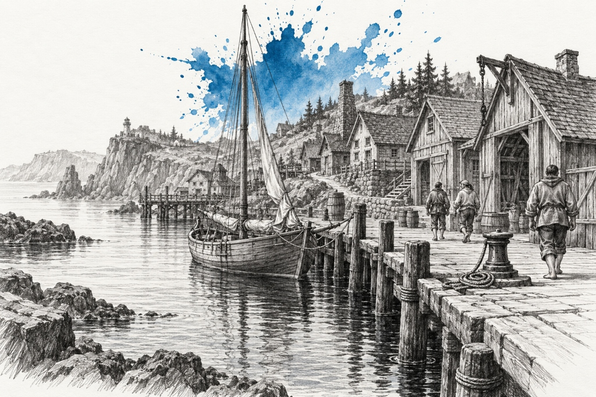
- **Biome & Location**: The sheltered rocky cove and tidal estuary of the Iceheart Sea.
- **Lore & Functions**: The sovereign coastal haven of the Merryn Humans. A rugged yet orderly small maritime town built along a natural sheltered cove. Sturdy weathered timber wharves resting on heavy barnacle-encrusted pilings, with gabled wooden boat-sheds and fish houses overlooking calm tidal water. A single moored wooden whaling cutter with neatly furled sails rests at the main pier. Exactly two or three hardy Merryn sailors in oilskin smocks walk the boardwalk in natural architectural scale.
```text
Wide-angle architectural concept art sketch of the coastal haven of Drift-Anchor Haven and Sovereign Wharves, in FULL CRISP FOCUS. Style: 1995 video game concept art by Samwise Didier, Always Be Chunky (ABC). Hand-drawn rough black charcoal and gritty graphite pencil draft linework with bold structural contours and gritty cross-hatching on clean off-white watercolor paper with vast open negative space. STYLIZED CONCEPT ART, NOT PHOTOREALISTIC, NOT A DIGITAL 3D RENDER: Chunky weathered timber wharves, expressive rough graphite linework, visible raw draft pencil hatching. STRICTLY PURE BLACK CHARCOAL AND GRAPHITE PENCIL DRAWING ONLY: 100% monochrome grayscale for all timber buildings, boat hulls, stone quays, water, and figures. ABSOLUTELY ZERO color tints, no sepia, no brown tones, no blue-tinted shadows, no colored lighting. NO GIANT OVERSIZED FOREGROUND FIGURE; FULL HARBOR TOWN PERSPECTIVE. RADICALLY DE-CLUTTERED, SENSIBLE MARITIME SMALL-TOWN ARCHITECTURE: A clean, orderly coastal haven that makes structural and mechanical sense; strictly NO scattered debris, NO piles of loose trash or discarded fish, NO messy piles of tangled ropes across walkways. Focal Architecture & Waterfront: A picturesque small maritime settlement built along a sheltered rocky cove. Sturdy weathered timber boardwalks and piers supported by heavy wooden pilings; two or three charming gabled timber boat-sheds and whalers' cottages with shingle roofs and stone chimneys lining the rocky shoreline. At the primary timber pier, a single classic wooden whaling cutter is neatly moored with furled sails; beside it, a clean stone slipway and a single iron capstan with a neatly coiled mooring line. In-Scale Citizens: Exactly two or three Merryn sailors in oilskin smocks, rolled trousers, and bare calloused feet walking along the wooden wharf in natural architectural perspective scale. Setting: Jagged coastal headlands, calm tidal water with gentle graphite ripples, and expansive clean off-white sketchbook sky. Accent: Single dynamic explosive watercolor splash in deep wave indigo (#0369a1) blooming behind the cutter's mast and harbor rooftops with fluid paint droplets. Pure isolated sketch, no borders, no frames.
```

#### ✅ 2. Merrowport Fish-Bazaar & Slipways (The Great Catch Exchange) [GENERATED]

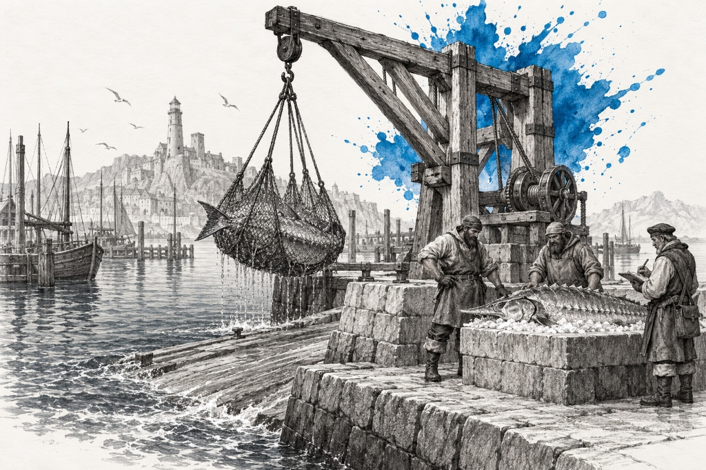
- **Biome & Location**: The tidal mudflats and stone sea-wall of Merrowport.
- **Lore & Functions**: The bustling open-air market where the daily ocean harvest is auctioned off. A wide stone harbor quay bordered by a monumental granite sea-wall. A heavy timber gantry crane with an iron winch cleanly hoists a single large woven fish net over the stone slipway. On a clean stone cleaning slab sits one giant deep-sea fish on bedded ice. Exactly two burly Merryn fishers in rolled trousers and oilskin smocks examine the catch, while one clerk records weights on a wooden slate in natural perspective scale.
```text
Wide-angle architectural concept art sketch of the Merrowport Fish-Bazaar and Slipways, in FULL CRISP FOCUS. Style: 1995 video game concept art by Samwise Didier, Always Be Chunky (ABC). Hand-drawn rough black charcoal and gritty graphite pencil draft linework with bold structural contours and gritty cross-hatching on clean off-white watercolor paper with vast open negative space. STYLIZED CONCEPT ART, NOT PHOTOREALISTIC, NOT A SMOOTH DIGITAL PAINTING: Chunky heavy architectural timbers, expressive rough linework, visible raw draft pencil marks. STRICTLY PURE BLACK CHARCOAL AND GRAPHITE PENCIL DRAWING ONLY: 100% monochrome grayscale for all architecture, stone, wood, figures, clothing, and fish. ABSOLUTELY ZERO color tints, no sepia, no brown tones, no colored lighting. NO GIANT FOREGROUND FIGURE; FULL WHARF PERSPECTIVE. RADICALLY DE-CLUTTERED, LOGICAL MARITIME SCENE: A clean, sensible harbor quay that makes architectural and functional sense; strictly NO scattered debris, NO tangled piles of loose ropes, NO random fish-heads or junk strewn on the floor. Focal Architecture: A wide stone harbor quay sloping gently down into the tidal surge, protected by a massive rough-hewn granite sea-wall. A single monumental heavy timber gantry crane with an iron winch hoists one large woven fish net cleanly over the stone slipway. Beside the crane, a single carved stone slab holds one giant deep-sea sturgeon on bedded ice. In-Scale Citizens: Exactly two burly Merryn fishers in rolled trousers and oilskin smocks calmly examining the giant catch, while one clerk records weights on a wooden slate in natural environmental scale. Setting: Clean stone pier, open tidal water, and distant mooring pilings fading softly into clean off-white parchment. Accent: Single dynamic explosive watercolor splash in deep wave indigo (#0369a1) blooming behind the timber gantry crane with fluid paint splatters. Pure isolated sketch, no borders, no frames.
```

#### ✅ 3. Pelican-Gut Anchorage (The Smuggler's Salt-Lagoon) [GENERATED]

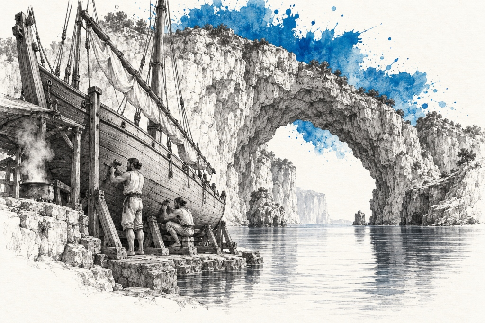
- **Biome & Location**: A secluded tidal lagoon protected by jagged limestone reefs and sea arches.
- **Lore & Functions**: The secluded anchorage where independent sailors repair storm damage and careen vessels. A sheltered saltwater lagoon framed by a monumental limestone sea arch. A single wooden sloop rests cleanly on timber dry-dock cradles beside the stone shelf for hull maintenance; a single iron pitch-kettle with a gentle plume of white smoke sits on a stone plinth. Exactly two Merryn shipwrights in canvas work breeches and bare feet caulk an oak hull seam with a wooden mallet and chisel in natural perspective scale.
```text
Wide-angle architectural concept art sketch of the Pelican-Gut Anchorage lagoon, in FULL CRISP FOCUS. Style: 1995 video game concept art by Samwise Didier, Always Be Chunky (ABC). Hand-drawn rough black charcoal and gritty graphite pencil draft linework with bold maritime contours and gritty cross-hatching on clean off-white watercolor paper with vast open negative space. STYLIZED CONCEPT ART, NOT PHOTOREALISTIC, NOT A SMOOTH DIGITAL PAINTING: Chunky timber supports, bold rough rock contours, visible raw draft pencil marks. STRICTLY PURE BLACK CHARCOAL AND GRAPHITE PENCIL DRAWING ONLY: 100% monochrome grayscale for all rock, timber, boat hulls, figures, and water. ABSOLUTELY ZERO color tints, no sepia, no brown tones, no blue-tinted shadows, no colored lighting. NO GIANT FOREGROUND FIGURE; FULL LAGOON PERSPECTIVE. RADICALLY DE-CLUTTERED, SENSIBLE SHIPWRIGHT SCENE: A clean, coherent repair cove that makes structural and mechanical sense; strictly NO scattered junk, NO loose debris, NO piles of discarded tools on the beach. Focal Architecture & Setting: A secluded saltwater lagoon framed by a monumental natural limestone sea arch. A single wooden sloop rests neatly propped up on sturdy timber cradle supports beside a stone ledge for hull repair; a single iron pitch-kettle vents a clean plume of white smoke. In-Scale Citizens: Exactly two Merryn shipwrights in canvas work breeches and bare calloused feet caulking an oak hull seam with a wooden mallet and chisel in natural architectural scale. Setting: Towering limestone sea cliff arches and open lagoon water fading softly into clean off-white parchment. Accent: Single dynamic explosive watercolor splash in deep wave indigo (#0369a1) blooming behind the limestone sea arch with fluid paint splatters. Pure isolated sketch, no borders, no frames.
```

### 👤 Part B: Notable & Legendary Figures (5 Figures)

#### ✅ 1. Captain Maren the Drift-Born (Commodore of the Shanty Fleet) [GENERATED]

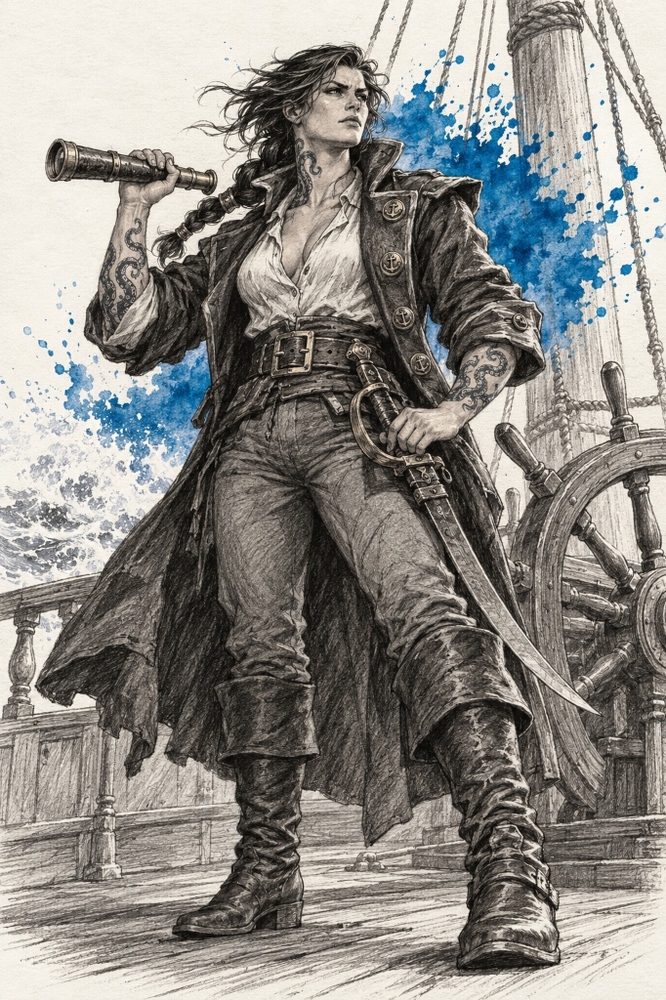
- **Lore Backstory**: Born at sea during a hurricane, Captain Maren has sailed every ocean in the known world. She unified the squabbling whaler crews into a mutual defense fleet and commands from her flagship.
```text
Single character concept art sketch of EXACTLY ONE Legendary Female Merryn Captain, Maren the Drift-Born. Style: 1995 video game fantasy concept art by Samwise Didier, Always Be Chunky (ABC). Hand-drawn rough black charcoal and gritty graphite pencil draft linework with bold heroic contours and gritty cross-hatching, isolated on clean off-white watercolor sketchbook paper. STYLIZED EXPRESSIVE CONCEPT ART, NOT PHOTOREALISTIC, NOT AN ACADEMIC PORTRAIT, NOT A SMOOTH DIGITAL PAINTING: Exaggerated heroic fantasy proportions, chunky muscular contours, heavy bold charcoal outlines, visible raw sketchbook pencil hatching. STRICTLY PURE BLACK CHARCOAL AND GRAPHITE PENCIL DRAWING ONLY: 100% monochrome grayscale for character, skin, hair, coat, boots, and weapons. ABSOLUTELY ZERO color tints, no sepia, no brown leather tones, no flesh tones, no colored lighting. STRICTLY NO TEXT, NO LETTERS, NO WORDS, NO LABELS, NO SIGNATURES, NO WATERMARKS. ABSOLUTE PROHIBITION ON MULTIPLE FIGURES: RENDER EXACTLY ONE SINGLE HEROIC FIGURE IN A COMMANDING QUARTERDECK STANCE. RADICALLY DE-CLUTTERED HEROIC COMPOSITION: Clean, commanding silhouette with vast breathable negative space; strictly NO loose clutter or unnecessary props. Canonical Anatomy: Tall, broad-shouldered, athletic human mariner with stylized heroic proportions, handsome square jawline, piercing sea-eyes squinting into ocean wind, windswept dark hair tied in a warrior sailor plait with brass rings, dark indigo kraken tattoos coiling around her neck and forearms. Attire: Heavy tailored oilcloth captain's coat with brass anchor buttons, coarse linen shirt open at the throat, wide leather belt with heavy brass buckle, tall sea-boots. Gear: Resting one hand on the pommel of a curved steel boarding cutlass at her hip, holding an antique brass collapsible spyglass in the other. Setting & Background: Clean quarterdeck of her flagship sketched in rough graphite linework—sturdy wooden deck planks, ship's wheel, clean mast rigging lines fading softly into off-white parchment, sea spray flurries. Accent: Single dynamic explosive watercolor splash in deep wave indigo (#0369a1) blooming behind the captain with fluid paint splatters. Pure sketchbook draft page, no formal borders or frames.
```

#### 2. Harpooner Bran the Wave-Cleaver (Master of the Iron Gaff)
- **Lore Backstory**: Elite deep-sea hunter whose incredible strength allows him to wrestle monstrous sea predators directly onto boat decks using only a barbed gaff hook and brute will.
```text
Single character concept art sketch of EXACTLY ONE Male Merryn Harpooner, Bran. Style: 1995 video game fantasy concept art by Samwise Didier, Always Be Chunky (ABC). Hand-drawn rough black charcoal and gritty graphite pencil draft linework with muscular bulky contours and gritty cross-hatching, isolated on clean off-white watercolor sketchbook paper. STYLIZED EXPRESSIVE CONCEPT ART, NOT PHOTOREALISTIC, NOT AN ACADEMIC PORTRAIT, NOT A SMOOTH DIGITAL PAINTING: Exaggerated heroic fantasy proportions, chunky colossal musculature, heavy bold charcoal outlines, visible raw sketchbook pencil hatching. STRICTLY PURE BLACK CHARCOAL AND GRAPHITE PENCIL DRAWING ONLY: 100% monochrome grayscale for character, skin, hair, breeches, boots, and weapon. ABSOLUTELY ZERO color tints, no sepia, no brown leather tones, no flesh tones, no colored lighting. STRICTLY NO TEXT, NO LETTERS, NO WORDS, NO LABELS, NO SIGNATURES, NO WATERMARKS. ABSOLUTE PROHIBITION ON MULTIPLE FIGURES: RENDER EXACTLY ONE SINGLE HEROIC FIGURE IN A READY COMBAT POSE. RADICALLY DE-CLUTTERED HEROIC COMPOSITION: Colossal powerful silhouette with vast breathable negative space; strictly NO loose clutter or unnecessary props. Canonical Anatomy: Colossal, barrel-chested human mariner with thick muscular neck, squared jaw, short cropped dark hair, stylized Samwise Didier chunky proportions, dark indigo kraken and wave tattoos coiling across broad chest and forearms. Attire: Waxed heavy canvas breeches tied with a thick hemp rope belt, cross-body leather harness holding bait-sheaths, heavy spiked sea-boots. Gear: Poising a heavy barbed iron whaling gaff hook with both hands in a ready athletic stance. Setting & Background: Clean wooden prow of a whaleboat sketched in rough graphite linework, single coiled hemp rope tub, churning ocean swells and sea spray fading softly into clean off-white parchment. Accent: Single dynamic explosive watercolor splash in deep wave indigo (#0369a1) blooming behind the hunter with fluid paint splatters. Pure sketchbook draft page, no formal borders or frames.
```

#### 3. Old Salty Vane (The Scrimshaw Storyteller)
- **Lore Backstory**: The oldest living whaler in Drift-Anchor Haven. He has survived three shipwrecks and spends his days carving elaborate naval battles into sperm-whale teeth while singing traditional sea shanties.
```text
Single character concept art sketch of EXACTLY ONE Veteran Male Merryn Sailor, Old Salty Vane. Style: 1995 fantasy concept art in the style of Samwise Didier. Hand-drawn rough black charcoal and graphite draft linework with deeply weathered contours and gritty cross-hatching, isolated on clean off-white watercolor sketchbook paper. STRICTLY MONOCHROMATIC CHARACTER & GEAR: No color fills on character or tools. STRICTLY NO TEXT, NO LETTERS, NO WORDS, NO LABELS, NO SIGNATURES, NO WATERMARKS. ABSOLUTE PROHIBITION ON MULTIPLE FIGURES: RENDER EXACTLY ONE SINGLE HEROIC FIGURE IN A SEATED SCRIMSHAW POSE. Canonical Anatomy: Gnarled, heavily muscled elderly human sailor with sun-scorched wrinkled skin, bushy white beard, humorous squinting sea-eyes, intricate compass rose tattoos on his calloused forearms. Attire: Ribbed wool knit sailor cap, frayed wool sweater, patched canvas sea-trousers, bare weathered leathery sailor feet. Gear: Holding a curved bone-carving knife in one hand, carefully inscribing an ocean wave pattern onto a polished sperm-whale tooth held in his lap. Setting & Crude Background: Seen in his element seated on a weathered wooden pier bench in Drift-Anchor Haven with crude, hand-drawn 1995 Samwise Didier draft style background scenery sketched in rough graphite linework and gritty cross-hatching—barnacle-crusted harbor pilings, tied-up dories bobbing in the tide, drying fishing nets on timber poles, and tavern porches with swinging anchor signs. Loosely vignetted sketch background. Accent: Single dynamic explosive watercolor splash in wave indigo (#0369a1) blooming behind the sailor with fluid paint splatters. Pure sketchbook draft page, no formal borders or frames.
```

#### 4. Cordelia Tattoo-Weaver (Mistress of the Blue Ink)
- **Lore Backstory**: Master tattoo artisan of Drift-Anchor Haven whose indigo sea-tattoos are believed by sailors to grant protection against drowning and ward off giant krakens in the deep.
```text
Single character concept art sketch of EXACTLY ONE Female Merryn Tattooist, Cordelia. Style: 1995 fantasy concept art in the style of Samwise Didier. Hand-drawn rough black charcoal and graphite draft linework with expressive artistic contours and gritty cross-hatching, isolated on clean off-white watercolor sketchbook paper. STRICTLY MONOCHROMATIC CHARACTER & GEAR: No color fills on character or ink. STRICTLY NO TEXT, NO LETTERS, NO WORDS, NO LABELS, NO SIGNATURES, NO WATERMARKS. ABSOLUTE PROHIBITION ON MULTIPLE FIGURES: RENDER EXACTLY ONE SINGLE HEROIC FIGURE IN A CRAFTING STANCE. Canonical Anatomy: Lean, striking human woman with sharp facial features, intense gaze, raven hair woven with shark teeth, her own skin covered in flowing geometric waves and tidal glyph tattoos. Attire: Sleeveless leather vest, linen wraps around arms, wide split canvas breeches, bare dexterous feet. Gear: Holding a bone tattooing needle and a small pot of dark squid-ink, examining a scroll of ancestral maritime tattoo flash. Setting & Crude Background: Seen in his element inside a cozy driftwood shanty tattoo parlor with crude, hand-drawn 1995 Samwise Didier draft style background scenery sketched in rough graphite linework and gritty cross-hatching—hanging strings of dried shark-teeth, unrolled parchment sheets of kraken tattoo flash, glass bottles of dark squid-ink, and lantern light flickering on plank walls. Loosely vignetted sketch background. Accent: Dynamic explosive watercolor splash in wave indigo (#0369a1) blooming behind the artisan with fluid paint splatters. Pure sketchbook draft page, no formal borders or frames.
```

#### 5. Sister Isla of the Swell (Priestess of the Tidal Drift)
- **Lore Backstory**: Spiritual leader who blesses newly christened vessels and conducts burial-at-sea rites, scattering drift-flowers onto the waves to guide drowned sailors' spirits to the quiet deep.
```text
Single character concept art sketch of EXACTLY ONE Female Merryn Priestess, Sister Isla. Style: 1995 fantasy concept art in the style of Samwise Didier. Hand-drawn rough black charcoal and graphite draft linework with flowing contours and gritty cross-hatching, isolated on clean off-white watercolor sketchbook paper. STRICTLY MONOCHROMATIC CHARACTER & GEAR: No color fills on character or robe. STRICTLY NO TEXT, NO LETTERS, NO WORDS, NO LABELS, NO SIGNATURES, NO WATERMARKS. ABSOLUTE PROHIBITION ON MULTIPLE FIGURES: RENDER EXACTLY ONE SINGLE HEROIC FIGURE IN A BLESSING POSE. Canonical Anatomy: Serene, tall human woman with wise sea-green eyes, gentle noble features, silver-streaked dark hair cascading freely in ocean breeze. Attire: Flowing robes made from pale bleached sailcloth adorned with cowrie shell hems, braided kelp rope belt, bare feet standing at water's edge. Gear: Holding a carved driftwood censer releasing fragrant dried sea-grass incense, holding her right hand raised in benediction. Setting & Crude Background: Seen in his element at the rocky tidal point of Drift-Anchor Haven with crude, hand-drawn 1995 Samwise Didier draft style background scenery sketched in rough graphite linework and gritty cross-hatching—wave-battered granite rocks, ocean spray washing over tide pools, drift-flowers floating on the surf, and distant ship masts silhouetted against sea mist. Loosely vignetted sketch background. Accent: Dynamic explosive watercolor splash in wave indigo (#0369a1) blooming behind the priestess with fluid paint splatters. Pure sketchbook draft page, no formal borders or frames.
```

---

### ☀️ 5. Ordan Human (Desert Gold `#ca8a04`)
*Canonical Anatomical Lock*: Agile, sun-bronzed, wind-hardened steppe nomads, falconers, and camel-caravaneers. Lean, sinewy, athletic horseman physiques adapted to vast open grasslands and scorching sun. Sun-blackened skin, sharp angular cheekbones, narrow dark amber eyes squinting against desert dust storms, dark hair braided with brass tubes and eagle feathers. Attire: Layered felt and silk riding caftans (deel) bound with embroidered silk sashes, pointed fur-trimmed hats or headwraps, high curved-toe soft riding boots. Armed with recurve composite horse-bows, curved cavalry sabers, lasso ropes, and hunting falcons perched on heavy leather gauntlets.

### 👤 Part 0: Dedicated Canonical Racial Portrait (1 Prompt)

#### ✅ 0. Canonical Ordan Racial Portrait (De-Cluttered Bust) [GENERATED]

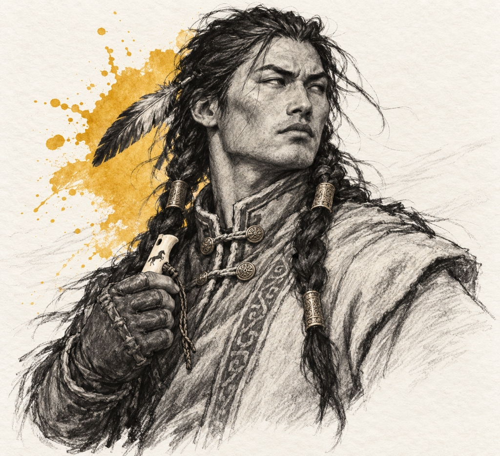
- **Role & Face**: Steppe Horse-Archer & Falconer (Upper-Torso Bust). Agile, athletic human nomad in late 20s. Sharp high cheekbones, sun-darkened skin, alert dark almond eyes squinting against prairie glare, raven hair in twin warrior braids bound with brass tubes and an eagle feather.
- **Attire & Gear**: Layered wool felt and silk-lined deel caftan with brass collar clasps; one leather-gauntleted hand raised near chest holding a polished bone horse-whistle.
- **De-Clutter Strategy**: Clean upper bust, expansive off-white negative space, minimal props, crisp linework.
```text
De-cluttered character concept art sketch of EXACTLY ONE Ordan Human Steppe-Nomad, upper-torso bust portrait with vast breathable negative space. Style: 1995 video game fantasy concept art by Samwise Didier, Always Be Chunky (ABC). Hand-drawn rough black charcoal and gritty graphite pencil draft linework on clean off-white watercolor sketchbook paper. STYLIZED EXPRESSIVE CONCEPT ART, NOT PHOTOREALISTIC, NOT AN ACADEMIC PORTRAIT, NOT A SMOOTH DIGITAL PAINTING: Exaggerated heroic fantasy proportions, chunky muscular contours, heavy bold charcoal outlines, visible raw sketchbook pencil hatching. STRICTLY PURE BLACK CHARCOAL AND GRAPHITE PENCIL DRAWING ONLY: 100% monochrome grayscale for character, skin, hair, deel caftan, gauntlet, and whistle. ABSOLUTELY ZERO color tints, no sepia, no brown leather tones, no flesh tones, no colored lighting. RADICALLY MINIMALIST AND DE-CLUTTERED: Absolutely zero loose props, zero flying debris, zero distracting background clutter. Distinctive Face & Anatomy: Agile human nomad in late 20s with sharp high cheekbones, sun-etched squinting dark almond eyes, and raven hair woven in twin warrior braids secured with brass tubes and a single eagle feather. Hands & Gear: One leather-gauntleted hand raised near the chest holding a polished bone horse-whistle. Attire: Traditional layered wool felt and silk-trimmed deel caftan fastened with brass clasp buttons at the high collar. Background: Clean sketchbook parchment with ample breathing room, faint graphite prairie wind contours fading cleanly into the paper. Accent: Single dynamic accent watercolor splash in radiant desert gold (#ca8a04) blooming softly behind the head and shoulder with fluid paint droplets. Pure sketch, no borders, no frames.
```

### 🏛️ Part A: Important Buildings & Locations (3 Prompts)

#### ✅ 1. Khagan-Gora (The Great Ring of Yurts — The Sovereign Capital) [GENERATED]

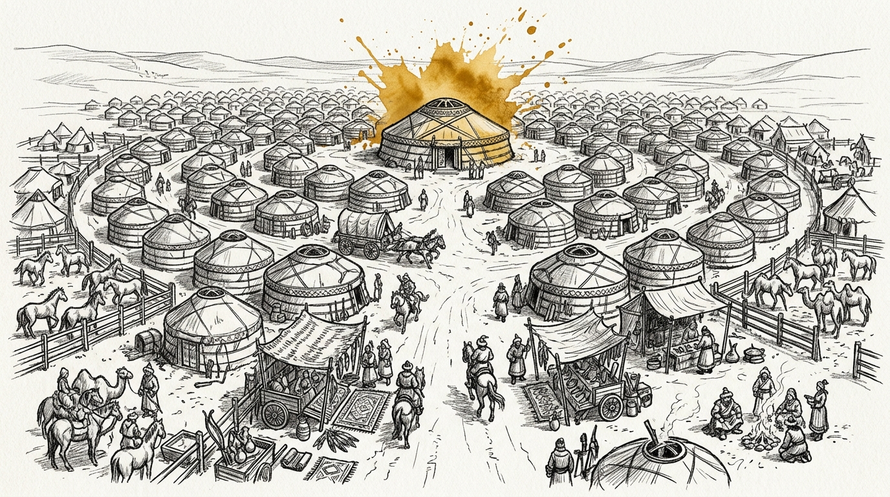
- **Biome & Location**: The endless golden grassland steppe of Sundrift Vale.
- **Lore & Functions**: The nomadic tent-capital of the Ordan. Over a thousand large circular felt yurts (ger) arranged in concentric rings around the monumental Golden Pavilion of the Khan. Massive wooden horse-corrals and camel pens surround the perimeter. The outer lanes form the Steppe Bazaar where nomads trade woven saddle blankets, fermented mare’s milk (airag), dried mutton, brass horse bits, and composite bows.
```text
Wide-angle architectural concept art sketch looking directly into the vast nomadic circle-city of Khagan-Gora, sovereign tent-capital of the Ordan Humans, in FULL CRISP FOCUS. Style: 1995 Warcraft fantasy concept art in the style of Samwise Didier, Always Be Chunky (ABC). Hand-drawn rough black charcoal and graphite draft linework with sweeping steppe perspective and gritty cross-hatching, isolated on clean off-white watercolor sketchbook paper. STRICTLY MONOCHROMATIC ARCHITECTURE & ENVIRONMENT: No color fills on characters or architecture. STRICTLY NO TEXT, NO LETTERS, NO WORDS, NO LABELS, NO SIGNATURES, NO WATERMARKS. NO GIANT OVERSIZED FOREGROUND PORTRAIT; FULL STEPPE CAMP PERSPECTIVE. Architectural & Nomadic Focus: A colossal circular tent-metropolis constructed from hundreds of white-and-ochre felt yurts (ger) framed with lattice timber and crowned with carved wooden roof rings. Traversal: Broad unpaved dirt thoroughfares radiating out from the center, horse-drawn wheeled wagon-tents (kibitkas), and galloping courier riders on shaggy steppe horses. Commerce & Markets: The Great Steppe Bazaar along the outer ring—nomads under woven goat-hair sunshades bartering intricately woven woolen rugs, bundles of eagle feathers, leather flasks of mare's milk, polished brass stirrups, and horn-backed composite bows from wooden carts. Herds & Forges: Enormous timber horse corrals with herds of spirited steeds, camel lines kneeling beside water troughs, and open-air nomadic bronze forges. In-Scale Citizens: Ordan horsemen, falconers, and herd-women (layered riding caftans, embroidered silk sashes, fur-trimmed pointed hats, curved riding boots, horse-bows) trading, saddling mounts, and gathering around campfires in natural architectural scale. Accent: Single dynamic explosive watercolor splash in radiant desert gold (#ca8a04) blooming behind the central Golden Pavilion yurt with fluid paint splatters. Pure isolated sketch, no borders, no frames.
```

#### ✅ 2. The Sun-Dial Astrolabe Pavilion (The Steppe Observatory) [GENERATED]

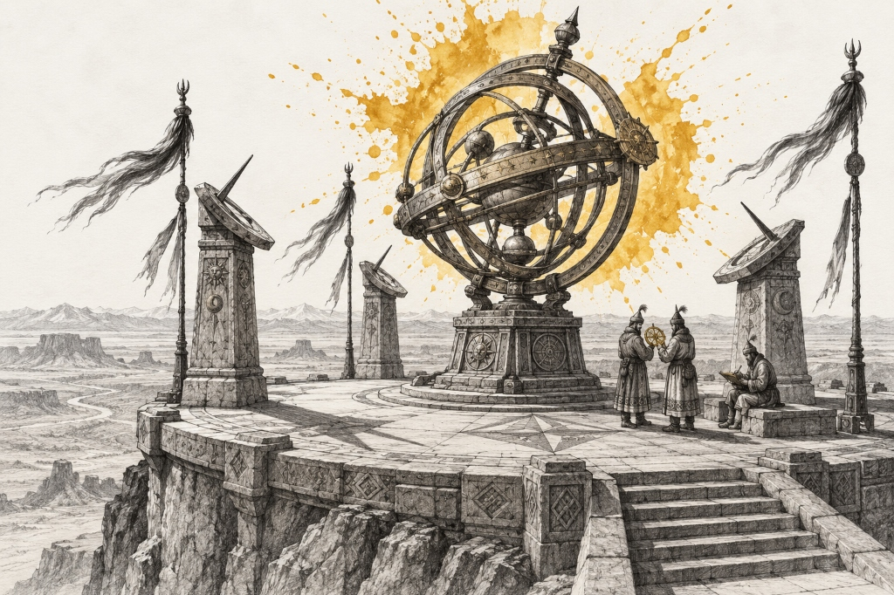
- **Biome & Location**: A natural limestone mesa rising above the flat grassland sea.
- **Lore & Functions**: The sacred astrological site where shamans and star-gazers track migration seasons and planetary alignments. A monumental circular stone platform atop a high mesa overlooking sweeping horizons. A colossal rotating bronze armillary sphere stands in the center with nested rings, surrounded by carved granite sundial pillars casting sharp shadows. Exactly two Ordan star-watchers in felt robes examine a handheld brass astrolabe, while a scribe records sky charts on a wooden slate in natural perspective scale.
```text
Wide-angle architectural concept art sketch of the Sun-Dial Astrolabe Pavilion atop the mesa in Sundrift Vale, in FULL CRISP FOCUS. Style: 1995 video game concept art by Samwise Didier, Always Be Chunky (ABC). Hand-drawn rough black charcoal and gritty graphite pencil draft linework with bold structural contours and gritty cross-hatching on clean off-white watercolor paper with vast open negative space. STYLIZED CONCEPT ART, NOT PHOTOREALISTIC, NOT A SMOOTH DIGITAL PAINTING: Chunky carved stone pillars, bold bronze gear rings, visible raw draft pencil marks. STRICTLY PURE BLACK CHARCOAL AND GRAPHITE PENCIL DRAWING ONLY: 100% monochrome grayscale for all architecture, stone, bronze mechanisms, figures, and clothing. ABSOLUTELY ZERO color tints, no sepia, no brown tones, no colored lighting. NO GIANT FOREGROUND FIGURE; FULL CELESTIAL PAVILION PERSPECTIVE. RADICALLY DE-CLUTTERED, LOGICAL OBSERVATORY SCENE: A clean, sensible mesa platform that makes astronomical and architectural sense; strictly NO scattered debris, NO loose tools, NO messy clutter on the stone floor. Focal Architecture: A monumental circular granite platform built atop a sheer desert mesa overlooking vast open steppe horizons. A colossal rotating bronze armillary sphere stands majestically as the primary centerpiece, flanked by three clean carved sundial pillars casting sharp shadows and tall horse-tail prayer poles fluttering in the wind. In-Scale Citizens: Exactly two Ordan star-watchers in embroidered felt caftans calmly examining a handheld brass astrolabe, while one scribe records notes on a wooden slate in natural environmental scale. Setting: Clean stone platform edge, endless prairie horizon, and open sky fading softly into clean off-white parchment. Accent: Single dynamic explosive watercolor splash in radiant desert gold (#ca8a04) blooming behind the central armillary sphere with fluid paint splatters. Pure isolated sketch, no borders, no frames.
```

#### ✅ 3. Wind-Gap Caravanserai (The Steppe Crossroads Bazaar) [GENERATED]

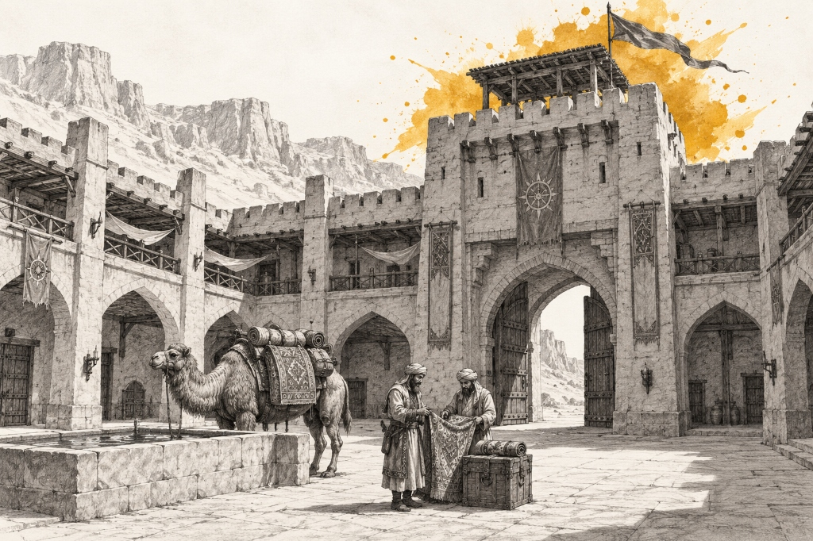
- **Biome & Location**: A natural canyon pass where mountain trade routes enter the open plains.
- **Lore & Functions**: The fortified stone and adobe caravanserai where desert camel trains meet mountain pack-mules. Sturdy mud-brick walls protect against sandstorms. A grand central arched gateway leads into a wide cobblestone courtyard. A single two-humped Bactrian camel loaded with carpet bales kneels calmly beside a carved stone water trough. Exactly two Ordan caravaneers in travel caftans inspect a woven saddle blanket beside an iron-banded chest, while a clerk checks weights.
```text
Wide-angle architectural concept art sketch looking into the courtyard of the Wind-Gap Caravanserai, in FULL CRISP FOCUS. Style: 1995 video game concept art by Samwise Didier, Always Be Chunky (ABC). Hand-drawn rough black charcoal and gritty graphite pencil draft linework with bold mud-brick masonry and gritty cross-hatching on clean off-white watercolor paper with vast open negative space. STYLIZED CONCEPT ART, NOT PHOTOREALISTIC, NOT A SMOOTH DIGITAL PAINTING: Chunky architectural archways, heavy timber gates, visible raw draft pencil marks. STRICTLY PURE BLACK CHARCOAL AND GRAPHITE PENCIL DRAWING ONLY: 100% monochrome grayscale for all walls, stone, camel, figures, clothing, and packs. ABSOLUTELY ZERO color tints, no sepia, no brown tones, no colored lighting. NO GIANT FOREGROUND FIGURE; FULL COURTYARD PERSPECTIVE. RADICALLY DE-CLUTTERED, SENSIBLE CARAVAN SCENE: A clean, orderly trading post that makes structural and functional sense; strictly NO loose debris, NO piles of scattered trash, NO messy heaps of disorganized cargo. Focal Architecture & Setting: A fortified quadrangular desert caravanserai built of thick rammed-earth and sun-baked brick walls with a grand arched gatehouse. In the clean central courtyard, a single noble two-humped Bactrian camel loaded with neat carpet rolls rests calmly beside a stone water trough. In-Scale Citizens: Exactly two Ordan caravaneers in travel caftans and turbans inspecting a woven saddle blanket beside an iron-bound cargo chest in natural architectural scale. Setting: Rammed-earth battlements and open desert canyon breeze fading softly into clean off-white parchment. Accent: Single dynamic explosive watercolor splash in warm desert gold (#ca8a04) blooming behind the gatehouse watchtower with fluid paint splatters. Pure isolated sketch, no borders, no frames.
```

### 👤 Part B: Notable & Legendary Figures (5 Figures)

#### ✅ 1. Ordan Khan (The Wind-Singer — Supreme Warlord of the Steppe) [GENERATED]

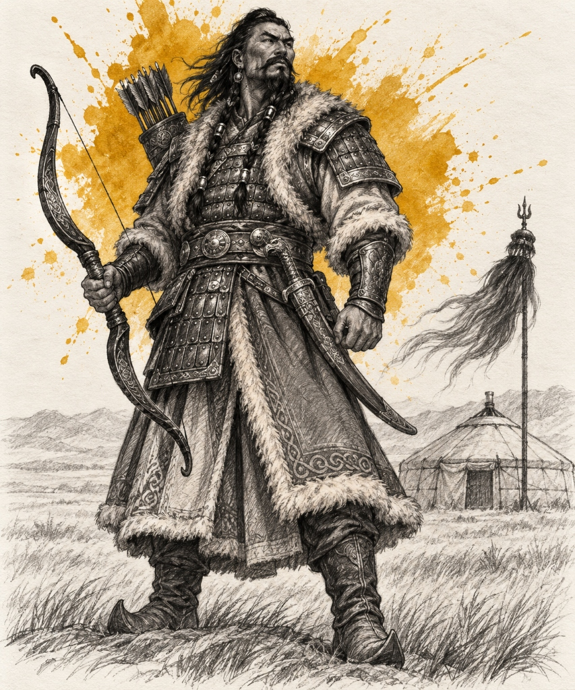
- **Lore Backstory**: Legendary unifier of the forty nomadic clans. Renowned for his supernatural mastery of horse archery, able to strike a galloping enemy in the eye at three hundred paces while singing the sacred wind-ballad.
```text
Single character concept art sketch of EXACTLY ONE Legendary Male Ordan Warlord, Ordan Khan. Style: 1995 video game fantasy concept art by Samwise Didier, Always Be Chunky (ABC). Hand-drawn rough black charcoal and gritty graphite pencil draft linework with bold heroic contours and gritty cross-hatching, isolated on clean off-white watercolor sketchbook paper. STYLIZED EXPRESSIVE CONCEPT ART, NOT PHOTOREALISTIC, NOT AN ACADEMIC PORTRAIT, NOT A SMOOTH DIGITAL PAINTING: Exaggerated heroic fantasy proportions, chunky muscular contours, heavy bold charcoal outlines, visible raw sketchbook pencil hatching. STRICTLY PURE BLACK CHARCOAL AND GRAPHITE PENCIL DRAWING ONLY: 100% monochrome grayscale for character, skin, hair, deel caftan, armor, boots, and weapons. ABSOLUTELY ZERO color tints, no sepia, no brown leather tones, no flesh tones, no colored lighting. STRICTLY NO TEXT, NO LETTERS, NO WORDS, NO LABELS, NO SIGNATURES, NO WATERMARKS. ABSOLUTE PROHIBITION ON MULTIPLE FIGURES: RENDER EXACTLY ONE SINGLE HEROIC FIGURE IN A COMMANDING STEPPE POSE. RADICALLY DE-CLUTTERED HEROIC COMPOSITION: Clean, commanding silhouette with vast breathable negative space; strictly NO loose clutter or unnecessary props. Canonical Anatomy: Broad-shouldered, athletic, sinewy human warlord with weather-darkened skin, proud high cheekbones, fierce dark almond eyes, long black mustache and braided beard adorned with silver rings. Attire: Ornate silk-lined felt caftan (deel) with fur trim bound by an embroidered sash with brass plaques, lamellar hardened-leather brigandine armor, curved-toe leather riding boots. Gear: Holding an exquisite horn-backed composite recurve bow in one hand, a carved eagle-headed cavalry saber sheathed at his hip, an embossed leather quiver filled with arrows slung at his back. Setting & Background: Sweeping steppe plains sketched in rough graphite linework—a single conical felt yurt (ger) in the background with a horse-tail war banner fluttering in the wind, prairie grass fading softly into clean off-white parchment. Accent: Single dynamic explosive watercolor splash in radiant desert gold (#ca8a04) blooming behind the warlord with fluid paint splatters. Pure sketchbook draft page, no formal borders or frames.
```

#### ✅ 2. Keshik Bato the Eagle-Eye (Champion Falconer of the Khan) [GENERATED]

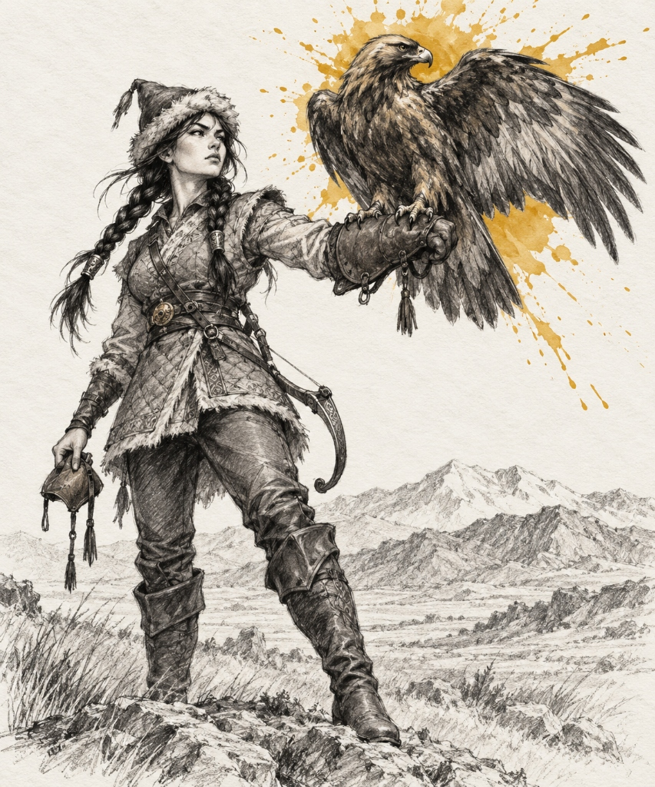
- **Lore Backstory**: Master huntress whose trained golden eagles can take down full-grown steppe wolves. She leads the advance scouting riders who scout three days ahead of the main yurt migration.
```text
Single character concept art sketch of EXACTLY ONE Female Ordan Falconer, Keshik Bato. Style: 1995 video game fantasy concept art by Samwise Didier, Always Be Chunky (ABC). Hand-drawn rough black charcoal and gritty graphite pencil draft linework with agile sharp contours and gritty cross-hatching, isolated on clean off-white watercolor sketchbook paper. STYLIZED EXPRESSIVE CONCEPT ART, NOT PHOTOREALISTIC, NOT AN ACADEMIC PORTRAIT, NOT A SMOOTH DIGITAL PAINTING: Exaggerated heroic fantasy proportions, chunky agile athletic contours, heavy bold charcoal outlines, visible raw sketchbook pencil hatching. STRICTLY PURE BLACK CHARCOAL AND GRAPHITE PENCIL DRAWING ONLY: 100% monochrome grayscale for character, skin, hair, bird, tunic, boots, and bow. ABSOLUTELY ZERO color tints, no sepia, no brown leather tones, no flesh tones, no colored lighting. STRICTLY NO TEXT, NO LETTERS, NO WORDS, NO LABELS, NO SIGNATURES, NO WATERMARKS. ABSOLUTE PROHIBITION ON MULTIPLE FIGURES: RENDER EXACTLY ONE SINGLE HEROIC FIGURE IN A FALCONRY STANCE. RADICALLY DE-CLUTTERED HEROIC COMPOSITION: Agile, powerful silhouette with vast breathable negative space; strictly NO loose clutter or unnecessary props. Canonical Anatomy: Lean, wiry athletic human woman with sharp cheekbones, piercing dark eyes squinting with eagle-sharp focus, raven hair woven in twin side-braids secured with brass clasps. Attire: Fitted quilted riding tunic, leather trousers, pointed fur-trimmed cap, knee-high riding boots. Gear: Perching a massive hunting golden eagle on a heavy leather falconer's gauntlet held out from her chest, holding the bird's leather hood in her other hand, a short recurve bow slung at her side. Setting & Background: Rocky steppe foothills sketched in rough graphite linework—undulating prairie grass, distant mountain ridge fading softly into clean off-white parchment. Accent: Single dynamic explosive watercolor splash in radiant desert gold (#ca8a04) blooming behind the eagle with fluid paint splatters. Pure sketchbook draft page, no formal borders or frames.
```

#### 3. High Shaman Temur the Sky-Watcher (Voice of the Prairie Spirits)
- **Lore Backstory**: The venerable elder mystic who interprets the flights of eagles and the shifting directions of seasonal dust storms to guide the seasonal migration of the grand encampment.
```text
Single character concept art sketch of EXACTLY ONE Male Ordan Shaman, Temur. Style: 1995 fantasy concept art in the style of Samwise Didier. Hand-drawn rough black charcoal and graphite draft linework with expressive mystic cross-hatching, isolated on clean off-white watercolor sketchbook paper. STRICTLY MONOCHROMATIC CHARACTER & GEAR: No color fills on character or robes. STRICTLY NO TEXT, NO LETTERS, NO WORDS, NO LABELS, NO SIGNATURES, NO WATERMARKS. ABSOLUTE PROHIBITION ON MULTIPLE FIGURES: RENDER EXACTLY ONE SINGLE HEROIC FIGURE IN A RITUAL DRUMMING POSE. Canonical Anatomy: Venerable, wiry human elder with deeply lined sun-baked face, milky blind eye, serene knowing smile, grey hair braided with eagle feathers and brass bells. Attire: Heavy felt shamanic robe hung with hundreds of small bronze mirrors, animal bones, and silk streamers, soft leather riding boots. Gear: Holding a large circular hide-covered ritual shaman drum in one hand and a carved bone drum-beater in the other, striking a rhythm to the sky. Setting & Crude Background: Seen in his element atop the sacred mesa astrolabe pavilion in Sundrift Vale with crude, hand-drawn 1995 Samwise Didier draft style background scenery sketched in rough graphite linework and gritty cross-hatching—a massive rotating bronze armillary sphere, carved granite sundial pillars casting sharp shadows, prayer flags whipping in the gale, and vast open skies. Loosely vignetted sketch background. Accent: Single explosive watercolor splash in desert gold (#ca8a04) blooming behind the shaman with fluid paint splatters. Pure sketchbook draft page, no formal borders or frames.
```

#### 4. Suren the Steppe-Weaver (Master of the Felt Yurt)
- **Lore Backstory**: Master artisan whose waterproof felt covers and intricately embroidered yurt carpets are legendary for keeping nomad families warm through sub-zero winter blizzards.
```text
Single character concept art sketch of EXACTLY ONE Female Ordan Artisan, Suren. Style: 1995 fantasy concept art in the style of Samwise Didier. Hand-drawn rough black charcoal and graphite draft linework with delicate cross-hatching, isolated on clean off-white watercolor sketchbook paper. STRICTLY MONOCHROMATIC CHARACTER & GEAR: No color fills on character or textiles. STRICTLY NO TEXT, NO LETTERS, NO WORDS, NO LABELS, NO SIGNATURES, NO WATERMARKS. ABSOLUTE PROHIBITION ON MULTIPLE FIGURES: RENDER EXACTLY ONE SINGLE HEROIC FIGURE IN A WEAVING POSE. Canonical Anatomy: Strong, dignified human woman with warm weather-tanned face, friendly laugh lines, hair bound beneath an embroidered headscarf. Attire: Practical layered wool deel coat with rolled sleeves, embroidered apron, soft leather boots. Gear: Working with an upright wooden rug loom, skillfully knotting vibrant wool yarn, holding a carved wooden weaving comb in her dexterous fingers. Setting & Crude Background: Seen in his element inside a spacious circular felt yurt with crude, hand-drawn 1995 Samwise Didier draft style background scenery sketched in rough graphite linework and gritty cross-hatching—timber lattice wall frames hung with embroidered felt carpets, an upright wooden carpet loom, central iron brazier with rising tea-smoke, and rolled saddle blankets. Loosely vignetted sketch background. Accent: Single explosive watercolor splash in warm desert gold (#ca8a04) blooming behind the loom with fluid paint splatters. Pure sketchbook draft page, no formal borders or frames.
```

#### 5. Yul the Camel-Master (Lord of the Wind-Bactrians)
- **Lore Backstory**: Veteran caravan leader who can navigate the trackless shifting sands by reading wind ripples on sand dunes. He commands a hundred-strong train of heavy pack camels.
```text
Single character concept art sketch of EXACTLY ONE Male Ordan Caravan Master, Yul. Style: 1995 Warcraft fantasy concept art in the style of Samwise Didier, Always Be Chunky (ABC). Hand-drawn rough black charcoal and graphite draft linework with sturdy weather-beaten contours and gritty cross-hatching, isolated on clean off-white watercolor sketchbook paper. STRICTLY MONOCHROMATIC CHARACTER & GEAR: No color fills on character or gear. STRICTLY NO TEXT, NO LETTERS, NO WORDS, NO LABELS, NO SIGNATURES, NO WATERMARKS. ABSOLUTE PROHIBITION ON MULTIPLE FIGURES: RENDER EXACTLY ONE SINGLE HEROIC FIGURE IN A CARAVAN STANCE. Canonical Anatomy: Burly, muscular human nomad with thick neck, heavy jaw, dark beard trimmed short, dust-streaked skin, piercing eyes shielded by a cloth desert wrap. Attire: Heavy wool traveling caftan with sheepskin lining, wide leather utility belt, durable riding boots. Gear: Holding a long camel-leading staff tipped with a brass bell in one hand and a coiled leather whip in the other, an unrolled route map tucked into his sash. Setting & Crude Background: Seen in his element in the bustling courtyard of Wind-Gap Caravanserai with crude, hand-drawn 1995 Samwise Didier draft style background scenery sketched in rough graphite linework and gritty cross-hatching—two-humped Bactrian pack camels loaded with wool bales kneeling beside stone troughs, adobe arches, striped merchant awnings, and dust swirling in the desert wind. Loosely vignetted sketch background. Accent: Dynamic explosive watercolor splash in desert gold (#ca8a04) blooming behind the caravan master with fluid paint splatters. Pure sketchbook draft page, no formal borders or frames.
```
