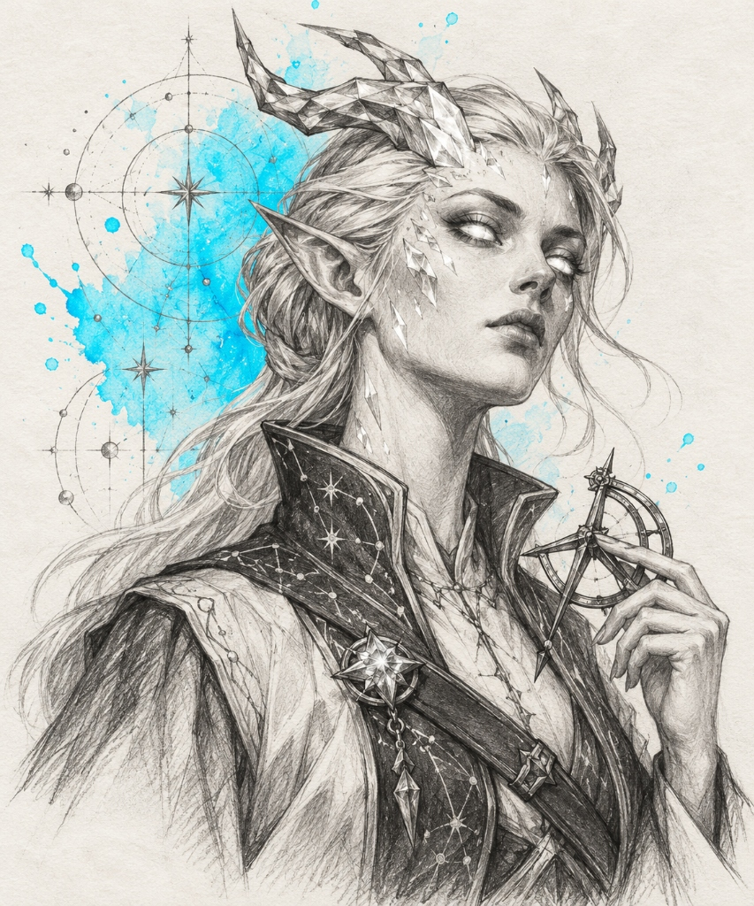
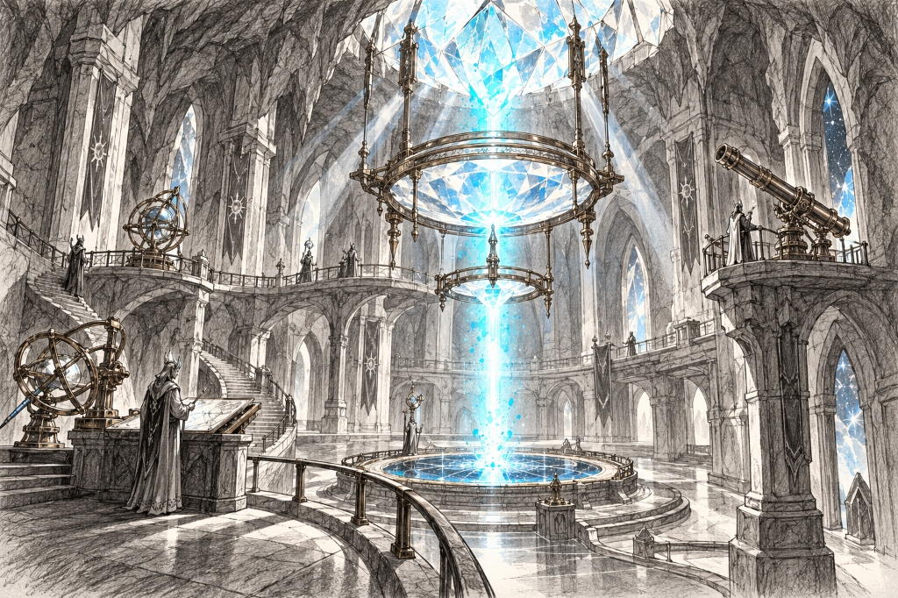
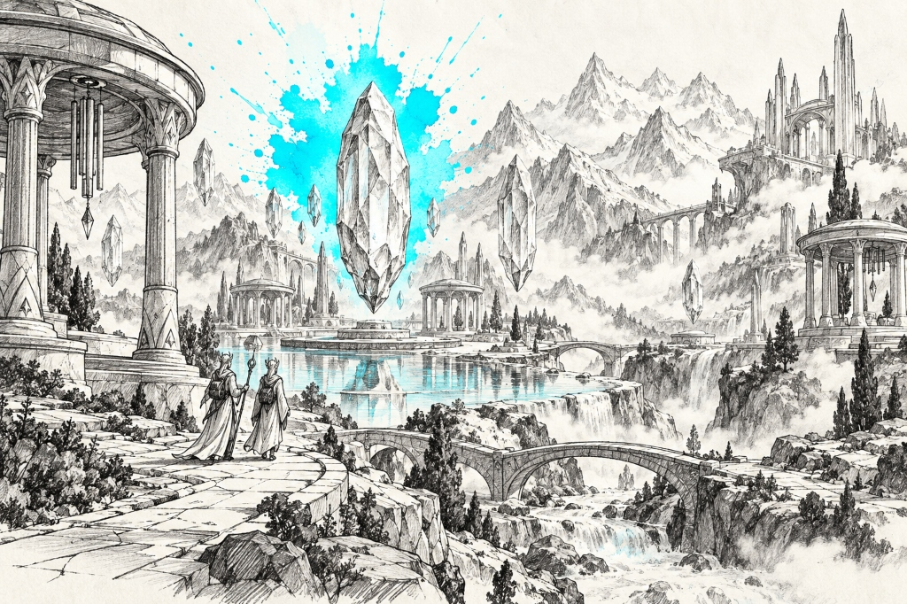
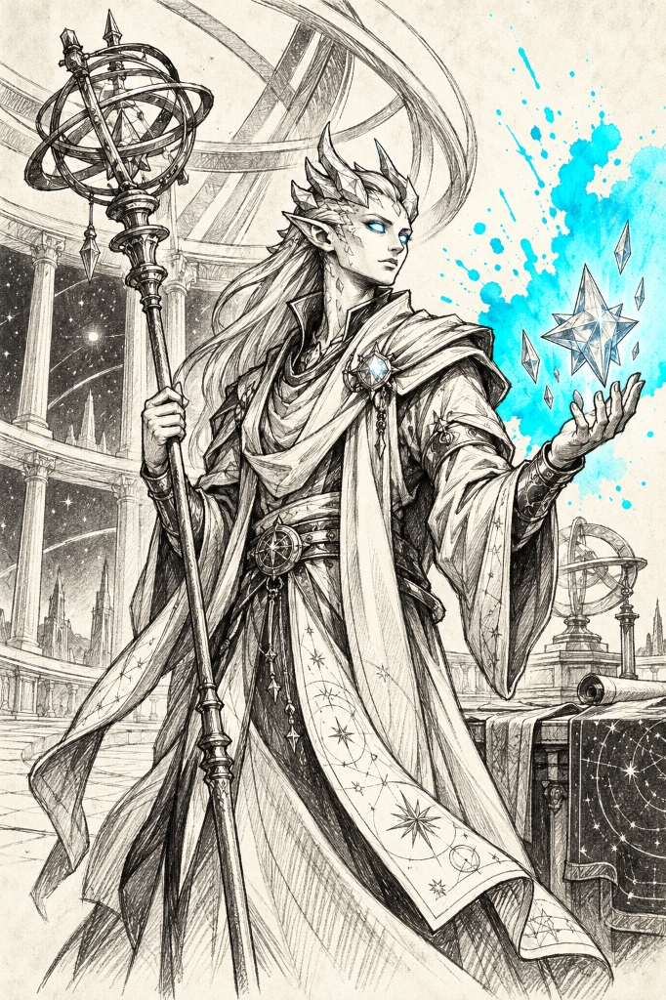
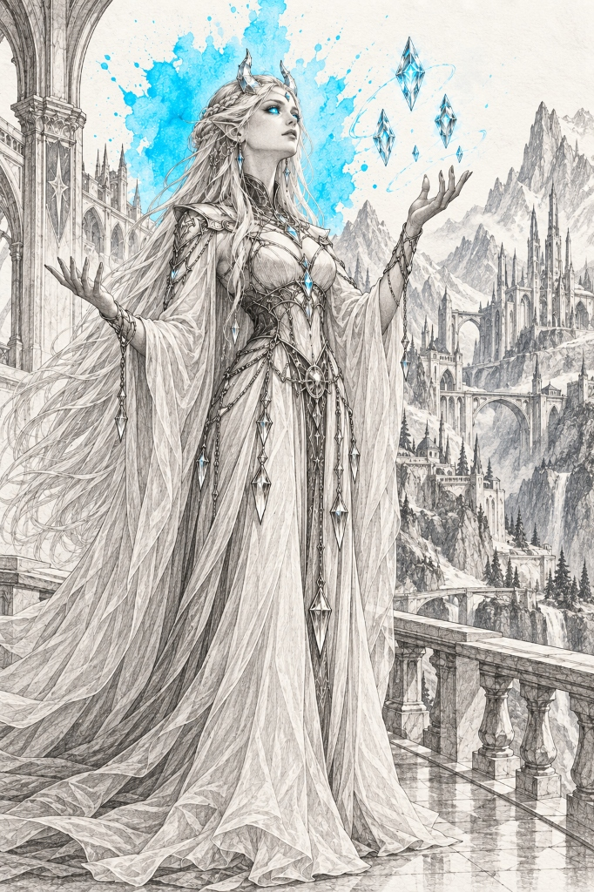
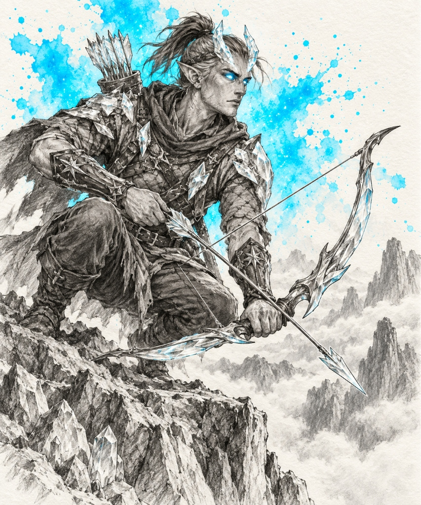
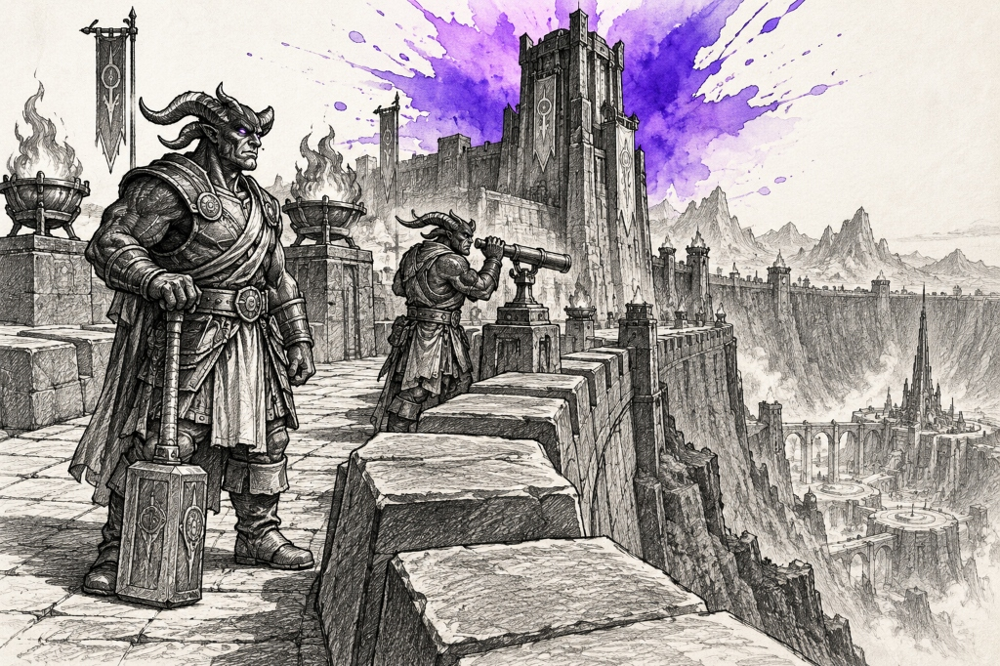
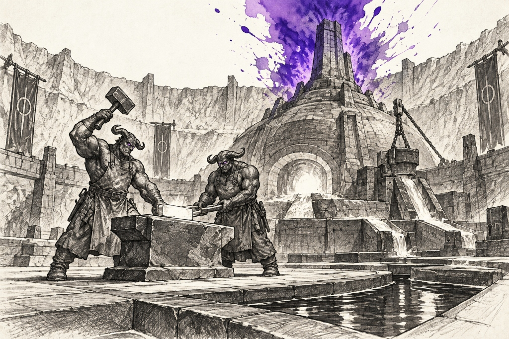
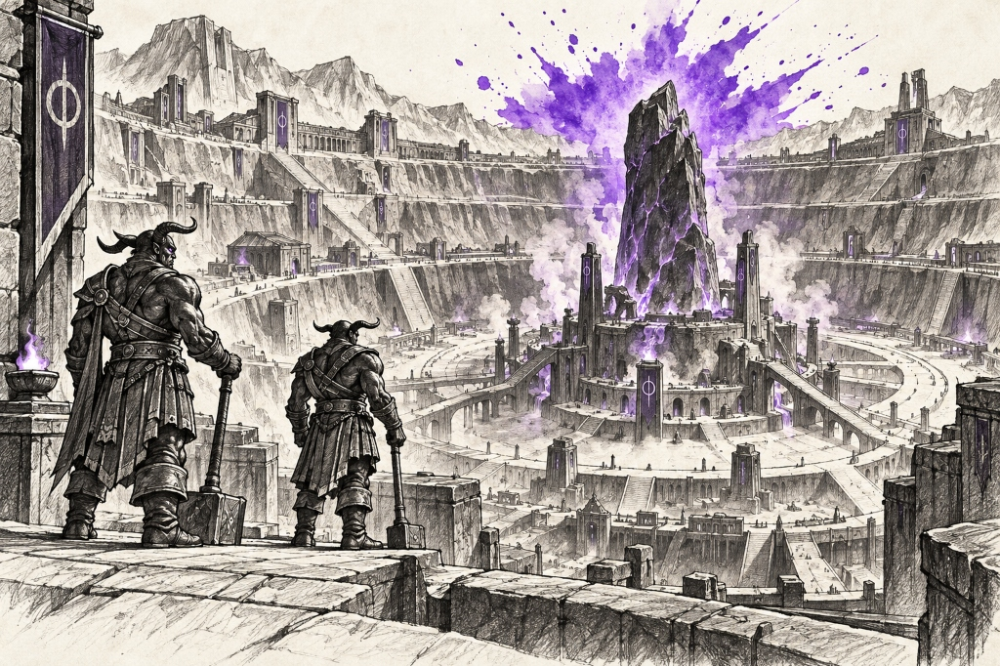
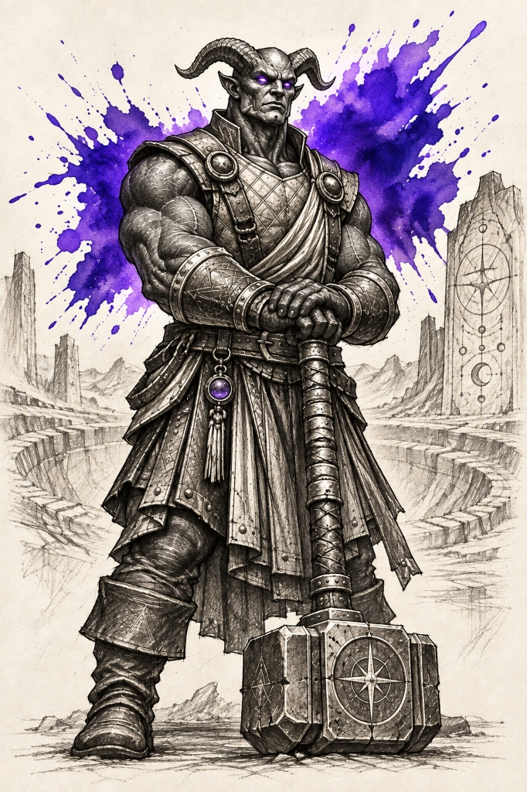

# Astril Subraces — Landmarks, Establishments & Notable Figures

> **Visual Directive**:
> - Style: 1995 Samwise Didier Concept Art (Always Be Chunky - ABC). Monochromatic rough charcoal and graphite draft linework with gritty cross-hatching on clean off-white watercolor paper.
> - Single Dynamic Watercolor Splash: The ONLY color is the signature watercolor bloom.
> - In-Focus Architecture: City and building prompts are deep-focus wide-angle interior/street-level views. Zero giant foreground portraits blocking the frame.
> - Canonical Anatomical Locks: 100% matched to approved T-poses and icon benchmarks.

---

## 🌟 1. Stargazer Astril (Starlight Cyan `#00e5ff`)
*Canonical Anatomical Lock*: Slender, elegant, cerebral crystalline celestial humanoids (matching `astril_stargazer_icon_v1.png`, `astril_stargazer_sheet_v1.png`, and `astril_stargazer_city_observatory.jpg`). Graceful, statuesque proportions with smooth alabaster-like porcelain skin exhibiting subtle crystalline facets along the collarbones, cheekbones, and temples. Eyes: Solid glowing starlight-cyan/white pupilless celestial orbs radiating faint inner luminescence. Head: Sleek crystalline hair flowing backward like spun prismatic glass fibers; delicate geometric crystalline crown horns growing naturally from the temples. Attire: Layered flowing celestial silk robes with astrological starmap embroideries, draped stole fastened with a faceted starlight gem, polished silver-and-brass planetary armlets, soft silk slippers. Armed with polished crystalline focusing staves, brass armillary astrolabes, and star-prism lenses.

### 👤 Part 0: Dedicated Canonical Racial Portrait (1 Prompt)

#### ✅ 0. Canonical Stargazer Racial Portrait (De-Cluttered Bust) [GENERATED]


- **Role & Face**: Celestial Star-Charter & Astromancer (Upper-Torso Bust). Slender, dignified crystalline celestial humanoid in early maturity. Smooth porcelain-like alabaster skin with delicate, subtle geometric crystalline facets along the temples, cheekbones, and collarbones. Solid glowing starlight-cyan/white pupilless celestial orbs radiating faint inner luminescence. Refined pointed ears. Swept-back hair of spun-glass prismatic crystalline fibers, with crystallized cranial horns protruding organically from the skull bone and temples.
- **Hands & Details**: One hand raised thoughtfully near the chest with long, graceful fingers holding an antique polished brass star-caliper or a faceted quartz star-prism. A slender leather chart-strap fastened across the chest with a faceted starlight gem brooch.
- **De-Clutter Strategy**: Clean upper bust, expansive off-white negative space, minimal props, crisp linework.
```text
De-cluttered character concept art sketch of EXACTLY ONE Stargazer Astril Astromancer, upper-torso bust portrait with ample negative space. Style: 1995 fantasy concept art by Samwise Didier, Always Be Chunky (ABC). Authoritative rough black charcoal and graphite draft linework with bold contours and gritty cross-hatching on off-white watercolor sketchbook paper. STRICTLY PURE BLACK CHARCOAL AND GRAPHITE PENCIL DRAWING ONLY: 100% monochrome grayscale for character, skin, hair, clothes, and background. Absolutely zero color tints, no sepia, no brown tones, no flesh tones, no colored lighting. STYLIZED EXPRESSIVE CONCEPT ART, NOT PHOTOREALISTIC, NOT AN ACADEMIC PORTRAIT, NOT A SMOOTH DIGITAL PAINTING. STRICTLY NO TEXT, NO WORDS, NO LABELS, NO SIGNATURES, NO WATERMARKS. SINGLE HEROIC FIGURE. Distinctive Face & Anatomy: Slender, statuesque crystalline celestial humanoid with smooth alabaster porcelain skin showing subtle crystalline facets along the cheekbones and temples. Striking solid glowing pupilless celestial orbs, delicate pointed ears, and sleek hair of spun-glass fibers flowing backward. Twin natural geometric crystalline crown horns grow outward and back from the temples. Hands & Details: One hand raised gracefully near the collar, holding an antique polished brass star-caliper; a slender leather stole crosses the chest pinned with a faceted starlight crystal brooch. Attire: Tailored celestial silk scholar's tunic with a high flared collar and subtle constellation embroidery along the lapels. Background: Clean sketchbook parchment with expansive breathing room, faint graphite astrological compass rings fading softly into the paper. Accent: Single dynamic watercolor splash in radiant starlight cyan (#00e5ff) blooming softly behind the head and shoulder with fluid paint droplets. Pure sketch, no borders, no frames.
```

### 🏛️ Part A: Important Buildings & Locations (3 Prompts)

#### 1. Synod Hold & Moon-Courtyard (The Living Cloister) [REMOVED HALLUCINATED METROPOLIS]
*(Note: Removed the hallucinated high-elf metropolis "Lumia's Crest Spire-Court" per directive. Astril communities are small, isolated refugee cloisters maintaining carried charts and moon-courtyards under a starless sky).*

#### ✅ 2. Shard-Cleft Observatory & Refractor Sanctum (The Great Lens Vault) [GENERATED]


- **Biome & Location**: A natural glacial crevasse carved with colossal optical prisms.
- **Lore & Functions**: The subterranean observatory where deep cosmic rays and falling starlight are gathered through massive cut-crystal lens arrays. Astromancers sit on circular amphitheatre tiers recording the harmony of the spheres into glowing crystal tablets.
```text
Wide-angle architectural concept art sketch of the interior of the Shard-Cleft Observatory in Lumia's Crest, in FULL CRISP FOCUS. Style: 1995 fantasy concept art in the style of Samwise Didier, Always Be Chunky (ABC). Hand-drawn rough black charcoal and graphite draft linework with grand subterranean vaulted perspective and gritty cross-hatching, isolated on clean off-white watercolor sketchbook paper. STRICTLY PURE BLACK CHARCOAL AND GRAPHITE PENCIL DRAWING ONLY: 100% monochrome grayscale for chamber, stonework, lenses, and figures. Absolutely zero color tints, no sepia, no brown tones, no colored lighting. STYLIZED EXPRESSIVE CONCEPT ART, NOT PHOTOREALISTIC, NOT A DIGITAL 3D RENDER. STRICTLY NO TEXT, NO LETTERS, NO WORDS, NO LABELS, NO SIGNATURES, NO WATERMARKS. NO GIANT FOREGROUND FIGURE; FULL CELESTIAL VAULT PERSPECTIVE. Architectural & Optical Focus: A colossal natural stone canyon chamber roofed with an enormous multifaceted crystal skylight that funnels focused beams of starlight downward into a circular central basin. Traversal: Tiered concentric stone balconies linked by polished brass ladders and spiral stairs, cantilevered viewing platforms jutting directly into starlight beams. Study & Science: Intricate brass gimbals suspending massive cut quartz lenses, mobile refractor telescopes on gear tracks, and stone drafting lecterns where scholars inscribe celestial ephemerides on crystalline slates with silver styluses. In-Scale Citizens: Slender Stargazer astromancers in pleated robes with glowing starlight eyes and crystalline temple horns diligently calibrating brass dials and observing refracting light in natural architectural scale. Accent: Single explosive watercolor splash in radiant starlight cyan (#00e5ff) blooming through the central crystal lens with fluid paint splatters. Pure isolated sketch, no borders, no frames.
```

#### ✅ 3. Prism-Vale Hermitage (The Boundary Shard-Sanctuary) [GENERATED]


- **Biome & Location**: A secluded high-altitude valley dotted with natural floating crystal monoliths.
- **Lore & Functions**: The contemplative retreat where Stargazers meditate during planetary alignments. Natural monoliths of levitating resonant crystal hum with low vibrations when touched by mountain winds. Open-air colonnades provide resting shelters for visiting pilgrims.
```text
Wide-angle architectural concept art sketch of the Prism-Vale Hermitage sanctuary, in FULL CRISP FOCUS. Style: 1995 fantasy concept art in the style of Samwise Didier, Always Be Chunky (ABC). Hand-drawn rough black charcoal and graphite draft linework with serene mountainous perspective and gritty cross-hatching, isolated on clean off-white watercolor sketchbook paper. STRICTLY PURE BLACK CHARCOAL AND GRAPHITE PENCIL DRAWING ONLY: 100% monochrome grayscale for mountains, colonnades, monoliths, and figures. Absolutely zero color tints, no sepia, no brown tones, no colored lighting. STYLIZED EXPRESSIVE CONCEPT ART, NOT PHOTOREALISTIC. STRICTLY NO TEXT, NO LETTERS, NO WORDS, NO LABELS, NO SIGNATURES, NO WATERMARKS. NO GIANT FOREGROUND PORTRAIT; FULL SACRED VALLEY PERSPECTIVE. Architectural & Landscape Focus: A serene alpine valley framed by sharp crystalline peaks, with massive faceted quartz monoliths floating weightlessly above reflecting pools. Traversal: Smooth white flagstone promenades crossing clear alpine brooks, low arched stone footbridges, and open-air circular meditation pavilions with slender fluted columns. Pilgrimage & Contemplation: Stargazer ascetics and pilgrims walking peacefully among humming crystal pillars, seated in meditation beside stone reflecting pools, and hanging brass wind-chimes from carved colonnade beams. In-Scale Citizens: Stargazer figures in draped robes with glowing eyes and crystalline hair moving gracefully through the mountain sanctuary in natural perspective scale. Accent: Single dynamic explosive watercolor splash in pure starlight cyan (#00e5ff) blooming behind the floating crystal monolith with fluid paint splatters. Pure isolated sketch, no borders, no frames.
```

### 👤 Part B: Notable & Legendary Figures (5 Figures)

#### ✅ 1. Vael of the Long Crossing (The Navigator — Sovereign Astromancer) [GENERATED]


- **Lore Backstory**: Legendary navigator who guided the Astril people across the frozen northern wastes by charting the movements of the fallen stars. Wields the Great Star-Compass.
```text
Single character concept art sketch of EXACTLY ONE Legendary Male Stargazer Astril, Vael of the Long Crossing. Style: 1995 fantasy concept art in the style of Samwise Didier, Always Be Chunky (ABC). Hand-drawn rough black charcoal and graphite draft linework with majestic expressive contours and gritty cross-hatching, isolated on clean off-white watercolor sketchbook paper. STRICTLY PURE BLACK CHARCOAL AND GRAPHITE PENCIL DRAWING ONLY: 100% monochrome grayscale for character, skin, robes, staff, and background. Absolutely zero color tints, no sepia, no brown tones, no flesh tones, no colored lighting. STYLIZED EXPRESSIVE CONCEPT ART, NOT PHOTOREALISTIC, NOT AN ACADEMIC PORTRAIT, NOT A SMOOTH DIGITAL PAINTING. STRICTLY NO TEXT, NO LETTERS, NO WORDS, NO LABELS, NO SIGNATURES, NO WATERMARKS. ABSOLUTE PROHIBITION ON MULTIPLE FIGURES: RENDER EXACTLY ONE SINGLE HEROIC FIGURE IN A MAJESTIC CELESTIAL STANCE. Canonical Anatomy: Tall, slender, dignified crystalline humanoid with noble facial features, smooth porcelain skin with fine crystalline facets along cheekbones, solid glowing starlight-cyan pupilless eyes, and swept-back geometric crystalline horns emerging from temples. Hair: Spun crystalline fibers flowing gracefully backward over shoulders. Attire: Layered draped celestial silk robes with embroidered planetary constellations, silver gorget set with a faceted star-gem, embroidered sash, soft pointed shoes. Gear: Standing tall, holding a monumental polished brass astrolabe staff crowned with rotating armillary rings in one hand, while gently cupping a levitating multifaceted crystal star-prism in his other palm. Setting & Crude Background: High open-dome celestial observatory of Lumia's Crest with crude, hand-drawn graphite draft background—massive rotating brass armillary sphere rings, slender fluted marble colonnades open to starry night skies, and floating crystalline prisms. Loosely vignetted sketch background. Accent: Single dynamic explosive watercolor splash in radiant starlight cyan (#00e5ff) blooming dynamically behind the navigator with fluid paint splatters. Pure sketchbook draft page, no formal borders or frames.
```

#### ✅ 2. Mother Therra (First Voice of Selunis — Venerable Seer) [GENERATED]


- **Lore Backstory**: Venerable matriarch and seer who hears the harmonic hum of the celestial spheres. She sits upon the highest spire of Lumia's Crest, predicting eclipses and comet impacts years in advance.
```text
Single character concept art sketch of EXACTLY ONE Legendary Female Stargazer Astril Seer, Mother Therra. Style: 1995 fantasy concept art in the style of Samwise Didier, Always Be Chunky (ABC). Hand-drawn rough black charcoal and graphite draft linework with delicate yet powerful cross-hatching, isolated on clean off-white watercolor sketchbook paper. STRICTLY PURE BLACK CHARCOAL AND GRAPHITE PENCIL DRAWING ONLY: 100% monochrome grayscale for character, skin, garments, and background. Absolutely zero color tints, no sepia, no brown tones, no flesh tones, no colored lighting. STYLIZED EXPRESSIVE CONCEPT ART, NOT PHOTOREALISTIC, NOT AN ACADEMIC PORTRAIT, NOT A SMOOTH DIGITAL PAINTING. STRICTLY NO TEXT, NO LETTERS, NO WORDS, NO LABELS, NO SIGNATURES, NO WATERMARKS. ABSOLUTE PROHIBITION ON MULTIPLE FIGURES: RENDER EXACTLY ONE SINGLE HEROIC FIGURE IN A REVERENT SEER POSE. Canonical Anatomy: Slender, ageless female crystalline humanoid with ethereal porcelain features, radiant solid glowing starlight-cyan eyes, elaborate twin crystalline crown horns arching back over her head, and long hair made of fine spun-glass filaments cascading to her waist. Attire: High-collared flowing celestial gown with gossamer sleeves that trail like stardust, silver waist chain hung with miniature crystal prism pendulums. Gear: Extending both open hands upward to guide three miniature faceted glowing crystal shards levitating and orbiting gently above her fingertips. Setting & Crude Background: High pinnacle aerie of Lumia's Crest with hand-drawn rough graphite linework—soaring fluted marble balcony balustrade overlooking sea of clouds, minimal architectural arches fading into white paper. Clean negative space, zero clutter. Accent: Single explosive watercolor splash in celestial cyan (#00e5ff) blooming behind the seer with fluid paint splatters. Pure sketchbook draft page, no formal borders or frames.
```

#### ✅ 3. Korr Stargazer Astril (The Warning-Bearer — Frontier Sentry) [GENERATED]


- **Lore Backstory**: Vigilant border warden who patrols the high mountain passes, watching the horizon for void incursions and corrupted meteor falls. Wields a crystalline composite bow.
```text
Single character concept art sketch of EXACTLY ONE Male Stargazer Astril Ranger, Korr. Style: 1995 fantasy concept art in the style of Samwise Didier, Always Be Chunky (ABC). Hand-drawn rough black charcoal and graphite draft linework with agile sharp contours and gritty cross-hatching, isolated on clean off-white watercolor sketchbook paper. STRICTLY PURE BLACK CHARCOAL AND GRAPHITE PENCIL DRAWING ONLY: 100% monochrome grayscale for character, skin, harness, bow, and background. Absolutely zero color tints, no sepia, no brown tones, no flesh tones, no colored lighting. STYLIZED EXPRESSIVE CONCEPT ART, NOT PHOTOREALISTIC, NOT AN ACADEMIC PORTRAIT. STRICTLY NO TEXT, NO LETTERS, NO WORDS, NO LABELS, NO SIGNATURES, NO WATERMARKS. ABSOLUTE PROHIBITION ON MULTIPLE FIGURES: RENDER EXACTLY ONE SINGLE HEROIC FIGURE IN A VIGILANT PATROL CROUCH. Canonical Anatomy: Lean, wiry athletic crystalline scout with sharp angular cheekbones, solid glowing pale-cyan pupilless eyes, short swept-back crystalline horns, hair tied in a warrior queue. Attire: Fitted quilted tunic reinforced with faceted quartz plate harness, leather vambraces with silver star rivets, soft mountain climbing boots. Gear: Holding an ornate composite bow crafted from polished silver and translucent crystal tines, a single crystal-tipped arrow held ready. Setting & Crude Background: High mountain crest with hand-drawn rough graphite linework—jagged quartz rock outcrops, a sheer drop into misty cloud canyons, minimal and clean composition. Accent: Dynamic explosive watercolor splash in starlight cyan (#00e5ff) blooming behind the ranger with fluid paint splatters. Pure sketchbook draft page, no formal borders or frames.
```

#### 4. Astromancer Lyra (The Constellation-Weaver)
- **Lore Backstory**: Master cartographer of the heavens who weaves silver threads into velvet tapestries to encode secret navigational charts used by deep-desert caravans.
```text
Single character concept art sketch of EXACTLY ONE Female Stargazer Astril Scholar, Astromancer Lyra. Style: 1995 fantasy concept art in the style of Samwise Didier. Hand-drawn rough black charcoal and graphite draft linework with expressive scholarly cross-hatching, isolated on clean off-white watercolor sketchbook paper. STRICTLY MONOCHROMATIC CHARACTER & GEAR: No color fills on character or scrolls. STRICTLY NO TEXT, NO LETTERS, NO WORDS, NO LABELS, NO SIGNATURES, NO WATERMARKS. ABSOLUTE PROHIBITION ON MULTIPLE FIGURES: RENDER EXACTLY ONE SINGLE HEROIC FIGURE IN A MAPPING STANCE. Canonical Anatomy: Elegant female crystalline humanoid with glowing pupilless cyan eyes, delicate crystalline temple horns, hair in a spun-glass coronet plait, porcelain skin. Attire: Pleated celestial scholar's gown, silk stole embroidered with stellar orbits, silver finger rings. Gear: Holding an unrolled dark velvet celestial chart in one hand and an antique brass sighting caliper in the other, examining a glowing crystal star-globe resting on an ivory pedestal. Setting & Crude Background: Seen in her element in the scripture scriptorium of Shard-Cleft with crude, hand-drawn 1995 Samwise Didier draft style background scenery sketched in rough graphite linework and gritty cross-hatching—carved marble lecterns, shelves of glowing crystal star-globes, brass sextants, and arched crystal skylights admitting beams of starlight. Loosely vignetted sketch background. Accent: Single explosive watercolor splash in radiant starlight cyan (#00e5ff) blooming behind the star-chart with fluid paint splatters. Pure sketchbook draft page, no formal borders or frames.
```

#### 5. Caelen the Lens-Polisher (Master of Prismatic Glass)
- **Lore Backstory**: Master optical artisan who grinds and polishes the giant curved quartz lenses used in the Grand Observatories, using diamond dust and mountain spring water.
```text
Single character concept art sketch of EXACTLY ONE Male Stargazer Astril Artisan, Caelen. Style: 1995 fantasy concept art in the style of Samwise Didier, Always Be Chunky (ABC). Hand-drawn rough black charcoal and graphite draft linework with sturdy contours and gritty cross-hatching, isolated on clean off-white watercolor sketchbook paper. STRICTLY MONOCHROMATIC CHARACTER & GEAR: No color fills on character or tools. STRICTLY NO TEXT, NO LETTERS, NO WORDS, NO LABELS, NO SIGNATURES, NO WATERMARKS. ABSOLUTE PROHIBITION ON MULTIPLE FIGURES: RENDER EXACTLY ONE SINGLE HEROIC FIGURE IN AN ARTISAN CRAFTING POSE. Canonical Anatomy: Slender yet wiry crystalline craftsman with glowing cyan eyes, short crystalline brow ridges, hair pulled back with a leather cord. Attire: Heavy leather work apron over simple silk tunic, rolled sleeves, soft work boots. Gear: Holding a large curved optical quartz lens in both hands, inspecting its flawless clarity against the light, a wooden polishing bowl and diamond-dust pastes resting on a low workbench beside him. Setting & Crude Background: Seen in his element at his optical grinding bench in Prism-Vale with crude, hand-drawn 1995 Samwise Didier draft style background scenery sketched in rough graphite linework and gritty cross-hatching—racks of cut optical prisms, diamond-dust polishing pastes in ceramic jars, brass lens-holders, and light refracting into sparkling rainbows across rough stone walls. Loosely vignetted sketch background. Accent: Dynamic explosive watercolor splash in vibrant starlight cyan (#00e5ff) blooming behind the glass lens with fluid paint splatters. Pure sketchbook draft page, no formal borders or frames.
```

---

## 🪨 2. Brutish Astril (Midnight Violet `#7c3aed`)
*Canonical Anatomical Lock*: Colossal, massive, hyper-muscular crystalline behemoths and impact-forgers (matching `astril_brutish_icon_v1.png`, `astril_brutish_city_settlement.jpg`, and `astril_brutish_culture_honing.png`). Always Be Chunky (ABC) proportions: enormous chest, colossally thick limbs, boulder-like shoulders. Complexion: Deep midnight-violet and obsidian stone-skin covered with heavy faceted crystalline armor plates protruding organically from shoulders, forearms, collarbones, and forehead. Eyes: Burning, fierce glowing amethyst/violet pupilless eyes. Heavy craggy jawline, shaved or rocky stone-ridged scalp. Attire: Heavy forge-cured hydra-leather battle kilt, riveted iron belts with forged buckles, spiked iron knee poleyns, bare heavy stone feet. Armed with colossal meteor-iron two-handed warhammers, jagged crystal-cleaving mauls, and towering shard-shields.

### 🏛️ Part A: Important Buildings & Locations (3 Prompts)

#### ✅ 1. Crater-Hold & Impact-Forge (The Sovereign Capital) [GENERATED]


- **Biome & Location**: The colossal meteor impact crater in the jagged volcanic basalt badlands.
- **Lore & Functions**: The subterranean fortress-city of the Brutish Astril. Built inside a mile-wide impact crater around a sunken black meteor monolith. Cyclopean megalithic walls of basalt blocks braced with heavy iron bands hold back falling scree. In the center, the monumental Impact-Forge harnesses volcanic magma heat to melt meteor-iron into colossal war-gear. Weapon racks, heavy anvil yards, and sparring rings dominate the plaza.
```text
Wide-angle architectural concept art sketch looking directly into the monumental volcanic crater fortress of Crater-Hold, sovereign capital of the Brutish Astril, in FULL CRISP FOCUS (exact match to canonical benchmark astril_brutish_city_settlement.jpg). Style: 1995 Warcraft fantasy concept art in the style of Samwise Didier, Always Be Chunky (ABC). Hand-drawn rough black charcoal and graphite draft linework with cyclopean stone architecture and gritty cross-hatching, isolated on clean off-white watercolor sketchbook paper. STRICTLY MONOCHROMATIC ARCHITECTURE & ENVIRONMENT: No color fills on characters or architecture. STRICTLY NO TEXT, NO LETTERS, NO WORDS, NO LABELS, NO SIGNATURES, NO WATERMARKS. NO GIANT OVERSIZED FOREGROUND PORTRAIT; FULL CRATER CITADEL PERSPECTIVE. Architectural & Urban Focus: A colossal fortress city constructed inside a massive meteor impact crater between sheer volcanic basalt walls. Traversal: Cyclopean stone ramps hauling titanic blocks of iron ore, heavy iron catwalks crossing boiling magma trenches, and monumental stone gate arches flanked by carved obsidian totems. Commerce & Anvil Yards: The open-air Impact Forge plaza—hundreds of massive stone anvils ringing with hammers where Brutish smiths forge meteor-iron warhammers, jagged shard-axes, and spiked armor plates under heavy iron-plated shed roofs; stone trading stalls bartering raw crystalline ore chunks and smelted ingots. Central Monolith: At the heart of the crater stands a colossal jagged black meteor monolith humming with low seismic power. In-Scale Citizens: Massive, broad-shouldered Brutish Astril warriors and forge-masters (heavy faceted crystal plate growths, obsidian skin, glowing violet eyes, leather battle kilts, massive hammers) sparring, forging, and hauling ore in natural architectural scale. Accent: Single dynamic explosive watercolor splash in deep midnight violet and amethyst (#7c3aed) blooming behind the central crater forge with fluid paint splatters. Pure isolated sketch, no borders, no frames.
```

#### ✅ 2. Scree-Hollow Bastion (The Iron-Chasm Redoubt) [GENERATED]


- **Biome & Location**: The narrow volcanic gorge defending the sole entrance to Crater-Hold.
- **Lore & Functions**: A formidable choke-point fortress built between two jagged cliffs. Cyclopean stone portcullises and massive counterbalanced boulder-slings defend against raiders. Heavy iron barracks line the rock face.
```text
Wide-angle architectural concept art sketch of Scree-Hollow Bastion at the mountain chasm gate, in FULL CRISP FOCUS. Style: 1995 Warcraft fantasy concept art in the style of Samwise Didier, Always Be Chunky (ABC). Hand-drawn rough black charcoal and graphite draft linework with massive brutalist stone textures and gritty cross-hatching, isolated on clean off-white watercolor sketchbook paper. STRICTLY MONOCHROMATIC ARCHITECTURE & ENVIRONMENT: No color fills on characters or architecture. STRICTLY NO TEXT, NO LETTERS, NO WORDS, NO LABELS, NO SIGNATURES, NO WATERMARKS. NO GIANT FOREGROUND FIGURE; FULL CHOKEPOINT BASTION PERSPECTIVE. Architectural & Defensive Focus: A gargantuan fortress wall constructed of interlocking volcanic basalt megaliths braced with iron clamps spanning a sheer mountain gorge. Traversal: Heavy iron gates, high crenelated battlements, and stone defense platforms mounted with massive counterbalanced boulder-throwers and heavy winch cranes. Garrisons & Weaponry: Sentry watchtowers cut into the cliff face, open-air armories stacked high with barbed javelins and heavy iron round-shields, and blazing stone braziers casting dramatic shadows. In-Scale Citizens: Colossal Brutish Astril sentries and gate-wardens in heavy iron armor holding massive cleavers and tower shields patrolling the parapets in natural architectural scale. Accent: Single explosive watercolor splash in midnight violet (#7c3aed) blooming behind the main bastion gate with fluid paint splatters. Pure isolated sketch, no borders, no frames.
```

#### ✅ 3. The Resonant Quarry & Crystal Extraction Pits [GENERATED]


- **Biome & Location**: A deep tiered quarry pit where raw resonant amethyst crystals grow out of volcanic bedrock.
- **Lore & Functions**: The industrial quarry where Brutish miners harvest living crystal clusters using acoustic sledgehammers. Heavy wooden crane cranes lift hundred-ton crystal boulders out of the pit.
```text
Wide-angle architectural concept art sketch of the Resonant Quarry and Crystal Extraction Pits of Crater-Hold, in FULL CRISP FOCUS. Style: 1995 Warcraft fantasy concept art in the style of Samwise Didier. Hand-drawn rough black charcoal and graphite draft linework with grand industrial excavation perspective and gritty cross-hatching, isolated on clean off-white watercolor sketchbook paper. STRICTLY MONOCHROMATIC ARCHITECTURE & ENVIRONMENT: No color fills on characters or architecture. STRICTLY NO TEXT, NO LETTERS, NO WORDS, NO LABELS, NO SIGNATURES, NO WATERMARKS. NO GIANT FOREGROUND PORTRAIT; FULL QUARRY PIT PERSPECTIVE. Architectural & Mining Focus: A colossal tiered open-pit quarry carved into stepped basalt terraces descending into the earth. Traversal: Heavy timber scaffold ramps, counterweighted crane booms hoisting massive iron ore buckets, and iron-tracked haulage carts. Mining & Extraction: Giant jagged clusters of sharp amethyst crystal sprouting from the rock walls; Brutish miners striking rock faces with heavy two-handed sledgehammers, sorting crystalline geodes into wicker sorting bins, and loading sleds. In-Scale Citizens: Muscular Brutish Astril quarrymen (obsidian skin, shoulder crystal plates, glowing violet eyes, work kilts, picks and mallets) laboring across the excavation tiers in natural perspective scale. Accent: Single dynamic explosive watercolor splash in glowing midnight violet (#7c3aed) blooming behind the quarry cranes with fluid paint splatters. Pure isolated sketch, no borders, no frames.
```

### 👤 Part B: Notable & Legendary Figures (5 Figures)

#### ✅ 1. Warmaster Thok Meteor-Fist (Breaker of the Void — Sovereign Warlord) [GENERATED]


- **Lore Backstory**: Legendary warlord whose sheer physical power is unmatched. During the siege of the Crags, he single-handedly smashed through a titanium gate using only his enchanted meteor-iron warhammer.
```text
Single character concept art sketch of EXACTLY ONE Legendary Male Brutish Astril Warlord, Warmaster Thok Meteor-Fist (matching approved benchmark icon astril_brutish_icon_v1.png). Style: 1995 Warcraft fantasy concept art in the style of Samwise Didier, Always Be Chunky (ABC). Hand-drawn rough black charcoal and graphite draft linework with colossal muscular proportions and gritty cross-hatching, isolated on clean off-white watercolor sketchbook paper. STRICTLY MONOCHROMATIC CHARACTER & GEAR: No color fills on character, armor, or weapon. STRICTLY NO TEXT, NO LETTERS, NO WORDS, NO LABELS, NO SIGNATURES, NO WATERMARKS. ABSOLUTE PROHIBITION ON MULTIPLE FIGURES: RENDER EXACTLY ONE SINGLE HEROIC FIGURE IN A COMMANDING COMBAT STANCE. Canonical Anatomy: Colossal, hulking crystalline behemoth with massive broad torso, thick muscular neck, squared craggy jawline, burning fierce glowing violet pupilless eyes. Heavy faceted jagged crystalline armor plates organically protruding from shoulders, collarbones, and brow. Deep obsidian stone-skin. Attire: Heavy hydra-leather battle kilt with iron studs, wide iron plate belt, spiked knee poleyns, bare heavy rock-cleaving feet. Gear: Gripping a colossal two-handed meteor-iron warhammer with both massive hands, resting the head heavily on the ground, a spiked jagged crystal knuckle-duster on his left forearm. Setting & Crude Background: Seen in his element in the smoking subterranean caldera arena of Crater-Hold with crude, hand-drawn 1995 Samwise Didier draft style background scenery sketched in rough graphite linework and gritty cross-hatching—cyclopean volcanic basalt megalith walls, glowing magma trenches casting dramatic shadows, heavy iron-plated weapon racks, and the titanic black meteor monolith humming in the background. Loosely vignetted sketch background. Accent: Single dynamic explosive watercolor splash in deep midnight violet (#7c3aed) blooming violently behind the warlord with fluid paint splatters. Pure sketchbook draft page, no formal borders or frames.
```

#### 2. Crag-Mother Brenda (Keeper of the Impact Shards)
- **Lore Backstory**: Elder matriarch and master geomancer who interprets the seismic tremors of the crater and guides the forging of sacred relic weapons.
```text
Single character concept art sketch of EXACTLY ONE Female Brutish Astril Matriarch, Crag-Mother Brenda. Style: 1995 Warcraft fantasy concept art in the style of Samwise Didier, Always Be Chunky (ABC). Hand-drawn rough black charcoal and graphite draft linework with sturdy monumental contours and gritty cross-hatching, isolated on clean off-white watercolor sketchbook paper. STRICTLY MONOCHROMATIC CHARACTER & GEAR: No color fills on character or garments. STRICTLY NO TEXT, NO LETTERS, NO WORDS, NO LABELS, NO SIGNATURES, NO WATERMARKS. ABSOLUTE PROHIBITION ON MULTIPLE FIGURES: RENDER EXACTLY ONE SINGLE HEROIC FIGURE IN A REVERENT ANCESTRAL POSE. Canonical Anatomy: Broad-shouldered, heavily built female crystalline elder with craggy stone-skin, glowing amethyst eyes, faceted crystalline crown plates curving around her head, powerful arms. Attire: Layered leather and fur mantle, heavy iron belt hung with geode amulets, reinforced hide boots. Gear: Holding an ancient carved basalt staff crowned with a jagged glowing violet crystal shard with one hand, her other hand extended to channel seismic vibrations. Setting & Crude Background: Seen in her element at the ancestral impact altar of Scree-Hollow with crude, hand-drawn 1995 Samwise Didier draft style background scenery sketched in rough graphite linework and gritty cross-hatching—titanic shattered basalt boulders embedded with giant purple amethyst geodes, smoking stone braziers, and carved seismic glyphs in the cavern floor. Loosely vignetted sketch background. Accent: Single explosive watercolor splash in deep midnight violet (#7c3aed) blooming behind the matriarch with fluid paint splatters. Pure sketchbook draft page, no formal borders or frames.
```

#### 3. Varek the Shard-Cleaver (Champion of the Impact Arena)
- **Lore Backstory**: Undefeated arena fighter who wields a massive jagged broad-cleaver made from a single fractured shard of the central meteor.
```text
Single character concept art sketch of EXACTLY ONE Male Brutish Astril Champion, Varek. Style: 1995 Warcraft fantasy concept art in the style of Samwise Didier, Always Be Chunky (ABC). Hand-drawn rough black charcoal and graphite draft linework with massive muscular contours and gritty cross-hatching, isolated on clean off-white watercolor sketchbook paper. STRICTLY MONOCHROMATIC CHARACTER & GEAR: No color fills on character or weapon. STRICTLY NO TEXT, NO LETTERS, NO WORDS, NO LABELS, NO SIGNATURES, NO WATERMARKS. ABSOLUTE PROHIBITION ON MULTIPLE FIGURES: RENDER EXACTLY ONE SINGLE HEROIC FIGURE IN AN AGGRESSIVE WARRIOR POSE. Canonical Anatomy: Enormous, thick-chested crystalline warrior with heavy shoulder crystal pauldrons growing from his flesh, burning violet eyes, squared stone chin. Attire: Studded leather war harness, heavy iron-plated battle skirt, spiked bracers. Gear: Poising an immense two-handed jagged obsidian-and-crystal shard cleaver over his shoulder, ready to strike, spiked iron shield strapped to his left arm. Setting & Crude Background: Seen in his element in the jagged scree trenches of Iron-Chasm with crude, hand-drawn 1995 Samwise Didier draft style background scenery sketched in rough graphite linework and gritty cross-hatching—steep slopes of loose volcanic basalt gravel, shattered iron shields, jagged crystal clusters protruding from rock faces, and fortified stone bunker walls. Loosely vignetted sketch background. Accent: Dynamic explosive watercolor splash in midnight violet (#7c3aed) bursting behind the warrior with fluid paint splatters. Pure sketchbook draft page, no formal borders or frames.
```

#### 4. Iron-Biter Gorr (Master Smelter of the Deep Crater)
- **Lore Backstory**: Chief forge-master who can handle red-hot meteor-iron with his bare hands thanks to his thick crystalline skin. He oversees the casting of Crater-Hold's defense gates.
```text
Single character concept art sketch of EXACTLY ONE Male Brutish Astril Blacksmith, Gorr. Style: 1995 fantasy concept art in the style of Samwise Didier. Hand-drawn rough black charcoal and graphite draft linework with bulky contours and gritty cross-hatching, isolated on clean off-white watercolor sketchbook paper. STRICTLY MONOCHROMATIC CHARACTER & GEAR: No color fills on character or tools. STRICTLY NO TEXT, NO LETTERS, NO WORDS, NO LABELS, NO SIGNATURES, NO WATERMARKS. ABSOLUTE PROHIBITION ON MULTIPLE FIGURES: RENDER EXACTLY ONE SINGLE HEROIC FIGURE IN A FORGE STANCE. Canonical Anatomy: Colossal, barrel-chested crystalline smith with rock-textured skin, faceted crystal shoulder ridge, fierce glowing violet eyes, soot-stained cheeks. Attire: Heavy fireproof dragon-hide apron with brass studs, thick leather trousers, iron-toed work boots. Gear: Holding massive iron crucible tongs gripping a glowing crystalline iron ingot in one hand and a heavy square forging hammer in the other. Setting & Crude Background: Seen in his element at the great anvil yard of the Impact-Forge with crude, hand-drawn 1995 Samwise Didier draft style background scenery sketched in rough graphite linework and gritty cross-hatching—a massive volcanic magma furnace, twenty-ton stone anvils, stacks of crude meteor-iron ingots, and heavy draft chains hanging from cavern ceilings. Loosely vignetted sketch background. Accent: Single explosive watercolor splash in deep midnight violet (#7c3aed) blooming behind the smith with fluid paint splatters. Pure sketchbook draft page, no formal borders or frames.
```

#### 5. Sola the Resonant (The Deep Harmonic Singer)
- **Lore Backstory**: Young mystic whose low-frequency chants resonate with the crystalline bedrock, causing structural fractures to heal and crystals to grow faster.
```text
Single character concept art sketch of EXACTLY ONE Female Brutish Astril Mystic, Sola. Style: 1995 fantasy concept art in the style of Samwise Didier. Hand-drawn rough black charcoal and graphite draft linework with expressive contours and gritty cross-hatching, isolated on clean off-white watercolor sketchbook paper. STRICTLY MONOCHROMATIC CHARACTER & GEAR: No color fills on character or robes. STRICTLY NO TEXT, NO LETTERS, NO WORDS, NO LABELS, NO SIGNATURES, NO WATERMARKS. ABSOLUTE PROHIBITION ON MULTIPLE FIGURES: RENDER EXACTLY ONE SINGLE HEROIC FIGURE IN A CHANTING POSE. Canonical Anatomy: Tall, powerfully built female crystalline humanoid with faceted obsidian cheek plates, radiant glowing violet eyes, smooth stone scalp with crystalline crest, muscular arms. Attire: Draped coarse wool tunic tied with heavy bronze chain, hide boots. Gear: Striking a large acoustic bronze chime-gong with a carved stone hammer, causing visible harmonic sound waves in the air. Setting & Crude Background: Seen in her element in the subterranean resonance grotto of Crater-Hold with crude, hand-drawn 1995 Samwise Didier draft style background scenery sketched in rough graphite linework and gritty cross-hatching—massive hanging acoustic bronze gongs, natural basalt sound flutes, and visible shockwave ripples vibrating through pools of still mineral water. Loosely vignetted sketch background. Accent: Dynamic explosive watercolor splash in radiant midnight violet (#7c3aed) blooming behind the gong with fluid paint splatters. Pure sketchbook draft page, no formal borders or frames.
```
