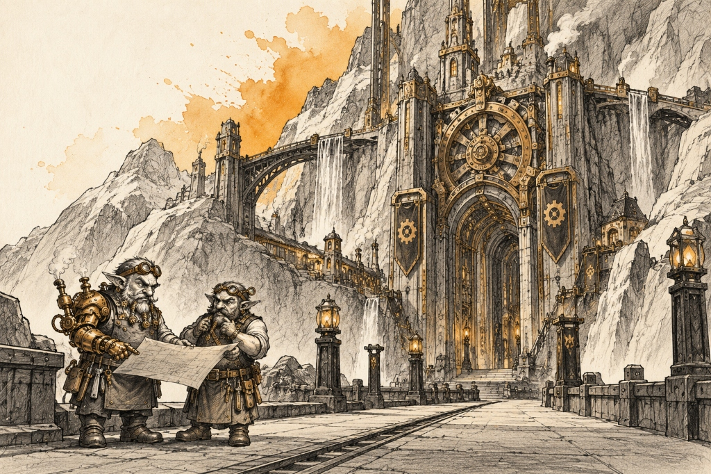
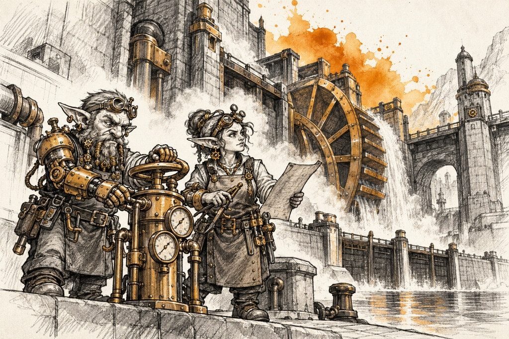
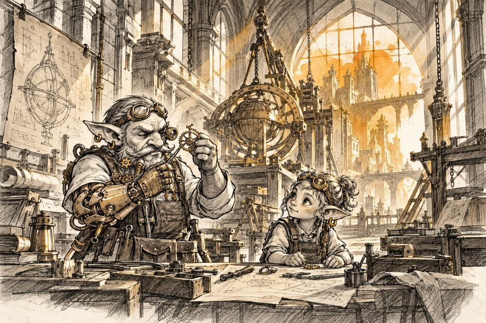
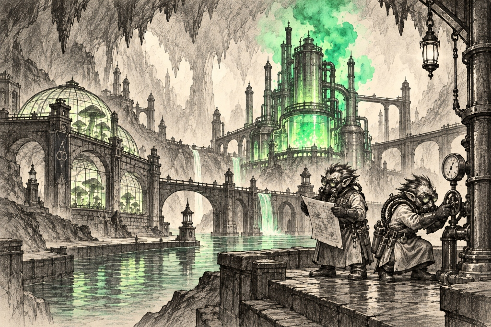
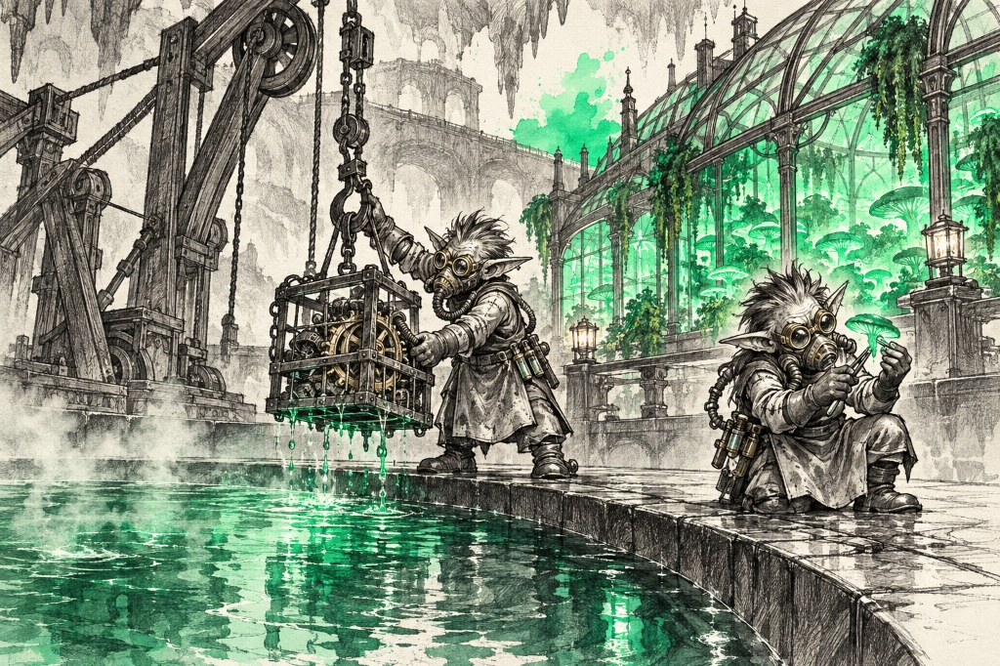
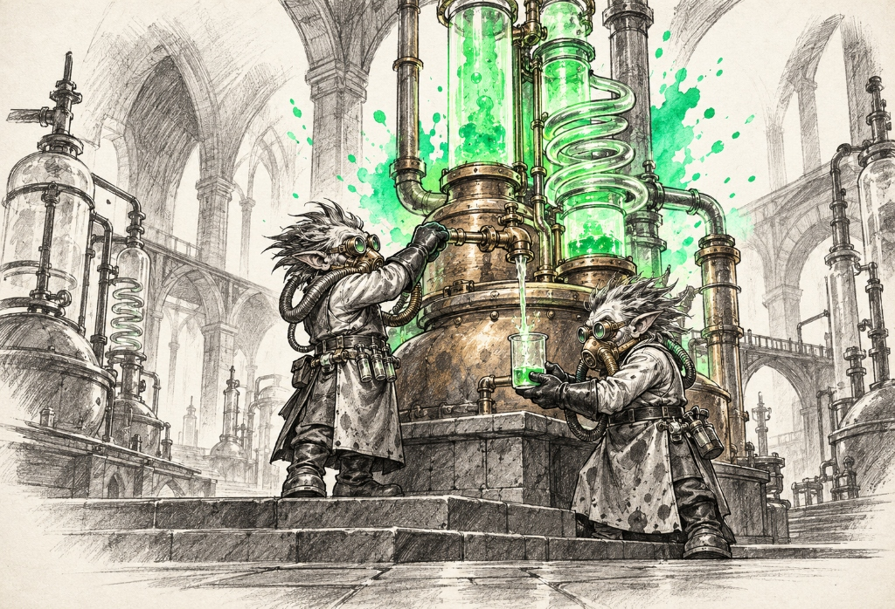

# Fexric Subraces — Landmarks, Establishments & Notable Figures

> **Visual Directive**:
> - Style: 1995 Samwise Didier Concept Art (Always Be Chunky - ABC). Monochromatic rough charcoal and graphite draft linework with gritty cross-hatching on clean off-white watercolor paper.
> - Single Dynamic Watercolor Splash: The ONLY color is the signature watercolor bloom.
> - In-Focus Architecture: City and building prompts are deep-focus wide-angle interior/street-level views. Zero giant foreground portraits blocking the frame.
> - Standalone Prompt Architecture: Every single prompt is 100% self-contained, describing the subrace anatomy, attire, materials, and environment without external file dependencies.
> - BioShock Aesthetic Lock:
>   - Clockwork Fexric: Heavy retrofuturistic artisan engineer aesthetic, exposed ticking gears, analog brass dials/gauges, diving-suit style helmets/goggles, and ornate mechanical prosthetics.
>   - Caustic Fexric: Earthy and alchemical with mad-scientist flair plus floral/botanical elements (greenhouse alembics, fungal distillations, herbal/mineral tinctures, BioShock style brass respirators and rubberized suits).

---

## ⚙️ 1. Clockwork Fexric (Steampunk Brass `#d97706`)
*Canonical Anatomical Lock*: Compact, stocky, ingenious retrofuturistic artisan engineer humanoids with heavy BioShock industrial motifs (matching `fexric_clockwork_icon_v1.png`, `fexric_clockwork_culture_workbench.jpg`, and `fexric_clockwork_city_gearhaven.jpg`). Pale green or soot-darkened skin, keen amber eyes magnified by brass-rimmed diving-suit style goggles, flip-down multi-lens loupes, or swiveling monocles. Thick, industrious beards meticulously braided with copper wire, miniature brass cogs, and tiny fiber-optic threads. Exposed mechanical prosthetics: articulated brass arms, pneumatic piston joints, whirring clockwork tickers visible in chest cavities, and exposed escapement ratchets. Instrumentation: Analog brass pressure dials, ticking needle gauges, and miniature steam release valves mounted directly to chest harnesses and gauntlets. Attire: Heavy fireproof oil-stained leather work aprons studded with brass rivets over durable canvas overalls, tool bandoliers packed with screwdrivers, pin-vises, and oilers, and heavy brass-capped industrial work boots. Armed with oversized brass cog-wrenches, spring-loaded repeating spanner-crossbows, and calipers.

### 🏛️ Part A: Important Buildings & Locations (3 Prompts)

#### ✅ 1. Gearford & Great Cog-Spire (The Sovereign Capital) [GENERATED]


- **Biome & Location**: The industrial river basin and canal hub of Gearhaven.
- **Lore & Functions**: The sovereign metropolis of the Clockwork Fexric. A city driven by gargantuan intermeshed bronze gears, clocktowers, and pressurized steam flumes. Towering brass clocktowers ring every hour with harmonic chimes. Overhead gantry cranes transport mammoth gear assemblies across cobblestone streets. Street-level markets trade precision escapements, copper wire coils, clock-springs, mineral oil, and brass hardware from busy open workshops.
```text
Wide panoramic elevated perspective looking down a broad cobblestone canal thoroughfare toward the Great Cog-Spire of Gearford, sovereign capital of the Clockwork Fexric. Grand multi-tiered stone and brick masonry facades are reinforced with curved art-deco iron trusses and gargantuan interlocking bronze cogwheels slowly turning along the building faces. Elevated iron transit catwalks span overhead. A clean, wide canal with calm water and a single brass steam-barge flows through the center. In the mid-ground on an open stone plaza, exactly two Clockwork Fexric engineers (short, stocky artisan tinkers, NOT orcs, wearing leather work aprons, copper-braided beards, brass goggles on their foreheads, and one displaying an articulated brass mechanical arm) converse while reviewing a rolled parchment schematic. Crisp, spacious composition with monumental industrial depth. Traditional rough black charcoal and graphite pencil linework on aged parchment paper, with a single radiant watercolor splash of Steampunk Brass (#d97706) blooming behind the summit of the Great Cog-Spire clocktower.
```

#### ✅ 2. The Brass Canal Locks & Slag Sluice (The Water-Power Hub) [GENERATED]


- **Biome & Location**: The tiered industrial canal system powering Gearford's central hydraulic works.
- **Lore & Functions**: A multi-tiered canal basin where massive wooden and brass paddle wheels convert rushing river currents into rotational gear power. Sluice-gates regulate water pressure, and cargo barges laden with copper and tin dock to unload at hydraulic crane quays.
```text
Low-angle, atmospheric eye-level view along a wide stone-and-iron canal lock basin where rushing water powers a colossal brass paddlewheel set into the heavy masonry wall. Pressure steam pipes vent soft plumes of white vapor into the open sky. Counterweighted iron sluice gates and heavy brass wheel-valves line the broad stone quayside. In the center mid-ground, exactly two Clockwork Fexric artisans (compact, short stocky humanoids with neat copper-wired beards, riveted leather aprons, tool belts, and brass calipers) stand beside a large brass control pedestal with analog needle gauges, adjusting a pressure wheel. Breathable stone promenade with deep water reflections and clean architecture. Traditional hand-drawn charcoal and gritty graphite cross-hatching, with a single concentrated splash of Steampunk Brass (#d97706) watercolor wash blooming behind the turning paddlewheel.
```

#### ✅ 3. Clocktower Chrono-Vaults & Escapement Guildhall [GENERATED]


- **Biome & Location**: The vaulted central archive chamber inside the base of the Great Cog-Spire.
- **Lore & Functions**: The sacred engineering guildhall where the master master-clocks are synchronized. Hundreds of calibrated pendulum clocks tick in perfect unison. Master horologists inspect microscopic gears under jeweler loupes, drafting blueprints for perpetual motion escapements.
```text
Wide-angle interior perspective looking down the grand vaulted nave of the Chrono-Vaults inside Gearford. Soaring ribbed stone arches frame rows of monumental brass regulator grandfather clocks, swinging bronze pendulums, and pneumatic brass message tubes running along the upper galleries. Tall arched glass windows cast dramatic angled shafts of light across the smooth flagstone floor. In the mid-ground around a sturdy oak drafting workbench, exactly two Clockwork Fexric horologists (short, stocky artisan scholars, NOT orcs, wearing magnifying jewelers' loupes, leather work aprons, one holding precision tweezers and inspecting a brass escapement balance wheel) work quietly in the peaceful, echoing hall. Spacious, uncluttered interior with dramatic lighting and deep vaulted perspective. Traditional graphite and charcoal sketch on off-white paper, with a single rich watercolor bloom of Steampunk Brass (#d97706) accentuating the grand rose window at the end of the hall.
```

### 👤 Part B: Notable & Legendary Figures (5 Figures)

#### 1. Clockwork Fexric Gear-Father (The First Tinker — Sovereign Artificer)
- **Lore Backstory**: Legendary founder of the Clockwork Guild who constructed his own prosthetic clockwork heart and arms after a foundry collapse. He designed the master escapement of the Great Cog-Spire.
```text
Single character concept art sketch of EXACTLY ONE Legendary Male Clockwork Fexric Artificer, Gear-Father (matching approved benchmark icon fexric_clockwork_icon_v1.png). Style: 1995 Warcraft fantasy concept art in the style of Samwise Didier, Always Be Chunky (ABC). Hand-drawn rough black charcoal and graphite draft linework with intricate retrofuturistic mechanical contours and gritty cross-hatching, isolated on clean off-white watercolor sketchbook paper. STRICTLY MONOCHROMATIC CHARACTER & GEAR: No color fills on character, armor, or tools. STRICTLY NO TEXT, NO LETTERS, NO WORDS, NO LABELS, NO SIGNATURES, NO WATERMARKS. ABSOLUTE PROHIBITION ON MULTIPLE FIGURES: RENDER EXACTLY ONE SINGLE HEROIC FIGURE IN A COMMANDING MASTER-TINKER POSE. Standalone Anatomy & Heritage: Stocky, muscular green-skinned Fexric artisan engineer with determined furrowed brow, short bristly grey beard intricately woven with copper wire, gear-teeth, and tiny fiber-optic threads. Goggles & Implants: One eye fitted with a heavy brass-rimmed diving-suit style goggle with triple swiveling magnifying loupes; both forearms and left shoulder are ornate articulated brass-and-copper clockwork prosthetics with exposed ticking gears, pneumatic valves, and analog needle pressure gauges embedded in the wrists; a visible ticking brass escapement heart-plate is bolted to his chest cuirass. Attire: Heavy fireproof leather work apron studded with brass rivets over a durable canvas tunic, wide tool belt hung with spanners, oil flasks, and precision calipers, heavy brass-capped work boots. Gear: Resting a heavy two-handed brass cog-wrench on a wooden workbench with one hand, holding a delicate ticking brass escapement sphere in his articulated metal palm. Setting & Crude Background: Seen in his element in the master workshop of the Great Cog-Spire with crude, hand-drawn 1995 Samwise Didier draft style background scenery sketched in rough graphite linework and gritty cross-hatching—gargantuan intermeshed bronze gears rotating on stone walls, an oily workbench littered with escapements and clock-springs, copper steam pipes venting vapor, and pinned blueprints. Loosely vignetted sketch background. Accent: Single dynamic explosive watercolor splash in rich steampunk brass and copper amber (#d97706) blooming behind the artificer with fluid paint splatters. Pure sketchbook draft page, no formal borders or frames.
```

#### 2. Chief Artificer Cog-Weaver Trix (Mistress of Escapements)
- **Lore Backstory**: Brilliant young horologist who invented the micro-pneumatic valve, allowing clockwork prosthetics to move with the same fluid dexterity as flesh and bone.
```text
Single character concept art sketch of EXACTLY ONE Female Clockwork Fexric Engineer, Trix. Style: 1995 fantasy concept art in the style of Samwise Didier. Hand-drawn rough black charcoal and graphite draft linework with energetic retrofuturistic contours and gritty cross-hatching, isolated on clean off-white watercolor sketchbook paper. STRICTLY MONOCHROMATIC CHARACTER & GEAR: No color fills on character or tools. STRICTLY NO TEXT, NO LETTERS, NO WORDS, NO LABELS, NO SIGNATURES, NO WATERMARKS. ABSOLUTE PROHIBITION ON MULTIPLE FIGURES: RENDER EXACTLY ONE SINGLE HEROIC FIGURE IN AN ALERT BENCH-CRAFTING POSE. Standalone Anatomy & Heritage: Agile, quick-witted green-skinned female Fexric engineer with sharp inquisitive features, dark hair tied back with braided copper wire and brass nuts, keen amber eyes. Headgear & Grafts: Heavy brass diving-suit style goggles perched on her forehead with dual circular glass portholes; a small rotating brass balance wheel embedded in her left temple; her right arm from the elbow down is an intricate articulated clockwork prosthetic with delicate needle-fine fingers and a miniature pressure dial. Attire: Fitted canvas work jumpsuit, leather tool corset with miniature screwdriver holsters, brass-tipped boots. Gear: Holding an intricate brass spring-tension caliper in one hand and a jeweler's loupe in the other, smiling as she calibrates a miniature clockwork automaton beetle. Setting & Crude Background: Seen in her element at her precision horology bench in Gearford with crude, hand-drawn 1995 Samwise Didier draft style background scenery sketched in rough graphite linework and gritty cross-hatching—racks of watchmaker loupes, rows of miniature glass oil vials, tiny brass cog-wheels in wooden sorting drawers, and a half-assembled clockwork automaton bird. Loosely vignetted sketch background. Accent: Dynamic explosive watercolor splash in vibrant steampunk brass (#d97706) blooming behind the engineer with fluid paint splatters. Pure sketchbook draft page, no formal borders or frames.
```

#### 3. Inspector Brass-Whistle Orrin (Keeper of the Mainspring)
- **Lore Backstory**: Chief safety inspector of Gearford. Orrin patrols the city's massive steam lines and hydraulic cogs, detecting dangerous pressure buildup before catastrophic explosions can occur.
```text
Single character concept art sketch of EXACTLY ONE Male Clockwork Fexric Inspector, Orrin. Style: 1995 fantasy concept art in the style of Samwise Didier, Always Be Chunky (ABC). Hand-drawn rough black charcoal and graphite draft linework with sturdy contours and gritty cross-hatching, isolated on clean off-white watercolor sketchbook paper. STRICTLY MONOCHROMATIC CHARACTER & GEAR: No color fills on character or gear. STRICTLY NO TEXT, NO LETTERS, NO WORDS, NO LABELS, NO SIGNATURES, NO WATERMARKS. ABSOLUTE PROHIBITION ON MULTIPLE FIGURES: RENDER EXACTLY ONE SINGLE FIGURE IN AN INSPECTION STANCE. Standalone Anatomy & Heritage: Sturdy, thickset green-skinned Fexric inspector with heavy jawline, mutton-chop sideburns woven with copper staples, stern observant gaze. Headgear & Apparatus: Rounded brass diving-suit style helmet resting open at his collar with heavy riveted neck-ring and round glass faceplate; mechanical brass ear-trumpet hearing horn strapped to one side; chest-mounted harness holding three circular brass pressure gauges with twitching needles. Attire: Heavy oilcloth overcoat with brass buttons, leather tool harness, reinforced work boots. Gear: Holding a long brass sounding rod to detect internal gear vibration in one hand, holding a loud multi-tone brass signaling steam whistle in the other. Setting & Crude Background: Seen in his element on the high iron inspection gantry of the Brass Canal Locks with crude, hand-drawn 1995 Samwise Didier draft style background scenery sketched in rough graphite linework and gritty cross-hatching—massive pressurized steam conduits venting white vapor, heavy turning paddle wheels, industrial canal water churn, and brass pressure dials. Loosely vignetted sketch background. Accent: Single explosive watercolor splash in brass amber (#d97706) blooming behind the inspector with fluid paint splatters. Pure sketchbook draft page, no formal borders or frames.
```

#### 4. Tinkerer Vina Spindle-Drive (Pioneer of Steam Pistons)
- **Lore Backstory**: Daring experimentalist who revolutionized transport by inventing the miniature high-pressure boiler that powers Gearford's street-trams and aerial cable hoists.
```text
Single character concept art sketch of EXACTLY ONE Female Clockwork Fexric Inventor, Vina. Style: 1995 fantasy concept art in the style of Samwise Didier. Hand-drawn rough black charcoal and graphite draft linework with dynamic contours and gritty cross-hatching, isolated on clean off-white watercolor sketchbook paper. STRICTLY MONOCHROMATIC CHARACTER & GEAR: No color fills on character or machinery. STRICTLY NO TEXT, NO LETTERS, NO WORDS, NO LABELS, NO SIGNATURES, NO WATERMARKS. ABSOLUTE PROHIBITION ON MULTIPLE FIGURES: RENDER EXACTLY ONE SINGLE HEROIC FIGURE IN A TESTING POSE. Standalone Anatomy & Heritage: Lithe, focused green-skinned female Fexric inventor with soot-smudged cheeks, bright amber eyes, wild curly hair tucked into a heavy leather welder's cap with flip-down brass-framed tinted goggles. Prosthetics & Grafts: Left leg from the knee down is an ornate retrofuturistic mechanical prosthetic with visible compression springs, bronze pistons, and brass bevel gears. Attire: Heavy leather work smock, thick cowhide gloves, tool bandolier loaded with wrenches and pressure valves. Gear: Turning an oversized brass pressure valve on a miniature steaming boiler cylinder with a spanner, an unrolled technical blueprint tucked under her arm. Setting & Crude Background: Seen in her element in the testing yard of the street-tram foundry with crude, hand-drawn 1995 Samwise Didier draft style background scenery sketched in rough graphite linework and gritty cross-hatching—steaming prototype piston engines on iron test blocks, spanner racks, oil barrels, turning flywheels, and tram rails disappearing into Gearford's cobblestone streets. Loosely vignetted sketch background. Accent: Dynamic explosive watercolor splash in rich brass amber (#d97706) bursting behind the steam boiler with fluid paint splatters. Pure sketchbook draft page, no formal borders or frames.
```

#### 5. Master Caliper Vael (Architect of the Great Cog)
- **Lore Backstory**: The venerable elder draftsman who drew the master blueprints for the interlocked gear systems that synchronize Gearford's mills and waterworks.
```text
Single character concept art sketch of EXACTLY ONE Male Clockwork Fexric Architect, Master Caliper Vael. Style: 1995 fantasy concept art in the style of Samwise Didier. Hand-drawn rough black charcoal and graphite draft linework with refined gritty cross-hatching, isolated on clean off-white watercolor sketchbook paper. STRICTLY MONOCHROMATIC CHARACTER & GEAR: No color fills on character or scrolls. STRICTLY NO TEXT, NO LETTERS, NO WORDS, NO LABELS, NO SIGNATURES, NO WATERMARKS. ABSOLUTE PROHIBITION ON MULTIPLE FIGURES: RENDER EXACTLY ONE SINGLE HEROIC FIGURE IN A DRAFTING STANCE. Standalone Anatomy & Heritage: Elderly, distinguished green-skinned Fexric architect with long white mustache and neatly plaited beard laced with silver and copper wire; wise eyes behind circular spectacles fitted with tiny swiveling brass loupes. Grafts: Small articulated brass mechanical clockwork fingers on his left hand with built-in ink-stylus and caliper points. Attire: Tailored tweed scholar's vest, pleated wool trousers, heavy brass pocket-watch chain draped across chest with multiple miniature gauges, comfortable leather slippers. Gear: Leaning over a grand drafting table, holding an oversized brass proportioning divider and drafting pen, reviewing an architectural blueprint of an enormous gear train. Setting & Crude Background: Seen in his element in the Chrono-Vaults drafting room with crude, hand-drawn 1995 Samwise Didier draft style background scenery sketched in rough graphite linework and gritty cross-hatching—dozens of grandfather clocks ticking in unison, pendulum weights swinging, an enormous angled drafting desk loaded with architectural blueprints, and brass scale rulers. Loosely vignetted sketch background. Accent: Single explosive watercolor splash in glowing brass amber (#d97706) blooming behind the drafting table with fluid paint splatters. Pure sketchbook draft page, no formal borders or frames.
```

---

## 🧪 2. Caustic Fexric (Caustic Green `#10b981`)
*Canonical Anatomical Lock*: Lean, wiry, chemical-resistant mad-scientist alchemists and sump-scavengers combining volatile industrial chemistry with earthy subterranean botanical and fungal cultivation (matching `fexric_caustic_icon_v1.png`, `fexric_caustic_culture_extraction.png`, and `fexric_caustic_city_sumpdeep.jpg`). Heavy BioShock atmospheric aesthetic: pale green or chemically mottled skin, sharp calculating eyes shielded by heavy round brass respirators with ribbed rubber breathing hoses, circular glass portholes, and twin copper intake canisters. Botanical & Alchemical gear: Subterranean fungal spore satchels, glass greenhouse alembics with coiled copper condensers, bulbous Erlenmeyer flasks filled with bubbling vitriol and glowing bioluminescent lichen tinctures, and pressurized syringe-injector gauntlets. Attire: Thick vulcanized rubber diving suits and acid-resistant lead-lined aprons with heavy brass buckles, reinforced elbow-length rubber gloves, and thick iron-soled boots. Armed with brass acid-siphon sprayers, vitriol-coated curved surgical daggers, and glass chemical-botanical throwing carboys.

### 🏛️ Part A: Important Buildings & Locations (3 Prompts)

#### ✅ 1. Slag-Deep & Sump-Foundry (The Sovereign Capital) [GENERATED]


- **Biome & Location**: The deep subterranean industrial caverns beneath the chemical runoff sumps.
- **Lore & Functions**: The sovereign underground capital of the Caustic Fexric. A cavern city carved into wet slate walls illuminated by glowing green alchemical runoffs, bubbling acid canals, and overgrown subterranean fungal shelf terrariums. Heavy iron catwalks span boiling vitriol pools. Sump-scavengers dive into chemical trenches with copper diving helmets. Market stalls trade distilled acids, rust-eating fluxes, greenhouse alembics, fungal spore tinctures, lead containers, and protective rubber gear.
```text
Wide panoramic architectural perspective looking across the monumental subterranean alchemical metropolis of Slag-Deep, sovereign capital of the Caustic Fexric. A cavernous underground city built along tiered limestone ledges: lead-reinforced stone laboratories, arched masonry aqueducts carrying calm runoff canals, and terraced glass-paned greenhouse conservatories cultivating giant subterranean shelf-fungi and bioluminescent lichen. Heavy iron catwalks span between cavern levels. The composition is expansive, clean, and uncluttered, with immense atmospheric cavern depth. In the mid-ground on an open flagstone terrace overlooking the canal, exactly two Caustic Fexric alchemists (short, stocky, wearing brass respirators with ribbed hoses and rubberized smocks, one holding an unrolled botanical formula scroll and the other checking an analog pressure gauge on an iron pipe) confer quietly. Traditional rough black charcoal and graphite pencil linework on aged parchment paper, with a single radiant watercolor splash of Caustic Green (#10b981) blooming behind the grand central distillery tower.
```

#### ✅ 2. Sump-Well No. 7 & Chemical Barter-Pits (The Subterranean Terrarium Exchange) [GENERATED]


- **Biome & Location**: The lowest subterranean drainage basin where industrial toxins collect and bizarre cave flora flourishes.
- **Lore & Functions**: The lawless, vibrant trade hub where scavengers auction salvaged machinery and cultivate rare subterranean fungi and mosses nourished by mineral runoff. Heavy crane cables lower iron drag-nets into boiling sumps, while greenhouse terrariums house glowing spore caps and herbal alembics.
```text
Low-angle, atmospheric eye-level view along a wide stone-and-iron terrace beside Sump-Well No. 7 in Slag-Deep. A deep circular drainage basin where calm, steaming mineral waters pool beside heavy timber winch derricks. Bordering the terrace is a rustic subterranean botanical greenhouse pavilion with tall glass panes protecting lush cultivated clusters of glowing shelf-mushrooms and climbing hanging mosses. In the center mid-ground, exactly two Caustic Fexric sump-scavengers (compact humanoid figures with brass respirators, rubber aprons, and iron-toed boots) stand on the dry stone terrace: one unhooks a dripping iron salvage cage laden with salvaged brass gears, while the other inspects a freshly clipped glowing fungal sample with fine brass tweezers. Spacious, breathable stone terrace with clean reflections on the water's surface, devoid of clutter. Traditional hand-drawn charcoal and gritty graphite cross-hatching, with a single concentrated splash of Caustic Green (#10b981) watercolor wash blooming behind the greenhouse glass pavilion.
```

#### ✅ 3. Acid-Flume Extraction Vats & Fungal Distilleries (The Alchemical Refinery) [GENERATED]


- **Biome & Location**: A volcanic limestone cavern lined with natural sulfuric steam vents and warm nutrient-rich drip pools.
- **Lore & Functions**: The refinery where raw chemical slimes and subterranean fungal cultures are distilled into concentrated acids, medicinal tinctures, and elemental salts. Massive glass condensation tubes, ceramic retorts, and copper greenhouse alembics line the walls, tended by masked alchemical apprentices.
```text
Wide-angle interior perspective looking down the monumental vaulted stone refinery hall of the Acid-Flume Extraction Vats. Soaring stone arches support rows of monumental copper alembics, coiled glass condenser tubes, and ceramic evaporating vats that gently decant purified reagents. Clean, smooth stone flagstone aisles with ample breathable floor space. In the center mid-ground around a heavy granite distillation bench, exactly two Caustic Fexric master chemists (short, stocky, wearing round brass goggles and twin-hose breathing masks over rubberized smocks) work with focused calm: one adjusts an overhead brass siphon cock, while the other holds a glass beaker up to catch a steady crystal-clear distilled tincture. Grand, industrial, and uncluttered laboratory perspective with deep cavern shadows. Traditional graphite and charcoal sketch on off-white paper, with a single rich watercolor bloom of Caustic Green (#10b981) accentuating the central copper condenser apparatus.
```

### 👤 Part B: Notable & Legendary Figures (5 Figures)

#### 1. Caustic Fexric Sump-Scavenger (The First Clan-Free — Sovereign Pioneer)
- **Lore Backstory**: Legendary survivor who severed ties with the oppressive foundry clans and established the independent scavenger communes of Slag-Deep. He survived a fall into pure aqua regia thanks to his custom lead-treated diver's armor and discovered the healing properties of deep-sump bioluminescent fungus.
```text
Single character concept art sketch of EXACTLY ONE Legendary Male Caustic Fexric Scavenger, The First Clan-Free (matching approved benchmark icon fexric_caustic_icon_v1.png). Style: 1995 Warcraft fantasy concept art in the style of Samwise Didier, Always Be Chunky (ABC). Hand-drawn rough black charcoal and graphite draft linework with rugged alchemical contours, BioShock retrofuturistic diver elements, and gritty cross-hatching, isolated on clean off-white watercolor sketchbook paper. STRICTLY MONOCHROMATIC CHARACTER & GEAR: No color fills on character, armor, or tools. STRICTLY NO TEXT, NO LETTERS, NO WORDS, NO LABELS, NO SIGNATURES, NO WATERMARKS. ABSOLUTE PROHIBITION ON MULTIPLE FIGURES: RENDER EXACTLY ONE SINGLE HEROIC FIGURE IN A DEFIANT SCAVENGER STANCE. Standalone Anatomy & Heritage: Lean, wiry, chemical-scarred green-skinned Fexric survivor with bald scalp and intense amber eyes staring through the round glass portholes of a heavy brass BioShock-style respirator mask with twin ribbed rubber breathing hoses connecting to copper filter canisters on his belt. Attire: Heavy lead-lined acid-resistant rubberized apron over reinforced canvas tunic, thick vulcanized rubber gauntlets with brass cuff-clamps, heavy work boots with iron sole-plates. Apparatus & Botanical Flair: Bandolier of sealed glass retorts containing bubbling vitriol and preserved glowing fungal caps across his chest; a pressurized copper chemical sprayer tank strapped to his back with coiled siphon hose. Gear: Holding an oversized two-pronged iron salvage claw in one hand and a brass syringe-injector sprayer in the other. Setting & Crude Background: Seen in his element on an iron-grate catwalk in Slag-Deep with crude, hand-drawn 1995 Samwise Didier draft style background scenery sketched in rough graphite linework and gritty cross-hatching—boiling green alchemical runoff canals hissing with steam, dripping lead-plated pipes, hanging salvage hooks, shelf mushrooms clinging to wet rock walls, and dark stalactite caverns. Loosely vignetted sketch background. Accent: Single dynamic explosive watercolor splash in vibrant caustic green (#10b981) blooming behind the scavenger with fluid paint splatters. Pure sketchbook draft page, no formal borders or frames.
```

#### 2. Mother Malice Sump-Boiler (Matriarch of the Vats & Fungal Breweries)
- **Lore Backstory**: Venerable chemist who perfected the triple-distillation formula combining concentrated vitriol with subterranean shelf-fungus extracts to produce impenetrable acid-resistant armor coatings and miraculous cauterizing tinctures.
```text
Single character concept art sketch of EXACTLY ONE Female Caustic Fexric Alchemist, Mother Malice. Style: 1995 fantasy concept art in the style of Samwise Didier. Hand-drawn rough black charcoal and graphite draft linework with expressive gritty cross-hatching, BioShock mad-scientist details, and botanical motifs, isolated on clean off-white watercolor sketchbook paper. STRICTLY MONOCHROMATIC CHARACTER & GEAR: No color fills on character or tools. STRICTLY NO TEXT, NO LETTERS, NO WORDS, NO LABELS, NO SIGNATURES, NO WATERMARKS. ABSOLUTE PROHIBITION ON MULTIPLE FIGURES: RENDER EXACTLY ONE SINGLE HEROIC FIGURE IN A COMMANDING REFINERY POSE. Standalone Anatomy & Heritage: Broad, formidable green-skinned female Fexric alchemist with sharp observant eyes, grey hair tied in a tight practical bun, chemical-stained knuckles, and a heavy brass-and-leather respirator hanging loosely around her neck with twin intake filters. Attire: Heavy patched leather work smock, thick rubberized bib apron stained with reagents, insulated gauntlets, heavy wooden-soled clogs. Apparatus & Botanical Gear: A leather shoulder harness holding dried subterranean lichen bundles, glass distillation vials, and brass measuring spoons. Gear: Holding a long-handled bronze stirring paddle with both hands, inspecting a steaming Erlenmeyer beaker of bubbling green herbal-mineral vitriol held up to the light. Setting & Crude Background: Seen in her element in the central refinery distillery of Slag-Deep with crude, hand-drawn 1995 Samwise Didier draft style background scenery sketched in rough graphite linework and gritty cross-hatching—colossal bronze boiling vats, twisting copper condensation serpentines venting vapor, wooden carboys of concentrated acid, glass terrarium domes holding giant fungal cultures, and stone fire-slabs. Loosely vignetted sketch background. Accent: Single explosive watercolor splash in toxic caustic green (#10b981) blooming behind the alchemist with fluid paint splatters. Pure sketchbook draft page, no formal borders or frames.
```

#### 3. Gasket the Acid-Diver (The Deep Siphon)
- **Lore Backstory**: Daring deep-pit diver who descends into boiling acid trenches and subterranean spore-pools wearing an archaic pressurized brass diving helmet to recover sunken master-tools and harvest rare subterranean black lotus roots.
```text
Single character concept art sketch of EXACTLY ONE Male Caustic Fexric Diver, Gasket. Style: 1995 Warcraft fantasy concept art in the style of Samwise Didier, Always Be Chunky (ABC). Hand-drawn rough black charcoal and graphite draft linework with heavy BioShock diving suit textures, Big Daddy industrial aesthetics, and gritty cross-hatching, isolated on clean off-white watercolor sketchbook paper. STRICTLY MONOCHROMATIC CHARACTER & GEAR: No color fills on character or gear. STRICTLY NO TEXT, NO LETTERS, NO WORDS, NO LABELS, NO SIGNATURES, NO WATERMARKS. ABSOLUTE PROHIBITION ON MULTIPLE FIGURES: RENDER EXACTLY ONE SINGLE FIGURE IN A HEAVY DIVER'S STANCE. Standalone Anatomy & Heritage: Stocky, powerful green-skinned Fexric encased in an archaic lead-weighted vulcanized rubber diving suit, rounded heavy brass diving helmet with circular glass portholes and massive wingnuts, thick corrugated air-hoses coiled behind his shoulders to a brass back-mounted pressure tank. Attire: Bulky treated rubber diving suit with reinforced brass knee and shoulder guards, lead-weighted diving boots. Gear: Holding a heavy pneumatic salvage harpoon with coiled cable in one hand and an iron specimen bucket containing bubbling acid and glowing cave lichen in the other, droplets of corrosive fluid hissing from his suit. Setting & Crude Background: Seen in his element on the slimy diving platform of Sump-Well No. 7 with crude, hand-drawn 1995 Samwise Didier draft style background scenery sketched in rough graphite linework and gritty cross-hatching—heavy iron winch cables lowering a salvage cage into a boiling green acid sump, rubber air-hoses, grease barrels, dripping wet cavern rock walls, and strange bioluminescent fungal clusters. Loosely vignetted sketch background. Accent: Dynamic explosive watercolor splash in caustic green (#10b981) blooming behind the diver with fluid paint splatters. Pure sketchbook draft page, no formal borders or frames.
```

#### 4. Tox-Smith Skarr (Master of Vitriol & Spore Blades)
- **Lore Backstory**: Master weaponsmith who quenches forged steel in concentrated acid infused with poisonous fungal alkaloids, etching razor-sharp micro-serrations that never dull and leave burning necrotic wounds on enemy armor.
```text
Single character concept art sketch of EXACTLY ONE Male Caustic Fexric Bladesmith, Skarr. Style: 1995 fantasy concept art in the style of Samwise Didier. Hand-drawn rough black charcoal and graphite draft linework with sharp aggressive contours and gritty cross-hatching, isolated on clean off-white watercolor sketchbook paper. STRICTLY MONOCHROMATIC CHARACTER & GEAR: No color fills on character or weapons. STRICTLY NO TEXT, NO LETTERS, NO WORDS, NO LABELS, NO SIGNATURES, NO WATERMARKS. ABSOLUTE PROHIBITION ON MULTIPLE FIGURES: RENDER EXACTLY ONE SINGLE HEROIC FIGURE IN A BLADE-INSPECTING POSE. Standalone Anatomy & Heritage: Wiry, muscular green-skinned Fexric bladesmith with sharp angular jawline, eyepatch over one eye, scarred forearms; wearing a heavy brass-framed half-respirator mask with charcoal filter cartidges. Attire: Heavy split-leather smithing apron, studded rubberized vambraces, reinforced trousers, steel-toed work boots. Apparatus: Bandolier of small amber tincture bottles containing distilled fungal toxins and aqua regia. Gear: Holding a newly quenched curved serrated dagger by the hilt, examining the green-fuming edge as drops of vitriol hiss upon an iron anvil, a pair of heavy smithing tongs resting at his hip. Setting & Crude Background: Seen in his element at his blade-quenching trough in the Sump Market with crude, hand-drawn 1995 Samwise Didier draft style background scenery sketched in rough graphite linework and gritty cross-hatching—a stone quenching trough filled with smoking green vitriol, iron blade-racks, a charred forging hearth, dried hanging toxic mushroom clusters, and tool racks holding tongs and files. Loosely vignetted sketch background. Accent: Single dynamic explosive watercolor splash in caustic green (#10b981) bursting behind the anvil with fluid paint splatters. Pure sketchbook draft page, no formal borders or frames.
```

#### 5. Slink the Siphon-Boy (Courier of the Slime-Tunnels & Spore-Pits)
- **Lore Backstory**: Lightning-fast young runner who knows every secret pipe, drainage conduit, and fungal nursery in Slag-Deep, delivering emergency antidote serums, rare spore samples, and black-market acids across the subterranean underworld.
```text
Single character concept art sketch of EXACTLY ONE Male Caustic Fexric Courier, Slink. Style: 1995 fantasy concept art in the style of Samwise Didier. Hand-drawn rough black charcoal and graphite draft linework with agile energetic contours and gritty cross-hatching, isolated on clean off-white watercolor sketchbook paper. STRICTLY MONOCHROMATIC CHARACTER & GEAR: No color fills on character or gear. STRICTLY NO TEXT, NO LETTERS, NO WORDS, NO LABELS, NO SIGNATURES, NO WATERMARKS. ABSOLUTE PROHIBITION ON MULTIPLE FIGURES: RENDER EXACTLY ONE SINGLE FIGURE IN AN AGILE CROUCH. Standalone Anatomy & Heritage: Small, slender, hyper-agile young green-skinned Fexric runner with wide curious eyes behind a round brass monocular lens, compact brass snout-respirator with ribbed intake hose strapped securely around his neck, wild mop of soot-stained hair. Attire: Lightweight rubberized overalls, reinforced knee pads, soft-soled rubber climbing shoes. Apparatus: A padded leather satchel packed with glass vials in wooden racks and sealed cloth bags of luminous fungal spores; holding a handheld brass siphon pump ready to spray or draw liquid. Setting & Crude Background: Seen in his element inside a cramped drainage sewer tunnel with crude, hand-drawn 1995 Samwise Didier draft style background scenery sketched in rough graphite linework and gritty cross-hatching—brick sewer vaults dripping with slime, leaking overhead pipes, narrow wooden balancing boards spanning runoff flumes, clusters of glowing shelf mushrooms, and distant yellow lantern reflections on dark water. Loosely vignetted sketch background. Accent: Dynamic explosive watercolor splash in vibrant caustic green (#10b981) blooming behind the runner with fluid paint splatters. Pure sketchbook draft page, no formal borders or frames.
```
