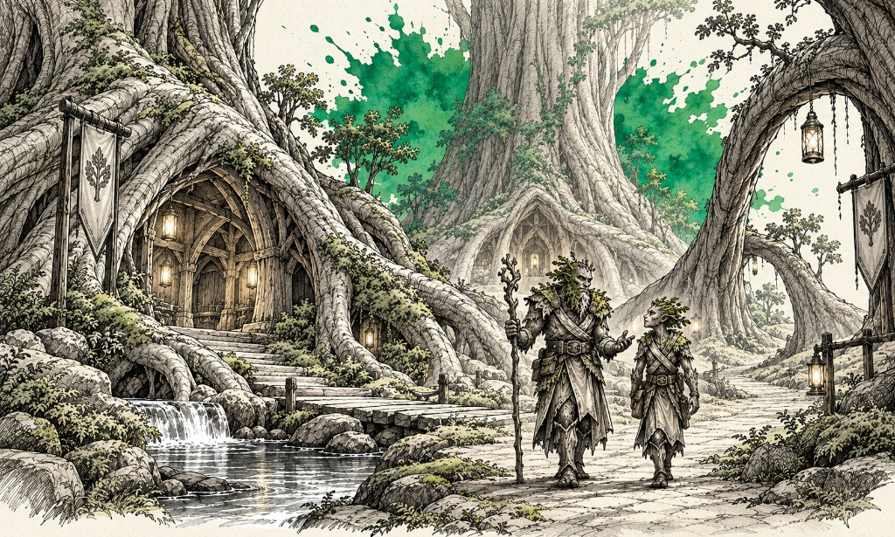
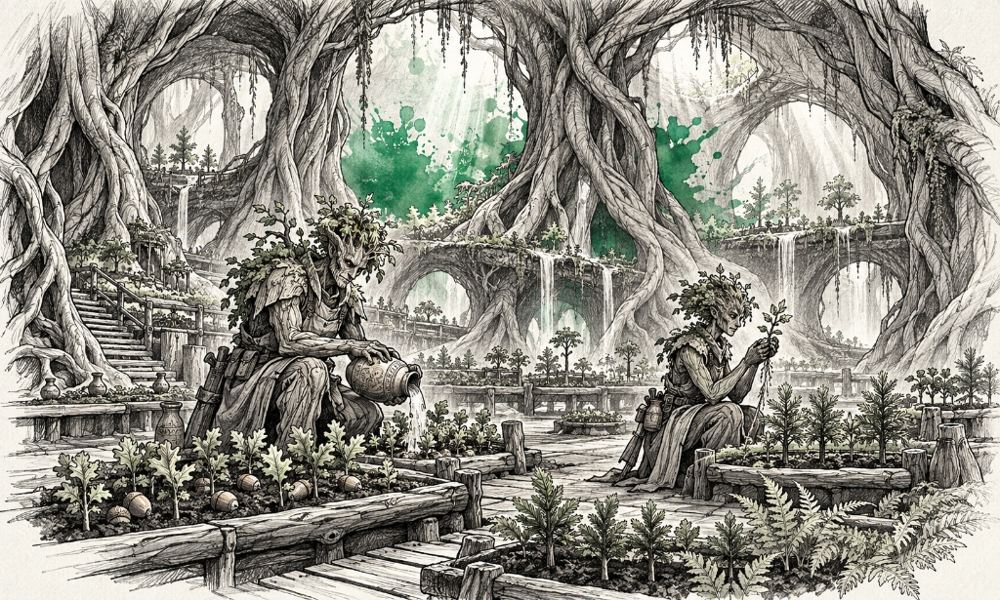
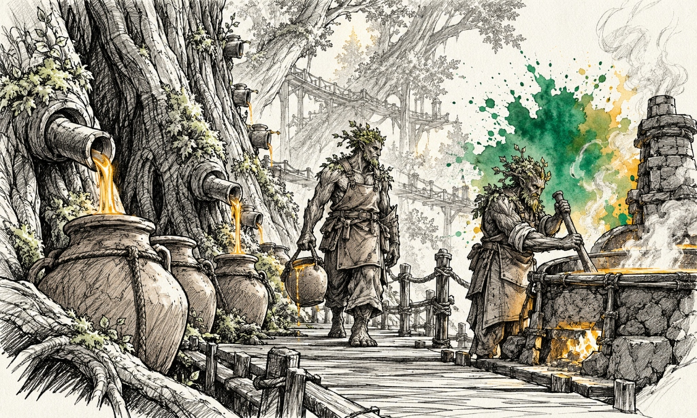
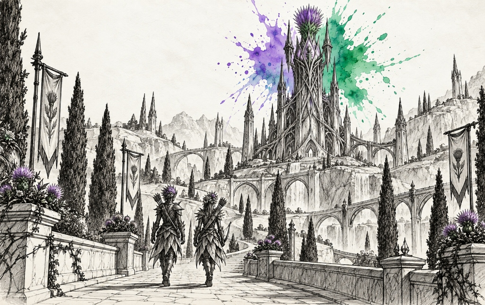
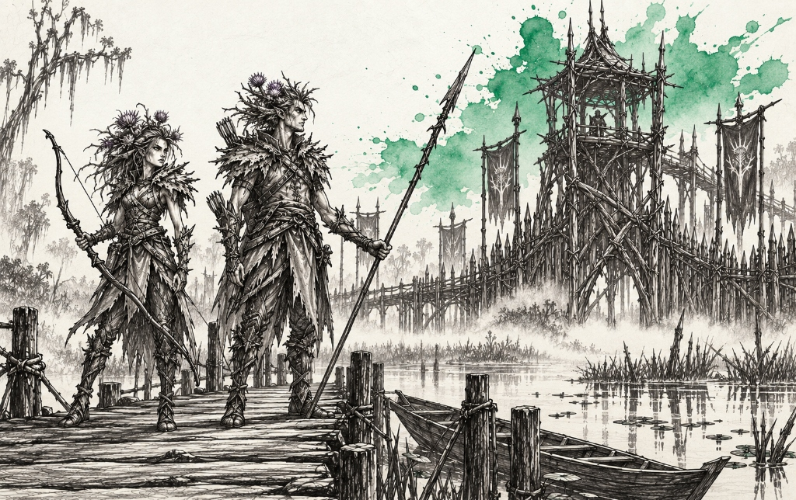
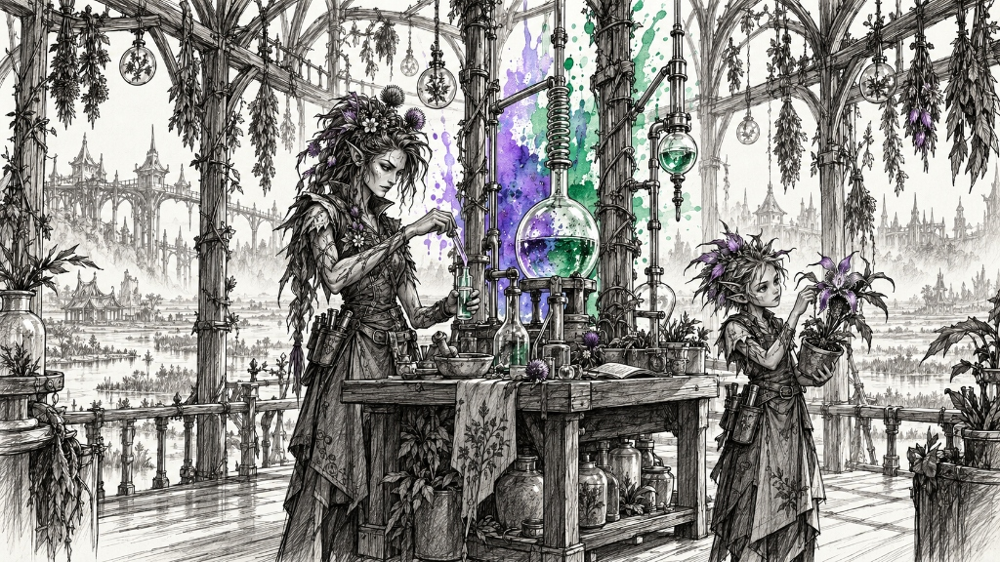

# Florae Subraces — Landmarks, Establishments & Notable Figures

> **Visual Directive**:
> - Style: 1995 Samwise Didier Concept Art (Always Be Chunky - ABC). Monochromatic rough charcoal and graphite draft linework with gritty cross-hatching on clean off-white watercolor paper.
> - Single Dynamic Watercolor Splash: The ONLY color is the signature watercolor bloom.
> - In-Focus Architecture: City and building prompts are deep-focus wide-angle interior/street-level views. Zero giant foreground portraits blocking the frame.
> - Canonical Anatomical Locks: 100% matched to approved T-poses and icon benchmarks.

---

## 🌳 1. Oken Florae (Forest Green `#059669`)
*Canonical Anatomical Lock*: Stately, ancient, powerfully built arboreal humanoids with weathered oak-bark skin and rich moss-and-lichen growth in joints and crevices (matching `florae_oken_icon_v1.png`, `florae_craftsman.jpg`, and `florae_oken_city_ironroot.jpg`). Broad, sturdy timber proportions with branch-like fingers and rooted feet. Facial features: Wise, noble, craggy bark-etched faces with deep-set glowing warm amber or moss-green eyes, beard and hair composed of living foliage, pine needles, and clinging ivy leaves that shift with the seasons. Attire: Tunics woven from supple willow bark and forest vines, braided root belts carrying seed pouches and bone gardening knives, bare rooted feet that anchor into the earth. Armed with gnarled living ironwood staves, seed-pod clubs, and sap-hardened wooden shields.

### 🏛️ Part A: Important Buildings & Locations (3 Prompts)

#### ✅ 1. Great-Grove & Primeval Ironwood Root-Sanctuary (The Sovereign Capital) [GENERATED]


- **Biome & Location**: The colossal ancient temperate rainforest of Ironroot.
- **Lore & Functions**: The sovereign primeval sanctuary of the Oken Florae, built strictly on the forest ground floor among the gargantuan buttress roots of five-thousand-year-old ironwood trees (strictly no treetop living). Cozy timber longhouses and council chambers are hollowed gracefully into the lower base trunks and buttress walls. Broad mossy earth avenues and stone-lined duckboard pathways connect dwellings across rich forest loam, sheltered beneath root arches.
```text
Wide panoramic architectural perspective looking across the majestic primeval ground-level sanctuary of Great-Grove in Ironroot, sovereign home of the Oken Florae. A monumental ground-floor forest settlement built directly upon the rich earth between the titanic buttress roots of ancient thousand-year-old ironwood trees: cozy longhouses and halls hollowed gracefully into the base trunks, broad mossy earth avenues, and smooth stone-lined duckboard footpaths crossing crystal-clear woodland streams. STRICTLY NO TREETOP HOUSES, STRICTLY GROUND-LEVEL LIVING. Overhead, colossal arching buttress roots form natural vaulted canopies where hanging clay oil lanterns glow softly. The composition is expansive, tranquil, and uncluttered, with immense atmospheric forest floor depth. In the mid-ground along a wide mossy path, exactly two Oken Florae elders (sturdy wood-skinned humanoids with leafy beards and root walking staves) stroll side-by-side in peaceful conversation. Traditional rough black charcoal and graphite pencil linework on aged parchment paper, with a single radiant watercolor splash of Forest Green (#059669) blooming behind the central tree base.
```

#### ✅ 2. Root-Knit Waystation & Seed Nursery (The Sacred Germination Vault) [GENERATED]


- **Biome & Location**: The mossy sheltered forest floor beneath the Great-Grove canopy.
- **Lore & Functions**: The sacred subterranean nursery where the ancient seeds and acorns of pre-Calamity trees are nurtured in rich loam. Warm hydrothermal humus mounds provide natural incubation. Seed-Mothers sing harmonic growth songs to awaken dormant saplings.
```text
Wide-angle interior perspective looking through the subterranean Root-Knit Nursery beneath Great-Grove. A colossal vaulted chamber formed by the intertwining roots of giant ironwoods arching overhead, admitting soft, gentle shafts of sunlight from root skylights. Moist, rich black earth terraces are lined with wooden duckboards, where hundreds of tiny vibrant saplings and rare forest ferns sprout in organized germination beds. Clean, spacious earthen floor with ample breathable room. In the center mid-ground, exactly two Oken Florae caretakers (sturdy arboreal humanoids with bark skin and leafy aprons) tend the seedlings: one pours water from a ceramic clay gourd over a bed of sprouting acorns, while the other inspects a young pinecone cutting with gentle branch-like fingers. Serene, nurturing, and uncluttered botanical sanctuary perspective with crisp graphite contours. Traditional hand-drawn charcoal and gritty graphite cross-hatching, with a single concentrated splash of Forest Green (#059669) watercolor wash blooming behind the central nursery arch.
```

#### ✅ 3. The Living Sapsucker Hollows (The Resin Refinery) [GENERATED]


- **Biome & Location**: The massive ground-level buttress roots of the ancient ironwoods where the trees sweat amber resin.
- **Lore & Functions**: The ground-level harvesting stations where amber sap is collected in clay amphoras from lower trunk taps. Master brewers ferment the sap into healing draughts and fireproof wood-varnishes that make Oken structures immune to forest fires.
```text
Low-angle, atmospheric eye-level view along an expansive timber boardwalk at the base of a titanic ironwood tree trunk in the Living Sapsucker Hollows. Thick ceramic spiles are tapped neatly into the lower buttress trunk, dripping rich golden amber resin into large clay amphoras resting on the mossy ground. Beside the tree base, a rustic stone hearth kettle gently simmers, refining the harvested resin into protective wood-varnish. In the center mid-ground on the wide timber walkway, exactly two Oken Florae woodworkers (broad-shouldered arboreal craftsmen with bark skin and leather work aprons) work calmly: one carries a heavy clay jug of raw resin by its rope handle, while the other stirs an earthen cooling vat with a long wooden paddle. Spacious, tranquil forest craftsmanship perspective with dappled sunlight breaking through the lower boughs, devoid of clutter. Traditional graphite and black charcoal drawing on off-white parchment, with a single subtle splash of Forest Green and Amber (#059669) watercolor blooming behind the boiling hearth.
```

### 👤 Part B: Notable & Legendary Figures (5 Figures)

#### 1. Elder Oak-Bough Thorun (The Heart-Root — Sovereign Patriarch)
- **Lore Backstory**: The oldest living Oken, Thorun has witnessed four human kingdoms rise and fall. His feet are semi-rooted into the sacred soil of Great-Grove, and his wooden crown blooms with white apple blossoms in spring.
```text
Single character concept art sketch of EXACTLY ONE Legendary Male Oken Florae Elder, Oak-Bough Thorun (matching approved benchmark icon florae_oken_icon_v1.png). Style: 1995 Warcraft fantasy concept art in the style of Samwise Didier, Always Be Chunky (ABC). Hand-drawn rough black charcoal and graphite draft linework with monumental arboreal contours and gritty cross-hatching, isolated on clean off-white watercolor sketchbook paper. STRICTLY MONOCHROMATIC CHARACTER & GEAR: No color fills on character, bark, or foliage. STRICTLY NO TEXT, NO LETTERS, NO WORDS, NO LABELS, NO SIGNATURES, NO WATERMARKS. ABSOLUTE PROHIBITION ON MULTIPLE FIGURES: RENDER EXACTLY ONE SINGLE HEROIC FIGURE IN A MAJESTIC ROOTED POSE. Canonical Anatomy: Colossal, broad-shouldered arboreal humanoid with deep-grooved oak-bark skin, wise ancient facial features, glowing warm amber eyes, and a majestic beard of living oak leaves and clinging lichen. Natural branch horns emerge from his brow blooming with seasonal acorns and foliage. Attire: Simple mantle of woven willow bark and hanging ivy ribbons, wide braided root belt with seed pods, bare heavy root feet planted firmly into rich soil. Gear: Resting both hands atop a massive gnarled living ironwood staff that sprouts green leaves at the tip, his body exuding ancient calm authority. Setting & Crude Background: Seen in his element in the primeval heart-grove of Great-Grove with crude, hand-drawn 1995 Samwise Didier draft style background scenery sketched in rough graphite linework and gritty cross-hatching—titanic moss-covered ironwood buttress roots arching along the forest floor, hanging weeping vines, sunbeams filtering through leaves, and living root steps descending into rich forest loam. Loosely vignetted sketch background. Accent: Single dynamic explosive watercolor splash in deep forest green (#059669) blooming behind the elder with fluid paint splatters. Pure sketchbook draft page, no formal borders or frames.
```

#### 2. Bark-Weaver Sylvan (Master of Living Architecture)
- **Lore Backstory**: Master artisan who shapes living branches and lower roots into halls and bridges without cutting a single living fiber, guiding growth through gentle touch and growth songs.
```text
Single character concept art sketch of EXACTLY ONE Male Oken Florae Architect, Sylvan (matching approved benchmark icon florae_craftsman.jpg). Style: 1995 fantasy concept art in the style of Samwise Didier. Hand-drawn rough black charcoal and graphite draft linework with expressive organic contours and gritty cross-hatching, isolated on clean off-white watercolor sketchbook paper. STRICTLY MONOCHROMATIC CHARACTER & GEAR: No color fills on character or tools. STRICTLY NO TEXT, NO LETTERS, NO WORDS, NO LABELS, NO SIGNATURES, NO WATERMARKS. ABSOLUTE PROHIBITION ON MULTIPLE FIGURES: RENDER EXACTLY ONE SINGLE HEROIC FIGURE IN A WOOD-SHAPING POSE. Canonical Anatomy: Sturdy, muscular wood-skinned humanoid with fine birch-grain textures, alert moss-green eyes, short leaf-fringed hair, dexterous branch fingers. Attire: Tough leather work apron over bark-fiber tunic, braided cord belt with small pruning hooks and resin jars, bare rooted feet. Gear: Gently holding a living pliable ironwood root branch between his fingers, guiding it into an interlocking archway, a bone carving awl held in his other hand. Setting & Crude Background: Seen in his element upon a ground-level buttress avenue of Great-Grove with crude, hand-drawn 1995 Samwise Didier draft style background scenery sketched in rough graphite linework and gritty cross-hatching—interlocking living tree roots forming an organic archway over a mossy path, hanging wicker lanterns, sapling pots on wooden benches, and ancient bark pillars. Loosely vignetted sketch background. Accent: Dynamic explosive watercolor splash in lush forest green (#059669) blooming behind the shaping arch with fluid paint splatters. Pure sketchbook draft page, no formal borders or frames.
```

#### 3. Seed-Mother Caelia (Guardian of the Ancient Cones)
- **Lore Backstory**: Revered botanical matriarch who preserves the genetic heritage of extinct flora, cultivating rare seed strains that can purify poisoned river water and rejuvenate scorched soil.
```text
Single character concept art sketch of EXACTLY ONE Female Oken Florae Matriarch, Seed-Mother Caelia. Style: 1995 fantasy concept art in the style of Samwise Didier. Hand-drawn rough black charcoal and graphite draft linework with maternal dignified contours and gritty cross-hatching, isolated on clean off-white watercolor sketchbook paper. STRICTLY MONOCHROMATIC CHARACTER & GEAR: No color fills on character or seeds. STRICTLY NO TEXT, NO LETTERS, NO WORDS, NO LABELS, NO SIGNATURES, NO WATERMARKS. ABSOLUTE PROHIBITION ON MULTIPLE FIGURES: RENDER EXACTLY ONE SINGLE HEROIC FIGURE IN A NURTURING SEED POSE. Canonical Anatomy: Statuesque, broad-hipped arboreal female with smooth cedar-bark skin, serene glowing green eyes, long hair composed of weeping-willow tendrils braided with wildflowers, moss-covered shoulders. Attire: Draped gown of woven clover-cloth and living ferns, belt of carved nutshells. Gear: Cupping a large glowing primeval pinecone in both hands, surrounded by floating seeds drifting gently from her palms. Setting & Crude Background: Seen in her element inside the subterranean Root-Knit Nursery with crude, hand-drawn 1995 Samwise Didier draft style background scenery sketched in rough graphite linework and gritty cross-hatching—intertwining roots forming a vaulted ceiling, stepped earthen planting beds sprouting glowing seedlings, clay water gourds, and floating pollen motes drifting in the air. Loosely vignetted sketch background. Accent: Single explosive watercolor splash in vibrant emerald green (#059669) blooming behind the pinecone with fluid paint splatters. Pure sketchbook draft page, no formal borders or frames.
```

#### 4. Branch-Warden Rowan (Keeper of the Root Ramparts)
- **Lore Backstory**: Fearless forest ranger who patrols the ground perimeter and outer root palisades of Great-Grove, defending the community against wood-boring beasts and encroaching blight.
```text
Single character concept art sketch of EXACTLY ONE Male Oken Florae Scout, Rowan. Style: 1995 Warcraft fantasy concept art in the style of Samwise Didier. Hand-drawn rough black charcoal and graphite draft linework with agile muscular contours and gritty cross-hatching, isolated on clean off-white watercolor sketchbook paper. STRICTLY MONOCHROMATIC CHARACTER & GEAR: No color fills on character or weapons. STRICTLY NO TEXT, NO LETTERS, NO WORDS, NO LABELS, NO SIGNATURES, NO WATERMARKS. ABSOLUTE PROHIBITION ON MULTIPLE FIGURES: RENDER EXACTLY ONE SINGLE HEROIC FIGURE IN A BALANCED ROOT CROUCH. Canonical Anatomy: Athletic, wiry wood-skinned scout with flexible vine sinews, sharp amber eyes, foliage hair tied in a warrior queue, branch-like toes gripping mossy earth. Attire: Quilted leaf-fiber vest, hardened bark vambraces, braided vine harness. Gear: Crouched low on a massive mossy root rampart, holding a sturdy ironwood spear with a razor-sharp stone blade ready to thrust, a coil of vine rope at his hip. Setting & Crude Background: Seen in his element patrolling the outer ironwood root ramparts of Ironroot with crude, hand-drawn 1995 Samwise Didier draft style background scenery sketched in rough graphite linework and gritty cross-hatching—massive interlocking buttress roots forming natural perimeter ramparts, rustling ferns, misty forest ground floor, and fallen autumn leaves blanketing the loam. Loosely vignetted sketch background. Accent: Dynamic explosive watercolor splash in forest green (#059669) blooming behind the scout with fluid paint splatters. Pure sketchbook draft page, no formal borders or frames.
```

#### 5. Old Knot-Root (The Memory-Bark)
- **Lore Backstory**: Ancient hermit whose bark has calcified into near-stone hardness. He preserves oral history by carving historical relief pictograms into his own thick outer bark.
```text
Single character concept art sketch of EXACTLY ONE Veteran Male Oken Florae Hermit, Old Knot-Root. Style: 1995 fantasy concept art in the style of Samwise Didier, Always Be Chunky (ABC). Hand-drawn rough black charcoal and graphite draft linework with heavily textured gnarls and gritty cross-hatching, isolated on clean off-white watercolor sketchbook paper. STRICTLY MONOCHROMATIC CHARACTER & GEAR: No color fills on character or carving. STRICTLY NO TEXT, NO LETTERS, NO WORDS, NO LABELS, NO SIGNATURES, NO WATERMARKS. ABSOLUTE PROHIBITION ON MULTIPLE FIGURES: RENDER EXACTLY ONE SINGLE HEROIC FIGURE IN A SEATED CONTEMPLATIVE POSE. Canonical Anatomy: Gnarled, burly elder arboreal humanoid covered in thick rough pine-bark ridges and swirling wood burls, squinting wise green eyes, beard of hanging Spanish moss. Attire: Ragged fiber kilt, bare rooted feet. Gear: Seated on a mossy boulder, using a flint chisel to inscribe a historical spiral motif into the thick bark of his left forearm. Setting & Crude Background: Seen in his element in a secluded mossy clearing beneath ancient boughs with crude, hand-drawn 1995 Samwise Didier draft style background scenery sketched in rough graphite linework and gritty cross-hatching—a weathered granite glacial boulder, gnarled tree roots grasping stone, stone offering cairns, and autumn oak leaves blanketing the ground. Loosely vignetted sketch background. Accent: Single explosive watercolor splash in deep forest green (#059669) blooming behind the boulder with fluid paint splatters. Pure sketchbook draft page, no formal borders or frames.
```

---

## 🥀 2. Viridian Florae (Briar Green & Thistle Violet `#059669`)
*Canonical Anatomical Lock*: Slender, lethal, hyper-agile briar-and-thorn arboreal hunters, snipers, and venom-chemists (matching `florae_viridian_icon_v1.png`, `florae_viridian_culture_archer.jpg`, and `florae_viridian_city_thornhollow.jpg`). Tall, lithe, wiry predator frames made of dense briar-wood and flexible thorn-vines. Face: Sharp, angular, predatory facial features with piercing emerald or violet cat-like eyes, sleek thorn-ridges emerging naturally along cheekbones and jawline. Hair: Vibrant, wild thistle-bloom magenta and purple spiky hair mixed with bramble leaves. Body: Sharp needle-thorns protruding along forearms, shoulders, and shin-ridges. Attire: Fitted combat suits of hardened briar-bark scales and poisonous nightshade leaf plates, wrist bracers with integrated thorn darts, soft stealth stalker boots. Armed with recurve thorn-backed longbows, venom-coated bone daggers, and stinging thistle javelins.

### 🏛️ Part A: Important Buildings & Locations (3 Prompts)

#### ✅ 1. The Thistle-Spire & Botanical Briar Citadel (The Sovereign Capital) [GENERATED]


- **Biome & Location**: The dense, mist-shrouded briar-vales and botanical terraces of Thornhollow.
- **Lore & Functions**: The sovereign botanical citadel of the Viridian Florae. A soaring central spire grown from interwoven blackthorn vines and giant blooming thistles rises majestically above an exquisitely organized town of manicured botanical architecture. The surrounding settlement is a marvel of living landscape design: geometrically sculpted thistle hedges, blooming climbing roses, manicured briar arches, cobblestone avenues flanked by flowering bramble espaliers, and elegant living topiary pavilions.
```text
Wide panoramic architectural perspective looking down a broad cobblestone avenue toward the Thistle-Spire in Thornhollow, sovereign capital of the Viridian Florae. A soaring central gothic tower woven from colossal blackthorn vines and blooming thistle petals rises majestically into the sky. The surrounding town is beautifully organized with manicured botanical architecture: neat stone walkways bordered by geometrically sculpted thistle hedges, climbing rose trellises blooming with thorny flowers, living briar archways spanning over avenues, and sculpted topiary pavilions. In the mid-ground along the clean cobblestone promenade, exactly two Viridian Florae scouts (slender, agile figures with spiky thistle hair, carrying curved briar longbows) walk side-by-side on patrol. Grand, elegant, and perfectly organized botanical civil engineering with deep spatial perspective and zero clutter. Traditional rough black charcoal and graphite pencil linework on aged parchment paper, with a single radiant watercolor splash of Thistle Violet and Briar Green (#7c3aed / #059669) blooming behind the summit of the Thistle-Spire.
```

#### ✅ 2. Bramble-Cross Outpost & Marsh Bazaars (The Border Trench) [GENERATED]


- **Biome & Location**: The fog-shrouded border quagmire where the briar jungle meets open waterways.
- **Lore & Functions**: A heavily fortified perimeter post built from living razor-brambles. Suspended watch platforms overlook the marsh channels. Visiting river merchants trade metal tools and salt in exchange for Viridian anti-venoms and medicinal swamp-moss.
```text
Low-angle, atmospheric eye-level view along a wide wooden corduroy boardwalk at the Bramble-Cross Outpost. An imposing defensive perimeter constructed from living, interlocking blackthorn boughs and razor-sharp bramble palisades bordering a calm, misty swamp waterway. Slender dugout skiffs are moored to wooden posts. In the center mid-ground on the wide plank walkway, exactly two Viridian Florae sentries (lithe humanoid archers with spiky thistle hair and thorn bracers) stand vigilant watch, one holding a recurve longbow and the other pointing across the misty water with a thorn-tipped javelin. Spacious, serene wetland perspective with quiet water reflections and clean defensive geometry, devoid of clutter. Traditional hand-drawn charcoal and gritty graphite cross-hatching, with a single concentrated splash of Briar Green (#059669) watercolor wash blooming behind the elevated cypress watch-platform.
```

#### ✅ 3. Bog-Marsh Extraction Sinks & Botanical Vats (The Poison Vats) [GENERATED]


- **Biome & Location**: The sulfurous peat bogs at the core of Thornhollow where flesh-eating pitcher plants thrive.
- **Lore & Functions**: The industrial harvesting grounds where venom-chemists drain the digestive juices of giant pitcher plants and the stinging oils of nettle trees. Distillation shacks stand on stilts over bubbling mud pools.
```text
Wide-angle interior perspective looking through an elevated stilt-laboratory pavilion over the Bog-Marsh Sinks in Thornhollow. Open-air timber gangways and arched blackthorn boughs support rows of glass distillation retorts, ceramic collection carboys, and hanging bundles of drying nightshade and belladonna blossoms. Clean wooden floorboards with plenty of breathable working space. In the center mid-ground around a smooth cedar lab bench, exactly two Viridian Florae toxicologists (slender figures with violet cat eyes and spiky thistle hair, wearing leaf-leather aprons) work with calm precision: one uses a slender reed siphon to collect translucent plant venom into a glass phial, while the other inspects a blooming carnivorous orchid held in a clay pot. Grand, eerie, and uncluttered botanical laboratory perspective. Traditional graphite and charcoal sketch on off-white paper, with a single rich watercolor bloom of Thistle Violet and Emerald Green (#7c3aed / #059669) accentuating the central distillation glassware.
```

### 👤 Part B: Notable & Legendary Figures (5 Figures)

#### 1. Queen Vespera the Thorn-Crowned (Sovereign of the Briar)
- **Lore Backstory**: Sovereign matriarch of the Viridian Florae. She commands the living briar jungle through psychic pheromone blooms and wears a living crown of blooming blackthorns that drip paralyzing venom upon her enemies.
```text
Single character concept art sketch of EXACTLY ONE Legendary Female Viridian Florae Sovereign, Queen Vespera. Style: 1995 fantasy concept art in the style of Samwise Didier. Hand-drawn rough black charcoal and graphite draft linework with regal lethal contours and gritty cross-hatching, isolated on clean off-white watercolor sketchbook paper. STRICTLY MONOCHROMATIC CHARACTER & GEAR: No color fills on character, gown, or thorns. STRICTLY NO TEXT, NO LETTERS, NO WORDS, NO LABELS, NO SIGNATURES, NO WATERMARKS. ABSOLUTE PROHIBITION ON MULTIPLE FIGURES: RENDER EXACTLY ONE SINGLE HEROIC FIGURE IN A COMMANDING REGAL POSE. Canonical Anatomy: Tall, statuesque, lethal female arboreal humanoid with sharp angular cheekbones, piercing feline violet eyes, and a majestic crown of living blackthorn briars with blooming purple thistles emerging from her brow. Body: Fine briar-wood skin with sharp needle-thorns tracing along collarbones and forearms. Attire: Form-fitting gown of overlapping dark nightshade leaf scales that trail behind her like thorny lace, high-standing briar collar, thorn-studded waist corset. Gear: Resting one hand on an ornate gnarled blackthorn scepter tipped with a dripping toxic orchid bulb, her other hand extended in command. Setting & Crude Background: Seen in her element in the high throne room of the Thistle-Spire with crude, hand-drawn 1995 Samwise Didier draft style background scenery sketched in rough graphite linework and gritty cross-hatching—interwoven blackthorn brambles forming vaulted gothic window arches, giant blooming thistle flowers, dripping toxic vines, and a throne grown from living briars overlooking the misty swamp canopy. Loosely vignetted sketch background. Accent: Single dynamic explosive watercolor splash in rich thistle violet and emerald green (#7c3aed / #059669) blooming behind the queen with fluid paint splatters. Pure sketchbook draft page, no formal borders or frames.
```

#### 2. Briar-Sniper Karr (The Deadliest Thorn — Master Marksman)
- **Lore Backstory**: Elite marksman who can fire a needle-thin thorn through an iron visor at two hundred paces in pitch darkness. He never leaves the high canopy of the Thistle-Spire.
```text
Single character concept art sketch of EXACTLY ONE Male Viridian Florae Marksman, Karr (matching approved benchmark icon florae_viridian_icon_v1.png and florae_viridian_culture_archer.jpg). Style: 1995 fantasy concept art in the style of Samwise Didier. Hand-drawn rough black charcoal and graphite draft linework with agile sharp contours and gritty cross-hatching, isolated on clean off-white watercolor sketchbook paper. STRICTLY MONOCHROMATIC CHARACTER & GEAR: No color fills on character or bow. STRICTLY NO TEXT, NO LETTERS, NO WORDS, NO LABELS, NO SIGNATURES, NO WATERMARKS. ABSOLUTE PROHIBITION ON MULTIPLE FIGURES: RENDER EXACTLY ONE SINGLE HEROIC FIGURE IN A SNIPER ARCHERY POSE. Canonical Anatomy: Slender, sinewy, hyper-agile humanoid with sharp predator face, piercing emerald cat eyes, wild spiky thistle hair, needle-thorns growing along forearms and cheekbones. Attire: Lightweight briar-scale stealth vest, thorn-proof bracers, camouflage foliage kilt, soft stealth boots. Gear: Drawing a magnificent recurve longbow crafted from supple thorn-vine back to his cheek, nocking a long barbed thorn-arrow dripping with venom, an open quiver of thorn darts at his hip. Setting & Crude Background: Seen in his element in a camouflaged sniper nest in the thorn-canopy with crude, hand-drawn 1995 Samwise Didier draft style background scenery sketched in rough graphite linework and gritty cross-hatching—dense clusters of serrated briars, toxic nightshade vines, hanging moss curtains, and an open sightline overlooking the misty swamp waterways below. Loosely vignetted sketch background. Accent: Dynamic explosive watercolor splash in vibrant briar green (#059669) blooming behind the drawn bow with fluid paint splatters. Pure sketchbook draft page, no formal borders or frames.
```

#### 3. Toxicologist Belladonna (Mistress of Plant Venoms)
- **Lore Backstory**: Chief venom-chemist who synthesized the iconic "Quiet Sleep" neurotoxin used on Viridian hunting darts. She has developed total immunity to every known swamp toxin.
```text
Single character concept art sketch of EXACTLY ONE Female Viridian Florae Chemist, Belladonna. Style: 1995 fantasy concept art in the style of Samwise Didier. Hand-drawn rough black charcoal and graphite draft linework with expressive contours and gritty cross-hatching, isolated on clean off-white watercolor sketchbook paper. STRICTLY MONOCHROMATIC CHARACTER & GEAR: No color fills on character or vials. STRICTLY NO TEXT, NO LETTERS, NO WORDS, NO LABELS, NO SIGNATURES, NO WATERMARKS. ABSOLUTE PROHIBITION ON MULTIPLE FIGURES: RENDER EXACTLY ONE SINGLE HEROIC FIGURE IN A LABORATORY POSE. Canonical Anatomy: Lean, focused female arboreal humanoid with sharp features, keen violet eyes, dark thistle hair woven with dried belladonna blossoms, thorn-ridged forearms. Attire: Heavy leather work tunic treated with wax, thick rubberized gloves, utility bandolier holding miniature glass alembics and droppers. Gear: Holding a glass distillation retort of glowing venom in one hand and a bone dropper in the other, testing the chemical potency on a broad green leaf. Setting & Crude Background: Seen in her element inside a stilt-laboratory over the Bog-Marsh Sinks with crude, hand-drawn 1995 Samwise Didier draft style background scenery sketched in rough graphite linework and gritty cross-hatching—glass distillation retorts bubbling with green and purple venoms, racks of glass phials, hanging dried toxic flowers, and bubbling sulfurous swamp mud visible beneath timber floorboards. Loosely vignetted sketch background. Accent: Single explosive watercolor splash in thistle violet and venom green (#7c3aed / #059669) blooming behind the retort with fluid paint splatters. Pure sketchbook draft page, no formal borders or frames.
```

#### 4. Spore-Watcher Nettle (Scout of the Marsh Fringe)
- **Lore Backstory**: Swift wetland ranger who can run across floating marsh reeds without sinking, scouting advance paths for Viridian hunting war-bands.
```text
Single character concept art sketch of EXACTLY ONE Male Viridian Florae Ranger, Nettle (matching approved benchmark icon florae_ranger.jpg). Style: 1995 Warcraft fantasy concept art in the style of Samwise Didier. Hand-drawn rough black charcoal and graphite draft linework with athletic contours and gritty cross-hatching, isolated on clean off-white watercolor sketchbook paper. STRICTLY MONOCHROMATIC CHARACTER & GEAR: No color fills on character or weapons. STRICTLY NO TEXT, NO LETTERS, NO WORDS, NO LABELS, NO SIGNATURES, NO WATERMARKS. ABSOLUTE PROHIBITION ON MULTIPLE FIGURES: RENDER EXACTLY ONE SINGLE HEROIC FIGURE IN AN ALERT RUNNER'S CROUCH. Canonical Anatomy: Wiry, athletic wood-skinned humanoid with wind-swept thistle hair, sharp alert eyes, thorn-spiked shoulders, flexible vine legs. Attire: Camouflage leaf-poncho, briar-fiber trousers, light swamp moccasins. Gear: Holding a barbed hunting javelin in one hand, balancing lightly on a mossy log, a short curved bone skinning dagger at his belt. Setting & Crude Background: Seen in his element balancing across floating peat bog logs with crude, hand-drawn 1995 Samwise Didier draft style background scenery sketched in rough graphite linework and gritty cross-hatching—steaming marsh quagmires, giant carnivorous pitcher plants, tangled stinging-nettle thickets, and low swamp mist clinging to cypress knees. Loosely vignetted sketch background. Accent: Dynamic explosive watercolor splash in briar green (#059669) blooming behind the scout with fluid paint splatters. Pure sketchbook draft page, no formal borders or frames.
```

#### 5. Warden Bramble-Skin (Defender of the Spire Gates)
- **Lore Backstory**: Battle-hardened guardian whose briar skin has grown into a thick impenetrable armor of dense interlocking thorns, capable of deflecting steel blades.
```text
Single character concept art sketch of EXACTLY ONE Male Viridian Florae Guardian, Warden Bramble-Skin. Style: 1995 Warcraft fantasy concept art in the style of Samwise Didier, Always Be Chunky (ABC). Hand-drawn rough black charcoal and graphite draft linework with muscular bulky contours and gritty cross-hatching, isolated on clean off-white watercolor sketchbook paper. STRICTLY MONOCHROMATIC CHARACTER & GEAR: No color fills on character, armor, or weapons. STRICTLY NO TEXT, NO LETTERS, NO WORDS, NO LABELS, NO SIGNATURES, NO WATERMARKS. ABSOLUTE PROHIBITION ON MULTIPLE FIGURES: RENDER EXACTLY ONE SINGLE HEROIC FIGURE IN A STURDY DEFENSIVE STANCE. Canonical Anatomy: Broad-chested, heavily muscled arboreal warrior whose entire torso, arms, and legs are covered in thick interlocking briar-bark plates studded with heavy defensive thorns. Fierce glowing green eyes, squared jaw. Attire: Hardened thorn-plate battle kilt, iron-reinforced leather belt, spiked knee poleyns. Gear: Holding a massive two-handed blackthorn broadsword with serrated edges upright before him, ready to repel invaders. Setting & Crude Background: Seen in his element guarding the spiked barrier gate of Bramble-Cross with crude, hand-drawn 1995 Samwise Didier draft style background scenery sketched in rough graphite linework and gritty cross-hatching—massive barricades of living interlocking blackthorn boughs, sharpened wooden stakes, a raised sentry platform with a horn-signaler, and muddy wetland tracks. Loosely vignetted sketch background. Accent: Single dynamic explosive watercolor splash in deep forest green and thistle purple (#059669 / #7c3aed) blooming behind the warrior with fluid paint splatters. Pure sketchbook draft page, no formal borders or frames.
```
