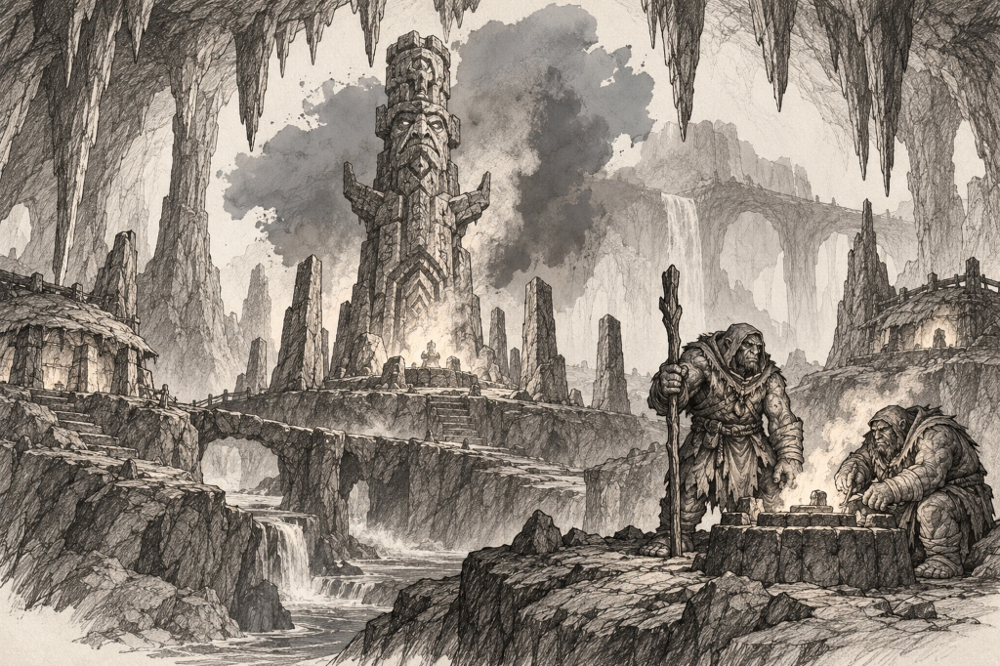
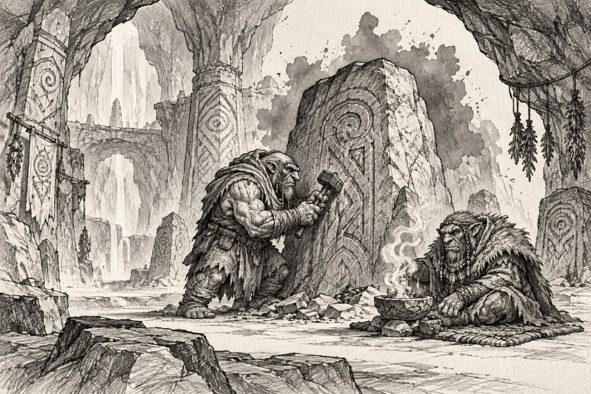
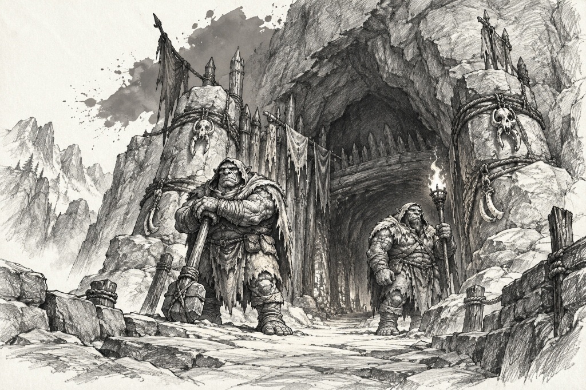
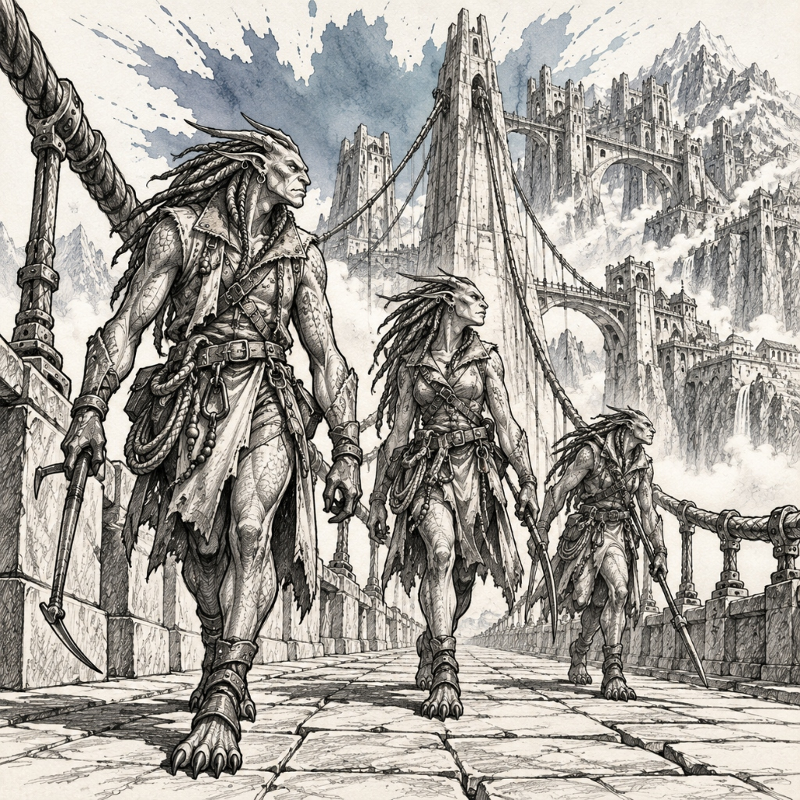
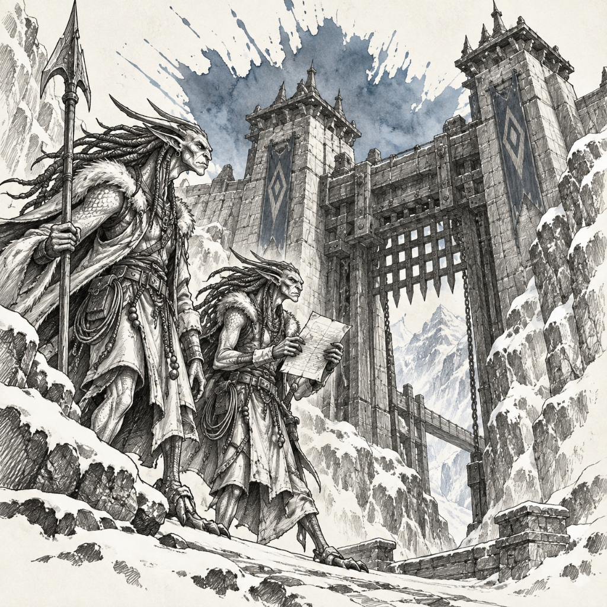
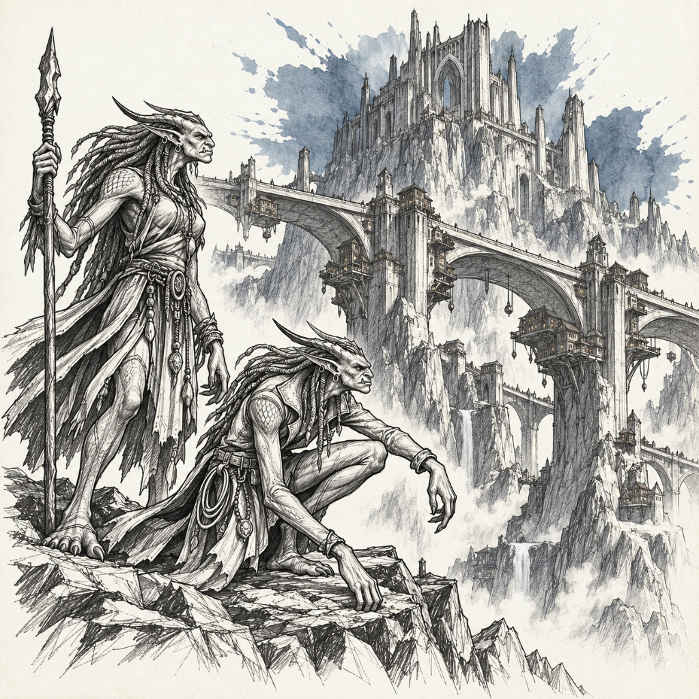

# Groven Subraces — Landmarks, Establishments & Notable Figures

> **Visual Directive**:
> - Style: 1995 Samwise Didier Concept Art (Always Be Chunky - ABC). Monochromatic rough charcoal and graphite draft linework with gritty cross-hatching on clean off-white watercolor paper.
> - Single Dynamic Watercolor Splash: The ONLY color is the signature watercolor bloom.
> - In-Focus Architecture: City and building prompts are deep-focus wide-angle interior/street-level views. Zero giant foreground portraits blocking the frame.
> - Canonical Anatomical Locks: 100% matched to approved T-poses and icon benchmarks.

---

## 🗿 1. Morgh Groven (Granite Slate Grey `#78716c`)
*Canonical Anatomical Lock*: Massive, monolithic, primal stone ogre-like beings, rock-hewn humanoids of titanic bulk and raw earth power (matching `groven_morgh_icon_v1.png` and `groven_morgh_city_karstmorgh.jpg`). Always Be Chunky (ABC) proportions: enormous crag-like chest, mountain-wide shoulders, thick pillar-like limbs, heavy square monolithic stone jaw with primal blunt crushing teeth (STRICTLY NO ORCS, NO TUSKS, NO ORCISH SNOUTS, NO PIG-MEN). Complexion: Rough cracked granite stone-skin with natural basalt fissures, dried lichen, moss, and mineral calcite veins across the back and shoulders. Eyes: Deep-set glowing molten amber or sulfur-yellow eyes beneath heavy craggy stone brow ridges. Attire: Heavy thick-stitched ox-hide quarry kilts, reinforced iron plate belts, spiked stone knee guards, bare massive rock-crushing feet. Armed with two-handed cyclopean stone-chisels, iron-banded granite mauls, and raw boulder-slings.

### 🏛️ Part A: Important Buildings & Locations (3 Prompts)

#### ✅ 1. The Kiln & Vat-Fortress of Morgh-Deep (The Sovereign Cavern Sanctuary) [GENERATED]


- **Biome & Location**: The ancient subterranean cave sanctuary and natural limestone karst of Morgh-Deep.
- **Lore & Functions**: The sovereign ancestral grotto of the Morgh Groven. A colossal natural limestone cavern hung with massive stalactites and natural stone pillars: primitive dry-stone hearth huts, low domed mud-and-stone melting kilns venting aromatic woodsmoke, and rope bridges spanning gentle underground streams. The cavern walls are marked with ancient ochre and charcoal cave paintings.
```text
Wide panoramic architectural perspective looking across the ancient subterranean cave sanctuary of The Kiln in Morgh-Deep, sovereign home of the Morgh Groven. A colossal natural limestone cavern hung with massive stalactites and natural stone pillars: primitive dry-stone hearth huts, low domed mud-and-stone melting kilns venting aromatic woodsmoke, and rope bridges spanning gentle underground streams. The cavern walls are marked with ancient ochre and charcoal cave paintings. The composition is expansive, primal, and uncluttered, with immense atmospheric cave depth. In the mid-ground on a wide rock shelf overlooking a central glowing hearth, exactly two Morgh Groven trolls (stocky, thick-limbed cave trolls with short ears, hide wraps, and stone necklaces, one holding a heavy fire-hardened wooden staff and the other tending an open brazier) confer quietly in the sacred firelight. Traditional rough black charcoal and graphite pencil linework on aged parchment paper, with a single radiant watercolor splash of Granite Slate Grey (#78716c) blooming behind the central stone kiln.
```

#### ✅ 2. The Shaping Hall & Masonry Yard (The Shamanic Rune Cavern) [GENERATED]


- **Biome & Location**: The monumental stepped granite masonry yard and sacred rune-carving cavern.
- **Lore & Functions**: The sacred cavern gallery where Morgh troll artisans inscribe bedrock slabs with ancient spiral runes and burn sage in hollow stone bowls. Master masons split and shape cyclopean monoliths with heavy mallets and flint chisels.
```text
Wide-angle interior perspective looking through the monumental vaulted cave gallery of the Shaping Caverns in Morgh-Deep. Colossal natural rock formations and smooth stalagmite pillars frame an ancient stone-carving sanctuary. Bedrock slabs are deeply inscribed with sacred spiral current runes, and dried herbal bundles hang from low limestone arches. Clean, dry cavern floor with ample breathable stone space. In the center mid-ground, exactly two Morgh Groven troll artisans work in quiet harmony: one uses a heavy flint chisel to inscribe a protective glyph into a standing bedrock boulder, while an elder shaman seated on a woven reed mat burns fragrant dried sage in a hollow stone bowl. Serene, primal, and uncluttered shamanic cave perspective with crisp graphite contours. Traditional hand-drawn charcoal and gritty graphite cross-hatching, with a single concentrated splash of Granite Slate Grey (#78716c) watercolor wash blooming behind the carved rune boulder.
```

#### ✅ 3. Karst-Morgh Megalith Bastion (The Outer Grotto Gate) [GENERATED]


- **Biome & Location**: The towering exterior natural rock mouth defending the approach to Morgh-Deep.
- **Lore & Functions**: An imposing natural cavern gatehouse reinforced with stacked dry-stone boulders, timber palisades, and bone-bound stone cairns. Vigilant troll sentries in sheepskin mantles stand guard over the winding mountain pass.
```text
Low-angle, atmospheric eye-level view from a rugged mountain gorge looking toward the Karst-Cairn Bastion, the grotto entrance leading into Morgh-Deep. A titanic natural arched cave mouth in the living rock face, reinforced with stacked rough-cut dry-stone boulders and heavy timber log palisades. Weathered stone cairns bound with braided fiber ropes and carved bone fetishes mark the path. In the center mid-ground on the gravel mountain path, exactly two Morgh Groven troll sentries (stocky, thick-set cave trolls with short rounded ears, thick beards, and heavy ox-hide cloaks) stand guard, one leaning on a heavy stone-headed war-club and the other holding a burning tallow torch. Breathable mountain grotto perspective with vast open sky and imposing natural rock contours, devoid of clutter. Traditional graphite and black charcoal drawing on off-white parchment, with a single subtle splash of Granite Slate Grey (#78716c) watercolor blooming across the high cavern arch.
```

### 👤 Part B: Notable & Legendary Figures (5 Figures)

#### 1. Vorr-Geth, Last of the Vat-Breakers (The Shattered One — Sovereign Patriarch)
- **Lore Backstory**: Ancient leader of the rebellion who shattered the enslavement vats to free the Groven race. His stone chest still bears the deep jagged fracture lines from the explosion, bound together with forged iron clamps.
```text
Single character concept art sketch of EXACTLY ONE Legendary Male Morgh Groven Patriarch, Vorr-Geth the Shattered One (matching approved benchmark icon groven_morgh_icon_v1.png). Style: 1995 Warcraft fantasy concept art in the style of Samwise Didier, Always Be Chunky (ABC). Hand-drawn rough black charcoal and graphite draft linework with colossal muscular proportions and gritty cross-hatching, isolated on clean off-white watercolor sketchbook paper. STRICTLY MONOCHROMATIC CHARACTER & GEAR: No color fills on character, armor, or weapons. STRICTLY NO TEXT, NO LETTERS, NO WORDS, NO LABELS, NO SIGNATURES, NO WATERMARKS. ABSOLUTE PROHIBITION ON MULTIPLE FIGURES: RENDER EXACTLY ONE SINGLE HEROIC FIGURE IN A MONUMENTAL PATRIARCHAL STANCE. Canonical Anatomy: Colossal, hulking primal stone ogre-like humanoid with massive boulder-like shoulders, thick muscular neck, squared granite jaw with blunt crushing teeth (STRICTLY NO ORC TUSKS, NO PIG SNOUT), burning glowing molten amber eyes under heavy craggy stone brow. Chest features dramatic, deep jagged fracture cracks held together by heavy riveted iron surgical clamps. Granite skin covered with patches of lichen. Attire: Heavy ox-hide quarry kilt, thick iron-plated belt, spiked stone knee guards, bare colossal rock-crushing feet. Gear: Resting both massive hands on the head of an immense two-handed stone-breaking sledgehammer resting on the floor, exuding indestructible ancient willpower. Setting & Crude Background: Seen in his element in the subterranean vat-citadel of Morgh-Deep with crude, hand-drawn 1995 Samwise Didier draft style background scenery sketched in rough graphite linework and gritty cross-hatching—cyclopean granite karst pillars, boiling mineral slurry vats casting fiery amber light, massive iron chains hanging from stalactites, and shattered pre-Calamity vat-remnants embedded in the stone floor. Loosely vignetted sketch background. Accent: Single dynamic explosive watercolor splash in granite slate grey and molten amber (#78716c) blooming behind the patriarch with fluid paint splatters. Pure sketchbook draft page, no formal borders or frames.
```

#### 2. Quarry-Master Brom (The Bedrock-Cleaver)
- **Lore Backstory**: Master quarryman who can find the natural fault lines in solid mountain granite by sound alone. With a single strike of his hammer, he can split a hundred-ton block with surgical precision.
```text
Single character concept art sketch of EXACTLY ONE Male Morgh Groven Stone-Cutter, Brom. Style: 1995 fantasy concept art in the style of Samwise Didier, Always Be Chunky (ABC). Hand-drawn rough black charcoal and graphite draft linework with sturdy contours and gritty cross-hatching, isolated on clean off-white watercolor sketchbook paper. STRICTLY MONOCHROMATIC CHARACTER & GEAR: No color fills on character or tools. STRICTLY NO TEXT, NO LETTERS, NO WORDS, NO LABELS, NO SIGNATURES, NO WATERMARKS. ABSOLUTE PROHIBITION ON MULTIPLE FIGURES: RENDER EXACTLY ONE SINGLE HEROIC FIGURE IN A QUARRY STANCE. Canonical Anatomy: Massive, thickset primal stone ogre with rock-textured skin, broad stone nose, glowing amber eyes, thick forearms like tree trunks, dust-covered stone beard (no orc tusks, no snouts). Attire: Heavy leather quarry apron with pocketed iron wedges, thick work boots with steel toes. Gear: Poising a massive two-handed iron quarry sledgehammer high over his shoulder, ready to strike a steel wedge driven into a raw granite slab. Setting & Crude Background: Seen in his element in the open-pit granite quarry of the Shaping Hall with crude, hand-drawn 1995 Samwise Didier draft style background scenery sketched in rough graphite linework and gritty cross-hatching—sheer stepped rock faces, enormous split stone monoliths on timber skid-sleds, heavy iron quarry wedges, timber crane-derricks, and clouds of stone-dust rising into the air. Loosely vignetted sketch background. Accent: Dynamic explosive watercolor splash in granite slate grey (#78716c) blooming behind the hammer strike with fluid paint splatters. Pure sketchbook draft page, no formal borders or frames.
```

#### 3. Slag-Tender Geth-Mor (Keeper of the Vat-Slurry)
- **Lore Backstory**: Senior alchemical founder who tends the Great Kiln's boiling slurry vats. He tests the melting point of liquefied stone by dipping his stone fingers directly into the magma.
```text
Single character concept art sketch of EXACTLY ONE Male Morgh Groven Smelter, Geth-Mor. Style: 1995 Warcraft fantasy concept art in the style of Samwise Didier, Always Be Chunky (ABC). Hand-drawn rough black charcoal and graphite draft linework with bulky contours and gritty cross-hatching, isolated on clean off-white watercolor sketchbook paper. STRICTLY MONOCHROMATIC CHARACTER & GEAR: No color fills on character or gear. STRICTLY NO TEXT, NO LETTERS, NO WORDS, NO LABELS, NO SIGNATURES, NO WATERMARKS. ABSOLUTE PROHIBITION ON MULTIPLE FIGURES: RENDER EXACTLY ONE SINGLE FIGURE IN A FOUNDRY POSE. Canonical Anatomy: Enormous, heavy-set primal stone ogre humanoid with dark basalt-textured skin, glowing sulfur-yellow eyes, heavy stone brow, wide mouth with blunt stone teeth (strictly no orc features). Attire: Charred ox-hide apron studded with bronze rivets, thick leather gauntlets. Gear: Holding an oversized iron slag-skimming shovel with both hands, inspecting a steaming ladle of molten rock slurry. Setting & Crude Background: Seen in his element beside the Great Kiln boiling slurry vats with crude, hand-drawn 1995 Samwise Didier draft style background scenery sketched in rough graphite linework and gritty cross-hatching—massive stone boiling cauldrons of liquefied rock, stone chimneys venting dark smoke, heavy slag scrapers, and red-hot magma sluice channels running into sand casting beds. Loosely vignetted sketch background. Accent: Single explosive watercolor splash in granite slate grey and furnace orange (#78716c) blooming behind the ladle with fluid paint splatters. Pure sketchbook draft page, no formal borders or frames.
```

#### 4. Stone-Binder Volda (Matriarch of the Mortar Rites)
- **Lore Backstory**: Venerable matriarch who mixes the sacred mineral binders that weld cyclopean stone blocks together forever. Her songs honor the slumbering spirits within the bedrock.
```text
Single character concept art sketch of EXACTLY ONE Female Morgh Groven Matriarch, Volda. Style: 1995 fantasy concept art in the style of Samwise Didier, Always Be Chunky (ABC). Hand-drawn rough black charcoal and graphite draft linework with broad monumental contours and gritty cross-hatching, isolated on clean off-white watercolor sketchbook paper. STRICTLY MONOCHROMATIC CHARACTER & GEAR: No color fills on character or garments. STRICTLY NO TEXT, NO LETTERS, NO WORDS, NO LABELS, NO SIGNATURES, NO WATERMARKS. ABSOLUTE PROHIBITION ON MULTIPLE FIGURES: RENDER EXACTLY ONE SINGLE HEROIC FIGURE IN A RITUAL MORTAR POSE. Canonical Anatomy: Broad-shouldered, statuesque female stone ogre-humanoid with granite skin, gentle glowing amber eyes, hair composed of carved stone braids adorned with lichen, sturdy powerful limbs (no tusks, no snouts). Attire: Heavy woven hemp robe tied with a chain belt, leather work gauntlets. Gear: Holding a stone mortar trowel in one hand and a carved bowl of glowing alchemical binder in the other, anointing a carved ancestral megalith. Setting & Crude Background: Seen in her element at an ancestral cyclopean shrine in Karst-Morgh with crude, hand-drawn 1995 Samwise Didier draft style background scenery sketched in rough graphite linework and gritty cross-hatching—massive interlocking megalithic pillars fitted without mortar, stone offering bowls filled with glowing mineral paste, smoking braziers, and ancient carved stone face runes. Loosely vignetted sketch background. Accent: Dynamic explosive watercolor splash in granite slate grey (#78716c) blooming behind the matriarch with fluid paint splatters. Pure sketchbook draft page, no formal borders or frames.
```

#### 5. Mason Kragg (Architect of the Karst Gates)
- **Lore Backstory**: Master architect who drafted the blueprints for Karst-Morgh's monumental gatehouses, balancing thousands of tons of interlocking granite without a single iron bolt.
```text
Single character concept art sketch of EXACTLY ONE Male Morgh Groven Architect, Kragg. Style: 1995 Warcraft fantasy concept art in the style of Samwise Didier. Hand-drawn rough black charcoal and graphite draft linework with sturdy contours and gritty cross-hatching, isolated on clean off-white watercolor sketchbook paper. STRICTLY MONOCHROMATIC CHARACTER & GEAR: No color fills on character or tools. STRICTLY NO TEXT, NO LETTERS, NO WORDS, NO LABELS, NO SIGNATURES, NO WATERMARKS. ABSOLUTE PROHIBITION ON MULTIPLE FIGURES: RENDER EXACTLY ONE SINGLE HEROIC FIGURE IN AN ARCHITECTURAL DRAFTING POSE. Canonical Anatomy: Colossal primal stone ogre architect with weathered granite features, focused amber eyes under heavy stone brow, massive dexterous stone hands (strictly no orc tusks). Attire: Leather work kilt, tool belt with iron calipers and plumb-bobs. Gear: Holding a large iron proportioning square against a standing stone tablet inscribed with architectural blueprints, examining the angles with calculating focus. Setting & Crude Background: Seen in his element in the architectural workshop of Karst-Morgh with crude, hand-drawn 1995 Samwise Didier draft style background scenery sketched in rough graphite linework and gritty cross-hatching—carved stone drafting tables, standing megalith slabs inscribed with fortress blueprints, iron proportioning calipers, and miniature carved stone models of defensive gatehouses. Loosely vignetted sketch background. Accent: Single dynamic explosive watercolor splash in granite slate grey (#78716c) blooming behind the stone tablet with fluid paint splatters. Pure sketchbook draft page, no formal borders or frames.
```

---

## 🌉 2. Ithran Groven (Mountain Slate Blue `#64748b`)
*Canonical Anatomical Lock*: Tall, noble, statuesque, athletic mountain stone-humanoids and high-span bridge engineers (matching `groven_ithran_icon_v1.png`, `groven_ithran_city_cragspan.jpg`, and `groven_ithran_city_cragspan.png`). Leaner, taller, agile stone-humanoid physiques built for balance on high mountain cables and narrow suspension arches. Complexion: Smooth, wind-polished slate-blue mineral skin with natural erosion contours and slate-shard ridges along clavicles and calves. Eyes: Deep-set glowing cobalt-blue or ice-grey eyes. Facial features: Chiseled, noble, aerodynamic stone face, clean jawline, noble humanoid profile. STRICT NEGATIVE GUARDRAILS: STRICTLY NO ORCS, NO TUSKS, NO ORCISH SNOUTS, NO PIG-MEN, NO GREEN SKIN. ATHLETIC, NOBLE STONE-HUMANOIDS WITH WIND-POLISHED SLATE-BLUE MINERAL SKIN. Attire: Cable-harness work vests of treated mountain-goat leather, brass carabiners and rigging rings, fingerless climbing gloves, spiked mountain climbing boots. Armed with stone-tipped mountaineering picks, counterweighted balance poles, steel cable winches, and heavy climbing ropes.

### 🏛️ Part A: Important Buildings & Locations (3 Prompts)

#### ✅ 1. Bridge-Peak & Cloud-Gantry Span-City (The Sovereign Capital) [GENERATED]


- **Biome & Location**: The dizzying alpine peaks and sheer glacial gorges of Frostmaw Crag.
- **Lore & Functions**: The sovereign high-altitude capital of the Ithran Groven. An extraordinary monumental metropolis suspended between alpine mountain summits over a two-mile-deep cloud canyon. A monumental grand suspension bridge spans alpine peaks with soaring stone pylons and steel cable networks, while thousands of Ithran citizens dwell along the terraced hillsides, steep mountain slopes, and sheer cliffs flanking the bridge. Terraced stone aeries, cliff-carved promenades, and hanging garden-terraces are carved directly into the living granite mountainsides, connected to the bridge deck by winding stairs and aerial gondolas. Street-level walkways along the grand bridge span house the High Toll Bazaar where merchants barter alpine goat wool, iron carabiners, climbing pitons, smoked mountain trout, and wind-harps under canvas sunshades.
```text
Dramatic diagonal perspective looking along the massive stone deck of the grand alpine suspension bridge of Bridge-Peak, sovereign capital of the Ithran Groven. Soaring stone-and-steel pylon towers suspend heavy braided cables spanning across a two-mile-deep cloud canyon between snow-capped alpine summits. In the background, extensive multi-tiered stone dwellings and carved promenades climb the steep mountain cliffs flanking the bridge, with smoke rising from stone hearth chimneys. On the broad flagstone bridge deck in the mid-ground, three Ithran Groven sentries walk their patrol: tall, noble, athletic stone-hewn humanoids with smooth wind-polished slate-blue mineral skin, noble chiseled facial contours, stone dreadlock braids, and glowing cobalt eyes, wearing mountain-leather cable-harness vests with brass carabiners and spiked climbing boots, holding mountaineering picks. Soaring alpine civil engineering with monumental scale, breathable space, and zero crowd clutter. Style: 1995 Samwise Didier fantasy concept art draft, Always Be Chunky (ABC). Rough black charcoal and graphite linework with gritty cross-hatching on off-white parchment paper. Strictly monochromatic line art with NO color fills. Single dynamic explosive watercolor splash in mountain slate blue (#64748b) blooming behind the central bridge tower with fluid paint splatters.
```

#### ✅ 2. Frostmaw Crag Toll-Gate & Toll-Keep (The High Pass Bastion) [GENERATED]


- **Biome & Location**: The narrow mountain notch where the continental trade road enters the bridge network.
- **Lore & Functions**: The heavily fortified customs keep guarding the northern pass. Massive counterbalanced iron portcullises block the narrow gorge. High stone towers house customs clerks who weigh merchant wagon trains on gargantuan hydraulic balance scales to determine road tariffs.
```text
Low-angle dramatic perspective looking up from a snowy mountain canyon approach toward the formidable stone gatehouse of Frostmaw Crag Toll-Gate, border fortress of the Ithran Groven. Massive interlocking slate-granite battlements span a narrow frozen mountain gap between vertical cliffs, featuring a heavy counterbalanced iron-banded stone portcullis and high watchtowers. Standing on the stone approach ramp in the mid-ground, two Ithran Groven toll-wardens inspect a surveyor's pass: tall, statuesque stone-hewn humanoids with smooth slate-blue rock skin, chiseled noble faces, stone hair dreads, and glowing cobalt eyes, wearing heavy mountain-goat leather traveling coats with brass rigging buckles and spiked boots, holding long stone-tipped halberds. Imposing alpine fortress architecture with clean focal lines and zero clutter. Style: 1995 Samwise Didier concept art draft, Always Be Chunky (ABC). Rough black charcoal and graphite linework with gritty cross-hatching on off-white paper. Strictly monochromatic linework, no color fills. Single dynamic explosive watercolor splash in mountain slate blue (#64748b) blooming behind the toll-keep tower with fluid paint splatters.
```

#### ✅ 3. The First Span & High Arch Promenade (The Ancestral Bridge) [GENERATED]


- **Biome & Location**: The central stone arch of Bridge-Peak spanning the widest canyon gulf.
- **Lore & Functions**: The original stone arch constructed by the first Ithran builders. Broad enough for three wagon trains to pass abreast, its balustrades are adorned with monumental statues of ancestral bridge-singers holding iron lanterns that burn through mountain blizzards.
```text
Sweeping wide-angle vista from a high mountain ridge overlooking the colossal semicircular stone arch of the First Span, ancestral promenade of the Ithran Groven. A gargantuan cyclopean stone arch bridge springs across an alpine chasm high above a sea of rolling white clouds, flanked by carved stone balustrades lined with monumental statues of ancient Ithran bridge-builders holding stone lanterns. Crossing the central flagstone span in the mid-ground, two Ithran Groven travelers walk alongside a mountain pack-beast: tall athletic stone-trolls with slate-blue mineral skin, sweeping backward-curving ribbed stone horns along the crown, braided stone dreadlocks bound with silver wire, long pointed ears with silver hoops, prominent lower under-fangs, shoulder scale plating, and clawed climbing limbs, carrying counterweighted balance poles and climbing gear. Majestic high-altitude monument with vast open sky and clean composition. Style: 1995 Samwise Didier concept art draft. Rough black charcoal and graphite linework with gritty cross-hatching on clean off-white sketchbook paper. Monochromatic drawing with NO color fills. Single dynamic explosive watercolor splash in radiant mountain slate blue (#64748b) blooming behind the central stone arch with fluid splatters.
```

### 👤 Part B: Notable & Legendary Figures (5 Figures)

#### 1. Ithra-Mal, High Toll-Keeper of Frostmaw Crag (The Voice of the Spans — Sovereign Toll-Lord)
- **Lore Backstory**: Sovereign master of the bridges whose word is law across the high passes. He personally engineered the counterweighted cable locks that allow Bridge-Peak to withstand hurricane alpine winds.
```text
Single character concept art sketch of EXACTLY ONE Legendary Male Ithran Groven Warlord, Ithra-Mal (matching approved benchmark groven_ithran_location_first_span.jpg). Style: 1995 Warcraft fantasy concept art in the style of Samwise Didier, Always Be Chunky (ABC). Hand-drawn rough black charcoal and graphite draft linework with tall statuesque muscular contours and gritty cross-hatching, isolated on clean off-white watercolor sketchbook paper. STRICTLY MONOCHROMATIC CHARACTER & GEAR: No color fills on character, armor, or weapons. STRICTLY NO TEXT, NO LETTERS, NO WORDS, NO LABELS, NO SIGNATURES, NO WATERMARKS. ABSOLUTE PROHIBITION ON MULTIPLE FIGURES: RENDER EXACTLY ONE SINGLE HEROIC FIGURE IN A COMMANDING HIGH-SPAN STANCE. Canonical Anatomy: Tall, broad-shouldered, athletic stone-troll with slate-blue mineral skin, sweeping backward-curving ribbed stone horns curling from his brow, long braided stone dreadlocks bound with silver wire, piercing glowing cobalt eyes, pointed ears with silver hoops, chiseled stone jaw with prominent lower under-fangs, fine stone-scale plating across shoulders and back, and clawed stone hands. Attire: Heavy tailored mountain leather work coat over studded brigandine cuirass, wide leather rigging belt hung with heavy brass carabiners and iron keys, reinforced climbing boots with ice-spikes. Gear: Resting one hand on the hilt of a massive two-handed mountaineer's poleaxe planted on the stone paving, holding a heavy brass telescope in his other hand. Setting & Crude Background: Seen in his element on the grand suspension bridge of Bridge-Peak with crude, hand-drawn 1995 Samwise Didier draft style background scenery sketched in rough graphite linework and gritty cross-hatching—a colossal arched stone bridge springing across a two-mile-deep cloud chasm, terraced hillside stone houses on the mountain slopes, heavy steel suspension cables, distant jagged alpine peaks, and toll-keep watchtowers. Loosely vignetted sketch background. Accent: Single dynamic explosive watercolor splash in mountain slate blue (#64748b) blooming behind the toll-lord with fluid paint splatters. Pure sketchbook draft page, no formal borders or frames.
```

#### 2. Geth-Run, the Murmur-Blooded (The Bridge Between)
- **Lore Backstory**: Respected mediator born with both Morgh karst resilience and Ithran balance. He travels continuously between the deep quarries and the high bridges, settling disputes between the clans.
```text
Single character concept art sketch of EXACTLY ONE Male Groven Mediator, Geth-Run. Style: 1995 fantasy concept art in the style of Samwise Didier. Hand-drawn rough black charcoal and graphite draft linework with sturdy hybrid stone contours and gritty cross-hatching, isolated on clean off-white watercolor sketchbook paper. STRICTLY MONOCHROMATIC CHARACTER & GEAR: No color fills on character or garments. STRICTLY NO TEXT, NO LETTERS, NO WORDS, NO LABELS, NO SIGNATURES, NO WATERMARKS. ABSOLUTE PROHIBITION ON MULTIPLE FIGURES: RENDER EXACTLY ONE SINGLE HEROIC FIGURE IN A DIGNIFIED MEDIATOR POSE. Canonical Anatomy: Powerful, muscular stone-hybrid exhibiting mottled granite-and-slate blue skin, one glowing amber eye and one glowing cobalt eye, dignified stone brow with short ridged horn nubs, lower under-fangs, braided dreadlocks, calm thoughtful smile. Attire: Heavy wool-and-leather traveler's mantle, climbing harness, sturdy leather mountain boots. Gear: Holding an unrolled parchment treaty slate in both hands, an iron bridge-mallet strapped across his back. Setting & Crude Background: Seen in his element at the boundary waystation between quarry and bridge with crude, hand-drawn 1995 Samwise Didier draft style background scenery sketched in rough graphite linework and gritty cross-hatching—a stone-paved mountain road crossing from rough karst boulders to polished bridge arches, resting pack beasts, stone distance cairns, and mountain mist swirling over cliffs. Loosely vignetted sketch background. Accent: Dynamic explosive watercolor splash in slate blue and granite grey (#64748b / #78716c) blooming behind the mediator with fluid paint splatters. Pure sketchbook draft page, no formal borders or frames.
```

#### 3. Cable-Master Tor (Lord of the High Gantry)
- **Lore Backstory**: Chief cable rigger who inspects the steel suspension cables thousands of feet above the clouds. He can balance on a two-inch cable in a blizzard without safety lines.
```text
Single character concept art sketch of EXACTLY ONE Male Ithran Groven Rigger, Tor. Style: 1995 Warcraft fantasy concept art in the style of Samwise Didier. Hand-drawn rough black charcoal and graphite draft linework with athletic contours and gritty cross-hatching, isolated on clean off-white watercolor sketchbook paper. STRICTLY MONOCHROMATIC CHARACTER & GEAR: No color fills on character or tools. STRICTLY NO TEXT, NO LETTERS, NO WORDS, NO LABELS, NO SIGNATURES, NO WATERMARKS. ABSOLUTE PROHIBITION ON MULTIPLE FIGURES: RENDER EXACTLY ONE SINGLE FIGURE IN A BALANCING RIGGER STANCE. Canonical Anatomy: Tall, lithe, muscular stone-troll with slate-blue skin, sweeping ribbed stone horns curling backward, wind-whipped chiseled facial contours with lower under-fangs, glowing blue eyes, braided dreadlocks, long powerful arms with clawed stone hands and taloned climbing feet. Attire: Leather rigging vest, thick cowhide grip gloves, heavy tool bandolier with wrenches and cable grease, spiked climbing boots. Gear: Balancing effortlessly on a narrow beam, holding a heavy iron cable-crimping lever over his shoulder, a coil of steel wire across his chest. Setting & Crude Background: Seen in his element suspended on a main gantry cable high above the clouds with crude, hand-drawn 1995 Samwise Didier draft style background scenery sketched in rough graphite linework and gritty cross-hatching—thick braided steel cables disappearing into swirling white mist, terraced hillside homes below, counterweighted cable-cars gliding below, iron pulley sheaves, and vertigo-inducing mountain drops. Loosely vignetted sketch background. Accent: Single explosive watercolor splash in mountain slate blue (#64748b) blooming behind the rigger with fluid paint splatters. Pure sketchbook draft page, no formal borders or frames.
```

#### 4. Sentry Kael-Ithr (Vigilant of the Scree Pass)
- **Lore Backstory**: Eagle-eyed sentry stationed at the highest watchtower of Frostmaw Crag. He uses a colossal brass wind-horn to signal approaching storms or invading armies across fifty miles of peaks.
```text
Single character concept art sketch of EXACTLY ONE Male Ithran Groven Sentry, Kael-Ithr. Style: 1995 fantasy concept art in the style of Samwise Didier. Hand-drawn rough black charcoal and graphite draft linework with alert sharp contours and gritty cross-hatching, isolated on clean off-white watercolor sketchbook paper. STRICTLY MONOCHROMATIC CHARACTER & GEAR: No color fills on character or gear. STRICTLY NO TEXT, NO LETTERS, NO WORDS, NO LABELS, NO SIGNATURES, NO WATERMARKS. ABSOLUTE PROHIBITION ON MULTIPLE FIGURES: RENDER EXACTLY ONE SINGLE HEROIC FIGURE IN A SENTRY POSE. Canonical Anatomy: Broad, athletic stone-troll with slate-blue mineral skin, sweeping backward-curving stone horns along his crown, pointed ears with silver hoops, prominent lower under-fangs, intense glowing cobalt eyes, shoulder scale plating, weather-etched brow, and braided stone dreadlocks. Attire: Heavy fur-lined leather overcoat, studded leather bracers, climbing boots. Gear: Holding a long mountain spear with an iron-capped butt-spike in one hand, holding a carved ram-horn war horn to his belt, gazing out over the precipice. Setting & Crude Background: Seen in his element at the high watchtower of Frostmaw Crag with crude, hand-drawn 1995 Samwise Didier draft style background scenery sketched in rough graphite linework and gritty cross-hatching—a narrow stone battlements balcony, an enormous mounted bronze signaling horn, snow-dusted rock pinnacles, and biting alpine winds whipping through the pass. Loosely vignetted sketch background. Accent: Dynamic explosive watercolor splash in slate blue (#64748b) blooming behind the sentry with fluid paint splatters. Pure sketchbook draft page, no formal borders or frames.
```

#### 5. Arch-Architect Varis (Builder of the Cloud Arches)
- **Lore Backstory**: Master engineer who designed the self-supporting stone arches of Bridge-Peak. She can calculate the harmonic load of a thousand tons of stone in her head.
```text
Single character concept art sketch of EXACTLY ONE Female Ithran Groven Architect, Varis. Style: 1995 fantasy concept art in the style of Samwise Didier. Hand-drawn rough black charcoal and graphite draft linework with elegant monumental contours and gritty cross-hatching, isolated on clean off-white watercolor sketchbook paper. STRICTLY MONOCHROMATIC CHARACTER & GEAR: No color fills on character or scrolls. STRICTLY NO TEXT, NO LETTERS, NO WORDS, NO LABELS, NO SIGNATURES, NO WATERMARKS. ABSOLUTE PROHIBITION ON MULTIPLE FIGURES: RENDER EXACTLY ONE SINGLE HEROIC FIGURE IN A DRAFTING STANCE. Canonical Anatomy: Statuesque, tall female stone-troll with slate-blue mineral skin, sweeping elegant backward-curving stone horns, glowing ice-blue eyes, pointed ears with silver hoops, subtle under-fangs, braided stone dreadlocks pinned with copper rings, and fine stone-scale plating on shoulders. Attire: Tailored leather engineer's tunic with brass fasteners, pleated work skirt, sturdy climbing shoes. Gear: Holding an oversized brass bridge-caliper and a rolled architectural parchment blueprint, standing proudly beside a carved stone model of a multi-tier arch bridge. Setting & Crude Background: Seen in her element in the bridge design aerie of Bridge-Peak with crude, hand-drawn 1995 Samwise Didier draft style background scenery sketched in rough graphite linework and gritty cross-hatching—open arched stone windows looking directly out across the First Span and terraced hillside districts, heavy drafting tables with architectural parchment rolls, plumb-bobs, brass levels, and stone architectural models. Loosely vignetted sketch background. Accent: Single dynamic explosive watercolor splash in mountain slate blue (#64748b) blooming behind the blueprint with fluid paint splatters. Pure sketchbook draft page, no formal borders or frames.
```
