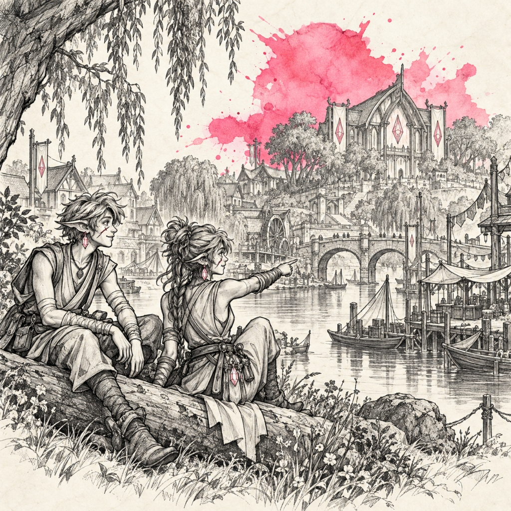
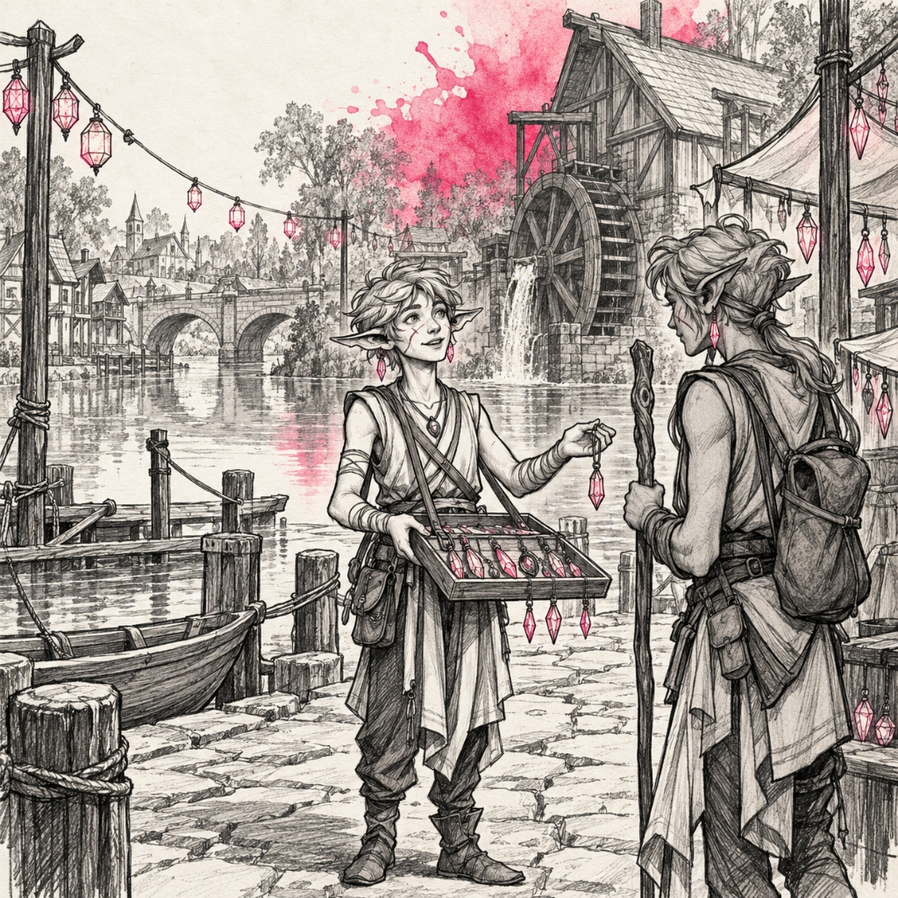
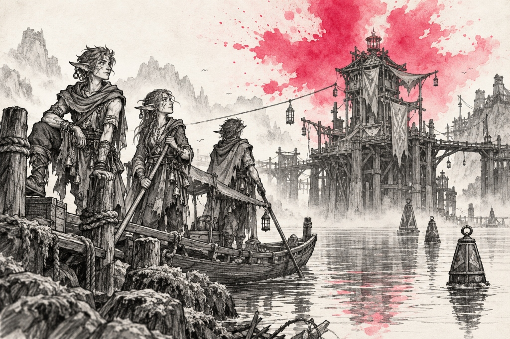

# Mimir Subraces — Landmarks, Establishments & Notable Figures

> **Visual Directive**:
> - Style: 1995 Samwise Didier Concept Art (Always Be Chunky - ABC). Monochromatic rough charcoal and graphite draft linework with gritty cross-hatching on clean off-white watercolor paper.
> - Single Dynamic Watercolor Splash: The ONLY color is the signature watercolor bloom.
> - In-Focus Architecture: City and building prompts are deep-focus wide-angle interior/street-level views. Zero giant foreground portraits blocking the frame.
> - Canonical Anatomical Locks: 100% matched to approved T-poses and icon benchmarks.

---

## 🎭 1. Broken Mimir (Festival Rose `#e11d48`)
*Canonical Anatomical Lock*: Slender, expressive, theatrical fae performers, acrobats, and puppeteers with **STRICTLY NO MASKS** (matching `mimir_broken_icon_v1.png`, `mimir_broken_culture_mirror.png`, and `mimir_broken_city_revelsend.jpg`). Graceful, lithe, agile frames accustomed to acrobatic leaps and street performances. Face & Head: Exposed theatrical faces with intricate, dramatic **demon facial scarring** across cheekbones, brow, and jaw; unique, elongated pointed **demon-fae ears** pierced and heavily adorned with elaborate dangling jewelry, tiered silver and brass ear-cuffs, delicate nose-to-ear chains, and polished glass beads. Deep expressive amber or rose eyes with painted theatrical greasepaint accents. Attire: Frayed velvet and silk carnival motley, patchwork jester tunics with tattered ribbon tails, brass jingle bells sewn to hem and cuffs, leather harness for puppets and props, soft leather dancing slippers. Armed with wooden marionette rods, juggling clubs, silver throwing ribbons, and concealed rapier canes.

### 🏛️ Part A: Important Buildings & Locations (3 Prompts)

#### ✅ 1. Oakhaven & River's Reach (The Sovereign Woodland Capital) [GENERATED]


- **Biome & Location**: The fertile, woodsy river-basin and ancient willow groves of River's Reach.
- **Lore & Functions**: The sovereign river settlement of the Broken Mimir. Graceful timber-and-stone halls, watermills, and lantern-strung riverside pavilions blend harmoniously into broadleaf groves. Slender, unmasked Mimir adorned with dangling crystal drop prisms and demon cheek scars gather along the peaceful waterways, free from rigid sky-court doctrines.
```text
Wide panoramic vista from a gentle mossy hill looking across the open woodland basin and winding river toward Oakhaven & River's Reach, the sovereign settlement of the Broken Mimir. Graceful timber-and-stone longhouses, quiet waterwheels, and open-air riverside market pavilions blend into an ancient grove of towering weeping willows and broadleaf trees. A low, broad arched stone bridge spans the calm river, where small wooden skiffs drift quietly. In the foreground on the grassy riverbank, exactly two Broken Mimir (slender, completely unmasked with bare heads, wild swept hair, pointed ears with glowing crystal drop earrings, demon cheek scars, and linen tunics with arm wraps) sit on a sunlit log, one pointing across the shimmering water toward the bustling riverfront. Traditional rough black charcoal and graphite pencil linework on aged parchment paper, with a single vibrant watercolor splash of Festival Rose (#e11d48) blooming softly behind the central council hall.
```

#### ✅ 2. The Crystal-Peddler's Quay & Watermill (The Riverside Wharf) [GENERATED]


- **Biome & Location**: The wide cobbled riverside wharf and turning watermill along the River's Reach riverfront.
- **Lore & Functions**: The open-air trading pier where crystal artisans display freshly cut rose-tinted prisms and resonant amulets on wooden trays. Strings of festive lanterns sway gently in the river breeze as travelers pause beside the millrace.
```text
Low-angle, atmospheric eye-level view along a wide cobbled riverside wharf next to an old moss-covered timber watermill. Calm reflective river water laps against heavy oak moorings where a curved wooden skiff is tied. A string of paper lanterns sways gently between carved cedar posts. In the center mid-ground, exactly two Broken Mimir are interacting on the wide cobblestone quay: one young unmasked peddler (wild hair, demon cheek scar, long ears with hanging crystal prisms, sleeveless tunic, arm wraps) holds out a shallow wooden display tray of cut crystal pendants to a traveling companion holding a wooden walking staff. Clean, spacious composition with plenty of breathable stone walkway and gentle ripples. Traditional hand-drawn charcoal and gritty graphite cross-hatching, with a subtle splash of Festival Rose (#e11d48) watercolor wash blooming behind the turning waterwheel.
```

#### ✅ 3. The Mist-Ferry River Mooring & Watch-Keep (The Waterway Outpost) [GENERATED]


- **Biome & Location**: The moody, mist-laden river crossing framed by distant foothills and calm waters.
- **Lore & Functions**: The border crossing where flat-bottom wooden punts and guide-ropes shuttle travelers across the wide river into Broken Mimir territory. A towering rustic timber beacon keep oversees the channel, adorned with fluttered banners and floating channel buoys.
```text
Wide-angle ground-level perspective from a low mossy shoreline looking across a quiet, misty waterway toward a fortified wooden toll-shanty and mooring tower built on thick cedar pilings. A long, taut guide-rope stretches across the water into the fog. Floating carved wooden buoys mark the channel. In the mid-ground on the low wooden pier, exactly three Broken Mimir boatmen (tall and agile, unmasked faces displaying distinct jagged cheek scars, pointed demon ears pierced with cascading brass hoops, draped in loose hooded traveling cloaks over bells and motley) stand by their pole-punt, waiting for incoming barges. Vast, moody open sky and quiet water reflections, devoid of clutter. Traditional graphite and black charcoal drawing on off-white parchment, with a single subtle splash of Festival Rose (#e11d48) watercolor blooming across the mist-cairn beacon.
```

### 👤 Part B: Notable & Legendary Figures (5 Figures)

#### 1. Vaelith Thread-Speaker (The Last Reader — Sovereign Storyteller)
- **Lore Backstory**: Venerable unmasked bard who remembers the unbroken songs of the ancient fae court. With her expressive demon-scarred face and long pierced ears jingling with silver, she reenacts the fall of the sky-citadels through intricate string marionettes.
```text
Single character concept art sketch of EXACTLY ONE Legendary Female Broken Mimir Storyteller, Vaelith Thread-Speaker. Style: 1995 fantasy concept art in the style of Samwise Didier. Hand-drawn rough black charcoal and graphite draft linework with graceful expressive contours and gritty cross-hatching, isolated on clean off-white watercolor sketchbook paper. STRICTLY MONOCHROMATIC CHARACTER & GEAR: No color fills on character, motley, or puppet. STRICTLY NO TEXT, NO LETTERS, NO WORDS, NO LABELS, NO SIGNATURES, NO WATERMARKS. ABSOLUTE PROHIBITION ON MULTIPLE FIGURES: RENDER EXACTLY ONE SINGLE HEROIC FIGURE IN A POISED PUPPETEER STANCE. STRICTLY NO MASKS: EXPOSED DEMON-SCARRED FACE. Canonical Anatomy: Slender, lithe fae woman with delicate posture. Face & Ears: Completely unmasked face marked with intricate, beautiful demon scarring across her brow and left cheek; unique elongated pointed demon-fae ears pierced with multiple dangling silver hoop earrings and delicate cascading chains. Expressive theatrical eyes. Attire: Layered draped velvet motley coat with frayed ribbon hems, bell-trimmed sleeves, embroidered sash, soft dancing slippers. Gear: Raising both hands to manipulate an elaborate wooden marionette cross-control, guiding a miniature carved wooden fae puppet that hovers in mid-air below her fingers. Setting & Crude Background: Seen in her element upon a creaking wooden stage in Revel's End with crude, hand-drawn 1995 Samwise Didier draft style background scenery sketched in rough graphite linework and gritty cross-hatching—tattered velvet carnival curtains, hanging paper lanterns, striped tent poles, wooden marionette racks, and children and wanderers sitting cross-legged in the audience. Loosely vignetted sketch background. Accent: Single dynamic explosive watercolor splash in rich festival rose (#e11d48) blooming behind the storyteller with fluid paint splatters. Pure sketchbook draft page, no formal borders or frames.
```

#### 2. Clown-King Harlequin Vane (Lord of Revel’s End)
- **Lore Backstory**: Flamboyant self-proclaimed monarch of the shanty carnival. Master of acrobatics and satire who flaunts his demon-scarred grin and jingling ear-cuffs while dancing on a tightrope to mock high nobles.
```text
Single character concept art sketch of EXACTLY ONE Male Broken Mimir Performer, Harlequin Vane (matching approved benchmark icon mimir_broken_icon_v1.png). Style: 1995 fantasy concept art in the style of Samwise Didier, Always Be Chunky (ABC). Hand-drawn rough black charcoal and graphite draft linework with theatrical energetic contours and gritty cross-hatching, isolated on clean off-white watercolor sketchbook paper. STRICTLY MONOCHROMATIC CHARACTER & GEAR: No color fills on character or gear. STRICTLY NO TEXT, NO LETTERS, NO WORDS, NO LABELS, NO SIGNATURES, NO WATERMARKS. ABSOLUTE PROHIBITION ON MULTIPLE FIGURES: RENDER EXACTLY ONE SINGLE HEROIC FIGURE IN A THEATRICAL BOWING POSE. STRICTLY NO MASK: EXPOSED DEMON-SCARRED FACE. Canonical Anatomy: Agile, slender fae man with wide theatrical stance. Face & Ears: Unmasked expressive face with dramatic demon scarring cutting across both cheeks in an ironic grin; prominent pointed demon-fae ears lined with heavy gold cuffs, ring piercings, and tiny tinkling bells. Attire: Flamboyant diamond-patterned patchwork jester doublet with ruff collar, pointed velvet shoes with brass bells, multi-tailed belt hung with small prop daggers. Gear: Holding a carved jester's bauble scepter topped with a miniature laughing skull in one hand, sweeping his feathered tricorn hat with the other. Setting & Crude Background: Seen in his element in the bustling carnival thoroughfare of Revel's End with crude, hand-drawn 1995 Samwise Didier draft style background scenery sketched in rough graphite linework and gritty cross-hatching—colorful canvas wagons, juggling pins flying in the air, hanging floral bunting, festival jewelry stalls, and an acrobatic tightrope stretched between willow trees above. Loosely vignetted sketch background. Accent: Single explosive watercolor splash in vibrant festival rose (#e11d48) blooming behind the clown-king with fluid paint splatters. Pure sketchbook draft page, no formal borders or frames.
```

#### 3. Jewel-Smith Pip (The Demon-Jeweler of Revel’s End)
- **Lore Backstory**: Master artisan of Revel's End whose custom ear-cuffs, silver brow-chains, and demon-ear piercings give newly arrived runaways a dazzling, defiant identity.
```text
Single character concept art sketch of EXACTLY ONE Male Broken Mimir Jeweler, Pip. Style: 1995 fantasy concept art in the style of Samwise Didier. Hand-drawn rough black charcoal and graphite draft linework with sturdy craftsman contours and gritty cross-hatching, isolated on clean off-white watercolor sketchbook paper. STRICTLY MONOCHROMATIC CHARACTER & GEAR: No color fills on character or tools. STRICTLY NO TEXT, NO LETTERS, NO WORDS, NO LABELS, NO SIGNATURES, NO WATERMARKS. ABSOLUTE PROHIBITION ON MULTIPLE FIGURES: RENDER EXACTLY ONE SINGLE FIGURE IN A WORKBENCH JEWELRY-MAKING POSE. STRICTLY NO MASK. Canonical Anatomy: Compact, dexterous fae artisan with unmasked face, prominent demon cheek scars, long pointed demon ears heavily pierced with bronze and silver rings. Attire: Heavy leather work apron over rolled-sleeve tunic, tool belt with fine jewelers' pliers and tweezers, soft leather boots. Gear: Holding an ultra-fine silver ear-cuff in small needle-nosed pliers in one hand and a miniature jewel-setting hammer in the other over a small steel anvil. Setting & Crude Background: Seen in his element inside a mirror-lined jewelry workshop booth with crude, hand-drawn 1995 Samwise Didier draft style background scenery sketched in rough graphite linework and gritty cross-hatching—trays of glittering silver and brass ear-cuffs, spools of fine wire, jewelry vises, oval brass mirrors reflecting candlelight, and velvet pouches of gemstones. Loosely vignetted sketch background. Accent: Dynamic explosive watercolor splash in festival rose and gold (#e11d48) blooming behind the workbench with fluid paint splatters. Pure sketchbook draft page, no formal borders or frames.
```

#### 4. The Mute Jester Lira (Dancer of the Broken Bell)
- **Lore Backstory**: Acrobatic scout who speaks only through expressive mime, her demon-scarred smile, and the rhythmic chime of the silver bells dangling from her pointed ears and wrist wraps.
```text
Single character concept art sketch of EXACTLY ONE Female Broken Mimir Acrobat, Lira. Style: 1995 fantasy concept art in the style of Samwise Didier. Hand-drawn rough black charcoal and graphite draft linework with agile dynamic contours and gritty cross-hatching, isolated on clean off-white watercolor sketchbook paper. STRICTLY MONOCHROMATIC CHARACTER & GEAR: No color fills on character or ribbons. STRICTLY NO TEXT, NO LETTERS, NO WORDS, NO LABELS, NO SIGNATURES, NO WATERMARKS. ABSOLUTE PROHIBITION ON MULTIPLE FIGURES: RENDER EXACTLY ONE SINGLE HEROIC FIGURE IN A LEAPING ACROBATIC POSE. STRICTLY NO MASK: EXPOSED DEMON-SCARRED FACE. Canonical Anatomy: Slender, hyper-flexible fae woman. Face & Ears: Unmasked expressive face with delicate demon facial scarring, large captivating eyes, long sweeping pointed demon-fae ears pierced with tiered silver hoops and small chime bells. Attire: Form-fitting dancer's leotard adorned with fluttering silk ribbons, bell-tipped wrist wraps, bare agile feet with ribbon wraps. Gear: Leaping gracefully in mid-air, trailing long swirling silk festival ribbons from her hands. Setting & Crude Background: Seen in her element dancing across a high suspended tightrope with crude, hand-drawn 1995 Samwise Didier draft style background scenery sketched in rough graphite linework and gritty cross-hatching—festooned carnival pennants fluttering in the breeze, the tops of striped circus pavilions, mossy willow tree branches, and the blurred crowd watching from below. Loosely vignetted sketch background. Accent: Single explosive watercolor splash in striking festival rose (#e11d48) blooming behind the acrobat with fluid paint splatters. Pure sketchbook draft page, no formal borders or frames.
```

#### 5. String-Puppeteer Milo (Master of the Marionettes)
- **Lore Backstory**: Mysterious puppeteer whose melancholy demon-scarred expression and life-sized wooden marionettes captivate audiences across the shanty carnival.
```text
Single character concept art sketch of EXACTLY ONE Male Broken Mimir Puppeteer, Milo. Style: 1995 fantasy concept art in the style of Samwise Didier. Hand-drawn rough black charcoal and graphite draft linework with expressive contours and gritty cross-hatching, isolated on clean off-white watercolor sketchbook paper. STRICTLY MONOCHROMATIC CHARACTER & GEAR: No color fills on character or puppet. STRICTLY NO TEXT, NO LETTERS, NO WORDS, NO LABELS, NO SIGNATURES, NO WATERMARKS. ABSOLUTE PROHIBITION ON MULTIPLE FIGURES: RENDER EXACTLY ONE SINGLE HEROIC FIGURE IN A COMMANDING MARIONETTE POSE. STRICTLY NO MASK: EXPOSED DEMON-SCARRED FACE. Canonical Anatomy: Tall, gaunt fae man. Face & Ears: Melancholy unmasked face with jagged demon scarring across his brow and jawline; long pointed demon-fae ears decorated with silver studs and an ornate chain looped to his collar. Attire: Tailored velvet frock coat with silk lapels, lace cravat, high leather riding boots. Gear: Holding an ornate wooden marionette controller with dozens of taut strings radiating downward to a life-sized wooden soldier puppet standing rigidly at his side. Setting & Crude Background: Seen in his element behind a wooden puppet theatre booth with crude, hand-drawn 1995 Samwise Didier draft style background scenery sketched in rough graphite linework and gritty cross-hatching—carved wooden puppet stages, tangled strings hanging from crossbars, disembodied painted wooden puppet heads on shelves, and a flickering tallow footlight. Loosely vignetted sketch background. Accent: Dynamic explosive watercolor splash in festival rose (#e11d48) blooming behind the puppeteer with fluid paint splatters. Pure sketchbook draft page, no formal borders or frames.
```

---

### 👑 2. Arch Mimir (Imperial Amethyst `#7c3aed`)
*Canonical Anatomical Lock*: Stately, severe, aristocratic fae nobles who secretly harbor latent, curbed demonic traits (subtle curved horn buds, sharp cheekbones, predatory posture). Convinced through eons of divine remodeling that their true forms are hideous failures, they adamantly refuse to expose their faces. Mask: Ancient, weathered wooden heirloom masks hand-carved in stylized visages of primordial mythical beasts (horned serpents, predatory stags, avian raptors, fanged chimeras) with carved beast-teeth, eye slits, and twisting wood crests. Attire: Majestic multi-layered courtly robes of imperial amethyst velvet and textured silk trimmed with braided bark fibers, swept train hems, high-standing collars, leather belts hung with scripture slates. Environment & Architecture: They live at the very summit of titanic old-growth trees, walking along sprawling networks of wooden sky-walks, plank bridges, and rope gantries high in the canopy—both to look down in haughty judgment upon the world below and to wait closer to the heavens for the return of their creator god (unaware he committed suicide long ago). Armed with elderwood scripture staves, carved bone styluses, ritual rapier canes, and silver bells.

### 🏛️ Part A: De-Cluttered Racial Portrait & Important Locations

#### 0. Canonical Arch Mimir Racial Portrait (De-Cluttered Bust / Half-Body)
- **Subject**: An aristocratic Arch Mimir in full noble regalia, highlighting the hand-carved ancient wooden beast mask, latent curled demonic horns, high-standing velvet collar, and sharp, imposing posture against a clean parchment background.
- **De-clutter strategy**: Bust / upper-torso portrait, clean breathing space, minimal ambient props, crisp linework.
```text
Crisp, de-cluttered character portrait sketch of EXACTLY ONE Arch Mimir Noble, upper-torso bust. Style: 1995 fantasy concept art in the style of Samwise Didier. Hand-drawn rough black charcoal and graphite draft linework with authoritative contours and elegant cross-hatching, isolated on clean off-white watercolor sketchbook paper with ample negative space. STRICTLY MONOCHROMATIC CHARACTER & ATTIRE: No color fills on character, wood, or robes. STRICTLY NO TEXT, NO LETTERS, NO WORDS, NO LABELS, NO SIGNATURES, NO WATERMARKS. STRICTLY ONE SINGLE FIGURE. Canonical Anatomy & Mask: Tall, aristocratic fae with subtle swept demonic horn buds curling back behind a high velvet cowl. Wearing a magnificent, ancient hand-carved wooden beast mask sculpted into the stylized visage of an antlered chimera-beast, with elegant eye slits, fanged predator contours, and polished grain textures. Attire: Tailored imperial velvet mantle with a sharp standing high-collar, silver neck torc, and braided cord clasps. Clean, uncluttered composition focusing purely on the character's imposing silhouette and intricate mask craft. Minimal background: faint sketch of a wooden balcony railing fading into clean parchment. Accent: Single dynamic watercolor bloom in rich imperial amethyst (#7c3aed) blooming softly behind the mask and collar with fluid paint splatters. Pure sketchbook portrait, no borders, no frames.
```

#### 1. Val-Caelis & The Sky-Canopy Holds (The Sovereign Treetop Capital)
- **Biome & Location**: The highest crowns of titanic ironwood and redwood trees suspended hundreds of feet above the misty forest floor.
- **Lore & Functions**: The sovereign treetop capital of the Arch Mimir. A sprawling network of broad timber highways, arched wooden sky-bridges, and multi-tiered palace chambers carved gracefully into the living upper boughs of ancient colossus trees. Masked aristocrats in trailing amethyst robes walk along guard-railed wooden platforms, gazing down upon the misty forest below while awaiting signs of their departed deity in the open sky.
```text
Wide panoramic architectural perspective looking across the breathtaking treetop metropolis of Val-Caelis, sovereign canopy capital of the Arch Mimir. Sprawling high at the very summit of titanic ancient redwood trees hundreds of feet above a sea of forest mist: broad wooden sky-pathways with carved timber balustrades, graceful arched suspension bridges spanning between tree crowns, and majestic palaces carved directly into living ironwood boughs. The open sky stretches above, framed by soaring wooden observation towers where masked scholars watch the heavens. Clean, spacious, uncluttered architectural composition with clear lines of sight and monumental vertical depth. Along a wide wooden promenade, two Arch Mimir nobles in trailing imperial velvet robes and carved wooden beast masks walk peacefully, looking upward toward the clouds. Traditional rough black charcoal and graphite linework on clean off-white parchment paper, with a single radiant watercolor splash of Imperial Amethyst (#7c3aed) blooming behind the central canopy palace spire. No text, no frames.
```

#### 2. The High Crown Scripture Aeries & Sounding Choirs (The Sky Sanctuary)
- **Biome & Location**: The uppermost observation terraces perched upon the tallest spire-branches of Val-Caelis.
- **Lore & Functions**: The sacred skyward archive where court chanters sound wooden resonant tubes and recite ancient creation scriptures toward the heavens.
```text
Wide-angle architectural concept art sketch of the High Crown Scripture Aeries in Val-Caelis. Style: 1995 fantasy concept art in the style of Samwise Didier. Hand-drawn rough black charcoal and graphite draft linework with soaring treetop perspective, clean open spaces, and gritty cross-hatching, isolated on clean off-white watercolor sketchbook paper. STRICTLY MONOCHROMATIC ARCHITECTURE & ENVIRONMENT: No color fills on characters or architecture. STRICTLY NO TEXT, NO LETTERS, NO WORDS, NO LABELS, NO SIGNATURES, NO WATERMARKS. STRICTLY AVOID CLUTTER: Clean, breathable wooden platform geometry. Architectural Focus: An expansive open-air wooden sanctuary platform built into a colossal tree fork, framed by a few monumental carved sounding horns and revolving scripture cylinder stands. Traversal: Sturdy arched timber walkways connecting to distant sunlit branches above rolling clouds. Arch Mimir scholars in wooden beast masks and sweeping robes gaze quietly up into the sky in natural architectural scale. Accent: Single dynamic watercolor splash in rich imperial amethyst (#7c3aed) blooming behind the central observation aerie with fluid paint splatters. Pure isolated sketch, no borders, no frames.
```

#### 3. The Beast-Carver's Guild & Heartwood Sanctuary (The Mask Foundry)
- **Biome & Location**: A sheltered, sacred grove-tier nestled in a colossal hollowed branch junction within the lower canopy.
- **Lore & Functions**: The ancient workshop where master mask-makers carve sacred heirloom masks from primeval heartwood.
```text
Spacious, low-angle eye-level view inside the Beast-Carver's Guild in Val-Caelis, a tranquil workshop carved into a mammoth hollowed tree bough. Clean, orderly workbenches hold precise wood-carving gouges and chisels. Clean wooden wall racks display a curated row of ancient wooden masks carved into stylized beast forms—fanged wolves, horned stags, and serpents. In the center mid-ground, two Arch Mimir craftsmen in beast masks and leather work aprons work with quiet reverence, shaping an ancient heartwood mask with mallet and chisel. Uncluttered workshop floor with natural light pouring from high branch skylights onto clean cedar planks. Traditional graphite and charcoal sketch on clean off-white paper, with a single rich watercolor bloom of Imperial Amethyst (#7c3aed) accentuating the central mask altar. No text, no borders.
```

### 👤 Part B: Notable Figures (De-Cluttered Character Art)

#### 1. High Arch-Lord Malakar the Beast-Crowned (Sovereign of the Canopy)
- **Lore Backstory**: Supreme lord of Val-Caelis who wears an eons-old heirloom wooden mask carved in the likeness of a six-horned chimera. Under his haughty courtly grace, his demonic heritage simmers with suppressed fury.
```text
Single character concept art sketch of EXACTLY ONE Male Arch Mimir Sovereign, High Arch-Lord Malakar. Style: 1995 fantasy concept art in the style of Samwise Didier, Always Be Chunky (ABC). Hand-drawn rough black charcoal and graphite draft linework with regal authoritative contours and gritty cross-hatching, isolated on clean off-white watercolor sketchbook paper. STRICTLY MONOCHROMATIC CHARACTER & GEAR: No color fills. STRICTLY NO TEXT, NO LABELS, NO WATERMARKS. STRICTLY ONE SINGLE FIGURE IN A COMMANDING STANCE. AVOID CLUTTER: Clean silhouette with ample negative space around the figure. Canonical Anatomy: Stately, tall fae noble with broad squared shoulders, regal posture, and subtle curved demonic horn buds behind his brow. Mask: Wearing a majestic, weathered ancient wooden mask intricately hand-carved in the visage of a snarling primordial horned chimera beast with sharp carved fangs and wood horns. Attire: Tailored velvet court coat with high stiff collar, ermine-trimmed mantle, silk sash, tall leather boots. Gear: Resting both hands atop a monumental gnarled elderwood scripture staff. Setting: High wooden sky-walk platform of Val-Caelis with simple, clean graphite lines of distant tree branches and clouds fading into the page. Accent: Single dynamic watercolor splash in rich imperial amethyst (#7c3aed) blooming behind the sovereign. Pure sketchbook draft page, no borders.
```

#### 2. High Mask-Lady Seraphina (Keeper of the Silent Vows)
- **Lore Backstory**: Revered matriarch who oversees the creation of all Arch Mimir masks. She wears a sacred wooden raptor-beast mask and has not spoken aloud in three centuries.
```text
Single character concept art sketch of EXACTLY ONE Female Arch Mimir Matriarch, High Mask-Lady Seraphina. Style: 1995 fantasy concept art in the style of Samwise Didier. Hand-drawn rough black charcoal and graphite draft linework with ethereal dignified contours and cross-hatching, isolated on clean off-white watercolor sketchbook paper. STRICTLY MONOCHROMATIC CHARACTER & GEAR: No color fills. STRICTLY NO TEXT, NO LETTERS, NO WATERMARKS. STRICTLY ONE SINGLE FIGURE. AVOID CLUTTER: Clean, elegant silhouette with ample negative space. Canonical Anatomy: Statuesque female fae noble with subtle pointed demon ears and graceful poise. Mask: Wearing a pristine, ancient wooden mask sculpted into the stylized visage of an eagle-raptor beast with sharp hooked beak-lines. Attire: Flowing gossamer veils cascading from a high crescent-moon wooden headdress, layered silk robes that pool at her feet. Gear: Gently hovering a luminous wooden prayer orb between her hands. Setting: High sky sanctuary terrace of Val-Caelis with simple, clean sketched balustrade fading into the paper. Accent: Single explosive watercolor splash in imperial amethyst (#7c3aed) blooming behind the matriarch. Pure sketchbook draft page, no borders.
```

#### 3. Arch-Chanter Morvath (Master of the Skyway Harmonics)
- **Lore Backstory**: Master musician who conducts the great horn choirs at the crown of Val-Caelis, directing harmonic acoustic tubes into the sky to call out to their missing god.
```text
Single character concept art sketch of EXACTLY ONE Male Arch Mimir Musician, Morvath. Style: 1995 fantasy concept art in the style of Samwise Didier. Hand-drawn rough black charcoal and graphite draft linework with dignified musical contours and cross-hatching, isolated on clean off-white watercolor sketchbook paper. STRICTLY MONOCHROMATIC CHARACTER & GEAR: No color fills. STRICTLY NO TEXT, NO WATERMARKS. STRICTLY ONE SINGLE FIGURE. AVOID CLUTTER: Crisp, readable silhouette. Canonical Anatomy: Tall fae noble wearing a smooth ancient wooden mask carved into the stylized visage of a singing serpent-beast. Attire: Pleated choir mantle over layered robes, silk sash with silver chime bells, soft leather boots. Gear: Raising an oversized dual-pronged silver harmonic tuning fork in one hand, extending his other hand upward. Setting: High Crown Scripture Aerie with clean, sparse sketched wooden balcony rails and clouds fading into parchment. Accent: Dynamic watercolor splash in vibrant imperial amethyst (#7c3aed) blooming behind the tuning fork. Pure sketchbook draft, no borders.
```

#### 4. Master Mask-Smith Vaelen (The Beast-Shaper)
- **Lore Backstory**: Legendary artisan who preserves the sacred art of heartwood carving, shaping ancestral beast masks from five-hundred-year-old ironwood roots.
```text
Single character concept art sketch of EXACTLY ONE Male Arch Mimir Artisan, Vaelen. Style: 1995 fantasy concept art in the style of Samwise Didier. Hand-drawn rough black charcoal and graphite draft linework with sturdy craftsman contours and cross-hatching, isolated on clean off-white watercolor sketchbook paper. STRICTLY MONOCHROMATIC CHARACTER & GEAR: No color fills. STRICTLY NO TEXT, NO WATERMARKS. STRICTLY ONE SINGLE FIGURE. AVOID CLUTTER: Orderly workspace, clean focal figure. Canonical Anatomy: Broad-shouldered fae woodworker wearing an ancient carved wooden wolf-beast mask, leather headband, tool apron. Gear: Holding an iron carving gouge in one hand and a wooden mallet in the other, leaning over a tree-stump workbench shaping a newly carved horned wooden mask. Setting: A quiet corner of the Beast-Carver's Guild with clean timber walls and curled wood shavings on the floor, vignetted softly into the page. Accent: Single dynamic watercolor splash in imperial amethyst (#7c3aed) blooming behind the workbench. Pure sketchbook draft page, no borders.
```

#### 5. Sky-Watcher Zephyr (The Eternal Vigil)
- **Lore Backstory**: Skyward sentinel who patrols the narrowest wooden sky-walks at the very tips of the canopy, tracking celestial tides and watching for the return of their creator.
```text
Single character concept art sketch of EXACTLY ONE Male Arch Mimir Scout, Zephyr. Style: 1995 fantasy concept art in the style of Samwise Didier. Hand-drawn rough black charcoal and graphite draft linework with agile vigilant contours and cross-hatching, isolated on clean off-white watercolor sketchbook paper. STRICTLY MONOCHROMATIC CHARACTER & GEAR: No color fills. STRICTLY NO TEXT, NO LABELS, NO WATERMARKS. STRICTLY ONE SINGLE FIGURE IN A TREETOP VIGIL POSE. AVOID CLUTTER: Dramatic open sky and clean negative space. Canonical Anatomy: Lithe fae scout with subtle horn buds beneath a leather cowl, wearing a stylized wooden raptor-beast mask. Attire: Fitted leather scout tunic, climbing harness, soft-soled boots gripping a narrow timber beam. Gear: Resting one hand on a tall wooden balance staff, shading his masked brow as he peers into the open heavens. Setting: Tip of a high redwood branch above Val-Caelis with simple clean sketch lines of clouds and sky. Accent: Dynamic watercolor splash in rich imperial amethyst (#7c3aed) blooming behind the scout. Pure sketchbook draft page, no borders.
```

