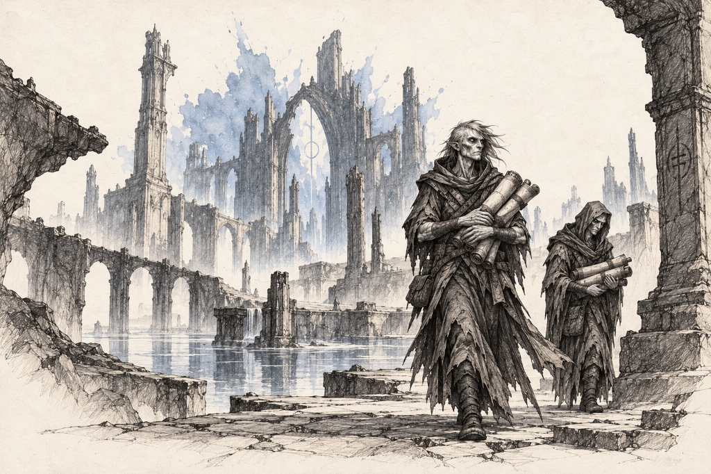
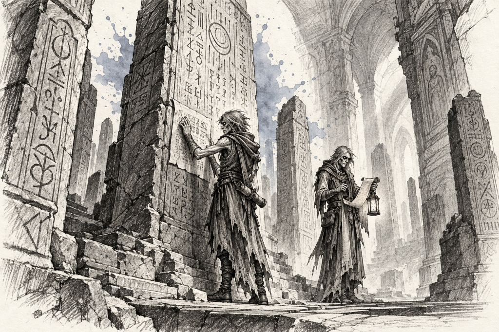
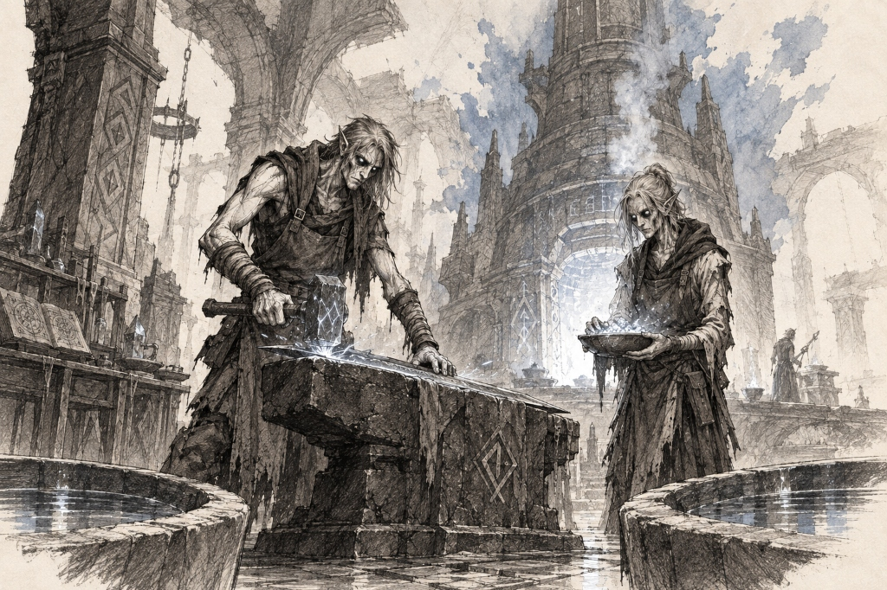

# Nethien Subraces — Landmarks, Establishments & Notable Figures

> **Visual Directive**:
> - Style: 1995 Samwise Didier Concept Art (Always Be Chunky - ABC). Monochromatic rough charcoal and graphite draft linework with gritty cross-hatching on clean off-white watercolor paper.
> - Single Dynamic Watercolor Splash: The ONLY color is the signature watercolor bloom.
> - In-Focus Architecture: City and building prompts are deep-focus wide-angle interior/street-level views. Zero giant foreground portraits blocking the frame.
> - Canonical Anatomical Locks: 100% matched to approved T-poses and icon benchmarks.

---

## ⚖️ 1. High Nethien (Ledger Gold `#ca8a04`)
*Canonical Anatomical Lock*: Stately, aristocratic, silver-touched noble bureaucrats, contract-magistrates, and bankers (matching `neth_high_icon_v1.png`, `neth_high_culture_contract.png`, and `neth_high_city_atropolis.jpg`). Tall, imposing humanoid silhouettes of severe authority. Complexion: Cool pale alabaster skin with metallic silver hair worn in immaculately braided queues or curled noble perukes. Eyes: Piercing mercury-silver or cold amber eyes with an unblinking, calculating stare. Attire: Heavy tailored gold-brocade and deep charcoal velvet coats trimmed with white ermine fur, high stiff lace collars, wide gold neck torcs, thick leather belts with brass ledger-locks and wax-seal signets, polished leather riding boots. Armed with brass balance-scale rods that double as maces, notarized contract scrolls, and gold-hilted paring daggers.

#### 🏛️ Part A: De-Cluttered Racial Portrait & Important Locations

#### 0. Canonical High Nethien Racial Portrait (De-Cluttered Bust)
- **Role & Archetype**: High Nethien Contract-Magistrate / Sovereign Bureaucrat.
- **Style & Medium**: 1995 Samwise Didier fantasy concept art, rough black charcoal and graphite draft linework, gritty cross-hatching, isolated on clean off-white watercolor sketchbook paper.
- **De-clutter Strategy**: Upper-torso bust portrait, ample negative space, clean breathing room, zero ambient clutter.
```text
Crisp, de-cluttered character portrait sketch of EXACTLY ONE High Nethien Contract-Magistrate, upper-torso bust. Role: Sovereign Bureaucrat and Contract-Lord of Atropolis. Style: 1995 fantasy concept art in the style of Samwise Didier. Hand-drawn rough black charcoal and graphite draft linework with severe authoritative contours and elegant cross-hatching, isolated on clean off-white watercolor sketchbook paper with ample negative space. STRICTLY MONOCHROMATIC CHARACTER & ATTIRE: No color fills on character, hair, or robes. STRICTLY NO TEXT, NO LETTERS, NO WORDS, NO LABELS, NO SIGNATURES, NO WATERMARKS. STRICTLY ONE SINGLE FIGURE. Canonical Anatomy & Role: Stately, unbreathing humanoid with pale porcelain skin, severe aristocratic jaw, solid obsidian-black eyes without pupils, and long straight silver-white hair pinned with a slender hammered-leaf circlet. Posture: Perfectly still, unmoving, and imposing. Attire: Tailored high-collared ghost-silk court mantle over an ermine-trimmed velvet doublet, wide gold neck torc, and braided silver shoulder cords. Gear: Holding an illuminated legal stylus upright near his collar. Composition: Clean, uncluttered composition focusing purely on the character's frozen, immortal grace. Background: Faint sketch of an archival marble pillar fading into clean white parchment. Accent: Single dynamic watercolor bloom in rich ledger gold (#ca8a04) blooming softly behind the magistrate's head and collar with fluid paint splatters. Pure sketchbook portrait, no borders, no frames.
```

#### 1. Atropolis & Great Ledger Chancery (The Sovereign Capital)
- **Role & Location**: Sovereign bureaucratic capital of the High Nethien, central registry and legislative heartbeat.
- **Style & Medium**: 1995 Samwise Didier concept art, deep-focus architectural linework on clean off-white parchment paper.
```text
Wide panoramic architectural perspective looking across the majestic marble law-city of Atropolis, sovereign capital of the High Nethien. Role & Setting: Sovereign bureaucratic capital and legal archive of the realm. Sprawling marble metropolis constructed of classical colonnades, fluted Corinthian pillars, and monumental gilded domes rising over broad paved stone avenues. The central Great Ledger Chancery dominates the skyline, where commercial contracts and ancestral debts are codified. Clean, spacious, uncluttered architectural composition with clear perspective lines and monumental vertical scale. In the mid-ground along a wide marble concourse, two High Nethien magistrates in trailing ghost-silk robes and braided silver hair walk with unhurried dignity, one holding a ribbon-tied contract scroll. Traditional rough black charcoal and graphite linework on clean off-white paper, with a single radiant watercolor splash of Ledger Gold (#ca8a04) blooming behind the central chancery dome. Style: 1995 fantasy concept art in the style of Samwise Didier. Strictly monochromatic architecture, no text, no labels, no borders, no frames.
```

#### 2. Chancery-Gate Customs Port & Toll Arch (The Sovereign Quay)
- **Role & Location**: Fortified maritime customs gate and harbor basin where tariffs are assessed.
- **Style & Medium**: 1995 Samwise Didier concept art ("Always Be Chunky" - ABC), heavy stone masonry, gritty cross-hatching.
```text
Wide-angle architectural concept art sketch of the Chancery-Gate Customs Port in Atropolis. Role & Setting: Fortified maritime customs gateway where foreign merchant galleons are assessed for tariffs. Style: 1995 fantasy concept art in the style of Samwise Didier, Always Be Chunky (ABC). Hand-drawn rough black charcoal and graphite draft linework with grand maritime masonry and gritty cross-hatching, isolated on clean off-white watercolor sketchbook paper. STRICTLY MONOCHROMATIC ARCHITECTURE & ENVIRONMENT: No color fills on stone or water. STRICTLY NO TEXT, NO LABELS, NO WATERMARKS. AVOID CLUTTER: Clean quay geometry with clear sightlines. Focus: Heavily fortified marble-and-granite harbor basin flanked by tall watchtowers and an imposing arched triumphal toll-gate over calm water. Traversal: Broad stone wharves with heavy iron mooring bollards, counterbalanced wooden drawbridges, and water gates. High Nethien customs bailiffs in brocade coats inspect cargo manifests on slant-top podiums in natural architectural scale. Accent: Single explosive watercolor splash in rich ledger gold (#ca8a04) blooming behind the triumphal toll-arch with fluid paint splatters. Pure isolated sketch, no borders, no frames.
```

#### 3. The Great Balance Mint & Bedrock Vaults (The Imperial Treasury)
- **Role & Location**: Subterranean bedrock treasury and sovereign coin-stamping mint.
- **Style & Medium**: 1995 Samwise Didier concept art, cavernous subterranean perspective, cross-hatched granite vaults.
```text
Wide-angle architectural concept art sketch of the Great Balance Mint and Vaults beneath Atropolis. Role & Setting: The sovereign currency mint and subterranean gold treasury. Style: 1995 fantasy concept art in the style of Samwise Didier. Hand-drawn rough black charcoal and graphite draft linework with massive vaulted perspective and cross-hatching, isolated on clean off-white watercolor sketchbook paper. STRICTLY MONOCHROMATIC ARCHITECTURE: No color fills. STRICTLY NO TEXT, NO LABELS, NO WATERMARKS. AVOID CLUTTER: Expansive, clean underground hall with ample breathing room. Focus: A colossal vaulted underground chamber with ribbed granite ceiling arches supported by massive square pillars. Heavy iron catwalks with clean railings, reinforced circular vault doors with rotating wheel-locks, and a central water-driven coin press. High Nethien treasury masters and armored sentries inspect bullion bars and balance scales in natural architectural scale. Accent: Single dynamic watercolor splash in radiant ledger gold (#ca8a04) blooming behind the central coin press with fluid paint splatters. Pure isolated sketch, no borders, no frames.
```

### 👤 Part B: Notable Figures (De-Cluttered Character Art)

#### 1. Vaelis the Scribe (The Sovereign Notary Who Drafted the First Contract)
- **Role & Archetype**: Mythic High Nethien Notary and Law-Giver.
- **Style & Medium**: 1995 Samwise Didier fantasy concept art, charcoal draft on off-white parchment.
```text
Single character concept art sketch of EXACTLY ONE Legendary Male High Nethien Magistrate, Vaelis the Scribe. Role: Sovereign Notary and Founder of Nethien Contract Law. Style: 1995 fantasy concept art in the style of Samwise Didier. Hand-drawn rough black charcoal and graphite draft linework with dignified classical contours and gritty cross-hatching, isolated on clean off-white watercolor sketchbook paper. STRICTLY MONOCHROMATIC CHARACTER & GEAR: No color fills on character, robe, or parchment. STRICTLY NO TEXT, NO LETTERS, NO WORDS, NO LABELS, NO SIGNATURES, NO WATERMARKS. STRICTLY ONE SINGLE HEROIC FIGURE IN A RESOLUTE NOTARY STANCE. AVOID CLUTTER: Clean silhouette with ample negative space around the figure. Canonical Anatomy: Tall, stately, silver-haired nobleman with sharp aristocratic facial features, unblinking obsidian-black eyes, and perfectly still posture. Attire: Heavy tailored velvet judge's robe trimmed with white ermine fur, high pleated lace cravat, wide hammered gold neck torc, leather boots. Gear: Holding an unrolled legal parchment charter in his left hand and a long golden quill pen in his right. Setting: Standing before a clean marble judgment lectern with a few sketched columns fading softly into the page. Accent: Single dynamic watercolor splash in radiant ledger gold (#ca8a04) blooming behind the magistrate with fluid paint splatters. Pure sketchbook draft page, no borders.
```

#### 2. High Arbitrator Cassian-Vel (Lord of the Golden Scale)
- **Role & Archetype**: Supreme Judge of the High Court and Legal Adjudicator.
- **Style & Medium**: 1995 Samwise Didier fantasy concept art (Always Be Chunky - ABC), bold contours.
```text
Single character concept art sketch of EXACTLY ONE Male High Nethien Adjudicator, Cassian-Vel. Role: Supreme High Court Judge and Master of the Golden Scale. Style: 1995 fantasy concept art in the style of Samwise Didier, Always Be Chunky (ABC). Hand-drawn rough black charcoal and graphite draft linework with imposing authoritative contours and gritty cross-hatching, isolated on clean off-white watercolor sketchbook paper. STRICTLY MONOCHROMATIC CHARACTER & GEAR: No color fills on character or gear. STRICTLY NO TEXT, NO LABELS, NO WATERMARKS. STRICTLY ONE SINGLE FIGURE IN A JUDICIAL STANCE. AVOID CLUTTER: Clean, readable outline and ample negative space. Canonical Anatomy: Broad-shouldered, severe humanoid magistrate with metallic silver hair tied in a neat queue, cold unblinking obsidian eyes, and squared aristocratic jaw. Attire: Structured court coat with frogging, high standing collar, embroidered sash holding archive keys, tall leather boots. Gear: Resting both hands atop a monumental brass balance-scale staff planted firmly on the floor. Setting: Elevated marble tribunal bench with clean sketched amphitheater steps fading into white parchment. Accent: Single explosive watercolor splash in ledger gold (#ca8a04) blooming behind the balance staff with fluid paint splatters. Pure sketchbook draft page, no borders.
```

#### 3. Lady Sovereign Aurelia-Sen (Matriarch of the Atropolis Banks)
- **Role & Archetype**: Chief Comptroller of the Sovereign Mint and High Financier.
- **Style & Medium**: 1995 Samwise Didier fantasy concept art, statuesque contours.
```text
Single character concept art sketch of EXACTLY ONE Female High Nethien Banker, Lady Sovereign Aurelia-Sen. Role: Chief Comptroller of the Grand Mint and Financial Matriarch. Style: 1995 fantasy concept art in the style of Samwise Didier. Hand-drawn rough black charcoal and graphite draft linework with regal aristocratic contours and cross-hatching, isolated on clean off-white watercolor sketchbook paper. STRICTLY MONOCHROMATIC CHARACTER & GEAR: No color fills on character or gown. STRICTLY NO TEXT, NO LABELS, NO WATERMARKS. STRICTLY ONE SINGLE FIGURE IN A COMMANDING SOVEREIGN POSE. AVOID CLUTTER: Elegant, statuesque silhouette. Canonical Anatomy: Tall, statuesque noblewoman with cool porcelain skin, silver hair styled in an elaborate braided coronet pinned with bodkins, and piercing pool-black eyes. Attire: Structured brocade gown with velvet oversleeves, standing lace collar, delicate gold neck torc. Gear: Holding a set of delicate gold assaying balance scales in one hand and an iron-bound credit ledger under her arm. Setting: Executive counting chamber with clean sketched vault doorway fading into the background. Accent: Dynamic watercolor splash in brilliant ledger gold (#ca8a04) blooming behind the matriarch. Pure sketchbook draft page, no borders.
```

#### 4. Ledger-Inquisitor Lucian (Auditor of Blood Debts)
- **Role & Archetype**: Contract-Enforcement Bailiff and Debt Inquisitor.
- **Style & Medium**: 1995 Samwise Didier fantasy concept art, sharp aggressive draftsmanship.
```text
Single character concept art sketch of EXACTLY ONE Male High Nethien Inquisitor, Lucian. Role: Contract-Enforcement Bailiff and Auditor of Blood Debts. Style: 1995 fantasy concept art in the style of Samwise Didier. Hand-drawn rough black charcoal and graphite draft linework with sharp aggressive contours and cross-hatching, isolated on clean off-white watercolor sketchbook paper. STRICTLY MONOCHROMATIC CHARACTER & GEAR: No color fills on character or gear. STRICTLY NO TEXT, NO LABELS, NO WATERMARKS. STRICTLY ONE SINGLE FIGURE IN A VIGILANT PURSUIT STANCE. AVOID CLUTTER: Sharp silhouette with minimal background clutter. Canonical Anatomy: Lean, tall humanoid with stern angular face, silver-grey hair cropped short, and cold unblinking black eyes. Attire: High-collared dueling coat with brass buttons, reinforced leather vambraces, tall riding boots, leather baldric. Gear: Holding an iron-bound bailiff's arrest warrant roll in one hand, resting his other hand on the pommel of a rapier at his hip. Setting: Minimalist sketch of a stone archway fading into parchment. Accent: Single dynamic watercolor splash in ledger gold (#ca8a04) blooming behind the inquisitor. Pure sketchbook draft page, no borders.
```

#### 5. Moneyer Titus (Master of the Sovereign Mint)
- **Role & Archetype**: Master Coin Engraver and Die-Cutter.
- **Style & Medium**: 1995 Samwise Didier fantasy concept art, sturdy craftsman contours.
```text
Single character concept art sketch of EXACTLY ONE Male High Nethien Artisan, Titus. Role: Master Coin Engraver and Mint Die-Cutter. Style: 1995 fantasy concept art in the style of Samwise Didier, Always Be Chunky (ABC). Hand-drawn rough black charcoal and graphite draft linework with sturdy craftsman contours and cross-hatching, isolated on clean off-white watercolor sketchbook paper. STRICTLY MONOCHROMATIC CHARACTER & GEAR: No color fills on character or tools. STRICTLY NO TEXT, NO LABELS, NO WATERMARKS. STRICTLY ONE SINGLE FIGURE IN A COIN-ENGRAVING POSE. AVOID CLUTTER: Orderly craftsman space. Canonical Anatomy: Broad humanoid craftsman with silver beard, magnifying spectacle loupe over one eye, and steady hands. Attire: Heavy leather engraver's apron over linen shirt, thick trousers, work boots. Gear: Holding a steel coin-die and a tiny engraving burin over a small anvil, inspecting the relief of a sovereign coin. Setting: Clean workbench corner with a few die-racks and tools sketched lightly in graphite. Accent: Dynamic watercolor splash in ledger gold (#ca8a04) blooming behind the anvil. Pure sketchbook draft page, no borders.
```

---

## 🌫️ 2. Veldun Nethien (Under-Fog Charcoal `#475569`)
*Canonical Anatomical Lock*: Sly, cunning, sharp-witted shadow-market brokers, canal scavengers, and information-merchants (matching `neth_veldun_icon_v1.png`, `neth_veldun_culture_divination.png`, and `neth_veldun_city_canals.jpg`). The sly and cunning underworld subrace of the Nethien. Lean, wiry, street-smart frames adapted to subterranean gloom and canal fog. Complexion: Slate-tinted pale skin with dark charcoal-streaked black hair tied back loosely. Eyes: Luminous coin-silver eyes that reflect lantern-light like a cat's in the dark, darting with watchful cunning. Attire: Dark wool traveling capes with concealed pockets, waxed oilskin vests, fingerless gloves, soft dark leather boots. Armed with handheld folding brass balance scales, spring-loaded stilettos, skeleton key rings, and hooded dark-lanterns.

### 🏛️ Part A: De-Cluttered Racial Portrait & Important Locations

#### 0. Canonical Veldun Nethien Racial Portrait (De-Cluttered Bust)
- **Role & Archetype**: Under-Fog Shadow-Broker / Canal Scavenger and Information Merchant.
- **Style & Medium**: 1995 Samwise Didier fantasy concept art, rough black charcoal and graphite draft linework, gritty cross-hatching, isolated on clean off-white watercolor sketchbook paper.
- **De-clutter Strategy**: Upper-torso bust portrait, ample negative space, clean breathing room, zero ambient clutter.
```text
Crisp, de-cluttered character portrait sketch of EXACTLY ONE Veldun Nethien Shadow-Broker, upper-torso bust. Role: Under-Fog Information Merchant and Debt-Broker of Under-Ledger. Style: 1995 fantasy concept art in the style of Samwise Didier. Hand-drawn rough black charcoal and graphite draft linework with sly, street-smart contours and gritty cross-hatching, isolated on clean off-white watercolor sketchbook paper with ample negative space. STRICTLY MONOCHROMATIC CHARACTER & ATTIRE: No color fills on character, hair, or leather. STRICTLY NO TEXT, NO LETTERS, NO WORDS, NO LABELS, NO SIGNATURES, NO WATERMARKS. STRICTLY ONE SINGLE FIGURE. Canonical Anatomy & Role: Lean, wiry humanoid with pale slate-tinted skin, sharp angular cheekbones, dark charcoal-streaked black hair tied back loosely with a leather lace, and luminous coin-silver eyes that reflect lantern-light like a cat's in the dark with watchful, calculating cunning. Attire: Dark wool traveling coat with a high upturned collar, waxed oilskin vest with small hidden pockets, silk neck scarf, and fingerless leather gloves. Gear: Holding a delicate brass folding balance scale poised between two fingers near his chest. Composition: Clean, uncluttered composition focusing purely on the broker's keen, enigmatic gaze and sharp silhouette. Background: Faint sketch of a dripping brick canal arch fading softly into clean parchment. Accent: Single dynamic watercolor bloom in under-fog charcoal and smoky slate (#475569) blooming behind the broker's shoulder and collar with fluid paint splatters. Pure sketchbook portrait, no borders, no frames.
```

#### 1. Under-Ledger Shadow-Exchange & Canal Slums (The Sovereign Capital)
- **Role & Location**: Sovereign subterranean black-market capital built inside flooded brick canal catacombs beneath Atropolis.
- **Style & Medium**: 1995 Samwise Didier fantasy concept art, cavernous canal perspective, gritty cross-hatching.
```text
Wide panoramic architectural perspective looking across the shadowy canal metropolis of Under-Ledger, sovereign subterranean capital of the Veldun Nethien. Role & Setting: Sovereign black market and canal haven operating within the flooded brick catacombs beneath Atropolis. Sprawling underground city constructed of massive dripping brick arches, cantilevered timber boardwalks, and murky waterways. Slender flat-bottom gondolas steered with long poles glide through mist-laden water tunnels lit by hanging amber lantern buoys. Clean, spacious, uncluttered architectural composition with clear perspective lines and cavernous depth. In the mid-ground along a wide wooden quay, two Veldun brokers in dark oilskin coats and traveling hoods confer quietly, one examining an unrolled cipher scroll. Traditional rough black charcoal and graphite linework on clean off-white paper, with a single radiant watercolor splash of Under-Fog Charcoal and smoky slate (#475569) blooming behind the central canal archway. Style: 1995 fantasy concept art in the style of Samwise Didier. Strictly monochromatic architecture, no text, no labels, no borders, no frames.
```

#### 2. Pawn-Wharf Basin & Sump Wharves (The Debt-Barter Slums)
- **Role & Location**: Sunken subterranean wharf and open-air barter bazaar over an underground tidal basin.
- **Style & Medium**: 1995 Samwise Didier fantasy concept art ("Always Be Chunky" - ABC), heavy timber stilts, gritty cross-hatching.
```text
Wide-angle architectural concept art sketch of the Pawn-Wharf Basin in Under-Ledger. Role & Setting: Bustling underground barter wharf where desperate debtors sell heirlooms and secret promissory notes. Style: 1995 fantasy concept art in the style of Samwise Didier, Always Be Chunky (ABC). Hand-drawn rough black charcoal and graphite draft linework with gritty subterranean maritime cross-hatching, isolated on clean off-white watercolor sketchbook paper. STRICTLY MONOCHROMATIC ARCHITECTURE & ENVIRONMENT: No color fills on wood or water. STRICTLY NO TEXT, NO LABELS, NO WATERMARKS. AVOID CLUTTER: Clean wharf geometry with clear sightlines and breathable negative space. Focus: A sunken subterranean wharf built on barnacle-encrusted timber stilts over a calm underground tidal basin. Traversal: Sturdy wooden boardwalks, floating log gangplanks, and tethered cargo rafts. Open-air appraisal stalls lit by hanging tallow lanterns where Veldun appraisers inspect pocket watches, silver heirlooms, and promissory slates with magnifying loupes in natural architectural scale. Accent: Single explosive watercolor splash in under-fog charcoal (#475569) blooming behind the central wharf post with fluid paint splatters. Pure isolated sketch, no borders, no frames.
```

#### 3. The Fog-Pipe Distilleries (The Sewer Gas Plant)
- **Role & Location**: Massive brick-vaulted industrial refinery converting subterranean methane and sewer gas into clean lantern naphtha.
- **Style & Medium**: 1995 Samwise Didier fantasy concept art, heavy industrial boilers, dense cross-hatching.
```text
Wide-angle architectural concept art sketch of the Fog-Pipe Distilleries in Under-Ledger. Role & Setting: Subterranean industrial refinery processing swamp gas into volatile lantern fuel. Style: 1995 fantasy concept art in the style of Samwise Didier. Hand-drawn rough black charcoal and graphite draft linework with cavernous industrial perspective and gritty cross-hatching, isolated on clean off-white watercolor sketchbook paper. STRICTLY MONOCHROMATIC ARCHITECTURE & ENVIRONMENT: No color fills on brick or metal. STRICTLY NO TEXT, NO LABELS, NO WATERMARKS. AVOID CLUTTER: Expansive, clean vaulted geometry with clear negative space. Focus: A massive brick-vaulted hall housing heavy copper alembic boilers, venting clean plumes of steam through curved overhead iron exhaust tubes. Traversal: Sturdy iron catwalks with safety grates spanning drainage flumes, ladder runs, and valve platforms. Veldun distillers in rubberized aprons and protective respirators monitor pressure dials and fill iron fuel canisters in natural architectural scale. Accent: Single dynamic explosive watercolor splash in under-fog charcoal and smoky slate (#475569) blooming behind the central boiler with fluid paint splatters. Pure isolated sketch, no borders, no frames.
```

### 👤 Part B: Notable Figures (De-Cluttered Character Art)

#### 1. Lyra-Vel (The Twelfth-Generation Oracle)
- **Role & Archetype**: Blind Canal Seer and Water Diviner.
- **Style & Medium**: 1995 Samwise Didier fantasy concept art, mystic gritty contours.
```text
Single character concept art sketch of EXACTLY ONE Female Veldun Nethien Seer, Lyra-Vel. Role: Blind Subterranean Oracle and Water Diviner. Style: 1995 fantasy concept art in the style of Samwise Didier. Hand-drawn rough black charcoal and graphite draft linework with mystic gritty cross-hatching, isolated on clean off-white watercolor sketchbook paper. STRICTLY MONOCHROMATIC CHARACTER & GEAR: No color fills on character or bowl. STRICTLY NO TEXT, NO LABELS, NO WATERMARKS. STRICTLY ONE SINGLE HEROIC FIGURE IN A WATER-DIVINATION POSE. AVOID CLUTTER: Clean silhouette with ample negative space around the figure. Canonical Anatomy: Slender humanoid woman with pale slate-tinted skin, milky blind eyes that glow with faint inner silver light, and long dark charcoal hair falling in wild waves. Attire: Tattered dark velvet traveler's cloak over a simple linen tunic, braided cord belt hung with bone trinkets and brass coins, soft leather boots. Gear: Extending both delicate hands over a dark ceramic scrying bowl of still canal water, causing subtle concentric ripples to form on the surface. Setting: Minimalist sketch of a stone canal step and low water fading softly into parchment. Accent: Single dynamic watercolor splash in under-fog charcoal (#475569) blooming behind the seer with fluid paint splatters. Pure sketchbook draft page, no borders.
```

#### 2. Orven-Sen (The Gambler Who Bet on the Sun — Sovereign Shadow Broker)
- **Role & Archetype**: Master Black-Market Broker and High-Stakes Gambler.
- **Style & Medium**: 1995 Samwise Didier fantasy concept art (Always Be Chunky - ABC), bold charismatic contours.
```text
Single character concept art sketch of EXACTLY ONE Male Veldun Nethien Broker, Orven-Sen. Role: Master Black-Market Shadow Broker and High-Stakes Gambler. Style: 1995 fantasy concept art in the style of Samwise Didier, Always Be Chunky (ABC). Hand-drawn rough black charcoal and graphite draft linework with charismatic gritty contours and cross-hatching, isolated on clean off-white watercolor sketchbook paper. STRICTLY MONOCHROMATIC CHARACTER & GEAR: No color fills on character or gear. STRICTLY NO TEXT, NO LABELS, NO WATERMARKS. STRICTLY ONE SINGLE HEROIC FIGURE IN A CONFIDENT GAMBLER'S STANCE. AVOID CLUTTER: Clean, readable outline and ample negative space. Canonical Anatomy: Lean, wiry humanoid with sharp calculating smile, angular jaw, charcoal-streaked dark hair, and luminous coin-silver eyes. Attire: Tailored dark wool frock coat with upturned collar, silk waistcoat with brass buttons, fingerless gloves, polished riding boots. Gear: Rolling a pair of carved bone dice casually in one palm, leaning on a hollow cane with a concealed stiletto, an unrolled debt ledger tucked into his coat pocket. Setting: Corner of an underground tavern bench with faint sketched brickwork fading into white parchment. Accent: Single dynamic watercolor splash in under-fog charcoal (#475569) blooming behind the gambler with fluid paint splatters. Pure sketchbook draft page, no borders.
```

#### 3. Black-Ledger Broker Silas (Master of Secret Pledges)
- **Role & Archetype**: Master Information Broker and Keeper of Blackmail Debts.
- **Style & Medium**: 1995 Samwise Didier fantasy concept art, secretive sharp contours.
```text
Single character concept art sketch of EXACTLY ONE Male Veldun Nethien Information Broker, Silas. Role: Master Information Broker and Keeper of Secret Pledges. Style: 1995 fantasy concept art in the style of Samwise Didier. Hand-drawn rough black charcoal and graphite draft linework with secretive contours and cross-hatching, isolated on clean off-white watercolor sketchbook paper. STRICTLY MONOCHROMATIC CHARACTER & GEAR: No color fills on character or ledger. STRICTLY NO TEXT, NO LABELS, NO WATERMARKS. STRICTLY ONE SINGLE FIGURE IN A SHADOWY LEDGER POSE. AVOID CLUTTER: Clean silhouette with minimal background clutter. Canonical Anatomy: Gaunt, middle-aged humanoid with furrowed brow, dark charcoal hair tied in a bun, sharp squinting silver eyes, and thin mustache. Attire: Waxed dark overcoat with hidden interior pockets, wool scarf, sturdy boots. Gear: Holding an iron-bound black cipher ledger with both hands, a brass key hanging from his wrist, a hooded dark-lantern sitting on a crate beside him. Setting: Clean sketched corner of a stone vault fading into clean parchment. Accent: Dynamic watercolor splash in under-fog charcoal (#475569) blooming behind the broker with fluid paint splatters. Pure sketchbook draft page, no borders.
```

#### 4. Fence Vanya the Key-Caster (Mistress of Pawn-Wharf)
- **Role & Archetype**: Master Locksmith, Fence, and Appraiser.
- **Style & Medium**: 1995 Samwise Didier fantasy concept art, agile craftsman contours.
```text
Single character concept art sketch of EXACTLY ONE Female Veldun Nethien Locksmith, Vanya. Role: Master Locksmith, Fence, and Appraiser of Stolen Relics. Style: 1995 fantasy concept art in the style of Samwise Didier. Hand-drawn rough black charcoal and graphite draft linework with quick sharp contours and cross-hatching, isolated on clean off-white watercolor sketchbook paper. STRICTLY MONOCHROMATIC CHARACTER & GEAR: No color fills on character or tools. STRICTLY NO TEXT, NO LABELS, NO WATERMARKS. STRICTLY ONE SINGLE HEROIC FIGURE IN A LOCKPICKING POSE. AVOID CLUTTER: Clean, readable silhouette with negative space. Canonical Anatomy: Agile, sharp-featured humanoid woman with luminous coin-silver eyes, dark hair tied in messy braids, and alert expression. Attire: Leather work doublet with rows of small pick-holsters, reinforced trousers, soft-soled boots. Gear: Holding an intricate steel skeleton key in one hand and a set of tension wrenches in the other, a large iron ring of stolen keys at her hip. Setting: Simple wooden workbench with a few locks and keys sketched lightly in graphite. Accent: Single explosive watercolor splash in under-fog charcoal (#475569) blooming behind the locksmith with fluid paint splatters. Pure sketchbook draft page, no borders.
```

#### 5. Night-Drifter Corin (Canal Sentry of the Fog Sump)
- **Role & Archetype**: Subterranean Canal Boatman and Sentry.
- **Style & Medium**: 1995 Samwise Didier fantasy concept art (Always Be Chunky - ABC), athletic contours.
```text
Single character concept art sketch of EXACTLY ONE Male Veldun Nethien Boatman, Corin. Role: Subterranean Canal Sentry and Smuggler Ferryman. Style: 1995 fantasy concept art in the style of Samwise Didier, Always Be Chunky (ABC). Hand-drawn rough black charcoal and graphite draft linework with athletic contours and gritty cross-hatching, isolated on clean off-white watercolor sketchbook paper. STRICTLY MONOCHROMATIC CHARACTER & GEAR: No color fills on character or boat. STRICTLY NO TEXT, NO LABELS, NO WATERMARKS. STRICTLY ONE SINGLE HEROIC FIGURE IN A POLED-BOAT STANCE. AVOID CLUTTER: Open water perspective with ample negative space. Canonical Anatomy: Muscular, athletic humanoid mariner with broad shoulders, weather-roughened slate skin, short charcoal hair, and alert luminous silver eyes. Attire: Oilskin sleeveless vest, water-resistant breeches, bare grip feet planted on boat decking. Gear: Holding a long iron-tipped canal poling-spear with both hands, an amber oil lantern hanging from the prow of his narrow skiff. Setting: Prow of a canal skiff gliding through calm dark water with light sketch lines of a distant brick arch fading into parchment. Accent: Dynamic watercolor splash in smoky charcoal (#475569) blooming behind the boatman with fluid paint splatters. Pure sketchbook draft page, no borders.
```

---

### 💀 3. Withered Nethien (Ash White `#94a3b8`)
*Canonical Anatomical Lock*: Gaunt, semi-undead, arcane-yearning outcasts, ruin-epigraphers, and master enchanters (matching `neth_withered_icon_v1.png`, `neth_withered_culture_burning.png`, and `neth_withered_city_severancehold.jpg`). Emaciated, hollow-cheeked, semi-undead humanoid frames of haunting endurance. Complexion: Paper-white, cold ashen dried skin with bluish veins visible beneath translucent flesh. Eyes: Eerie loss of soul in their eyes—pale, light greyish irises swirling with cold shadowy darkness and hollow, haunted sockets, reflecting an insatiable, desperate yearning for magic, understanding, and lost warmth. Hair: Wispy snow-white hair clinging to scarred, rune-etched scalps. Motivation & Calling: Banished and afflicted by their ancestors' catastrophic sin, they dwell within ancient crumbling ruins, fallen monasteries, and shattered pre-Calamity libraries specifically to uncover lost arcane knowledge, desperately seeking a way to reverse the curse and restore their souls. They are obsessively keen on stone inscriptions, runic decipherment, enchanting, and infusing ancient relics with ambient mana. Attire: Tattered homespun ash-grey burlap cowl-shrouds, frayed monastic wraps, leather scholar bandoliers holding stone-chisels, magnifying lenses, charcoal rubbing papers, and bone enchanting styluses; severed iron debt-collars and wrist manacles etched with warding glyphs. Armed with runic enchanting staves, glowing chisels, and scrolls of deciphered ancient inscriptions.

### 🏛️ Part A: Important Buildings & Locations (3 Prompts)

#### ✅ 1. Cinder-Grave & Severance Hold (The Sovereign Ruined Necropolis) [GENERATED]


- **Biome & Location**: The barren subterranean limestone ruins and crumbling monastery catacombs of the Severance wastes.
- **Lore & Functions**: The sovereign sanctuary city of the Withered Nethien. Carved into ancient pre-Calamity temple ruins, collapsed gothic arches, and dry limestone catacombs. Here the semi-undead outcasts gather among shattered colonnades to excavate lost pre-Calamity knowledge, striving to reverse the ancestral sin that stripped their souls.
```text
Wide panoramic architectural perspective looking across the monumental subterranean ruins of Severance Hold, the sovereign necropolis city of the Withered Nethien. A colossal pre-Calamity stone monastery and temple complex carved into deep limestone caverns: soaring cracked gothic arches, fallen fluted pillars, and weathered stone staircases leading down to excavation plazas. The composition is solemn, vast, and uncluttered, with monumental spatial depth. In the mid-ground on an open flagstone terrace beside an ancient engraved stele, exactly two Withered Nethien scholars (skeletal, desiccated undead revenants in ragged hooded shrouds, bare throats, with glowing sunken eye sockets, holding charcoal rubbing papers and a glowing runic chisel) inspect a crumbling wall inscription, desperately seeking lost magic to reverse their ancestral curse. Traditional rough black charcoal and graphite pencil linework on aged parchment paper, with a single radiant watercolor splash of Ash White (#94a3b8) blooming behind the central broken cathedral arch.
```

#### ✅ 2. The Inscription Catacombs & Vault of Lost Sins (The Stele Library) [GENERATED]


- **Biome & Location**: The subterranean ruin catacombs beneath Severance Hold.
- **Lore & Functions**: An enormous underground archive carved into forgotten monastery ruins where Withered epigraphers decipher hundreds of monumental carved stone steles. Monks take charcoal rubbings of ancient pre-Calamity inscriptions, analyzing the magical grammar of their ancestors' sin to engineer a reversal ritual.
```text
Wide-angle interior perspective looking down the grand vaulted aisle of the Inscription Catacombs beneath Severance Hold. Towering monolithic stone steles carved with thousands of ancient magical glyphs stand along cracked flagstone walls supported by weathered stone pillars. Dust motes float in the quiet air through cracked masonry arches. In the center mid-ground, exactly two Withered Nethien undead monks work peacefully in the spacious hall: one skeletal figure holds a sheet of parchment against a carved stele to make a charcoal rubbing with desiccated bony fingers, while the other holds a slender lantern and reads an unrolled translation scroll. Grand, eerie, and uncluttered composition with deep vaulted ruin perspective. Traditional hand-drawn charcoal and gritty graphite cross-hatching, with a single concentrated splash of Ash White (#94a3b8) watercolor wash blooming behind the central inscribed monolith.
```

#### ✅ 3. The Arcane Kiln & Enchanting Sinks (The Runic Foundry) [GENERATED]


- **Biome & Location**: A volcanic limestone undercroft on the perimeter of the ruins.
- **Lore & Functions**: The subterranean workshop where Withered enchanters channel ambient mana into salvaged metal and stone relics. Blacksmiths and enchanters forge warding instruments, chisel reversal glyphs into silver sheets, and test ancient spells to break the ancestral curse.
```text
Low-angle, atmospheric eye-level view inside the Arcane Kiln of Severance Hold, a ruined subterranean stone sanctuary converted into an enchanting workshop. A massive carved stone kiln furnace vents gentle plumes of heat into an open cavern vault. In the center, a heavy granite enchanting anvil rests beside smooth stone basins filled with still quenching water reflecting ambient light. In the center mid-ground, exactly two Withered Nethien undead enchanters (half-skeletal revenants with glowing sunken eyes and bare mummified throats) stand beside the anvil: one strikes an ancient salvaged blade with a runic engraving hammer, sending tiny glowing sparks of ambient mana into the air, while the other holds a glowing dish of enchanting salts. Clean, spacious workshop floor with ample breathable flagstones and crisp masonry contours. Traditional graphite and black charcoal drawing on off-white parchment, with a single subtle splash of Ash White (#94a3b8) watercolor blooming behind the enchanting furnace.
```

### 👤 Part B: Notable & Legendary Figures (5 Figures)

#### 1. Saren-Vel (The First Withered — The Penitent Enchanter)
- **Lore Backstory**: Legendary founder of the Severance who first recognized their ancestors' sin. Dedicated her centuries of semi-undead existence to scouring ancient ruins for the lost magical knowledge that can reverse the curse and restore their souls.
```text
Single character concept art sketch of EXACTLY ONE Legendary Male Withered Nethien Enchanter, Saren-Vel (matching approved benchmark icon neth_withered_icon_v1.png and neth_withered_culture_burning.png). Style: 1995 fantasy concept art in the style of Samwise Didier. Hand-drawn rough black charcoal and graphite draft linework with gaunt monumental contours and gritty cross-hatching, isolated on clean off-white watercolor sketchbook paper. STRICTLY MONOCHROMATIC CHARACTER & GEAR: No color fills on character, robe, or runes. STRICTLY NO TEXT, NO LETTERS, NO WORDS, NO LABELS, NO SIGNATURES, NO WATERMARKS. ABSOLUTE PROHIBITION ON MULTIPLE FIGURES: RENDER EXACTLY ONE SINGLE HEROIC FIGURE IN A RESOLUTE RESEARCH STANCE. Canonical Anatomy: Gaunt, semi-undead humanoid elder with paper-white dried skin, haunting light-greyish eyes swirling with cold inner darkness and hollow soul-loss, wispy white hair, cracked lips murmuring ancient words of power. Shackle: Wearing an iron collar etched with glowing protective runes around his neck. Attire: Tattered homespun ash-grey burlap scholar cowl-shroud tied with a knotted cord belt hung with magnifying loupes and carving chisels, bare feet wrapped in cloth. Gear: Holding a glowing bone enchanting stylus in his right hand, tracing an intricate runic diagram onto a pre-Calamity stone tablet cradled in his left arm, radiating an insatiable yearning for lost magic. Setting & Crude Background: Seen in his element in the ruined library vault of Severance Hold with crude, hand-drawn 1995 Samwise Didier draft style background scenery sketched in rough graphite linework and gritty cross-hatching—collapsed gothic temple arches, towering ruined stone steles covered in ancient inscriptions, piles of unrolled rubbings and scrolls, and a smoking enchanting brazier. Loosely vignetted sketch background. Accent: Single dynamic explosive watercolor splash in stark ash white and pale slate (#94a3b8) blooming behind the enchanter with fluid paint splatters. Pure sketchbook draft page, no formal borders or frames.
```

#### 2. Bone-Warden Marrow (Keeper of Lost Inscriptions)
- **Lore Backstory**: Revered epigrapher who has pieced together thousands of broken stone inscriptions from ruined temples, seeking the specific syntax of the ancestral sin.
```text
Single character concept art sketch of EXACTLY ONE Male Withered Nethien Epigrapher, Marrow. Style: 1995 fantasy concept art in the style of Samwise Didier. Hand-drawn rough black charcoal and graphite draft linework with delicate gaunt contours and gritty cross-hatching, isolated on clean off-white watercolor sketchbook paper. STRICTLY MONOCHROMATIC CHARACTER & GEAR: No color fills on character or stone. STRICTLY NO TEXT, NO LETTERS, NO WORDS, NO LABELS, NO SIGNATURES, NO WATERMARKS. ABSOLUTE PROHIBITION ON MULTIPLE FIGURES: RENDER EXACTLY ONE SINGLE HEROIC FIGURE IN AN INSCRIPTION RUBBING POSE. Canonical Anatomy: Frail, semi-undead humanoid scholar with ash-white skin, light-grey eyes with eerie hollow darkness, bald head marked with faint runic ash lines, broken iron wrist cuffs. Attire: Layered burlap scholar tunic, tool belt with charcoal blocks and soft brushes, cloth slippers. Gear: Pressing a roll of parchment against an ancient carved ruin stele with one hand, applying a charcoal rubbing block with the other to reveal hidden magical inscriptions. Setting & Crude Background: Seen in his element in the Inscription Catacombs of Severance Hold with crude, hand-drawn 1995 Samwise Didier draft style background scenery sketched in rough graphite linework and gritty cross-hatching—collapsed ancient ruin pillars carved with intricate pre-Calamity glyphs, stacks of rolled parchment rubbings in wicker bins, and candle lanterns resting on crumbling stone pedestals. Loosely vignetted sketch background. Accent: Dynamic explosive watercolor splash in ash white (#94a3b8) blooming behind the stele with fluid paint splatters. Pure sketchbook draft page, no formal borders or frames.
```

#### 3. The Silent Scrivener Elyse (Enchanter of the Reversal Glyphs)
- **Lore Backstory**: Mute arcanist who channels pure ambient mana through hand-carved stone tablets, testing reversal enchantments to break the generational curse.
```text
Single character concept art sketch of EXACTLY ONE Female Withered Nethien Enchanter, Elyse. Style: 1995 fantasy concept art in the style of Samwise Didier. Hand-drawn rough black charcoal and graphite draft linework with expressive gaunt contours and gritty cross-hatching, isolated on clean off-white watercolor sketchbook paper. STRICTLY MONOCHROMATIC CHARACTER & GEAR: No color fills on character or slate. STRICTLY NO TEXT, NO LETTERS, NO WORDS, NO LABELS, NO SIGNATURES, NO WATERMARKS. ABSOLUTE PROHIBITION ON MULTIPLE FIGURES: RENDER EXACTLY ONE SINGLE HEROIC FIGURE IN AN ENCHANTING POSE. Canonical Anatomy: Thin, severe semi-undead humanoid woman with sunken cheeks, eerie light-grey eyes ringed with shadowy darkness, white hair tied with rough twine, scarred throat, broken iron ankle chain. Attire: Hooded burlap cowl, frayed fingerless wool gloves, salt-crusted moccasins. Gear: Holding an enchanted silver chisel in one hand, carving a glowing arcane glyph of reversal into a white marble tablet held on her knee, delicate sparks of mana drifting from her fingertips. Setting & Crude Background: Seen in her element inside a ruined temple sanctuary cell with crude, hand-drawn 1995 Samwise Didier draft style background scenery sketched in rough graphite linework and gritty cross-hatching—crumbling pre-Calamity limestone walls covered in carved magical formulas, a simple stone bench, jars of enchanting salts, and stacks of inscribed reversal slates. Loosely vignetted sketch background. Accent: Single dynamic explosive watercolor splash in ghost ash white (#94a3b8) blooming behind the slate with fluid paint splatters. Pure sketchbook draft page, no formal borders or frames.
```

#### 4. Master Inscription-Smith Karr (The Runic Founder)
- **Lore Backstory**: Master metalsmith and enchanter who forges runic instruments and chisels capable of inscribing stone with permanent magical enchantments.
```text
Single character concept art sketch of EXACTLY ONE Male Withered Nethien Runic Smith, Karr. Style: 1995 Warcraft fantasy concept art in the style of Samwise Didier, Always Be Chunky (ABC). Hand-drawn rough black charcoal and graphite draft linework with intense contours and gritty cross-hatching, isolated on clean off-white watercolor sketchbook paper. STRICTLY MONOCHROMATIC CHARACTER & GEAR: No color fills on character or tools. STRICTLY NO TEXT, NO LETTERS, NO WORDS, NO LABELS, NO SIGNATURES, NO WATERMARKS. ABSOLUTE PROHIBITION ON MULTIPLE FIGURES: RENDER EXACTLY ONE SINGLE HEROIC FIGURE IN A RUNIC FORGE STANCE. Canonical Anatomy: Broad-chested yet hollow-flanked semi-undead craftsman with fire-scarred ash skin, eerie light-grey eyes with deep shadowy sockets, wild white beard, heavy iron neck collar etched with runes. Attire: Charred leather apron over ragged burlap robes, heavy iron-toed work boots. Gear: Holding a long-handled iron carving chisel glowing with heated mana runes in one hand, holding heavy forge tongs in the other. Setting & Crude Background: Seen in his element in the subterranean Arcane Kiln of Severance Hold with crude, hand-drawn 1995 Samwise Didier draft style background scenery sketched in rough graphite linework and gritty cross-hatching—a glowing stone enchanting forge, heavy iron anvils covered in carved runic stencils, steaming quenching basins, and scrap fragments of ancient pre-Calamity relics. Loosely vignetted sketch background. Accent: Dynamic explosive watercolor splash in ash white and ember glow (#94a3b8) blooming behind the smith with fluid paint splatters. Pure sketchbook draft page, no formal borders or frames.
```

#### 5. Ruin-Drifter Vael (Seeker of the Sunken Monasteries)
- **Lore Backstory**: Wandering explorer who braves monster-infested pre-Calamity ruins and subterranean catacombs across Mythrill to recover lost codices and enchanting relics for Severance Hold.
```text
Single character concept art sketch of EXACTLY ONE Male Withered Nethien Ruin-Drifter, Vael. Style: 1995 fantasy concept art in the style of Samwise Didier. Hand-drawn rough black charcoal and graphite draft linework with weathered nomadic contours and gritty cross-hatching, isolated on clean off-white watercolor sketchbook paper. STRICTLY MONOCHROMATIC CHARACTER & GEAR: No color fills on character or gear. STRICTLY NO TEXT, NO LETTERS, NO WORDS, NO LABELS, NO SIGNATURES, NO WATERMARKS. ABSOLUTE PROHIBITION ON MULTIPLE FIGURES: RENDER EXACTLY ONE SINGLE FIGURE IN AN EXCAVATION STANCE. Canonical Anatomy: Wiry, weathered semi-undead wanderer with gaunt cheeks, eerie light-grey eyes ringed with hollow darkness, cloth wrapped around his head to block dust, broken iron wrist cuffs. Attire: Ragged patched travel cloak, rope belt hung with scroll canisters and flint chisels, wrapped foot bandages. Gear: Leaning on a sturdy charred oak walking staff topped with a glowing crystal scrying lantern, a leather pack laden with excavated ancient stone tablets slung across his back. Setting & Crude Background: Seen in his element exploring the crumbling colonnades of a sunken pre-Calamity ruin with crude, hand-drawn 1995 Samwise Didier draft style background scenery sketched in rough graphite linework and gritty cross-hatching—collapsed stone temple pillars overgrown with dry moss, cracked flagstones littered with inscribed shards, drifting dust motes, and distant ruined archways leading deeper underground. Loosely vignetted sketch background. Accent: Single explosive watercolor splash in ash white (#94a3b8) blooming behind the wanderer with fluid paint splatters. Pure sketchbook draft page, no formal borders or frames.
```
