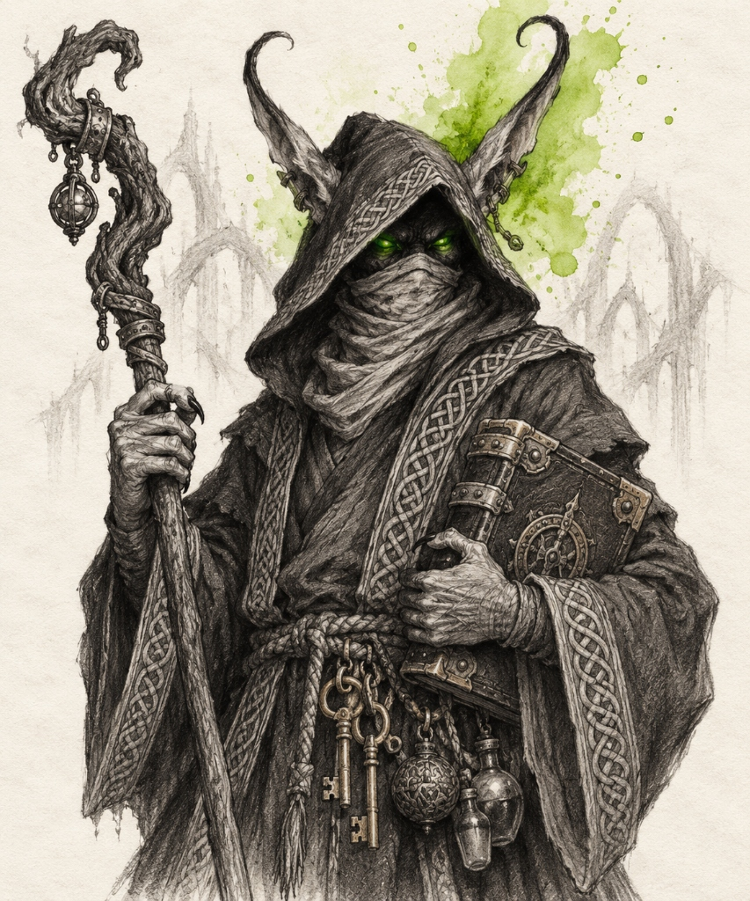
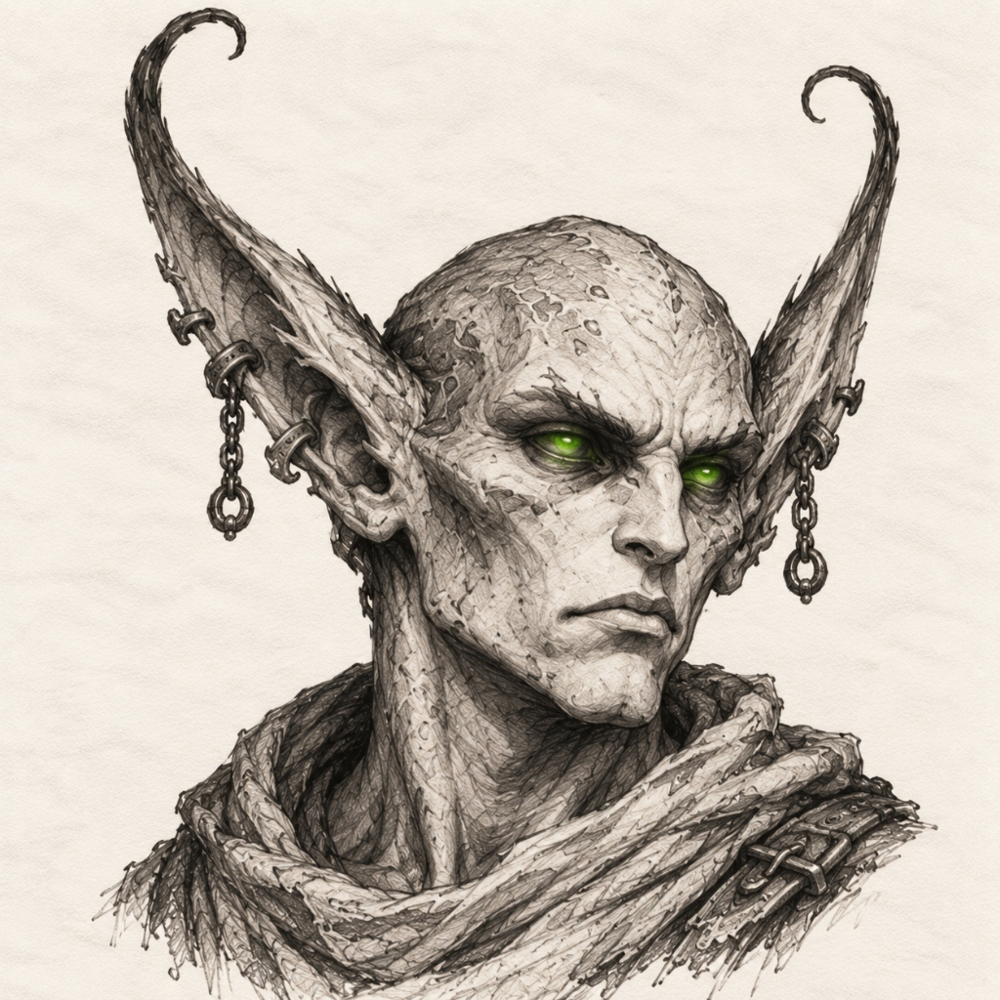
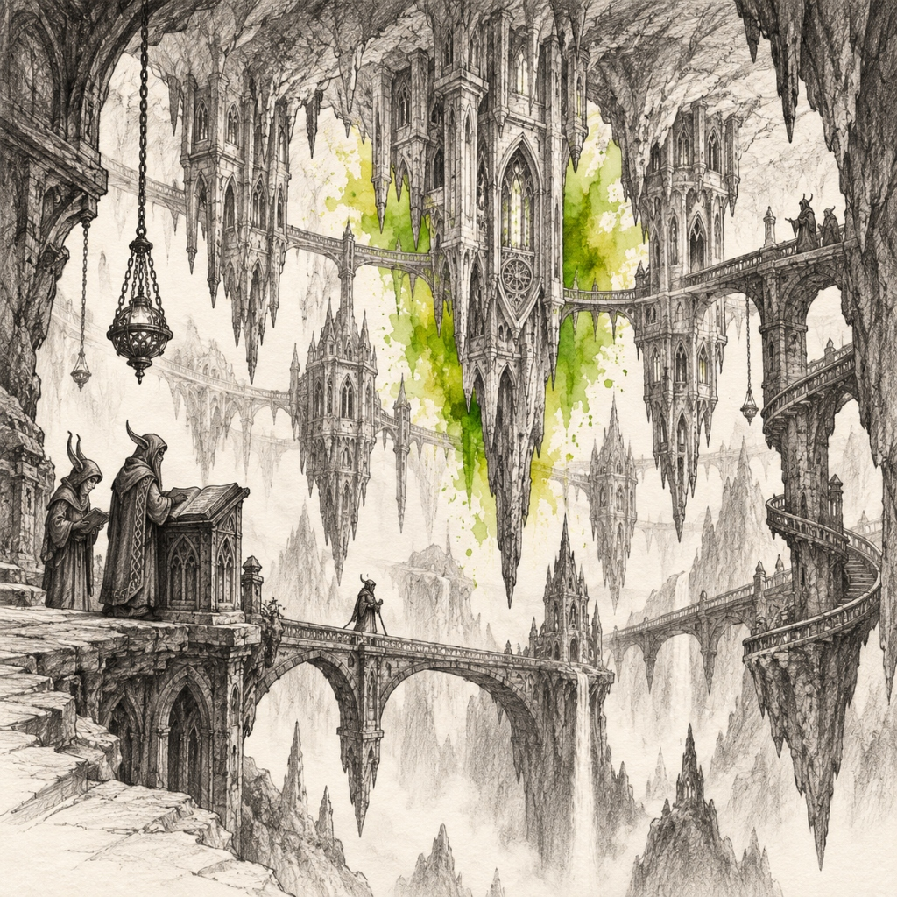
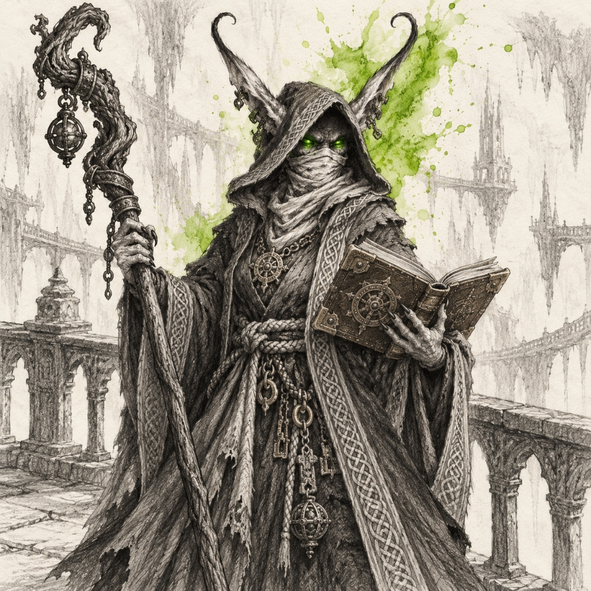
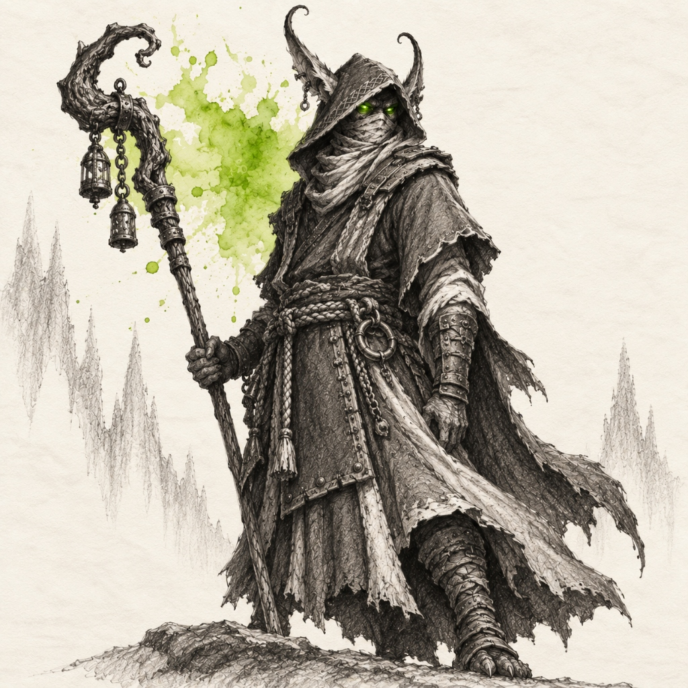
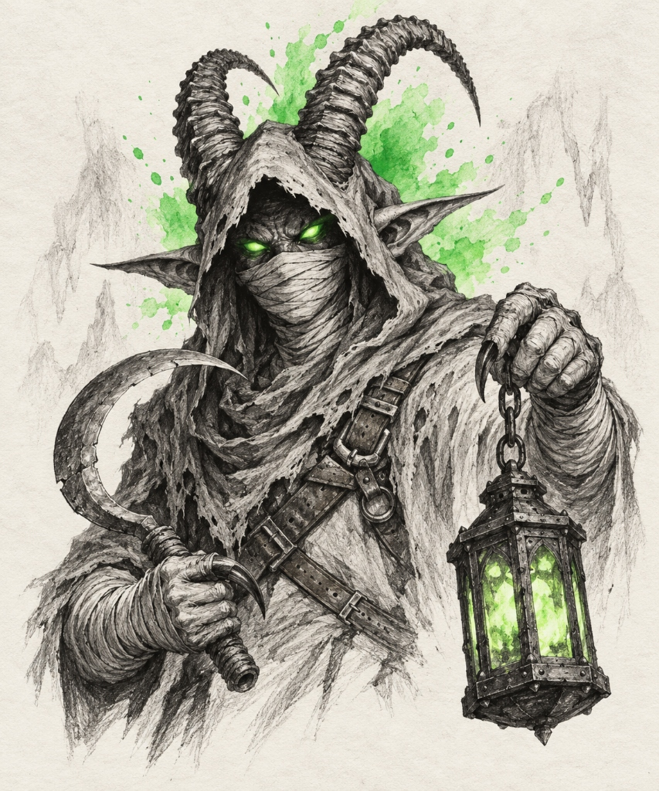
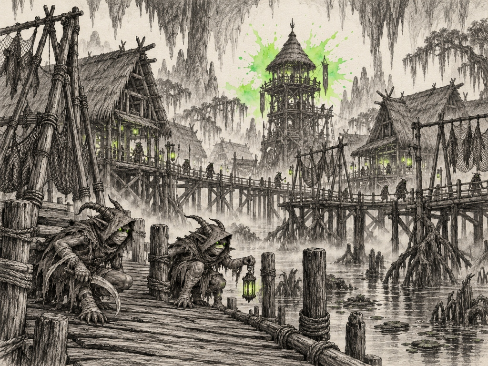

# Vreken Subraces — Landmarks, Establishments & Notable Figures

> **Visual Directive**:
> - Style: 1995 Samwise Didier Concept Art (Always Be Chunky - ABC). Monochromatic rough charcoal and graphite draft linework with gritty cross-hatching on clean off-white watercolor paper.
> - Single Dynamic Watercolor Splash: The ONLY color is the signature watercolor bloom.
> - In-Focus Architecture: City and building prompts are deep-focus wide-angle interior/street-level views. Zero giant foreground portraits blocking the frame.
> - Canonical Anatomical Locks: 100% matched to approved T-poses and icon benchmarks.

---

## 🍄 1. Clean Vreken (Blight Green `#65a30d`)
*Canonical Anatomical Lock*: Compact, wiry, mysterious subterranean crypt-keepers and gloom-monks (exact match to approved benchmarks: compact hooded monk with upward-curling horn-ears, cloth face-veil, and inverted Sunken Spire reverse monastery). CAREFULLY NON-ELVISH: Compact, slightly hunched subterranean physique (standing 4'10" to 5'4"), NOT tall or regal. Ears: Long, tapered, horn-like ears that curve dramatically UPWARD and backward from beneath the deep monk hood like spiral horns. Eyes: Incandescent glowing green or amber lantern-eyes piercing through the shadow of the deep monk cowl. Face: Lower face completely wrapped in a layered cloth cowl-mask / mouth veil. Hands: Long-fingered, clawed / taloned hands with sharp curved nails, built for delicate peat-carving and spore-harvesting. Attire: Heavy dark gothic monastic cassock/robe with ornate embroidered knotwork borders along the flared cuffs and skirt hem, tied with a thick knotted hemp rope cincture. Accessories: Hanging potion phials, antique iron/brass keys, and bone rosary prayer beads suspended from the rope belt. Armed with gnarled twisted wooden rune staves, carved quartz sounding rods, and heavy brass-cornered crypt tomes.

### 👤 Part 0: Dedicated Canonical Racial Portrait & Anatomy (2 Benchmarks)

#### ✅ 0A. Canonical Clean Vreken Racial Portrait (De-Cluttered Bust) [GENERATED]


- **Role & Face**: Crypt-Scholar & Spore-Inscriptor (Upper-Torso Bust). Compact, mysterious subterranean gloom-monk. Distinctive non-elvish anatomy: deep monk cowl casting heavy shadows over the brow; long tapered horn-like ears curving dramatically upward and back from beneath the hood; piercing glowing toxic-green lantern eyes shining from the dark; lower face fully concealed by a wrapped cloth cowl-mask/veil.
- **Hands & Gear**: One clawed hand raised near the chest holding an antique gnarled wooden rune staff; clutching a heavy brass-cornered crypt tome against the chest; hanging brass keys and potion phials visible at the rope belt.
- **Attire**: Heavy gothic monastic robe with embroidered knotwork borders along the flared cuffs and collar, tied with a knotted hemp rope cincture.
- **De-Clutter Strategy**: Clean upper bust, expansive off-white negative space, minimal props, crisp linework.
```text
De-cluttered character concept art sketch of EXACTLY ONE Clean Vreken Crypt-Scholar, upper-torso bust portrait with vast breathable negative space. Style: 1995 fantasy concept art by Samwise Didier, Always Be Chunky (ABC). Authoritative rough black charcoal and graphite draft linework with bold contours and gritty cross-hatching on off-white watercolor sketchbook paper. STRICTLY PURE BLACK CHARCOAL AND GRAPHITE PENCIL DRAWING ONLY: 100% monochrome grayscale for character, skin, clothes, robe, staff, and tome. Absolutely zero color tints, no sepia, no brown tones, no flesh tones, no colored lighting. STYLIZED EXPRESSIVE CONCEPT ART, NOT PHOTOREALISTIC, NOT AN ACADEMIC PORTRAIT, NOT A SMOOTH DIGITAL PAINTING: Exaggerated fantasy proportions, chunky contours, heavy bold charcoal outlines, visible raw sketchbook pencil hatching. STRICTLY NO TEXT, NO WORDS, NO LABELS, NO SIGNATURES, NO WATERMARKS. SINGLE HEROIC FIGURE. RADICALLY MINIMALIST AND DE-CLUTTERED: Absolutely zero loose props, zero flying debris, zero distracting background clutter. Distinctive Face & Anatomy: Compact, mysterious subterranean gloom-keeper, strictly NOT elvish. A deep monk hood casts dark shadows over the face; long, tapered horn-like ears emerge from under the cowl and curve dramatically UPWARD like curling horns. Piercing, incandescent glowing toxic-green lantern eyes shine from the cowl's darkness; lower face is completely wrapped in a layered cloth cowl-mask and mouth veil. Hands & Gear: Long-fingered clawed hand with sharp curved dark nails holding a gnarled, twisted wooden rune staff; clutching a massive brass-cornered leather crypt grimoire against the ribs; heavy brass keys and potion phials hang from a knotted rope cincture at the waist. Attire: Heavy gothic monastic cassock with ornate embroidered knotwork borders along the flared cuffs and hem. Background: Expansive clean sketchbook parchment with ample breathing room, faint graphite inverted cavern arches fading cleanly into the paper. Accent: Single dynamic watercolor splash in sickly blight green and toxic bile olive (#65a30d) blooming softly behind the hooded head and upward-curled horn-ears with fluid droplets. Pure sketch, no borders, no frames.
```

#### ✅ 0B. Canonical Clean Vreken Facial Anatomy Benchmark (Unhooded) [GENERATED]


- **Role & Anatomy**: Official anatomical benchmark showing head, ear geometry, and facial features without the obscuring monastic cowl. Note the pale chalky complexion, long horn-ears curling upward and back, high arched brow, and glowing toxic-green/amber lantern eyes piercing from recessed sockets.

### 🏛️ Part A: Important Buildings & Locations (2 Prompts)

#### ✅ 1. The Sunken Spire & Reverse Monasteries (The Sovereign Capital) [GENERATED]


- **Biome & Location**: The colossal subterranean limestone cavern beneath the Bryngloom peat bogs.
- **Lore & Functions**: The sovereign reverse-cathedral metropolis of the Clean Vreken. A monumental limestone cavern where gothic cathedral towers, bell-arches, and monastic cloisters hang completely upside down, carved directly out of massive hanging stalactites. Downward-pointing spires plunge into the misty cavern chasm. Vertiginous spiral stone staircases coil around natural limestone pillars, linked by high arched bridges. Hanging iron chain censers billow faint incense into the dark. Monks with upward-curled horn-ears and cowl-masks walk the inverted stairs in natural architectural scale.
```text
Wide-angle architectural concept art sketch looking directly into the breathtaking inverted cavern monastery of The Sunken Spire, sovereign capital of the Clean Vreken, in FULL CRISP FOCUS. Style: 1995 video game concept art by Samwise Didier, Always Be Chunky (ABC). Hand-drawn rough black charcoal and gritty graphite pencil draft linework with grand subterranean perspective and gritty cross-hatching on clean off-white watercolor paper with vast open negative space. STYLIZED CONCEPT ART, NOT PHOTOREALISTIC, NOT A DIGITAL 3D RENDER: Chunky calcified cavern limestone, expressive rough linework, visible raw draft pencil hatching. STRICTLY PURE BLACK CHARCOAL AND GRAPHITE PENCIL DRAWING ONLY: 100% monochrome grayscale for all cavern rock, inverted towers, stone bridges, stairways, and monk robes. ABSOLUTELY ZERO color tints, no sepia, no brown tones, no blue-tinted shadows, no colored lighting. NO GIANT OVERSIZED FOREGROUND FIGURE; FULL CAVERN MONASTERY PERSPECTIVE. RADICALLY DE-CLUTTERED, LOGICAL REVERSE-MONASTERY ARCHITECTURE: A clean, orderly subterranean city that makes architectural and structural sense; strictly NO scattered debris, NO piles of loose junk, NO messy rubble strewn across walkways. Focal Architecture: A colossal subterranean cavern where monumental gothic cathedrals, bell-towers, and monastic cloisters hang completely UPSIDE DOWN, carved directly out of titanic hanging stalactites and the cavern ceiling. Downward-pointing cathedral spires and gothic lancet turrets plunge into the misty abyss. Traversal: Vertiginous spiral stone staircases wind around massive limestone pillars; high arched stone bridges span the chasm between hanging towers. Hanging iron chain braziers and incense censers dangle cleanly from stalactite tips. In-Scale Citizens: Exactly two or three compact Clean Vreken monks with upward-curled horn-ears and cloth cowl-masks reading at a carved stone lectern and walking the arched bridge in natural architectural scale. Setting: Sweeping limestone cavern vaults, deep chasm shadows, and clean off-white sketchbook sky. Accent: Single dynamic explosive watercolor splash in toxic blight green and bile amber (#65a30d) blooming behind the central inverted stalactite spire with fluid paint droplets. Pure isolated sketch, no borders, no frames.
```

#### 2. Hollow-Scriptorium of the Resonant Hymns (The Sounding Cloister)
- **Biome & Location**: An inverted acoustic amphitheatre carved inside a hollow hanging limestone stalactite.
- **Lore & Functions**: The sacred choir hall and archive where Clean Vreken inscriptors sing ancestral crypt-chants and record genealogies on fungal-wood tablets. Semicircular stone seating tiers step down toward an inverted acoustic vault where a central stone lectern holds ancient grimoires.
```text
Wide-angle architectural concept art sketch of the Hollow-Scriptorium of the Resonant Hymns in The Sunken Spire, in FULL CRISP FOCUS. Style: 1995 video game concept art by Samwise Didier, Always Be Chunky (ABC). Hand-drawn rough black charcoal and gritty graphite pencil draft linework with grand subterranean vaulted perspective and gritty cross-hatching on clean off-white watercolor paper with vast negative space. STYLIZED CONCEPT ART, NOT PHOTOREALISTIC, NOT A DIGITAL 3D RENDER: Chunky calcified stone arches, expressive rough linework, visible raw draft pencil marks. STRICTLY PURE BLACK CHARCOAL AND GRAPHITE PENCIL DRAWING ONLY: 100% monochrome grayscale for all cavern rock, stone benches, grimoires, and monk robes. ABSOLUTELY ZERO color tints, no sepia, no brown tones, no colored lighting. NO GIANT FOREGROUND FIGURE; FULL CHOIR SCRIPTORIUM PERSPECTIVE. RADICALLY DE-CLUTTERED, LOGICAL ACOUSTIC ARCHITECTURE: A clean, orderly subterranean cloister that makes architectural sense; strictly NO scattered debris, NO loose clutter on stone benches. Focal Architecture: A grand tiered acoustic amphitheatre carved inside a massive hollowed limestone stalactite vault. Semicircular stone seating tiers step down toward an inverted stone sounding dais. At the center of the dais stands a single carved stone lectern holding an open fungal-wood grimoire beneath a hanging iron chain censer venting a gentle thread of smoke. In-Scale Citizens: Exactly two or three compact Clean Vreken monks with upward-curling horn-ears, cowl-masks, and glowing lantern-eyes standing at the stone lectern chanting from the vellum roll in natural architectural scale. Setting: Ribbed gothic vault arches and stone balustrades fading softly into clean off-white parchment. Accent: Single dynamic explosive watercolor splash in toxic blight green (#65a30d) blooming behind the central stone lectern with fluid paint splatters. Pure isolated sketch, no borders, no frames.
```

### 👤 Part B: Notable & Legendary Figures (2 Prompts)

#### ✅ 1. Matriarch Isara Deep-Glow (Sovereign Veil-Speaker) [GENERATED]


- **Lore Backstory**: Supreme spiritual matriarch of The Sunken Spire. Compact, authoritative subterranean elder in deep monastic vestments. She formulated the doctrine of stability that preserved the Vreken through centuries of blight.
```text
Single character concept art sketch of EXACTLY ONE Legendary Clean Vreken Matriarch, Isara Deep-Glow. Style: 1995 fantasy concept art in the style of Samwise Didier, Always Be Chunky (ABC). Hand-drawn rough black charcoal and graphite draft linework with authoritative contours and gritty cross-hatching, isolated on clean off-white watercolor sketchbook paper. STRICTLY PURE BLACK CHARCOAL AND GRAPHITE PENCIL DRAWING ONLY: 100% monochrome grayscale for character, skin, robes, staff, and tome. Absolutely zero color tints, no sepia, no brown tones, no flesh tones, no colored lighting. STYLIZED EXPRESSIVE CONCEPT ART, NOT PHOTOREALISTIC, NOT AN ACADEMIC PORTRAIT, NOT A SMOOTH DIGITAL PAINTING. STRICTLY NO TEXT, NO LETTERS, NO WORDS, NO LABELS, NO SIGNATURES, NO WATERMARKS. ABSOLUTE PROHIBITION ON MULTIPLE FIGURES: RENDER EXACTLY ONE SINGLE HEROIC FIGURE IN A COMMANDING MONASTIC POSE. Canonical Anatomy: Compact, slightly hunched subterranean matriarch, strictly NOT elvish. Deep monastic cowl casting shadows; long tapered horn-ears curving dramatically UPWARD from beneath the hood. Piercing glowing toxic-green lantern eyes shining from the dark; lower face covered in a layered cloth cowl-mask. Attire: Heavy gothic monastic cassock with ornate embroidered knotwork borders, tied with a thick hemp rope belt hung with brass keys and dried root charms. Gear: Resting a gnarled elder-wood rune staff firmly on the ground with one clawed hand, holding open a heavy brass-clasped ancestral grimoire with the other. Setting & Background: High inverted stone balcony overlooking the cavern abyss, sketched in rough graphite—limestone stalactite pillars and gothic balustrades fading softly into clean off-white parchment. Accent: Single dynamic explosive watercolor splash in toxic blight green and bile amber (#65a30d) blooming behind the matriarch with fluid paint splatters. Pure sketchbook draft page, no formal borders or frames.
```

#### ✅ 2. Inquisitor Orven the Still-Handed (The Threshold Guardian) [GENERATED]


- **Lore Backstory**: Solemn inquisitor who guards the threshold of The Sunken Spire. He can detect parasitic black-spore rot in a newcomer with a single touch of his palm, turning away the corrupted.
```text
Single character concept art sketch of EXACTLY ONE Male Clean Vreken Inquisitor, Orven the Still-Handed. Style: 1995 Warcraft fantasy concept art in the style of Samwise Didier, Always Be Chunky (ABC). Hand-drawn rough black charcoal and graphite draft linework with sturdy authoritative contours and gritty cross-hatching, isolated on clean off-white watercolor sketchbook paper. STRICTLY PURE BLACK CHARCOAL AND GRAPHITE PENCIL DRAWING ONLY: 100% monochrome grayscale for character, skin, armor, staff, and background. Absolutely zero color tints, no sepia, no brown tones, no flesh tones, no colored lighting. STYLIZED EXPRESSIVE CONCEPT ART, NOT PHOTOREALISTIC, NOT AN ACADEMIC PORTRAIT. STRICTLY NO TEXT, NO LETTERS, NO WORDS, NO LABELS, NO SIGNATURES, NO WATERMARKS. ABSOLUTE PROHIBITION ON MULTIPLE FIGURES: RENDER EXACTLY ONE SINGLE HEROIC FIGURE IN A VIGILANT JUDGMENT STANCE. Canonical Anatomy: Compact, muscular subterranean monk with deep hood; long tapered horn-ears curling sharply UPWARD from under the cowl; glowing toxic-green lantern eyes; cloth mouth-veil covering lower face. Attire: Heavy split-leather guard apron over gothic monastic robe, studded leather bracers, thick rope belt, heavy cave boots. Gear: Gripping a long-handled wooden sounding staff with iron chime rings in one clawed hand, holding his other clawed palm outstretched in a stern gesture of halt and inspection. Setting & Background: Inverted cavern gatehouse threshold sketched in rough graphite—limestone stalactite walls, hanging chain bells, and carved warning runes fading into clean parchment. Accent: Single explosive watercolor splash in sickly blight green (#65a30d) blooming behind the sounding staff with fluid paint splatters. Pure sketchbook draft page, no formal borders or frames.
```

---

## 🪱 2. Marked Vreken (Toxic Acid Green `#22c55e`)
*Canonical Anatomical Lock*: Compact, feral, hyper-agile subterranean swamp-stalkers, crypt-inquisitors, and bog-spore harvesters (exact match to approved benchmarks: `vreken_marked_icon_v1.png`, `vreken_marked_culture_harvest.jpg`, and `vreken_marked_city_mirehollow.jpg`). CAREFULLY NON-ELVISH: Compact, wiry subterranean physique (standing 4'10" to 5'4"), hunched in an agile predatory low crouch. Head & Horns: Two prominent, heavily transversely RIDGED horns growing from the forehead/skull and curving dramatically upward, back, and slightly inward, bursting through holes in the deep tattered hood. Ears: Long, pointed goblin/bat-like ears projecting horizontally outward beneath the horns. Eyes: Incandescent glowing toxic-green lantern-eyes piercing with intense light from the cowl's shadow. Face: Lower face, chin, and neck completely wrapped in tight horizontal linen bandages / cloth face-veil (mummy wrap). Body & Limbs: Torso, forearms, and calves/shins tightly bound in protective cloth wraps/bandages; chest crossed by a leather bandolier harness with small brass buckles. Hands & Feet: Long-fingered clawed hands with sharp curved dark talons; bare muscular feet with sharp curved talons. Attire: Tattered hooded monk cowl and frayed ragged loincloth/skirt. Iconic Gear: Curved bone-handled harvesting sickle held in one clawed hand; antique hexagonal iron/brass cage-lantern suspended from a short metal chain held in the other. Style: 100% black charcoal and gritty graphite pencil drawing on off-white watercolor sketchbook paper, with a single dynamic liquid watercolor splash in radiant toxic acid lime green (#22c55e).

### 👤 Part 0: Dedicated Canonical Racial Portrait (1 Prompt)

#### ✅ 0. Canonical Marked Vreken Racial Portrait (De-Cluttered Bust) [GENERATED]


- **Role & Face**: Crypt-Stalker & Bog-Harvester (Upper-Torso Bust). Compact, feral subterranean stalker. Distinctive non-elvish anatomy: deep tattered monk cowl casting shadows; two prominent, heavily transversely ridged horns bursting through the hood and curving upward and back; long pointed goblin-like ears sticking out horizontally beneath the horns; piercing glowing toxic-green lantern eyes shining from the dark; lower face, chin, and neck completely wrapped in tight horizontal linen mummy bandages.
- **Hands & Gear**: One clawed, bandage-wrapped hand raised near the chest holding a curved bone-handled harvesting sickle; other clawed hand holding an antique hexagonal iron cage-lantern by a short metal chain; leather cross-strap bandolier across chest.
- **De-Clutter Strategy**: Clean upper bust, expansive off-white negative space, minimal props, crisp linework.
```text
De-cluttered character concept art sketch of EXACTLY ONE Marked Vreken Crypt-Stalker, upper-torso bust portrait with vast breathable negative space (exact anatomical match to approved benchmarks vreken_marked_icon_v1.png and vreken_marked_culture_harvest.jpg). Style: 1995 fantasy concept art by Samwise Didier, Always Be Chunky (ABC). Authoritative rough black charcoal and gritty graphite pencil draft linework with bold energetic contours and heavy cross-hatching on off-white watercolor sketchbook paper. STRICTLY PURE BLACK CHARCOAL AND GRAPHITE PENCIL DRAWING ONLY: 100% monochrome grayscale for character, skin, cowl, bandages, harness, sickle, lantern, and background. Absolutely zero color tints, no sepia, no brown tones, no flesh tones, no colored lighting. STYLIZED EXPRESSIVE CONCEPT ART, NOT PHOTOREALISTIC, NOT AN ACADEMIC PORTRAIT, NOT A SMOOTH DIGITAL PAINTING: Exaggerated fantasy proportions, chunky contours, heavy bold charcoal outlines, visible raw sketchbook pencil hatching. STRICTLY NO TEXT, NO WORDS, NO LABELS, NO SIGNATURES, NO WATERMARKS. SINGLE HEROIC FIGURE. RADICALLY MINIMALIST AND DE-CLUTTERED: Absolutely zero loose props, zero flying debris, zero distracting background clutter. Distinctive Face & Anatomy: Compact, feral subterranean stalker, strictly NOT elvish. A tattered monk cowl drapes over the head and shoulders, with two prominent, heavily transversely RIDGED horns bursting through the hood and curving dramatically upward and back like ribbed ibex horns. Long pointed ears project horizontally outward beneath the horns. Piercing, incandescent glowing toxic-green lantern eyes shine brightly from the cowl's darkness; lower face, chin, and neck are completely wrapped in tight horizontal linen bandages. Hands & Attire: Leather cross-strap bandolier across the chest; arms bound in linen wraps down to clawed hands with sharp dark curved talons. One hand holds a curved harvesting sickle near the chest; the other hand extends forward holding an antique hexagonal iron cage-lantern by a metal chain. Background: Expansive clean sketchbook parchment with ample breathing room, faint graphite cavern contours fading cleanly into the paper. Accent: Single dynamic explosive watercolor splash in radiant toxic acid green and lime (#22c55e) blooming softly behind the hooded head and ridged horns with fluid droplets. Pure sketch, no borders, no frames.
```

### 🏛️ Part A: Important Buildings & Locations (2 Prompts)

#### ✅ 1. Mirehollow Wetland Haven & Stilt Settlement (The Sovereign Capital) [GENERATED]


- **Biome & Location**: The subterranean peat bog and cypress swamp of Mirehollow.
- **Lore & Functions**: The sovereign wetland stilt-village of the Marked Vreken (exact match to canonical benchmark `vreken_marked_city_mirehollow.jpg`). Built above dark, still peat water on sturdy timber stilts and gnarled mangrove root pilings. Raised wooden boardwalks and plank piers connect stilt longhouses and multi-level watchtowers roofed with steep thatched reeds. A-frame timber drying racks hold net meshes, while weeping swamp trees draped in Spanish moss frame the mist-covered waterways.
```text
Wide-angle architectural concept art sketch looking directly into the subterranean wetland haven of Mirehollow, sovereign capital of the Marked Vreken, in FULL CRISP FOCUS (exact match to canonical benchmark vreken_marked_city_mirehollow.jpg). Style: 1995 video game concept art by Samwise Didier, Always Be Chunky (ABC). Hand-drawn rough black charcoal and gritty graphite pencil draft linework with grand wetland timber architecture and gritty cross-hatching on clean off-white watercolor paper with vast negative space. STYLIZED CONCEPT ART, NOT PHOTOREALISTIC, NOT A DIGITAL 3D RENDER: Chunky rough-hewn timber logs, thatched reed roofs, expressive rough linework, visible raw draft pencil hatching. STRICTLY PURE BLACK CHARCOAL AND GRAPHITE PENCIL DRAWING ONLY: 100% monochrome grayscale for all timber buildings, boardwalks, stilt roots, trees, swamp water, and figures. ABSOLUTELY ZERO color tints, no sepia, no brown tones, no blue tones, no colored lighting. NO GIANT OVERSIZED FOREGROUND FIGURE; FULL WETLAND STILT VILLAGE PERSPECTIVE. RADICALLY DE-CLUTTERED, LOGICAL PEAT-BOG ARCHITECTURE: A clean, orderly wetland settlement that makes structural sense; strictly NO scattered debris, NO piles of loose junk, NO messy rubble strewn across walkways. Focal Architecture: A subterranean wetland village built entirely on stilts above dark peat-bog water. Sturdy wooden boardwalks and timber plank piers span the waterways; stilt longhouses with steep thatched reed roofs sit elevated on gnarled mangrove tree roots and wooden pilings. A multi-level timber lookout watchtower with a thatched conical roof rises in the mid-ground. Tall A-frame timber drying racks hung with net meshes stand along the boardwalk. Setting & Atmosphere: Gnarled swamp willow trees draped in hanging Spanish moss, low swirling swamp fog drifting across the wooden boardwalk, and clean off-white parchment sky. In-Scale Citizens: Exactly two compact Marked Vreken stalkers crouching on the wooden boardwalk in the foreground (hoods, ridged horns, cloth mouth-wraps, glowing green eyes, clawed limbs, holding a sickle and a hanging lantern) with distant citizens walking on stilt bridges in natural architectural scale. Accent: Single dynamic explosive watercolor splash in radiant toxic acid green and lime (#22c55e) blooming in the upper sky behind the wooden watchtower with fluid paint droplets. Pure isolated sketch, no borders, no frames.
```

#### 2. The Peat-Sump Grotto & Spore-Niche Flumes (The Subterranean Waterway)
- **Biome & Location**: A natural subterranean cavern canal where dark peat water flows between calcified limestone shelves.
- **Lore & Functions**: The waterborne harvesting waterway where Marked Vreken gather bioluminescent cave-moss and float shallow wooden punt-skiffs between fungal harvesting shelves.
```text
Wide-angle architectural concept art sketch of the Peat-Sump Grotto and Waterway in Mirehollow, in FULL CRISP FOCUS. Style: 1995 video game concept art by Samwise Didier, Always Be Chunky (ABC). Hand-drawn rough black charcoal and gritty graphite pencil draft linework with grand cavern perspective and gritty cross-hatching on clean off-white watercolor paper with vast negative space. STYLIZED CONCEPT ART, NOT PHOTOREALISTIC, NOT A DIGITAL 3D RENDER: Chunky calcified cavern limestone, rough wooden docks, expressive rough linework, visible raw draft pencil marks. STRICTLY PURE BLACK CHARCOAL AND GRAPHITE PENCIL DRAWING ONLY: 100% monochrome grayscale for all cavern rock, wooden docks, water, and figures. ABSOLUTELY ZERO color tints, no sepia, no brown tones, no colored lighting. NO GIANT FOREGROUND FIGURE; FULL CAVERN WATERWAY PERSPECTIVE. RADICALLY DE-CLUTTERED, LOGICAL WETLAND ARCHITECTURE: A clean, orderly subterranean canal that makes structural sense; strictly NO scattered debris, NO loose junk piles on docks. Focal Architecture: A subterranean waterway where dark, still peat water flows between stepped natural limestone ledges. Sturdy rough-timber docking piers and mooring posts line the water's edge; a single flat-bottomed wooden punt-skiff is moored to an iron ring. Overhead, natural limestone stalactites hang cleanly from the vault with hanging root-vines. In-Scale Citizens: Exactly two or three compact Marked Vreken stalkers with ridged horns, cloth mouth-veils, bandage-wrapped limbs, and glowing green eyes crouching on the stone ledge inspecting glowing moss niches with sickles and chained cage-lanterns in natural architectural scale. Setting: Sweeping cavern limestone arches, still water reflections, and clean off-white parchment. Accent: Single dynamic explosive watercolor splash in vibrant toxic acid green (#22c55e) blooming behind the central stone arch with fluid paint splatters. Pure isolated sketch, no borders, no frames.
```

### 👤 Part B: Notable & Legendary Figures (2 Prompts)

#### 1. Aedris the First-Lit (The Sovereign Stalker — Founder of Mirehollow)
- **Lore Backstory**: Legendary founder of Mirehollow and master crypt-stalker who led his kin into the safety of the deep peat bogs.
- **Anatomy & Gear**: Veteran Marked Vreken alpha stalker in a low, ready crouch. Majestic, heavily transversely ridged spiral horns bursting from his hood, pointed horizontal ears, glowing toxic-green lantern eyes, lower face wrapped in linen mummy bandages. Bandage-wrapped limbs, clawed hands and feet, cross-strap harness. Resting a heavy curved two-handed rot-glaive / great-sickle on the stone, holding a heavy chained hexagonal iron cage-lantern.
- **De-Clutter Strategy**: Heroic single figure, minimal props, vast negative space, faint cavern background.
```text
Single character concept art sketch of EXACTLY ONE Legendary Male Marked Vreken Warlord, Aedris the First-Lit (exact anatomical match to approved benchmarks vreken_marked_icon_v1.png and vreken_marked_city_mirehollow.jpg). Style: 1995 fantasy concept art by Samwise Didier, Always Be Chunky (ABC). Authoritative rough black charcoal and graphite draft linework with bold heroic contours and gritty cross-hatching on off-white watercolor sketchbook paper. STRICTLY PURE BLACK CHARCOAL AND GRAPHITE PENCIL DRAWING ONLY: 100% monochrome grayscale for character, skin, cowl, bandages, harness, weapon, and lantern. Absolutely zero color tints, no sepia, no brown tones, no flesh tones, no colored lighting. STYLIZED EXPRESSIVE CONCEPT ART, NOT PHOTOREALISTIC, NOT AN ACADEMIC PORTRAIT, NOT A SMOOTH DIGITAL PAINTING. STRICTLY NO TEXT, NO WORDS, NO LABELS, NO SIGNATURES, NO WATERMARKS. SINGLE HEROIC FIGURE. RADICALLY MINIMALIST AND DE-CLUTTERED: Absolutely zero loose props, zero flying debris, zero distracting background clutter. Distinctive Face & Anatomy: Compact, muscular subterranean warlord (standing 5'2"), strictly NOT elvish, posed in a low, powerful stalking crouch. A tattered monk cowl covers the head, from which two massive, heavily transversely RIDGED horns curve dramatically upward, out, and back like ancient ibex horns. Long pointed ears protrude horizontally beneath the horns. Piercing, incandescent glowing toxic-green lantern eyes shine from the cowl's darkness; lower face, chin, and neck are completely bound in tight horizontal linen bandages. Hands, Limbs & Attire: Leather cross-strap bandolier across chest; arms and legs bound in tight linen wraps down to sharp dark claws and taloned bare feet; tattered loincloth skirt. Gear: Resting a heavy, curved two-handed harvesting rot-glaive firmly on a mossy peat-stone with one clawed hand; holding an antique hexagonal iron cage-lantern suspended from a short metal chain in the other hand. Setting & Background: A lone mossy boulder in a misty peat pool, sketched in rough graphite linework—faint subterranean cavern stalactites fading cleanly into the off-white paper. Accent: Single dynamic explosive watercolor splash in vibrant toxic acid green and lime (#22c55e) blooming violently behind the warlord and horns with fluid paint droplets. Pure sketch, no borders, no frames.
```

#### ✅ 2. Blight-Harvester Garrow (Master of the Peat-Spore) [GENERATED]


- **Lore Backstory**: Master forager who can track rare ghost-mycelium blooms through dark peat caverns (exact match to canonical benchmark `vreken_marked_culture_harvest.jpg`).
- **Anatomy & Gear**: Compact subterranean stalker in a wide, deep crouch atop a mossy boulder in dark water. Ridged horns curving up and out from hood, horizontal pointed ears, glowing toxic-green eyes, bandage-wrapped lower face and limbs, clawed hands and feet. Holding a curved harvesting sickle raised in one hand, lowering a chained cage-lantern into the water with the other.
```text
Single character concept art sketch of EXACTLY ONE Male Marked Vreken Harvester, Garrow (exact match to canonical benchmark vreken_marked_culture_harvest.jpg). Style: 1995 fantasy concept art by Samwise Didier, Always Be Chunky (ABC). Authoritative rough black charcoal and graphite draft linework with rugged agile contours and gritty cross-hatching on off-white watercolor sketchbook paper. STRICTLY PURE BLACK CHARCOAL AND GRAPHITE PENCIL DRAWING ONLY: 100% monochrome grayscale for character, skin, cowl, bandages, harness, sickle, and lantern. Absolutely zero color tints, no sepia, no brown tones, no flesh tones, no colored lighting. STYLIZED EXPRESSIVE CONCEPT ART, NOT PHOTOREALISTIC, NOT AN ACADEMIC PORTRAIT, NOT A SMOOTH DIGITAL PAINTING. STRICTLY NO TEXT, NO WORDS, NO LABELS, NO SIGNATURES, NO WATERMARKS. SINGLE HEROIC FIGURE. RADICALLY MINIMALIST AND DE-CLUTTERED: Absolutely zero loose props, zero flying debris, zero distracting background clutter. Distinctive Face & Anatomy: Compact, wiry subterranean harvester crouched low and wide upon a mossy rock in a dark peat pool. A tattered monk cowl covers the head, pierced by two transversely RIDGED curved horns pointing upward and outward. Pointed ears project horizontally beneath the horns. Piercing glowing toxic-green lantern eyes shine from the cowl; lower face and neck are wrapped in horizontal cloth bandages. Hands & Limbs: Cross-strap leather harness across chest; arms and shins wrapped in cloth bandages; bare feet with sharp talons gripping the rock. Gear: Right clawed hand raised holding a curved bone-handled harvesting sickle; left clawed hand extended lowering an antique hexagonal iron cage-lantern on a metal chain over the dark water. Background: Dark peat-bog cavern with faint graphite stalactites and dripping cavern walls fading softly into off-white parchment. Accent: Single dynamic explosive watercolor splash in radiant toxic acid green (#22c55e) blooming behind the harvester with fluid paint droplets. Pure sketch, no borders, no frames.
```
