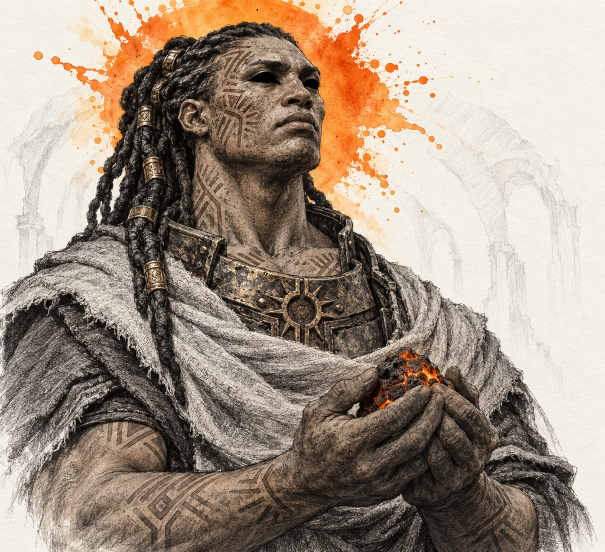
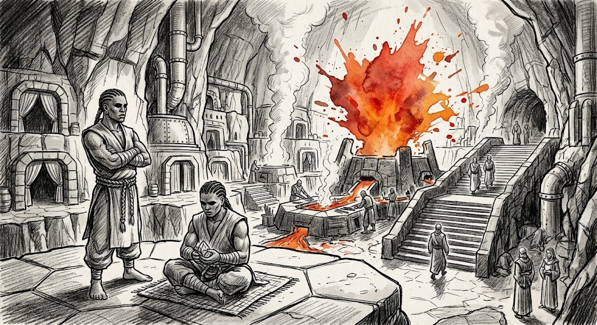
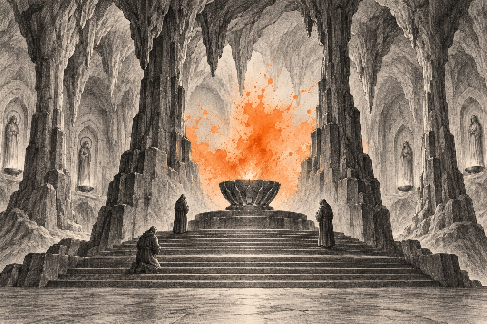
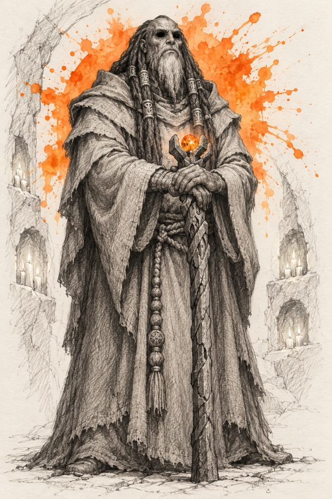
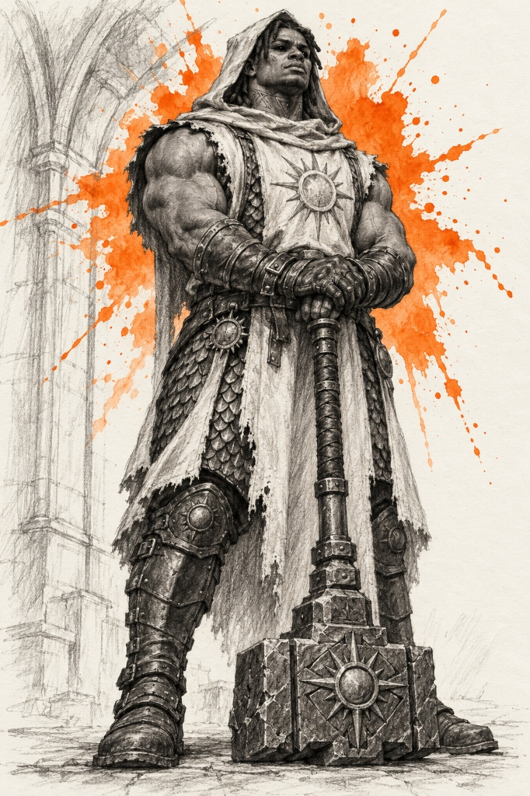
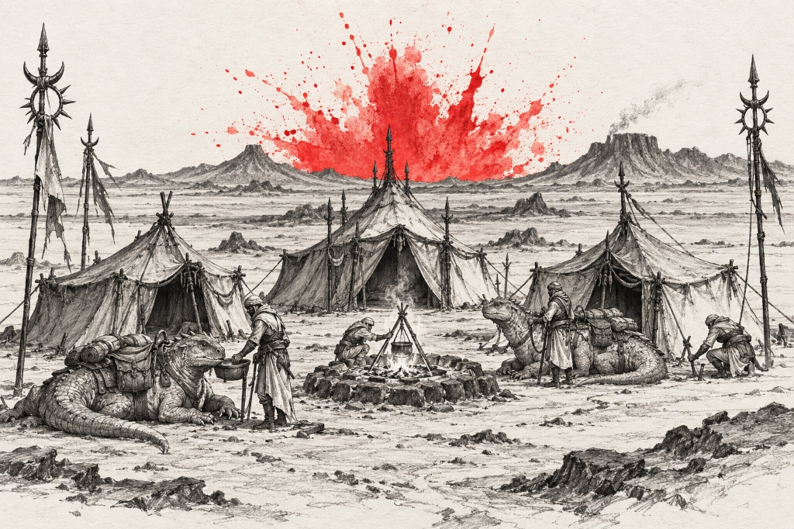
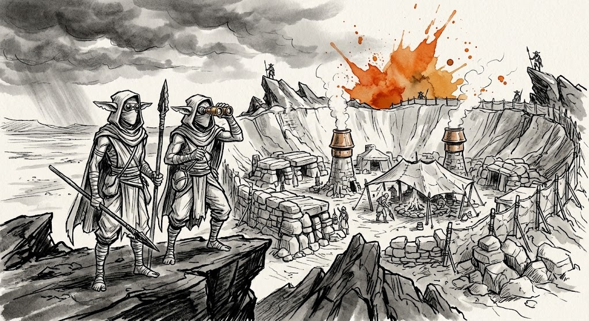
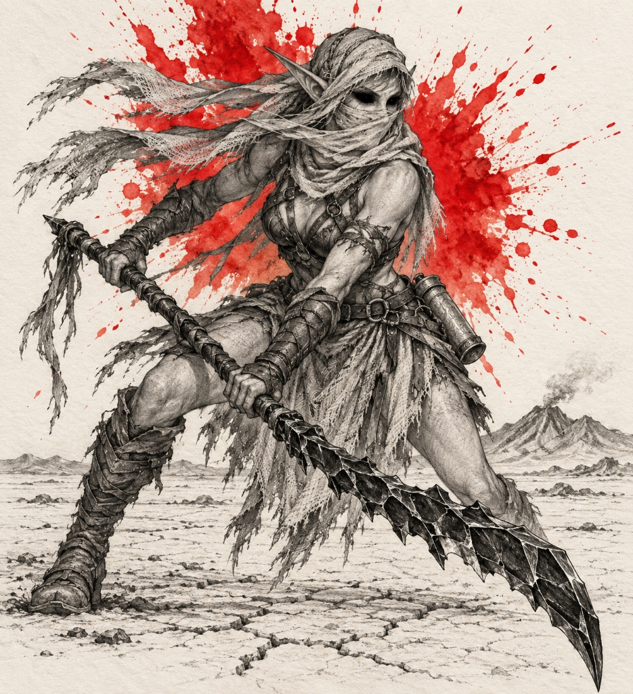
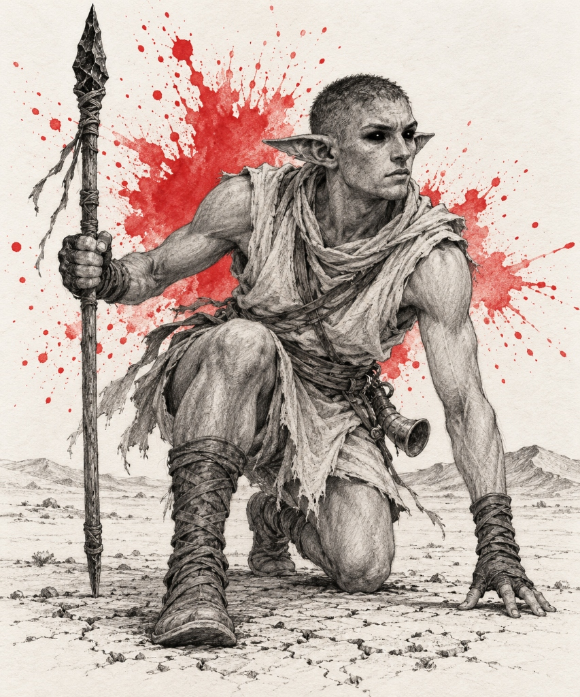

# Solari Subraces — Landmarks, Establishments & Notable Figures

> **Visual Directive**:
> - Style: 1995 Samwise Didier Concept Art (Always Be Chunky - ABC). Monochromatic rough charcoal and graphite draft linework with gritty cross-hatching on clean off-white watercolor paper.
> - Single Dynamic Watercolor Splash: The ONLY color is the signature watercolor bloom.
> - In-Focus Architecture: City and building prompts are deep-focus wide-angle interior/street-level views. Zero giant foreground portraits blocking the frame.
> - Canonical Anatomical Locks: 100% matched to approved T-poses and icon benchmarks.

---

## 🔥 1. Hollow-Solari (Cinder Orange `#ea580c`)
*Canonical Anatomical & Cultural Lock*: Devout, contemplative, monastic humanoids who dwell in subterranean volcanic cave monasteries. When other human lineages bargained with the celestial deities for iron, mastery, and magic, the Solari asked for nothing in return. Blessed for their steadfast humility and uncorrupted devotion, they received the holy living Ember (Sol's Breath). Physicality: Broad-shouldered and deeply still, with skin shaded in dense graphite pencil cross-hatching and charcoal smudge (avoiding brown paint/fleshy tones). Enormous solid-black eyes that absorb all light without reflection. Long dreadlocks bound in carved bone or volcanic stone rings; geometric ritual forge-scars etched along jaw, neck, and forearms. Attire: Heavy coarse-loomed monastic wool robes, draped cowls, frayed fringed mantles, sunburst gorgets, prayer cord cinctures, and stone-tempered scale mail for the templar order.

### 👤 Part 0: Dedicated Canonical Racial Portrait (1 Prompt)

#### ✅ 0. Canonical Hollow-Solari Racial Portrait (De-Cluttered Bust) [GENERATED]

- **Role & Face**: Monastic Cinder-Monk / Templar (Upper-Torso Bust). Broad-shouldered devout monk with solid black light-absorbing eyes, long dreadlocks bound in carved metal cuffs, and geometric ritual scars etched on cheekbones, neck, and chest.
- **Attire & Relic**: Wearing a sunburst bronze gorget and draped coarse linen mantle over robes; calloused hands reverently cupping a porous glowing volcanic ember stone. Faint graphite cave arches in background.
- **Accent**: Single dynamic explosive watercolor splash in radiant cinder orange (`#ea580c`).

---

### 🏛️ Part A: Important Buildings & Locations (2 Prompts)

#### ✅ 1. The Still-Hearth & Caldera Vaults of Sol’s Breath (The Sovereign Capital) [GENERATED]

- **Biome & Location**: The deep subterranean magma caldera beneath the extinct volcanic shield of Sol's Breath.
- **Lore & Functions**: The sovereign subterranean forge-city of the Hollow-Solari. Built inside a colossal volcanic magma dome ringed by obsidian terraces. Heavy cyclopean basalt bridges span glowing lava canals. The central Still-Hearth houses the Primordial Hearth—an eternal magma furnace that has burned since the First Age. Streets are paved with heat-resistant basalt flags.

#### ✅ 2. The Grotto of the First Ember (Subterranean Cavern Monastery) [GENERATED]

- **Biome & Location**: A colossal natural volcanic cavern transformed into an austere subterranean cloister.
- **Lore & Functions**: The sacred monastery where Hollow-Solari monks keep silent vigil over the eternal ember. Titanic stalactite pillars are hand-chiseled into clean monastic columns. Broad stone steps ascend to a solitary circular basalt dais holding a carved stone bowl with a quiet holy ember. Three hooded monks pray in absolute unhurried silence.

---

### 👤 Part B: Notable & Legendary Figures (2 Figures)

#### ✅ 1. High Prior Thaeron (Keeper of the Silent Ember) [GENERATED]

- **Role**: Eldest living sovereign abbot and spiritual anchor of the Hollow-Solari.
- **Visuals**: Venerable monk elder with solid black eyes and long grey-woven dreadlocks bound in cuffs. Coarse-spun monastic robes with frayed edges, heavy woven prayer rope cincture, resting both hands on an immense carved stone pilgrim staff crowned with an ember cradle.

#### ✅ 2. Templar-Warden Malthor (Guardian of the Cloister) [GENERATED]

- **Role**: Holy warrior and martial protector of the subterranean cavern sanctuaries.
- **Visuals**: Muscular monastic warrior with solid black eyes and short dreadlocks under a monk's cowl. Sleeveless white prayer tabard emblazoned with a sun seal worn over stone-tempered scale armor; both hands resting on the pommel of an immense two-handed forged basalt great-maul planted vertically on the stone floor.
---

## 🌋 2. Waste-Solari (Ash Crimson `#dc2626`)
*Canonical Anatomical & Cultural Lock*: Nomadic open-air plains-striders and desert rangers who range the vast, windswept volcanic ash-plains, scrubland deserts, and baking salt flats. When the celestials blessed the Solari with the living Ember, the Waste-Solari rejected the notion of hiding or preaching inside dark subterranean caves. They believed that divine fire belongs under the open sky and must be carried across the living world. Physicality: Lean, sinewy, athletic desert physiques built for long-distance treks across cracked hardpan and shifting ash dunes. Shaded entirely in black graphite pencil linework and cross-hatching (strictly no brown paint, no fleshy tones). Enormous solid-black light-absorbing eyes protected from blowing ash by semi-translucent woven linen desert face-wraps; wide horizontal pointed ears tuned to desert wind shifts; close-shorn hair. Attire: Light layered sun-protective linen cowls, boiled leather harnesses with bone toggles, flat-soled scree-runner boots, carrying knapped black obsidian hunting daggers and spears. Accent: Single dynamic explosive watercolor splash in fiery ash crimson and scarlet (`#dc2626`).

### 🏛️ Part A: Important Buildings & Locations (2 Prompts)

#### ✅ 1. The Nomad Encampment on the Ash-Plains (Open-Air Desert Oasis) [GENERATED]

- **Biome & Location**: The vast windswept ash-plains and scrubland deserts of the outer volcanic basin.
- **Lore & Functions**: The open-air nomadic center of the Waste-Solari. Low hide tents pegged firmly into the volcanic soil surrounding a central sunken fire-pit. Domesticated desert pack lizards resting with travel gear; totem spear-poles marking clan perimeters under an expansive open sky. Clean, de-cluttered composition with vast horizon negative space.

#### ✅ 2. Scathrach’s Teeth & Scree-Watch Ash Caldera (The Sovereign Stronghold) [GENERATED]

- **Biome & Location**: The jagged obsidian crags and active sulfur calderas of Scree-Watch.
- **Lore & Functions**: The mountain stronghold of the Waste-Solari. Perched upon razor-sharp obsidian pillars overlooking active thermal fissures. Suspension bridges span bubbling gorges, providing a fortified mountain retreat during fierce ash hurricanes.

---

### 👤 Part B: Notable & Legendary Figures (2 Figures)

#### ✅ 1. Sovereign Huntress Vaelith the Ash-Veiled [GENERATED]

- **Role**: Supreme sovereign huntress and legendary messenger of the nomadic clans.
- **Visuals**: Tall, athletic desert huntress in a low predatory combat stance on cracked hardpan. Face veiled in lightweight ash-linen wraps, solid black eyes, pointed ears, fitted combat kilt, cylindrical bronze message tube strapped to hip, wielding a formidable two-handed jagged obsidian-glass scythe with both hands.

#### ✅ 2. Scree-Runner Kaelen (Master of the Ash-Plains) [GENERATED]

- **Role**: Swift desert runner and plains scout.
- **Visuals**: Wiry, athletic scout in a runner's crouch on cracked desert hardpan. Close-shorn hair, wide horizontal pointed ears tuned to wind shifts, solid black light-absorbing eyes. Lightweight linen desert wrap, forearm and shin wraps, horn at hip, holding an obsidian-tipped hunting spear. Single dynamic crimson splash bloom.
